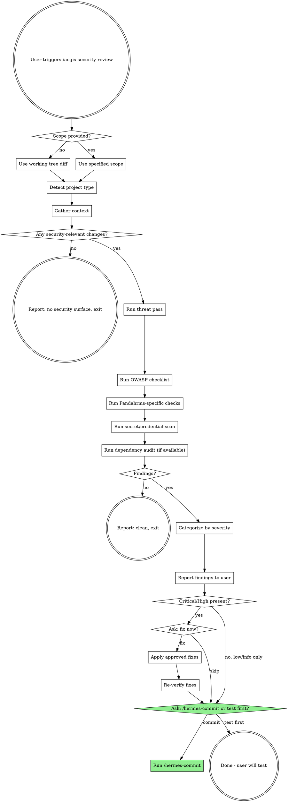

# Aegis Security Review

## Overview

Focused security audit of code under review. Scans working tree changes (or specified feature area) for vulnerabilities using OWASP Top 10 and Pandahrms-specific threat patterns (tenant isolation, audit trails, PII handling). Reports findings by severity and optionally fixes approved issues. Never commits on its own.

## Hard Prohibitions

MUST NOT at any phase:

- Run `git commit`, `git commit --amend`, `git push`, `git rebase`, `git reset --hard`, `git stash`, `git add`, or any history-altering, staging, or remote-publishing command. Fixes go to working tree only; staging is user's responsibility.
- Invoke any other skill except through explicit user choice in Phase 8.
- Send working-tree contents, diffs, file paths, or finding details to any external service (WebFetch, WebSearch, MCP servers, paste services, gists). Only allowed network calls are dependency-audit invocations of project's own package-manager CLI (`dotnet`, `pnpm`, `npm`).
- Rotate, re-issue, or relocate secrets when fixing leaked-credential findings. Only remove leaked value from source file and report leak; rotation is user responsibility.
- Modify `appsettings.Production.json`, KeyVault references, GitHub Actions secrets, or any production configuration store as a "fix."
- Apply security fix without explicit user approval recorded in Phase 7.
- Write `Where:` reference (file:line) for a line not opened with Read tool in this run.
- Cite CVE numbers from training-data memory. CVE knowledge comes only from package-manager audit output captured during Phase 3 (A06).
- Dispatch parallel subagents. All work in main thread.

## Skip Conditions

Skip ONLY when **every** condition holds. If any fails, run in full.

- Diff contains no `dangerouslySetInnerHTML`, no `@Html.Raw`, no template/raw-HTML interpolation.
- Diff contains no `localStorage`, `sessionStorage`, or cookie writes.
- Diff contains no auth-route, middleware, filter, policy, or `[Authorize]` changes.
- Diff contains no new API call, new fetch, new HTTP client usage, or new server-action declarations.
- Diff contains no env-var reads (`process.env.*`, `IConfiguration[...]`, `appsettings.*`).
- Diff is documentation-only (`*.md`, `*.mdx`, `*.txt`), spec-only (`*.feature`), or tooling-only (lint config, formatter config) not shipped to production.

Run `git diff` and grep for tokens above before declaring change out of scope.

## Workflow

Phases run **strictly sequentially** Phase 0 -> 1 -> 2 -> 3 -> 4 -> 5 -> 6 -> 7 -> 8. Do not begin a phase until previous emitted required output. No parallel subagents; all work in main thread.



**Phase 0: Scope**

### 0.1 Resolve scope to concrete file list

- If user supplied literal path or glob (e.g. `/aegis-security-review src/auth`, `aegis on Pandahrms.Performance.Api/Controllers/LoginController.cs`), use exactly that path set.
- If user supplied natural-language scope (e.g. "the new login endpoint", "the export feature"), resolve to concrete file list using `git status`, `grep`, `find`. When more than 5 files match, or zero match, list the matched files inline in chat and ask the user inline in plain text to confirm before proceeding.
- If no scope supplied, default to git working tree captured by:
  - `git status` (untracked and modified files)
  - `git diff` and `git diff --cached` (unstaged and staged changes)

### 0.2 Empty working tree halt

If no scope supplied AND `git status` shows clean tree (no staged, unstaged, or untracked changes), halt immediately with single line: "No changes to audit. Pass an explicit scope (e.g. `/aegis-security-review src/auth`) to audit specific files." Do not audit entire repository as fallback.

### 0.3 Read every in-scope file end-to-end

Read **full content** of every in-scope file using Read tool. Diff alone is not enough for security analysis -- unchanged surrounding code (guards, middleware, filters) often determines whether change is safe.

If file exceeds 2000 lines, page through with explicit `offset`/`limit` calls until EOF. Maintain per-file ledger:

| Path | Total lines | Fully read |
|------|-------------|------------|

Do not begin Phase 1 until every in-scope file shows "Fully read: yes".

**Phase 1: Detect Project Type**

Detect every project-type signal in the in-scope file list. Run checklist rows for **every** matching project type (a change touching both `*.csproj` and `package.json` runs both checklists). Multiple matches are common and expected.

| Signal | Project type | Emphasis |
|--------|--------------|----------|
| `*.csproj`, `Program.cs`, `Startup.cs` | .NET backend (Performance API, Recruitment API, main API) | Controllers, `[Authorize]`, EF queries, DI, audit entity base, tenant filter |
| `next.config.*`, `app/` with route handlers | Next.js frontend / BFF | API routes, server actions, session cookies, CSRF, CSP, env var leakage |
| `package.json` + React only, no server routes | React frontend | XSS, `dangerouslySetInnerHTML`, auth token storage, dependency CVEs |
| `*.sql`, EF `Migrations/` | Schema change | Column-level PII, default values, NOT NULL on sensitive cols, down-migration safety |
| Docker, CI configs | Infra | Secret injection, image base CVEs, privilege, exposed ports |

### No-signal fallback

If **no** project-type signal matches in scope, halt and use `AskUserQuestion` to confirm whether to (a) abort as out-of-scope, or (b) proceed using user-specified checklist set. Do not infer checklist from absence of signals, and do not silently default to .NET.

**Phase 2: Threat Pass**

Before checklist work, produce written **Trust Boundary Map** emitted into final report under "Phase 2: Trust Boundaries". Map is required input to Phase 3.

Map has exactly five labelled rows. Each row lists `file:line` references drawn from files actually opened in Phase 0 (do not invent line numbers):

1. **Entry points** -- where does untrusted input enter? (HTTP body, query string, headers, cookies, file upload, message queue, webhook)
2. **Validation / parameterization** -- what does code do with it before trusting it? (validate, parameterize, escape, authorize)
3. **Exit points** -- where does it leave the system? (response body, log, DB, external API, email, file)
4. **Authorization gates** -- what gate protects the operation? Enforced on server, or only UI?
5. **Ownership verification** -- what tenant/user/org owns the data? Is ownership verified before read/write?

Append "weak spots" list at end of map -- specific concerns feeding into Phase 3 checklist findings. Do not begin Phase 3 until map is written.

**Phase 3: OWASP Checklist**

Work rows in **strict numeric order**: A01, A02, A03, A04, A05, A06, A07, A08. A09 and A10 are covered downstream as noted but must still be acknowledged in report ("A09: see Phase 4 audit-trail row", "A10: see A03 SSRF row"). Do not skip a row because earlier rows produced findings.

For each row, do **one of two things explicitly**:

- (a) Execute check and report findings under that row, OR
- (b) Mark row "N/A" with one-line reason (e.g. "A02 N/A: no crypto, password storage, token signing, or TLS code in scope").

Row qualifies as N/A only when none of the file types or APIs it inspects appear in scope. Do not silently omit a row -- every row gets either findings or N/A reason in report.

### A01 - Broken Access Control

| Check | What to look for |
|-------|------------------|
| **Missing `[Authorize]` / auth guard** | New controller, action, route handler, or server action without auth enforcement. `AllowAnonymous` used intentionally? |
| **IDOR** | Endpoint takes id from client and loads by that id without verifying caller owns/has access. Always scope queries by `TenantId`, `OrgId`, or `UserId`. |
| **Role/policy bypass** | Role/policy strings typo'd, hardcoded `true`, or commented out. Policies registered in DI? |
| **Mass assignment** | Request DTO binds directly to entity with fields client should not set (`IsAdmin`, `TenantId`, `Status`). Use explicit mapping. |
| **Server-side enforcement** | UI hides button but endpoint does not re-check permission. Every check must exist on server. |
| **Path traversal** | File/blob paths built from user input without sanitization (`..`, absolute paths). |

### A02 - Cryptographic Failures

| Check | What to look for |
|-------|------------------|
| **Passwords** | Never stored plain or with weak hash (MD5, SHA1, unsalted SHA256). Use `PasswordHasher<TUser>`, bcrypt, or argon2. |
| **Token signing** | JWT secrets not hardcoded, algorithms not `none` or `HS256` with weak key, issuer/audience validated. |
| **TLS** | Cookies marked `Secure`. External HTTP calls use HTTPS. No `ServicePointManager.ServerCertificateValidationCallback = (_, _, _, _) => true`. |
| **Encryption at rest** | Sensitive columns (SSN, salary, bank info) encrypted or isolated. EF value converters in place. |
| **Insecure randomness** | Security-sensitive randomness (tokens, nonces) uses `RandomNumberGenerator` / `crypto.randomUUID`, not `Random` or `Math.random`. |

### A03 - Injection

| Check | What to look for |
|-------|------------------|
| **SQL injection** | Raw `FromSqlRaw`, `ExecuteSqlRaw`, string-concatenated SQL, or Dapper with interpolation. Use parameters. |
| **NoSQL / LINQ dynamic** | Dynamic LINQ strings built from user input. |
| **Command injection** | `Process.Start`, shell exec, `child_process` built from user input. |
| **LDAP / XPath / ORM** | User input in LDAP filters, XPath queries, or ORM string predicates without escaping. |
| **XSS** | React: `dangerouslySetInnerHTML`. Razor: `@Html.Raw`. Response templates echoing unescaped user input. |
| **Log injection** | User input written to logs without sanitization of CR/LF. |
| **SSRF** | Server makes outbound HTTP to a URL taken from client input without allowlist. |

### A04 - Insecure Design

| Check | What to look for |
|-------|------------------|
| **Missing rate limiting** | Login, password reset, OTP, export endpoints without throttling. |
| **Predictable IDs** | Sequential public identifiers for sensitive resources. Use GUIDs for externally-exposed keys. |
| **Business logic abuse** | Negative quantities, zero prices, status transitions not enforced, workflow steps skippable. |

### A05 - Security Misconfiguration

| Check | What to look for |
|-------|------------------|
| **CORS** | `AllowAnyOrigin` with credentials. Origin allowlist explicit. |
| **CSP / security headers** | Missing `Content-Security-Policy`, `X-Content-Type-Options`, `X-Frame-Options`, `Strict-Transport-Security`. |
| **Verbose errors** | Stack traces, SQL errors, internal paths leaked to client in production. |
| **Default creds / sample data** | Demo users, `admin:admin`, seed credentials shipped to prod. |
| **Env vs appsettings** | Production secrets in committed `appsettings.json` instead of env/KeyVault. |

### A06 - Vulnerable and Outdated Components

Detect package manager from in-scope files and run matching command:

- If any `*.csproj` in scope, run `dotnet list package --vulnerable --include-transitive`.
- If `package.json` in scope and `pnpm-lock.yaml` exists at project root, run `pnpm audit --prod`.
- If `package.json` in scope and `package-lock.json` exists at project root, run `npm audit --production`.
- If `package.json` in scope and `yarn.lock` exists at project root, run `yarn npm audit --recursive --severity high`.

If relevant CLI not installed (command not found), report "dependency audit skipped: <command> not installed" in Phase 6 report. Do not silently skip.

CVE knowledge comes **only** from captured audit output. Do not cite CVE IDs from training-data memory. If audit output unavailable for any reason, report "lockfile changed; CVE check skipped" rather than inferring vulnerability status from prior knowledge.

Report any **High** or **Critical** advisories tied to changed `*.csproj` or `package.json`. If a lockfile changed, diff it and flag new packages the audit output reports as vulnerable.

### A07 - Identification and Authentication Failures

| Check | What to look for |
|-------|------------------|
| **Session handling** | Cookies `HttpOnly`, `Secure`, `SameSite=Lax` or `Strict`. Token refresh / revocation implemented. |
| **MFA / lockout** | Brute-force protections on login and OTP endpoints. Account lockout thresholds. |
| **Password policy** | Minimum length, complexity, breached-password check where applicable. |
| **Token storage (FE)** | Access tokens in `localStorage` is red flag -- prefer secure cookies or in-memory. |

### A08 - Software and Data Integrity Failures

| Check | What to look for |
|-------|------------------|
| **Deserialization** | `BinaryFormatter`, `JavaScriptSerializer` with type info, or `TypeNameHandling.All` in Newtonsoft. |
| **Unsigned updates** | Dynamic asset loads from unverified URLs. |
| **CI/CD supply chain** | New GitHub Actions pinned to SHA, not moving tags. |

### A09 - Security Logging and Monitoring Failures

Covered in Pandahrms-specific checks below (audit trail).

### A10 - Server-Side Request Forgery (SSRF)

Covered in A03 above.

**Phase 4: Pandahrms-Specific Checks**

| Check | What to look for |
|-------|------------------|
| **Tenant isolation** | Every DB query involving tenant-scoped tables filters by `TenantId`/`OrganisationId`. Global query filters in `DbContext.OnModelCreating` present and not bypassed with `IgnoreQueryFilters()` without justification. |
| **Audit fields** | Entities needing tracking have `CreatedBy`, `CreatedAt`, `ModifiedBy`, `ModifiedAt`. Populated via base entity or middleware, not hand-set. |
| **Audit trail on state-changing endpoints** | Every POST / PUT / PATCH / DELETE writes audit log record (who, what, when, which resource). New endpoints must use same audit mechanism as existing ones. Missing audit trail is **High** severity finding. |
| **PII in responses** | Response DTOs do not leak fields like `PasswordHash`, `SecurityStamp`, internal `Id` of other tenants' records, or salary/bank info not needed by caller. |
| **PII in logs** | No logging of passwords, tokens, full credit card, full NRIC/SSN. Redaction in place. |
| **Cross-project contract** | If FE change calling BE endpoint, verify BE actually enforces the authorization FE assumes. If BE change, verify downstream FE / mobile is not relying on removed checks. |
| **EF migrations** | New columns holding PII marked for encryption / masking. `DROP COLUMN` on sensitive columns reviewed for data retention policy. No unfiltered `UPDATE`/`DELETE` in migration SQL. |
| **Bridge / external keys** | No API keys, service account tokens, or bridge secrets committed. Check `.env*`, `appsettings.*.json`, `launchSettings.json`, `.github/workflows/*`. |

**Phase 5: Secret and Credential Scan**

Phase 5 runs as discrete pass after Phase 4 completes. Do not merge into Phase 3 or Phase 4 even if those phases noticed potential secrets.

On full set of changed files (including untracked):

1. Grep for common patterns: `password\s*=`, `secret\s*=`, `api[_-]?key`, `Bearer `, `AKIA`, `-----BEGIN`, `ConnectionString`, `eyJ` (JWT prefix).
2. Flag any committed `.env`, `.pem`, `.pfx`, `.key`, `.p12`, `id_rsa`, `credentials.json`, `service-account*.json`.
3. For any hit, treat as **Critical** until proven false, and emit top-of-report warning block in this exact form:

   ```
   ## CRITICAL: POSSIBLE SECRET LEAKED
   - File: <path>
   - Line: <lineno>
   - Pattern matched: <pattern>
   - Matched substring (redacted): <first 4 chars>...<last 4 chars>
   ```

   This block appears at very top of Phase 6 report, above Counts table, in addition to (not instead of) regular Critical entry under Findings.

**Phase 6: Categorize and Report**

Group findings into four buckets:

- **Critical** - exploitable now, data loss / account takeover / RCE class. Must fix before merge.
- **High** - clear vulnerability with plausible exploit path. Fix before merge unless explicitly accepted.
- **Medium** - weakness raising risk (e.g., weak logging, missing rate limit on non-auth endpoint). Fix soon.
- **Low / Info** - hardening suggestion, defense-in-depth. Fix opportunistically.

### Mandatory report structure

Phase 6 report is single message containing, in this exact order:

1. Any `## CRITICAL: POSSIBLE SECRET LEAKED` blocks emitted by Phase 5 (zero or more, at very top).
2. `## Aegis Report -- <scope summary>`
3. `### Counts` -- table with one row per severity (Critical, High, Medium, Low, Info) and integer count for each.
4. `### Phase 2: Trust Boundaries` -- Trust Boundary Map produced in Phase 2.
5. `### Findings` -- one block per finding using **exactly** this four-bullet template:

   > **[Severity] [Short title]**
   > - **Where:** `path/to/file.cs:lineno`
   > - **What:** vulnerability in one sentence
   > - **Why it matters:** concrete attacker scenario
   > - **Fix:** concrete remediation (code sketch if non-trivial)

6. `### Phase 3 row coverage` -- one line per OWASP row (A01-A08) marked either "executed" or "N/A: <reason>".
7. `### Phases / checks skipped` -- list any other check that was N/A or skipped (e.g. dependency audit, project-type checklist) with one-line reason.

Deviation from this structure is defect. Do not omit a section because empty -- emit heading with "(none)" instead.

### No invented references

Every `Where:` reference must come from file actually opened by Read tool in this run. Do not write line number unless you have read that line. If finding spans a concept rather than single line, write `path/to/file.cs (whole file)` instead of guessing.

**Phase 7: Fix (Optional)**

### When to run Phase 7

- If at least one Critical or High finding exists, run Phase 7 (ask before fixing).
- If only Medium / Low / Info findings exist, **skip Phase 7 entirely** and proceed directly to Phase 8.

### Approval prompt

If Critical or High findings exist, ask inline in plain text:

> "Aegis Security Review found [N Critical / M High] issues. Fix them now, or report and let you handle them?"

Options the user can type back:
- **Fix now** -- apply remediations for approved findings.
- **Skip** -- report stays as-is, user decides what to do.

Never silently apply security fix without user approval. Security fixes can change behavior.

### What "fix" means in Phase 7

A "fix" is **minimum code change** that closes specific finding. In Phase 7, MUST NOT:

- Refactor unrelated code or rename symbols.
- Add new tests or test files (user owns test coverage decisions for security fixes).
- Restructure files or move code between files.
- Change formatting, indentation, or whitespace outside touched lines.
- Modify dependency versions or lockfiles.

If minimum fix is non-local (touches multiple files or requires architectural changes), do not auto-apply -- report as finding-with-recommendation and let user decide.

### Re-verification

After applying fixes, re-verify each fix by:

1. Re-reading **entire file** containing fix end-to-end (not just diff).
2. Re-running OWASP rows that originally produced finding.
3. **Plus** re-running A01 (access control) and Phase 4 tenant-isolation row, even if those did not flag original finding -- a fix can introduce new access-control or tenant-scoping defects.

Record re-verification results inline under each fixed finding in report ("Re-verified: clean" or "Re-verified: new finding -- [details]").

**Phase 8: Handoff**

Summarize:
- Counts by severity
- What was fixed (if any)
- Residual risk the user is accepting (if any)

Then use `AskUserQuestion` to ask:

> "Security review complete. Would you like to proceed to /hermes-commit, or test first?"

- **Commit** -- invoke `pandahrms:hermes-commit` via Skill tool, then end aegis-security-review turn immediately upon dispatch. Do not produce additional output, findings, or commentary after dispatch.
- **Test first** -- emit exactly the single line "Sounds good. Run /hermes-commit when you're ready." and end turn. Do not add further text.

After Phase 8 ends, aegis-security-review is complete. Do not continue executing aegis-security-review behavior (no further audits, follow-up advice, or additional checks) in same turn.

## Red Flags - STOP

- Applying security fix without explicit user approval
- Reporting "no issues" without actually reading full changed files
- Skipping tenant-isolation checks on any DB query in tenant-scoped project
- Declaring hardcoded credential "probably fine" - always flag as Critical until disproven
- Using narrow diff view to judge security question - always read full file to see surrounding guards
- Running `/hermes-commit` automatically after fixes - always ask commit vs test first
- Treating missing audit trail as Low - it is High severity in Pandahrms

## Common Mistakes

| Mistake | Fix |
|---------|-----|
| Judging auth from route handler alone | Trace middleware/filter pipeline too; guard may be upstream -- or missing there. |
| Assuming ORM prevents injection | LINQ is safe; raw SQL, dynamic LINQ, and string interpolation into `FromSqlRaw` are not. |
| Accepting "it's only reachable internally" | Internal-only endpoints still need authz -- insiders and compromised services exist. |
| Treating frontend validation as sufficient | FE validation is UX; server must re-validate every input. |
| Ignoring a removed check | If `[Authorize]` or tenant filter was deleted, treat as Critical finding until shown intentional. |
| Skipping dependency audit because "it's just a patch bump" | Run audit anyway; transitive CVEs hide in minor bumps. |
| Not reading full file | Security depends on context -- vulnerability may live in unchanged block next to edit. |
