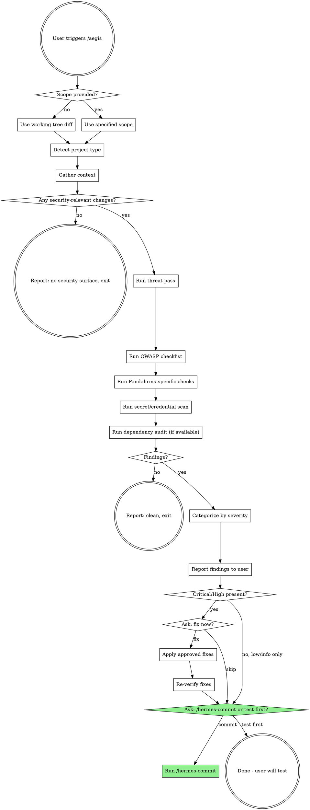

# Aegis - Security Review

## Overview

Aegis is a focused security audit of the code under review. It scans working tree changes (or a specified feature area) for security vulnerabilities using the OWASP Top 10, Pandahrms-specific threat patterns (tenant isolation, audit trails, PII handling), and the standards in `~/.claude/rules/Security.md`. It reports findings grouped by severity, optionally fixes approved issues, and hands off to `/hermes-commit`. Aegis never commits on its own.

## When to Use

- Before merging a branch that touches authentication, authorization, API endpoints, or data persistence
- After adding or modifying any endpoint that accepts user input, handles secrets, or returns sensitive data
- When the user explicitly asks for a security review, pen-test pass, or OWASP audit
- As a follow-up to `/athena-review` when the change surface is security-sensitive (auth flows, payment, PII, file upload, cross-tenant operations)
- Before a release cut when changes include public-facing endpoints or schema migrations that touch sensitive columns

## When NOT to Use

- Pure UI work with no business logic, no new endpoints, no auth surface (styling, layout, dark mode, responsiveness only)
- Documentation, README, or spec-only changes
- Tooling-only changes (lint config, CI config) that do not ship to production

## Workflow

## Phase 0: Scope

If the user supplied a scope (e.g. "aegis on the new login endpoint", "aegis on src/auth"), use that scope. Otherwise default to the git working tree:

- `git status` - untracked and modified files
- `git diff` and `git diff --cached` - unstaged and staged changes

Read the **full content** of every in-scope file. A diff alone is not enough for security analysis -- unchanged surrounding code (guards, middleware, filters) often determines whether a change is safe.

## Phase 1: Detect Project Type

Aegis adjusts its checklist based on the project:

| Signal | Project type | Emphasis |
|--------|--------------|----------|
| `*.csproj`, `Program.cs`, `Startup.cs` | .NET backend (Performance API, Recruitment API, main API) | Controllers, `[Authorize]`, EF queries, DI, audit entity base, tenant filter |
| `next.config.*`, `app/` with route handlers | Next.js frontend / BFF | API routes, server actions, session cookies, CSRF, CSP, env var leakage |
| `package.json` + React only, no server routes | React frontend | XSS, `dangerouslySetInnerHTML`, auth token storage, dependency CVEs |
| `*.sql`, EF `Migrations/` | Schema change | Column-level PII, default values, NOT NULL on sensitive cols, down-migration safety |
| Docker, CI configs | Infra | Secret injection, image base CVEs, privilege, exposed ports |

If a change spans multiple layers (common), run every applicable checklist.

## Phase 2: Threat Pass

Before checklist work, mentally trace **trust boundaries** in the changed code:

1. Where does untrusted input enter? (HTTP body, query string, headers, cookies, file upload, message queue, webhook)
2. What does the code do with it before trusting it? (validate, parameterize, escape, authorize)
3. Where does it leave the system? (response body, log, DB, external API, email, file)
4. What authorization gate protects the operation? Is it enforced on the server, or only the UI?
5. What tenant/user/org owns the data? Is that ownership verified before read/write?

Keep a running list of "weak spots" found during this pass -- they feed the checklist findings.

## Phase 3: OWASP Checklist

Apply every row that is relevant to the scope. Skip rows with no surface area.

### A01 - Broken Access Control

| Check | What to look for |
|-------|------------------|
| **Missing `[Authorize]` / auth guard** | New controller, action, route handler, or server action without auth enforcement. `AllowAnonymous` used intentionally? |
| **IDOR** | Endpoint takes an id from the client and loads by that id without verifying the caller owns/has access to the resource. Always scope queries by `TenantId`, `OrgId`, or `UserId`. |
| **Role/policy bypass** | Role/policy strings typo'd, hardcoded `true`, or commented out. Policies registered in DI? |
| **Mass assignment** | Request DTO binds directly to entity with fields the client should not set (`IsAdmin`, `TenantId`, `Status`). Use explicit mapping. |
| **Server-side enforcement** | UI hides a button but the endpoint does not re-check permission. Every check must exist on the server. |
| **Path traversal** | File/blob paths built from user input without sanitization (`..`, absolute paths). |

### A02 - Cryptographic Failures

| Check | What to look for |
|-------|------------------|
| **Passwords** | Never stored plain or with weak hash (MD5, SHA1, unsalted SHA256). Use `PasswordHasher<TUser>`, bcrypt, or argon2. |
| **Token signing** | JWT secrets not hardcoded, algorithms not `none` or `HS256` with weak key, issuer/audience validated. |
| **TLS** | Cookies marked `Secure`. External HTTP calls use HTTPS. No `ServicePointManager.ServerCertificateValidationCallback = (_, _, _, _) => true`. |
| **Encryption at rest** | Sensitive columns (SSN, salary, bank info) encrypted or isolated. EF value converters in place. |
| **Insecure randomness** | Security-sensitive randomness (tokens, nonces) uses `RandomNumberGenerator` / `crypto.randomUUID`, not `Random` or `Math.random`. |

### A03 - Injection

| Check | What to look for |
|-------|------------------|
| **SQL injection** | Raw `FromSqlRaw`, `ExecuteSqlRaw`, string-concatenated SQL, or Dapper with interpolation. Use parameters. |
| **NoSQL / LINQ dynamic** | Dynamic LINQ strings built from user input. |
| **Command injection** | `Process.Start`, shell exec, `child_process` built from user input. |
| **LDAP / XPath / ORM** | User input in LDAP filters, XPath queries, or ORM string predicates without escaping. |
| **XSS** | React: `dangerouslySetInnerHTML`. Razor: `@Html.Raw`. Response templates echoing unescaped user input. |
| **Log injection** | User input written to logs without sanitization of CR/LF. |
| **SSRF** | Server makes outbound HTTP to a URL taken from client input without allowlist. |

### A04 - Insecure Design

| Check | What to look for |
|-------|------------------|
| **Missing rate limiting** | Login, password reset, OTP, export endpoints without throttling. |
| **Predictable IDs** | Sequential public identifiers for sensitive resources. Use GUIDs for externally-exposed keys. |
| **Business logic abuse** | Negative quantities, zero prices, status transitions not enforced, workflow steps skippable. |

### A05 - Security Misconfiguration

| Check | What to look for |
|-------|------------------|
| **CORS** | `AllowAnyOrigin` with credentials. Origin allowlist explicit. |
| **CSP / security headers** | Missing `Content-Security-Policy`, `X-Content-Type-Options`, `X-Frame-Options`, `Strict-Transport-Security`. |
| **Verbose errors** | Stack traces, SQL errors, internal paths leaked to the client in production. |
| **Default creds / sample data** | Demo users, `admin:admin`, seed credentials shipped to prod. |
| **Env vs appsettings** | Production secrets in committed `appsettings.json` instead of env/KeyVault. |

### A06 - Vulnerable and Outdated Components

Run whichever applies:

- .NET: `dotnet list package --vulnerable --include-transitive`
- Node: `pnpm audit --prod` / `npm audit --production`
- Report any **High** or **Critical** advisories in changed `*.csproj` or `package.json`.
- If a lockfile changed, diff it and flag new packages with known CVEs.

### A07 - Identification and Authentication Failures

| Check | What to look for |
|-------|------------------|
| **Session handling** | Cookies `HttpOnly`, `Secure`, `SameSite=Lax` or `Strict`. Token refresh / revocation implemented. |
| **MFA / lockout** | Brute-force protections on login and OTP endpoints. Account lockout thresholds. |
| **Password policy** | Minimum length, complexity, breached-password check where applicable. |
| **Token storage (FE)** | Access tokens in `localStorage` is a red flag -- prefer secure cookies or in-memory. |

### A08 - Software and Data Integrity Failures

| Check | What to look for |
|-------|------------------|
| **Deserialization** | `BinaryFormatter`, `JavaScriptSerializer` with type info, or `TypeNameHandling.All` in Newtonsoft. |
| **Unsigned updates** | Dynamic asset loads from unverified URLs. |
| **CI/CD supply chain** | New GitHub Actions pinned to SHA, not moving tags. |

### A09 - Security Logging and Monitoring Failures

Covered in Pandahrms-specific checks below (audit trail).

### A10 - Server-Side Request Forgery (SSRF)

Covered in A03 above.

## Phase 4: Pandahrms-Specific Checks

| Check | What to look for |
|-------|------------------|
| **Tenant isolation** | Every DB query involving tenant-scoped tables filters by `TenantId`/`OrganisationId`. Global query filters in `DbContext.OnModelCreating` present and not bypassed with `IgnoreQueryFilters()` without justification. |
| **Audit fields** | Entities that need tracking have `CreatedBy`, `CreatedAt`, `ModifiedBy`, `ModifiedAt`. Populated via base entity or middleware, not hand-set. |
| **Audit trail on state-changing endpoints** | Every POST / PUT / PATCH / DELETE writes an audit log record (who, what, when, which resource). New endpoints must use the same audit mechanism as existing ones. Missing audit trail is a **High** severity finding. |
| **PII in responses** | Response DTOs do not leak fields like `PasswordHash`, `SecurityStamp`, internal `Id` of other tenants' records, or salary/bank info not needed by the caller. |
| **PII in logs** | No logging of passwords, tokens, full credit card, full NRIC/SSN. Redaction in place. |
| **Cross-project contract** | If this is a FE change calling a BE endpoint, verify the BE actually enforces the authorization the FE assumes. If this is a BE change, verify downstream FE / mobile is not relying on removed checks. |
| **EF migrations** | New columns holding PII are marked for encryption / masking. `DROP COLUMN` on sensitive columns reviewed for data retention policy. No unfiltered `UPDATE`/`DELETE` in migration SQL. |
| **Bridge / external keys** | No API keys, service account tokens, or bridge secrets committed. Check `.env*`, `appsettings.*.json`, `launchSettings.json`, `.github/workflows/*`. |

## Phase 5: Secret and Credential Scan

On the full set of changed files (including untracked):

1. Grep for common patterns: `password\s*=`, `secret\s*=`, `api[_-]?key`, `Bearer `, `AKIA`, `-----BEGIN`, `ConnectionString`, `eyJ` (JWT prefix).
2. Flag any committed `.env`, `.pem`, `.pfx`, `.key`, `.p12`, `id_rsa`, `credentials.json`, `service-account*.json`.
3. Warn loudly for **any** hit. Treat as **Critical** until proven false.

## Phase 6: Categorize and Report

Group findings into four buckets:

- **Critical** - exploitable now, data loss / account takeover / RCE class. Must fix before merge.
- **High** - clear vulnerability with plausible exploit path. Fix before merge unless explicitly accepted.
- **Medium** - weakness that raises risk (e.g., weak logging, missing rate limit on non-auth endpoint). Fix soon.
- **Low / Info** - hardening suggestion, defense-in-depth. Fix opportunistically.

For each finding, report:

> **[Severity] [Short title]**
> - **Where:** `path/to/file.cs:lineno`
> - **What:** the vulnerability in one sentence
> - **Why it matters:** concrete attacker scenario
> - **Fix:** concrete remediation (code sketch if non-trivial)

## Phase 7: Fix (Optional)

If Critical or High findings exist, use `AskUserQuestion` to ask:

> "Aegis found [N Critical / M High] issues. Fix them now, or report and let you handle them?"

Options:
- **Fix now** - apply remediations for approved findings, then re-verify by re-reading the changed code and re-running the relevant checklist rows.
- **Skip** - report stays as-is, user decides what to do.

Never silently apply a security fix without user approval. Security fixes can change behavior.

If only Medium / Low / Info findings exist, report them and move on without asking.

## Phase 8: Handoff

Summarize:
- Counts by severity
- What was fixed (if any)
- Residual risk the user is accepting (if any)

Then use `AskUserQuestion` to ask:

> "Security review complete. Would you like to proceed to /hermes-commit, or test first?"

- **Commit** - invoke the `/hermes-commit` skill.
- **Test first** - end with: "Sounds good. Run /hermes-commit when you're ready."

## Red Flags - STOP

- Applying a security fix without explicit user approval
- Reporting "no issues" without actually reading the full changed files
- Skipping tenant-isolation checks on any DB query in a tenant-scoped project
- Declaring a hardcoded credential "probably fine" - always flag as Critical until disproven
- Using a narrow diff view to judge a security question - always read the full file to see the surrounding guards
- Running `/hermes-commit` automatically after fixes - always ask commit vs test first
- Treating a missing audit trail as Low - it is High severity in Pandahrms

## Common Mistakes

| Mistake | Fix |
|---------|-----|
| Judging auth from the route handler alone | Trace the middleware/filter pipeline too; the guard may be upstream -- or missing there. |
| Assuming the ORM prevents injection | LINQ is safe; raw SQL, dynamic LINQ, and string interpolation into `FromSqlRaw` are not. |
| Accepting "it's only reachable internally" | Internal-only endpoints still need authz -- insiders and compromised services exist. |
| Treating frontend validation as sufficient | FE validation is UX; the server must re-validate every input. |
| Ignoring a removed check | If a `[Authorize]` or tenant filter was deleted, treat it as a Critical finding until shown to be intentional. |
| Skipping dependency audit because "it's just a patch bump" | Run the audit anyway; transitive CVEs hide in minor bumps. |
| Not reading the full file | Security depends on context -- the vulnerability may live in the unchanged block next to the edit. |
