# Athena Code Review

## Overview

Review all git working tree changes against code quality standards, fix issues, and run /simplify. Changes code but never commits.

## Workflow

```dot
digraph code_review {
    "Assess change size" [shape=doublecircle];
    "Small change?" [shape=diamond];
    "Ask: review or commit?" [shape=diamond];
    "Run /hermes-commit directly" [shape=box, style=filled, fillcolor=lightgreen];
    "Gather changes" [shape=box];
    "git diff and git status" [shape=plaintext];
    "Any changes?" [shape=diamond];
    "No changes to review" [shape=doublecircle];
    "Read all changed files" [shape=box];
    "Run linter" [shape=box];
    "Codex installed?" [shape=diamond, style=filled, fillcolor=lavender];
    "Dispatch Codex reviewer" [shape=box, style=filled, fillcolor=lavender];
    "Review against standards" [shape=box];
    "Merge Codex findings" [shape=box, style=filled, fillcolor=lavender];
    "Issues found?" [shape=diamond];
    "Minor issues?" [shape=diamond];
    "Auto-fix minor issues" [shape=box];
    "Report major issues to user" [shape=box];
    "User approves fixes?" [shape=diamond];
    "Apply major fixes" [shape=box];
    "Security-sensitive changes?" [shape=diamond, style=filled, fillcolor=lightpink];
    "Run /aegis-security-review" [shape=box, style=filled, fillcolor=lightpink];
    "UI-only changes?" [shape=diamond, style=filled, fillcolor=lightblue];
    "Check spec discrepancy" [shape=box, style=filled, fillcolor=lightblue];
    "Spec covers changes?" [shape=diamond, style=filled, fillcolor=lightblue];
    "Ask: create/update spec?" [shape=diamond, style=filled, fillcolor=lightblue];
    "Run /spec-writing" [shape=box, style=filled, fillcolor=lightblue];
    "Run /simplify" [shape=box, style=filled, fillcolor=lightyellow];
    "Show simplify changes" [shape=box];
    "Review summary" [shape=box];
    "Ask: /hermes-commit or test first?" [shape=diamond, style=filled, fillcolor=lightgreen];
    "Run /hermes-commit" [shape=box, style=filled, fillcolor=lightgreen];
    "Done - user will test" [shape=doublecircle];

    "Assess change size" -> "Small change?";
    "Small change?" -> "Ask: review or commit?" [label="yes"];
    "Small change?" -> "Gather changes" [label="no, full review"];
    "Ask: review or commit?" -> "Run /hermes-commit directly" [label="commit"];
    "Ask: review or commit?" -> "Gather changes" [label="review"];
    "Gather changes" -> "git diff and git status";
    "git diff and git status" -> "Any changes?";
    "Any changes?" -> "No changes to review" [label="no"];
    "Any changes?" -> "Read all changed files" [label="yes"];
    "Read all changed files" -> "Run linter";
    "Run linter" -> "Codex installed?";
    "Codex installed?" -> "Dispatch Codex reviewer" [label="yes, parallel"];
    "Codex installed?" -> "Review against standards" [label="no"];
    "Dispatch Codex reviewer" -> "Review against standards";
    "Review against standards" -> "Merge Codex findings" [label="if dispatched"];
    "Review against standards" -> "Issues found?" [label="no Codex"];
    "Merge Codex findings" -> "Issues found?";
    "Issues found?" -> "Security-sensitive changes?" [label="no"];
    "Issues found?" -> "Minor issues?" [label="yes"];
    "Minor issues?" -> "Auto-fix minor issues" [label="yes"];
    "Minor issues?" -> "Report major issues to user" [label="no, major"];
    "Auto-fix minor issues" -> "Report major issues to user";
    "Report major issues to user" -> "User approves fixes?";
    "User approves fixes?" -> "Apply major fixes" [label="yes"];
    "User approves fixes?" -> "Security-sensitive changes?" [label="skip"];
    "Apply major fixes" -> "Security-sensitive changes?";
    "Security-sensitive changes?" -> "Run /aegis-security-review" [label="yes"];
    "Security-sensitive changes?" -> "UI-only changes?" [label="no"];
    "Run /aegis-security-review" -> "UI-only changes?";
    "UI-only changes?" -> "Run /simplify" [label="yes, skip spec check"];
    "UI-only changes?" -> "Check spec discrepancy" [label="no"];
    "Check spec discrepancy" -> "Spec covers changes?";
    "Spec covers changes?" -> "Run /simplify" [label="yes"];
    "Spec covers changes?" -> "Ask: create/update spec?" [label="no or missing"];
    "Ask: create/update spec?" -> "Run /spec-writing" [label="yes"];
    "Ask: create/update spec?" -> "Run /simplify" [label="skip"];
    "Run /spec-writing" -> "Run /simplify";
    "Run /simplify" -> "Show simplify changes";
    "Show simplify changes" -> "Review summary";
    "Review summary" -> "Ask: /hermes-commit or test first?";
    "Ask: /hermes-commit or test first?" -> "Run /hermes-commit" [label="commit"];
    "Ask: /hermes-commit or test first?" -> "Done - user will test" [label="test first"];
}
```



## Phase 0: Triage

Run `git diff` and `git diff --cached` to assess change size.

**Small change definition (literal):** diff has **<= 20 changed lines total across <= 2 files**, AND no `.cs` / `.ts` / `.tsx` / `.py` files contain new functions, classes, or exported symbols. If both conditions hold, change is small. Otherwise not small. Do not classify by file type alone.

**If small**: use `AskUserQuestion` to ask:

> "Small change detected. Would you like to run a full code review, or commit directly?"

- **review** -> proceed to Phase 1
- **commit** -> invoke `/hermes-commit` and end flow
- If answer off-list, re-ask once with same options. If second response still off-list, stop skill, summarize state in one line, let user direct next steps.

**If not small**: proceed directly to Phase 1 (no question asked).

## Phase 1: Gather Changes

Run in parallel:
- `git status` - all modified, added, untracked files
- `git diff` - unstaged changes
- `git diff --cached` - staged changes

**No changes detected:** If `git status`, `git diff`, and `git diff --cached` together produce no output, respond exactly: "No changes detected in the working tree. Nothing to review." Then exit skill. Do NOT proceed to Phase 2, do NOT run a linter, do NOT dispatch Codex, do NOT suggest follow-up work.

Read full content of every changed file. Full context required to review properly.

### Run Linter

Linter precedence (run only the FIRST matching linter, never multiple):

1. `biome.json` / `biome.jsonc` -> `pnpm biome check` or `npx biome check`
2. `eslint.config.*` / `.eslintrc.*` -> `pnpm lint` or `npx eslint`
3. `lint` script in `package.json` -> `pnpm lint` or `yarn lint`
4. `*.csproj` files present -> `dotnet format --verify-no-changes`

Run matched linter scoped to changed files. Failure handling:

- **No matching linter detected:** skip silently, record `Linter: not configured` in Phase 7 summary.
- **Linter binary missing, OR linter runs and exits non-zero with infrastructure errors (not lint findings):** record `Linter: failed (<exit code or reason>)` in Phase 7 summary, then continue.
- **Linter runs successfully:** include any lint findings in Phase 2 review findings.

Never skip linter silently when one was matched but failed.

### Second Opinion: Dispatch Codex Reviewer (if installed)

If Codex plugin is installed in this session, dispatch a parallel review by Codex. Gives a cross-model second opinion on the same diff before Claude runs its own checklist in Phase 2.

**Detection.** Codex is installed if EITHER: (1) system reminder lists a skill prefixed `codex:` in the available-skills block, OR (2) user invoked any `codex:*` skill earlier in this conversation. If neither, treat Codex as not installed, skip silently, proceed to Phase 2 checklist -- do not announce skip.

**Dispatch pattern.** Dispatch exactly ONE Codex agent for the entire diff via Agent tool with `subagent_type: "codex:codex-rescue"`. Do NOT split per file, per category, or per phase -- if diff is large, let Codex handle scope internally.

**Dispatch timing (strict sequencing):**

1. Phase 1 file reads complete first.
2. Phase 1 linter run completes (or is skipped per linter rules above).
3. Single message that begins Phase 2 contains, in parallel: (a) Codex Agent dispatch tool call, AND (b) any additional grep/read calls Claude needs for Phase 2 checklist context.

Do not dispatch Codex during Phase 1. Do not wait for Codex before starting Claude's own checklist.

**Codex prompt template** (self-contained -- Codex has no conversation context):

```
Perform an independent code review of the working-tree changes in the
current repository. Do not execute the plan, do not commit, do not
modify files -- review only.

Scope: all files reported by `git status` and all hunks in
`git diff` and `git diff --cached`. Read each changed file in full for
context (not just the hunks).

Review against:
1. SOLID principles (single responsibility, DI, interface size)
2. Security (injection, authz, secrets, input validation, data exposure)
3. Audit trail on state-changing endpoints (backend projects only)
4. Code quality (reuse before creating, test coverage, error handling,
   dead code, async correctness)
5. Any project-specific CLAUDE.md rules you can find at the repo root.

Return findings as a JSON block with this shape, nothing else in the
response except the block:

{
  "findings": [
    {
      "severity": "minor" | "major",
      "category": "solid" | "security" | "audit" | "quality" | "other",
      "file": "relative/path.ext",
      "line": 42,
      "issue": "one-line description",
      "suggested_fix": "one-line suggested fix"
    }
  ],
  "summary": "2-3 sentences -- overall assessment"
}

If you find nothing, return {"findings": [], "summary": "..."}.
```

Use Agent tool's `description` field: `"Codex second-opinion review"`.

### Handling Codex output

When Codex returns:
- **Parse JSON findings.** If parsing fails, classify entire Codex output as a single Major finding with category `other`, attribution `[Codex - unparsed]`, and surface raw text to user verbatim under that finding. Do not auto-fix any portion of unparsed Codex output.
- **Dedupe against Claude's findings.** If Claude's checklist and Codex both flag same file+line+category, merge into one finding and credit both reviewers in Phase 3 report (`[Claude + Codex]`).
- **Keep Codex-only findings** as separate entries tagged `[Codex]`.
- **Keep Claude-only findings** tagged `[Claude]`.
- **Treat Codex severity as advisory.** If Claude classifies a finding as major and Codex as minor (or vice versa), use higher severity.

If Codex fails or times out, do not block review -- note "Codex unavailable, proceeding with Claude-only review" and continue.

## Phase 2: Review

Apply these checks to every changed file. Include any lint/format violations from Phase 1 in findings.

**Evaluation order (strict):** Complete each checklist section across ALL changed files before moving to next section. Do NOT parallelize sections or interleave per file.

1. Architecture and Design
2. Security
3. Auditing and Observability
4. Code Quality

**End-of-phase merge sequence (when Codex was dispatched):**

1. Wait for Codex to return (or its timeout).
2. Parse Codex JSON per "Handling Codex output" rules above.
3. Dedupe Claude + Codex findings.
4. Run "Categorize Issues" step (Minor vs Major) over **merged** set, applying higher-severity rule when reviewers disagree.

Categorization always runs on merged set, never on Claude-only findings.

### Review Checklist

**Architecture and Design:**

| Check | What to Look For |
|-------|-----------------|
| **God class / giant class** | Flag classes with 100+ lines of logic OR three or more unrelated public methods as a Major finding. Do NOT split classes during this skill -- splitting requires a separate plan. Report location, responsibilities the class is mixing, and a suggested split, then ask user. |
| **Single Responsibility** | Each class/function has one reason to change. Handlers should only orchestrate, not contain business logic. |
| **Open/Closed** | New behavior via extension, not modification. Check for long switch/if-else chains that should be polymorphic. |
| **Liskov Substitution** | Subtypes behave correctly when substituted for base types. No surprising overrides. |
| **Interface Segregation** | Interfaces are small and focused. No "fat" interfaces forcing unused method implementations. |
| **Dependency Inversion** | Dependencies injected via constructor, not instantiated with `new`. No service locator anti-pattern. |
| **DI registration** | *Only if project uses DI.* Project "uses DI" if ANY of: `Program.cs` calls `builder.Services.Add*`, `Startup.cs` exists with `ConfigureServices`, `ServiceCollectionExtensions` file is present, or `package.json` / `*.csproj` references a DI container (`Microsoft.Extensions.DependencyInjection`, `tsyringe`, `inversify`, `awilix`). If none detected after a single grep, skip this check and note `DI registration: not applicable` in Phase 7 summary. When DI is in use, new interfaces/services must be registered in DI container. New repositories, services, and handlers must be wired up. |

**Security:**

| Check | What to Look For |
|-------|-----------------|
| **Injection** | SQL injection (raw string queries), command injection, XSS in responses. Use parameterized queries. |
| **Authentication/Authorization** | Endpoints have proper `[Authorize]` attributes. Role/policy checks enforced. No endpoints accidentally left open. |
| **Secrets** | No hardcoded API keys, connection strings, passwords, or tokens in code. Check for `.env` files staged. |
| **Input validation** | User inputs validated and sanitized. Request DTOs have proper validation attributes/rules. |
| **Data exposure** | Responses don't leak sensitive fields (passwords, internal IDs, PII). DTOs properly restrict what's returned. |

**Auditing and Observability:**

*Applies to backend projects (API, MVC5, monorepo with backend). If the project is frontend-only, skip this section.*

| Check | What to Look For |
|-------|-----------------|
| **Audit fields** | Entities needing tracking have `CreatedBy`, `CreatedAt`, `ModifiedBy`, `ModifiedAt` fields populated. |
| **Audit trail on all API endpoints** | Every state-changing API endpoint (POST, PUT, PATCH, DELETE) must have audit trail logging -- who did what, when, on which resource. Check new or modified endpoints follow project's existing audit pattern (e.g., base entity audit, middleware audit, or explicit audit log calls). Endpoints without audit trail are **major**. |
| **Audit trail consistency** | Verify audit mechanism matches project's existing pattern. Check for: base entity auto-population, audit middleware, or explicit audit service calls. New endpoints must use same approach as existing ones. |
| **Logging** | Important operations have appropriate log levels. Errors logged with context. No sensitive data in logs. |

**Code Quality:**

| Check | What to Look For |
|-------|-----------------|
| **Reuse before creating** | Before new code is added, check if an existing function, class, component, helper, or utility already does same thing. Search codebase for similar patterns. Flag duplicated logic that should reuse what exists. |
| **Test coverage** | New/changed functionality has corresponding tests. Edge cases and error paths covered. |
| **Error handling** | Specific exceptions caught, meaningful messages, no swallowed errors. Consistent error response format. |
| **Readability** | Self-documenting code. No unnecessary complexity or over-engineering. Clear naming. |
| **Dead code** | No commented-out code, unused variables, unreachable branches, or leftover debugging code. |
| **No silent TODOs** | No `TODO`, `FIXME`, or `XXX` comments in diff -- whether newly written by implementer or inherited from existing code in files that were edited. Surface every occurrence to user as a major finding so it can be resolved (finished, tracked, or dropped) -- never accepted silently. |
| **Async correctness** | `async`/`await` used properly. No `async void` (except event handlers). No blocking on async (`.Result`, `.Wait()`). |

### Categorize Issues

**Minor (auto-fix without asking) is restricted to this enumerated list. Anything outside this list is Major.**

(a) Lint/format violations the linter would auto-fix
(b) Missing access modifiers on private members
(c) Removal of unused imports
(d) Removal of unused private fields/locals
(e) Addition of `readonly` to private fields never reassigned outside constructor
(f) Addition of missing `async` keyword on methods that use `await`

**Major (ask first):** SOLID violations, god classes, duplicated logic that should reuse existing code, missing DI registration, missing audit fields, missing audit trail on API endpoints, security vulnerabilities, missing test coverage, architectural concerns, missing authorization attributes, every `TODO` / `FIXME` / `XXX` in diff, and anything not enumerated in Minor list above.

## Phase 3: Fix

Work from merged finding set (Claude checklist + Codex second opinion, if dispatched). Preserve `[Claude]` / `[Codex]` / `[Claude + Codex]` attribution in user-facing report so user can see where each finding originated.

**Scope of edits (literal):** Apply fixes ONLY to files that already appear in `git status` as modified/added, OR to the single file required to wire up a finding (e.g., DI registration file for a missing-DI-registration finding). Never refactor adjacent code, fix pre-existing issues unrelated to diff, or "tidy up" files you opened for context only.

1. **Auto-fix minor issues** silently - apply fixes, then list what was changed in a summary (with attribution).
2. **Report major issues** clearly - for each, explain: what the issue is, why it matters, proposed fix, and attribution.
3. **Ask user** via `AskUserQuestion` whether to fix major issues or skip them. After emitting the question, STOP and wait for user's response. Do NOT stage, edit, or pre-write any major fix in same turn as question. Edit tool may be used only after user explicitly approves a specific finding.
4. Apply approved fixes (still bound by scope-of-edits rule above).

If user's answer does not match offered options, re-ask same question once. If second response still off-list, stop skill and let user direct next steps.

## Phase 4: Security Review (/aegis-security-review)

Phase 2 catches obvious security issues. Aegis Security Review is the deeper pass: OWASP Top 10, tenant isolation, PII handling, audit-trail completeness, and dependency scanning.

### Skip Conditions

Skip this phase entirely if **any** of the following apply:

- **UI-only changes** - see precise definition below
- **Docs/spec/config-only changes** - README, markdown, `.feature` files, lint config, CI config with no production impact
- **No security-relevant surface** - no new or modified auth, authorization, endpoints, request handlers, persistence writes, file I/O, secrets, PII fields, or cross-tenant operations

**UI-only changes (literal definition, also used by Phase 5):** Every changed file matches `*.css` / `*.scss` / `*.tailwind.config.*`, OR is a `.tsx` / `.svelte` / `.vue` file where diff hunks contain ONLY: JSX/template markup changes, className/style attribute changes, import additions for UI primitives, or text/copy changes. If any hunk modifies a function body, hook, store, API call, or event handler, change is NOT UI-only. When uncertain, treat as not-UI-only and run all phases.

When skipped, announce: "Skipping security review -- no security-relevant surface in these changes." and proceed to Phase 5.

### Step 1: Detect Security-Relevant Changes

From diff already gathered in Phase 1, check for any of:

- New or modified routes/endpoints/controllers/handlers
- Changes to `[Authorize]`, authorization policies, role/policy checks, middleware order
- Request DTOs, form handlers, or any code accepting user input
- Token/session/cookie/password handling
- File upload, download, or path construction from user input
- Persistence writes crossing tenant boundaries, or queries missing tenant filters
- PII fields added to responses, logs, or exceptions
- Secrets, API keys, connection strings, environment variable additions
- Dependency additions in `package.json`, `.csproj`, `requirements.txt`, etc.

If none apply, apply skip condition above. Otherwise continue.

### Step 2: Invoke /aegis-security-review

Use `AskUserQuestion` to confirm:

> "Changes include security-sensitive surface ([summary of what was detected]). Run /aegis-security-review for a deeper OWASP + Pandahrms security audit?"

Options:
- **Run /aegis-security-review** -> invoke `aegis-security-review` skill against working tree. Aegis Security Review reports findings, optionally applies approved fixes, returns control here.
- **Skip** -> note skip in review summary and proceed to Phase 5.
- If answer off-list, re-ask once. If still off-list, stop skill.

When aegis-security-review returns, treat any approved fixes as already applied (aegis-security-review does not commit). Do not re-ask about committing -- control returns here, not to aegis-security-review's own commit prompt. If aegis-security-review exits with an error or times out, see "Sub-Skill Failure Handling" below.

### Step 3: Record Outcome

Capture aegis-security-review outcome for Phase 7 summary:
- **Skipped** -- no security surface, or user declined
- **Clean** -- aegis-security-review ran, zero findings
- **Fixes applied** -- aegis-security-review ran, N findings, M fixed
- **Findings acknowledged** -- aegis-security-review ran, findings reported, user chose not to fix

Then proceed to Phase 5.

## Phase 5: Spec Discrepancy Check

**Skip this phase entirely if changes are UI-only** (use precise UI-only definition from Phase 4 above).

### Step 1: Locate pandahrms-spec

Resolve spec repo path using this order (use FIRST one that exists):

1. `$(dirname $PWD)/pandahrms-spec`
2. `$PWD/../../pandahrms-spec`
3. `$HOME/Developer/pandaworks/_pandahrms/pandahrms-spec`

If none exist, report "Spec repo not found at any expected location" to user and proceed to Phase 6. Do not block review.

### Step 2: Identify affected specs

From git changes gathered in Phase 1, determine:
1. **What module** changes belong to (performance, recruitment, hr, leave, campaign, etc.)
2. **What feature area** is affected (e.g., template management, review lifecycle, leave application)
3. **What business behaviors** were added, changed, or removed

Search `pandahrms-spec/specs/` for existing spec files covering the affected feature area. Use Glob and Grep to find relevant `.feature` files by module directory and keyword matching.

### Step 3: Compare changes against specs

For each behavioral change in git diff, check whether spec covers it:

- **New endpoint/action added** -- is there a scenario for this behavior?
- **Validation rule changed** -- does a `@validation` scenario reflect the new rule?
- **Status transition modified** -- does a `@status` scenario match the new flow?
- **Permission/authorization changed** -- does an `@authorization` scenario cover it?
- **Bug fix** -- is there a `@bugfix` scenario capturing correct behavior?

Categorize findings:
- **Covered** -- spec exists and matches implementation
- **Outdated** -- spec exists but describes old behavior that no longer matches
- **Missing** -- no spec covers the new/changed behavior

### Step 4: Report and ask

If all changes covered, report: "Specs are in sync with changes." and move to Phase 6.

If **outdated or missing specs**, report discrepancies clearly:

> **Spec discrepancy found:**
> - [Missing/Outdated]: [description of behavior not covered or out of date]
> - ...

Then use `AskUserQuestion` to ask:

> "Specs are out of sync with your changes. Would you like to create/update specs now? (This will invoke /spec-writing)"

- **yes** -> invoke `/spec-writing` skill, then continue to Phase 6
- **skip** -> record gap in Phase 7 summary and move to Phase 6
- If answer off-list, re-ask once. If still off-list, stop skill.

**Never write `.feature` files yourself in this skill.** Only path to spec creation/update is invoking `/spec-writing`. If user declines, do NOT draft spec content as a courtesy. If `/spec-writing` exits with an error, see "Sub-Skill Failure Handling" below.

## Phase 6: Simplify

Run `/simplify` automatically. Launches three parallel review agents (Code Reuse, Code Quality, Efficiency) against current changes.

**Acceptance criteria for /simplify findings (literal):** Accept and apply a finding only if BOTH conditions hold:

1. Does not contradict a fix already applied in Phase 3.
2. Fix is mechanical (rename, dead-code removal, single-helper extraction).

For findings involving behavior changes, surface them to user via `AskUserQuestion` before applying.

If `/simplify` exits with an error or times out, record `Simplify: failed - <reason>` in Phase 7 summary and proceed to Phase 7. Do not retry.

After `/simplify` completes and fixes are applied, show user a summary of what changed.

## Phase 7: Done

Summarize all changes made during review:
- Minor issues auto-fixed (with `[Claude]` / `[Codex]` / `[Claude + Codex]` attribution)
- Major issues fixed (if any, with attribution)
- Codex review status (dispatched and merged, unavailable, or not installed)
- Security review outcome (skipped, clean, fixes applied, or findings acknowledged)
- Spec discrepancy status (in sync, updated, or skipped)
- /simplify changes

Then use `AskUserQuestion` to ask:

> "Code review complete. Would you like to proceed to /hermes-commit, or test first?"

- **commit** -> invoke `/hermes-commit` skill. When `/hermes-commit` returns control, **athena-code-review skill is complete**. Do not produce further output, do not re-summarize, do not offer next steps.
- **test** -> end flow with: "Sounds good. Run /hermes-commit when you're ready."
- If answer off-list, re-ask once. If still off-list, stop skill.

## Red Flags - STOP

- Running `/spec-writing` without asking user first - always use AskUserQuestion
- Running `/aegis-security-review` without asking user first - always use AskUserQuestion in Phase 4
- Committing without asking user first - always ask commit vs test in Phase 7
- Auto-skipping review because "changes are small" without asking user - Phase 0 ALWAYS asks via AskUserQuestion when small; never auto-skip
- Reviewing only diff, not full file - always read full files
- Running spec check on UI-only changes - skip Phase 5 for styling/layout/theming work (per precise UI-only definition in Phase 4)
- Running security review on UI-only or docs-only changes - skip Phase 4 when skip conditions apply
- Waiting for Codex before starting Claude's own checklist - dispatch Codex in same tool-call batch as first Phase 2 read, so both reviews run in parallel
- Blocking review when Codex fails or times out - note failure and proceed with Claude-only findings
- Announcing "Codex not installed" when it isn't - silent skip only
- Running tests, builds, migrations, dev servers, or any side-effecting commands during this skill - only commands this skill runs are `git status`, `git diff`, `git diff --cached`, file reads, matched linter scoped to changed files, and sub-skill invocations defined in phases (`/simplify`, `/aegis-security-review`, `/spec-writing`, `/hermes-commit`). Anything else requires explicit user instruction mid-flow.
- Dispatching multiple Codex agents (per file, per category, per phase) - exactly ONE Codex agent for entire diff
- Editing files outside `git status` changed set when applying fixes - only touch changed files plus single file needed to wire up a finding (e.g., DI registration)
- Writing `.feature` files yourself in Phase 5 - only path to spec creation/update is `/spec-writing`
- Splitting / refactoring a god class during this skill - flag as Major finding only; splitting requires a separate plan
- Continuing after `/hermes-commit` returns - skill ends
- Producing commit messages, PR descriptions, changelogs, migration plans, test scaffolds, new docs, design docs, memory entries, or branch/PR creation - see "Out of Scope" below

## Common Mistakes

| Mistake | Fix |
|---------|-----|
| Reviewing only diff, not full file | Always read full file for context |
| Fixing issues without telling user | Always summarize what was auto-fixed |
| Committing without asking | Always ask user: /hermes-commit or test first? |
| Blocking review when spec repo is missing | Report it and move on -- do not block review |
| Running spec check on UI-only changes | Skip Phase 5 for precise UI-only definition in Phase 4 |
| Running /aegis-security-review on UI-only or docs-only changes | Skip Phase 4 when no security-relevant surface exists |
| Invoking /aegis-security-review without user confirmation | Always ask in Phase 4 before invoking |
| Running Claude's checklist first then Codex | Dispatch in parallel -- same tool-call batch as first Phase 2 read |
| Announcing "Codex not installed" | Silent skip -- no user-facing message when absent |
| Treating Codex output as authoritative | Advisory only -- dedupe, merge attribution, use higher severity when classifications differ |
| Editing AND asking in same turn | After AskUserQuestion in Phase 3, STOP. No Edit calls until user approves. |
| "Tidying up" files opened only for context | Only touch files in `git status` plus DI-registration wiring file |
| Drafting `.feature` content as a courtesy | Spec writes go through `/spec-writing` only; never inline |
| Running tests/builds/migrations to "verify" | Out of scope; athena-code-review reads only |

## Out of Scope

Athena Code Review does NOT produce any of the following. If any would be useful, mention it as a one-line suggestion in Phase 7 summary and let user decide whether to invoke a separate skill:

- Commit messages, PR descriptions, changelogs
- Migration plans, test scaffolds, new documentation files
- Design docs, memory entries
- Branch creation, PR creation, push operations
- Builds, test runs, dev-server starts, database migrations, deployment artifacts

## Sub-Skill Failure Handling

Applies whenever athena-code-review invokes `/simplify`, `/aegis-security-review`, `/spec-writing`, or `/hermes-commit`:

- If sub-skill exits with an error or times out, record failure as `<skill>: failed - <reason>` in Phase 7 summary and continue to next phase. Do NOT retry sub-skill in this run.
- If sub-skill returns control with its own pending question, treat that question as belonging to sub-skill -- surface it verbatim to user, then resume athena-code-review once user answered through sub-skill.
