# Athena Review (Code Review)

## Overview

Review all git working tree changes against code quality standards, fix issues found, and run /simplify. This skill changes code but never commits.

## When to Use

- After finishing a chunk of implementation work, before testing and committing
- On explicit invocation to review current changes
- As the first step in the "review -> test -> commit" cycle

## Workflow

```dot
digraph code_review {
    "Assess change size" [shape=doublecircle];
    "Small change?" [shape=diamond];
    "Ask: review or commit?" [shape=diamond];
    "Run /hermes-commit directly" [shape=box, style=filled, fillcolor=lightgreen];
    "Gather changes" [shape=box];
    "git diff and git status" [shape=plaintext];
    "Any changes?" [shape=diamond];
    "No changes to review" [shape=doublecircle];
    "Read all changed files" [shape=box];
    "Run linter" [shape=box];
    "Codex installed?" [shape=diamond, style=filled, fillcolor=lavender];
    "Dispatch Codex reviewer" [shape=box, style=filled, fillcolor=lavender];
    "Review against standards" [shape=box];
    "Merge Codex findings" [shape=box, style=filled, fillcolor=lavender];
    "Issues found?" [shape=diamond];
    "Minor issues?" [shape=diamond];
    "Auto-fix minor issues" [shape=box];
    "Report major issues to user" [shape=box];
    "User approves fixes?" [shape=diamond];
    "Apply major fixes" [shape=box];
    "Security-sensitive changes?" [shape=diamond, style=filled, fillcolor=lightpink];
    "Run /aegis" [shape=box, style=filled, fillcolor=lightpink];
    "UI-only changes?" [shape=diamond, style=filled, fillcolor=lightblue];
    "Check spec discrepancy" [shape=box, style=filled, fillcolor=lightblue];
    "Spec covers changes?" [shape=diamond, style=filled, fillcolor=lightblue];
    "Ask: create/update spec?" [shape=diamond, style=filled, fillcolor=lightblue];
    "Run /spec-writing" [shape=box, style=filled, fillcolor=lightblue];
    "Run /simplify" [shape=box, style=filled, fillcolor=lightyellow];
    "Show simplify changes" [shape=box];
    "Review summary" [shape=box];
    "Ask: /hermes-commit or test first?" [shape=diamond, style=filled, fillcolor=lightgreen];
    "Run /hermes-commit" [shape=box, style=filled, fillcolor=lightgreen];
    "Done - user will test" [shape=doublecircle];

    "Assess change size" -> "Small change?";
    "Small change?" -> "Ask: review or commit?" [label="yes"];
    "Small change?" -> "Gather changes" [label="no, full review"];
    "Ask: review or commit?" -> "Run /hermes-commit directly" [label="commit"];
    "Ask: review or commit?" -> "Gather changes" [label="review"];
    "Gather changes" -> "git diff and git status";
    "git diff and git status" -> "Any changes?";
    "Any changes?" -> "No changes to review" [label="no"];
    "Any changes?" -> "Read all changed files" [label="yes"];
    "Read all changed files" -> "Run linter";
    "Run linter" -> "Codex installed?";
    "Codex installed?" -> "Dispatch Codex reviewer" [label="yes, parallel"];
    "Codex installed?" -> "Review against standards" [label="no"];
    "Dispatch Codex reviewer" -> "Review against standards";
    "Review against standards" -> "Merge Codex findings" [label="if dispatched"];
    "Review against standards" -> "Issues found?" [label="no Codex"];
    "Merge Codex findings" -> "Issues found?";
    "Issues found?" -> "Security-sensitive changes?" [label="no"];
    "Issues found?" -> "Minor issues?" [label="yes"];
    "Minor issues?" -> "Auto-fix minor issues" [label="yes"];
    "Minor issues?" -> "Report major issues to user" [label="no, major"];
    "Auto-fix minor issues" -> "Report major issues to user";
    "Report major issues to user" -> "User approves fixes?";
    "User approves fixes?" -> "Apply major fixes" [label="yes"];
    "User approves fixes?" -> "Security-sensitive changes?" [label="skip"];
    "Apply major fixes" -> "Security-sensitive changes?";
    "Security-sensitive changes?" -> "Run /aegis" [label="yes"];
    "Security-sensitive changes?" -> "UI-only changes?" [label="no"];
    "Run /aegis" -> "UI-only changes?";
    "UI-only changes?" -> "Run /simplify" [label="yes, skip spec check"];
    "UI-only changes?" -> "Check spec discrepancy" [label="no"];
    "Check spec discrepancy" -> "Spec covers changes?";
    "Spec covers changes?" -> "Run /simplify" [label="yes"];
    "Spec covers changes?" -> "Ask: create/update spec?" [label="no or missing"];
    "Ask: create/update spec?" -> "Run /spec-writing" [label="yes"];
    "Ask: create/update spec?" -> "Run /simplify" [label="skip"];
    "Run /spec-writing" -> "Run /simplify";
    "Run /simplify" -> "Show simplify changes";
    "Show simplify changes" -> "Review summary";
    "Review summary" -> "Ask: /hermes-commit or test first?";
    "Ask: /hermes-commit or test first?" -> "Run /hermes-commit" [label="commit"];
    "Ask: /hermes-commit or test first?" -> "Done - user will test" [label="test first"];
}
```



## Phase 0: Triage

First, run `git diff` and `git diff --cached` to assess the size of changes.

**If changes are small** (e.g., a few lines, single-file tweak, config change, typo fix): use `AskUserQuestion` to ask:

> "Small change detected. Would you like to run a full code review, or commit directly?"

- If user says **review** -> proceed to Phase 1
- If user says **commit** -> invoke `/hermes-commit` and end the flow

**If changes are not small**: proceed directly to Phase 1 (no question asked).

## Phase 1: Gather Changes

Run in parallel:
- `git status` - see all modified, added, untracked files
- `git diff` - see unstaged changes
- `git diff --cached` - see staged changes

Read the full content of every changed file. You need full context to review properly.

### Run Linter (if available)

Detect the project's linter by checking for config files or `package.json` scripts:
- `biome.json` / `biome.jsonc` -> `pnpm biome check` or `npx biome check`
- `.eslintrc.*` / `eslint.config.*` -> `pnpm lint` or `npx eslint`
- `dotnet format` for .NET projects (check if `dotnet-format` tool is available)
- Any `lint` script in `package.json` -> `pnpm lint` or `yarn lint`

Run the linter on changed files only if possible. Include lint errors in the Phase 2 review findings.

### Second Opinion: Dispatch Codex Reviewer (if installed)

If the Codex plugin is installed in this session, dispatch a parallel review by Codex. This gives a genuine cross-model second opinion on the same diff before Claude runs its own checklist in Phase 2.

**Detection.** Check the session's available skills list for any skill name starting with `codex:` (e.g. `codex:rescue`, `codex:setup`). If none are present, skip this step silently and proceed to Phase 2 checklist -- do not announce the skip.

**Dispatch pattern.** Use the Agent tool with `subagent_type: "codex:codex-rescue"`. Send it in the **same message** as the first file-read/grep tool call for Phase 2 so the two reviews run concurrently. Do not wait for Codex before starting the checklist.

**Codex prompt template** (self-contained -- Codex has no conversation context):

```
Perform an independent code review of the working-tree changes in the
current repository. Do not execute the plan, do not commit, do not
modify files -- review only.

Scope: all files reported by `git status` and all hunks in
`git diff` and `git diff --cached`. Read each changed file in full for
context (not just the hunks).

Review against:
1. SOLID principles (single responsibility, DI, interface size)
2. Security (injection, authz, secrets, input validation, data exposure)
3. Audit trail on state-changing endpoints (backend projects only)
4. Code quality (reuse before creating, test coverage, error handling,
   dead code, async correctness)
5. Any project-specific CLAUDE.md rules you can find at the repo root.

Return findings as a JSON block with this shape, nothing else in the
response except the block:

{
  "findings": [
    {
      "severity": "minor" | "major",
      "category": "solid" | "security" | "audit" | "quality" | "other",
      "file": "relative/path.ext",
      "line": 42,
      "issue": "one-line description",
      "suggested_fix": "one-line suggested fix"
    }
  ],
  "summary": "2-3 sentences -- overall assessment"
}

If you find nothing, return {"findings": [], "summary": "..."}.
```

Use the Agent tool's `description` field: `"Codex second-opinion review"`.

### Handling Codex output

When Codex returns:
- **Parse the JSON findings.** If parsing fails, treat the whole output as a free-text finding and surface it to the user verbatim.
- **Dedupe against Claude's findings.** If Claude's checklist and Codex both flag the same file+line+category, merge into one finding and credit both reviewers in the Phase 3 report (`[Claude + Codex]`).
- **Keep Codex-only findings** as separate entries tagged `[Codex]`.
- **Keep Claude-only findings** tagged `[Claude]`.
- **Treat Codex severity as advisory.** If Claude classifies a finding as major and Codex as minor (or vice versa), use the higher severity.

If Codex fails or times out, do not block the review -- note "Codex unavailable, proceeding with Claude-only review" and continue.

## Phase 2: Review

Apply these checks to every changed file. Include any lint/format violations from Phase 1 in the findings. If a Codex reviewer was dispatched in Phase 1, its findings will be merged in at the end of this phase (see "Handling Codex output" above).

### Review Checklist

**Architecture and Design:**

| Check | What to Look For |
|-------|-----------------|
| **God class / giant class** | Classes doing too much (100+ lines of logic, multiple unrelated methods). Split into focused classes. |
| **Single Responsibility** | Each class/function has one reason to change. Handlers should only orchestrate, not contain business logic. |
| **Open/Closed** | New behavior via extension, not modification. Check for long switch/if-else chains that should be polymorphic. |
| **Liskov Substitution** | Subtypes behave correctly when substituted for base types. No surprising overrides. |
| **Interface Segregation** | Interfaces are small and focused. No "fat" interfaces forcing unused method implementations. |
| **Dependency Inversion** | Dependencies injected via constructor, not instantiated with `new`. No service locator anti-pattern. |
| **DI registration** | *Only if project uses DI.* New interfaces/services are registered in DI container (e.g., `ServiceCollectionExtensions`, `Program.cs`, or relevant module registration). New repositories, services, and handlers must be wired up. |

**Security:**

| Check | What to Look For |
|-------|-----------------|
| **Injection** | SQL injection (raw string queries), command injection, XSS in responses. Use parameterized queries. |
| **Authentication/Authorization** | Endpoints have proper `[Authorize]` attributes. Role/policy checks enforced. No endpoints accidentally left open. |
| **Secrets** | No hardcoded API keys, connection strings, passwords, or tokens in code. Check for `.env` files staged. |
| **Input validation** | User inputs validated and sanitized. Request DTOs have proper validation attributes/rules. |
| **Data exposure** | Responses don't leak sensitive fields (passwords, internal IDs, PII). DTOs properly restrict what's returned. |

**Auditing and Observability:**

*Applies to backend projects (API, MVC5, monorepo with backend). If the project is frontend-only, skip this section.*

| Check | What to Look For |
|-------|-----------------|
| **Audit fields** | Entities that need tracking have `CreatedBy`, `CreatedAt`, `ModifiedBy`, `ModifiedAt` fields populated. |
| **Audit trail on all API endpoints** | Every state-changing API endpoint (POST, PUT, PATCH, DELETE) must have audit trail logging -- who did what, when, and on which resource. Check that new or modified endpoints follow the project's existing audit pattern (e.g., base entity audit, middleware audit, or explicit audit log calls). Endpoints without audit trail are a **major** issue. |
| **Audit trail consistency** | Verify the audit mechanism matches the project's existing pattern. Check for: base entity auto-population, audit middleware, or explicit audit service calls. New endpoints must use the same approach as existing ones. |
| **Logging** | Important operations have appropriate log levels. Errors are logged with context. No sensitive data in logs. |

**Code Quality:**

| Check | What to Look For |
|-------|-----------------|
| **Reuse before creating** | Before new code is added, check if an existing function, class, component, helper, or utility already does the same thing. Search the codebase for similar patterns. Flag duplicated logic that should reuse what already exists. |
| **Test coverage** | New/changed functionality has corresponding tests. Edge cases and error paths covered. |
| **Error handling** | Specific exceptions caught, meaningful messages, no swallowed errors. Consistent error response format. |
| **Readability** | Self-documenting code. No unnecessary complexity or over-engineering. Clear naming. |
| **Dead code** | No commented-out code, unused variables, unreachable branches, or leftover debugging code. |
| **Async correctness** | `async`/`await` used properly. No `async void` (except event handlers). No blocking on async (`.Result`, `.Wait()`). |

### Categorize Issues

- **Minor** (auto-fix): lint/format violations, naming inconsistencies, missing access modifiers, trivial formatting, simple null checks, obvious missing `readonly`, dead code removal, missing `async` keyword
- **Major** (ask first): SOLID violations, god classes, duplicated logic that should reuse existing code, missing DI registration, missing audit fields, missing audit trail on API endpoints, security vulnerabilities, missing test coverage, architectural concerns, missing authorization attributes

## Phase 3: Fix

Work from the merged finding set (Claude checklist + Codex second opinion, if dispatched). Preserve the `[Claude]` / `[Codex]` / `[Claude + Codex]` attribution in the user-facing report so the user can see where each finding originated.

1. **Auto-fix minor issues** silently - apply fixes, then list what was changed in a summary (with attribution)
2. **Report major issues** clearly - for each, explain: what the issue is, why it matters, proposed fix, and attribution
3. **Ask user** whether to fix major issues or skip them
4. Apply approved fixes

## Phase 4: Security Review (/aegis)

Athena's Phase 2 catches the obvious security issues (injection, missing `[Authorize]`, hardcoded secrets, unvalidated input, leaked fields). Aegis is the deeper pass: OWASP Top 10, tenant isolation, PII handling, audit-trail completeness, and dependency scanning.

### Skip Conditions

Skip this phase entirely if **any** of the following apply:

- **UI-only changes** - styling, layout, theming, responsiveness, dark mode, visual polish, no business logic
- **Docs/spec/config-only changes** - README, markdown, `.feature` files, lint config, CI config with no production impact
- **No security-relevant surface** - no new or modified auth, authorization, endpoints, request handlers, persistence writes, file I/O, secrets, PII fields, or cross-tenant operations

When skipped, announce: "Skipping security review -- no security-relevant surface in these changes." and proceed to Phase 5.

### Step 1: Detect Security-Relevant Changes

From the diff already gathered in Phase 1, check for any of:

- New or modified routes/endpoints/controllers/handlers
- Changes to `[Authorize]`, authorization policies, role/policy checks, middleware order
- Request DTOs, form handlers, or any code accepting user input
- Token/session/cookie/password handling
- File upload, download, or path construction from user input
- Persistence writes that cross tenant boundaries, or queries missing tenant filters
- PII fields added to responses, logs, or exceptions
- Secrets, API keys, connection strings, environment variable additions
- Dependency additions in `package.json`, `.csproj`, `requirements.txt`, etc.

If none apply, apply the skip condition above. Otherwise continue.

### Step 2: Invoke /aegis

Use `AskUserQuestion` to confirm:

> "Changes include security-sensitive surface ([summary of what was detected]). Run /aegis for a deeper OWASP + Pandahrms security audit?"

Options:
- **Run /aegis** -> invoke the `aegis` skill against the working tree. Aegis will report findings, optionally apply approved fixes, and return control here.
- **Skip** -> note the skip in the review summary and proceed to Phase 5.

When aegis returns, treat any approved fixes as already applied (aegis does not commit). Do not re-ask about committing -- control returns here, not to aegis's own commit prompt.

### Step 3: Record Outcome

Capture the aegis outcome for the Phase 7 summary:
- **Skipped** -- no security surface, or user declined
- **Clean** -- aegis ran, zero findings
- **Fixes applied** -- aegis ran, N findings, M fixed
- **Findings acknowledged** -- aegis ran, findings reported, user chose not to fix

Then proceed to Phase 5.

## Phase 5: Spec Discrepancy Check

**Skip this phase entirely if the changes are UI-only** (styling, layout, theming, responsiveness, dark mode, visual polish with no business logic changes).

### Step 1: Locate pandahrms-spec

The spec repo is a **sibling directory** to the current project. Resolve the path as: `$(dirname $PWD)/pandahrms-spec/`

If the spec repo is not found, report it to the user and move on to Phase 6. Do not block the review.

### Step 2: Identify affected specs

From the git changes gathered in Phase 1, determine:
1. **What module** the changes belong to (performance, recruitment, hr, leave, campaign, etc.)
2. **What feature area** is affected (e.g., template management, review lifecycle, leave application)
3. **What business behaviors** were added, changed, or removed

Search `pandahrms-spec/specs/` for existing spec files that cover the affected feature area. Use Glob and Grep to find relevant `.feature` files by module directory and keyword matching.

### Step 3: Compare changes against specs

For each behavioral change in the git diff, check whether the spec covers it:

- **New endpoint/action added** -- is there a scenario for this behavior?
- **Validation rule changed** -- does a `@validation` scenario reflect the new rule?
- **Status transition modified** -- does a `@status` scenario match the new flow?
- **Permission/authorization changed** -- does an `@authorization` scenario cover it?
- **Bug fix** -- is there a `@bugfix` scenario capturing the correct behavior?

Categorize the findings:
- **Covered** -- spec exists and matches the implementation
- **Outdated** -- spec exists but describes old behavior that no longer matches
- **Missing** -- no spec covers the new/changed behavior

### Step 4: Report and ask

If all changes are covered, report: "Specs are in sync with changes." and move to Phase 6.

If there are **outdated or missing specs**, report the discrepancies clearly:

> **Spec discrepancy found:**
> - [Missing/Outdated]: [description of the behavior not covered or out of date]
> - ...

Then use `AskUserQuestion` to ask:

> "Specs are out of sync with your changes. Would you like to create/update specs now? (This will invoke /spec-writing)"

- If user says **yes** -> invoke the `/spec-writing` skill, then continue to Phase 6
- If user says **skip** -> move to Phase 6

## Phase 6: Simplify

Run `/simplify` automatically. This launches three parallel review agents (Code Reuse, Code Quality, Efficiency) against the current changes. Apply any valid findings.

After `/simplify` completes and fixes are applied, show the user a summary of what changed.

## Phase 7: Done

Summarize all changes made during the review:
- Minor issues auto-fixed (with `[Claude]` / `[Codex]` / `[Claude + Codex]` attribution)
- Major issues fixed (if any, with attribution)
- Codex review status (dispatched and merged, unavailable, or not installed)
- Security review outcome (skipped, clean, fixes applied, or findings acknowledged)
- Spec discrepancy status (in sync, updated, or skipped)
- /simplify changes

Then use `AskUserQuestion` to ask:

> "Code review complete. Would you like to proceed to /hermes-commit, or test first?"

- If user says **commit** -> invoke the `/hermes-commit` skill
- If user says **test** -> end the flow with: "Sounds good. Run /hermes-commit when you're ready."

## Red Flags - STOP

- Running `/spec-writing` without asking the user first - always use AskUserQuestion
- Running `/aegis` without asking the user first - always use AskUserQuestion in Phase 4
- Committing without asking the user first - always ask commit vs test in Phase 7
- Skipping review because "changes are small" - review everything
- Reviewing only the diff, not the full file - always read full files
- Running spec check on UI-only changes - skip Phase 5 for styling/layout/theming work
- Running security review on UI-only or docs-only changes - skip Phase 4 when the skip conditions apply
- Waiting for Codex before starting Claude's own checklist - dispatch Codex in the same tool-call batch as the first Phase 2 read, so both reviews run in parallel
- Blocking the review when Codex fails or times out - note the failure and proceed with Claude-only findings
- Announcing "Codex not installed" when it isn't - silent skip only

## Common Mistakes

| Mistake | Fix |
|---------|-----|
| Reviewing only the diff, not the full file | Always read full file for context |
| Fixing issues without telling the user | Always summarize what was auto-fixed |
| Committing without asking | Always ask user: /hermes-commit or test first? |
| Blocking review when spec repo is missing | Report it and move on -- do not block the review |
| Running spec check on UI-only changes | Skip Phase 5 for styling, layout, theming, dark mode |
| Running /aegis on UI-only or docs-only changes | Skip Phase 4 when no security-relevant surface exists |
| Invoking /aegis without user confirmation | Always ask in Phase 4 before invoking |
| Running Claude's checklist first then Codex | Dispatch in parallel -- same tool-call batch as first Phase 2 read |
| Announcing "Codex not installed" | Silent skip -- no user-facing message when absent |
| Treating Codex output as authoritative | Advisory only -- dedupe, merge attribution, use higher severity when classifications differ |
