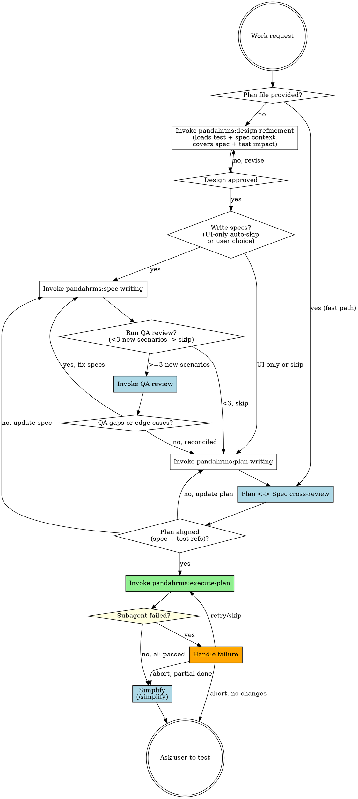

# Pandahrms Atlas Pipeline Orchestrator

<MANUAL-ONLY>
atlas-pipeline-orchestrator activates ONLY when one of these conditions holds:
1. The immediately preceding assistant turn invoked the forge-pipeline-orchestrator skill and announced "Routing to atlas-pipeline-orchestrator based on Pipeline Selection".
2. The user's most recent message starts with `/atlas-pipeline-orchestrator` (with optional plan path, `--resume`, or `--skip-e2e` flag).

In all other cases, STOP and respond verbatim: "Atlas Pipeline Orchestrator is reachable only via /atlas-pipeline-orchestrator or via forge-pipeline-orchestrator's Pipeline Selection. Run /forge-pipeline-orchestrator to start." Do NOT auto-activate from work-start triggers, brainstorming triggers, planning triggers, or execution triggers -- forge-pipeline-orchestrator owns the entry point for all such phrases.
</MANUAL-ONLY>

<SINGLE-INSTANCE>
Only one atlas-pipeline-orchestrator pipeline runs in a session at a time. Before starting, check whether a plan file exists with an `## Atlas Progress` section that has incomplete steps. If so, STOP and ask the user via AskUserQuestion: "An atlas-pipeline-orchestrator run is already in progress for plan '<path>'. How would you like to proceed?" with options: "Resume existing run", "Abort existing and start fresh", "Cancel this invocation". Do not silently start a parallel run.
</SINGLE-INSTANCE>

<STATE-FILES>
Atlas Pipeline Orchestrator state lives ONLY in:
- The design doc at `docs/pandahrms/designs/<...>.md`
- The plan file's `## Atlas Progress` section
- Updated `.feature` spec files in `pandahrms-spec`
- Staged code changes via implementer subagents

Do NOT create any other state, log, tracking, scratch, or progress files. Do NOT create README.md, NOTES.md, CHANGELOG entries, summary docs, or any markdown file outside the design doc and plan file -- the Development Summary at Step 9 is delivered in the chat response, not as a file. Do NOT write to `~/.claude/bridge/` unless the user explicitly instructs you to.
</STATE-FILES>

<CANONICAL-LABELS>
All AskUserQuestion option labels shown in this skill are CANONICAL. Use them verbatim -- do not paraphrase, shorten, expand, or reorder. All announcement strings shown in quoted form (e.g. "Skipping QA review -- ...") are also canonical -- emit them verbatim with only the bracketed placeholders substituted.
</CANONICAL-LABELS>

## Overview

Unified Pandahrms-native pipeline: design, spec writing, QA review, implementation planning, Plan <-> Spec cross-review, and subagent-driven execution -- all in a single session, with no superpowers dependency.

Atlas Pipeline Orchestrator is the no-superpowers cousin of `forge-pipeline-orchestrator`. The pipeline shape is the same; the component skills swap from `superpowers:*` to `pandahrms:*`. The biggest practical difference is per-task throughput: atlas-pipeline-orchestrator runs single-stage review by default and only opts into a second-stage spec-compliance reviewer for tasks the plan tags `**Risk:** high`. This was the v4->v5 superpowers change that produced the largest slowdown.

**Role split between Codex and Claude (active only when Codex is available locally):** when `codex_available` is `true`, **Codex implements** (Step 6 dispatches, fix re-dispatches) and **Claude plans and audits** (Steps 1, 2, 4 planning; Steps 3, 5, 7 review; Step 8 exploration; second-stage reviewer for `Risk: high`). Codex never reviews its own output. When Codex is unavailable, the split collapses and Claude handles every step including implementation. See [Codex Availability](#codex-availability) for the full policy and announcement strings.

**Announce at start:** "I'm using Pandahrms atlas-pipeline-orchestrator to orchestrate design through execution (no-superpowers mode). Routed here from forge-pipeline-orchestrator."

## Fast Path (plan provided)

When `/atlas-pipeline-orchestrator` is invoked with a positional argument that is NOT `--resume` or `--skip-e2e`, treat it as a plan file path. Before skipping any steps:

1. Verify the path exists and is readable via the Read tool.
2. If the path is missing, unreadable, or does not contain a recognizable plan structure, STOP and respond verbatim: "Plan file '<path>' not found or unreadable. Provide a valid path or run /atlas-pipeline-orchestrator with no arguments to start fresh." Do not auto-create the file.

If validation passes, run Step 0 (Setup) FIRST, THEN announce "Executing existing plan -- running Plan <-> Spec cross-review, then execution.", THEN skip directly to step 5 (Plan <-> Spec cross-review), then step 6 (Execute plan).

- Step 0 runs in full -- codex detection and time tracking init still happen, even on Fast Path.
- On Fast Path entry, before Step 6 invokes pandahrms:execute-plan, atlas-pipeline-orchestrator reconciles the `Codex execution mode:` line in the existing plan against current `codex_available`:
  - If `codex_available` is true and the line is missing or set to `none`, overwrite it to `full` (the new policy default). Announce: `"Codex available -- setting execution mode to 'full' (atlas policy default)."`
  - If `codex_available` is true and the line is already `full` or `partial-parallel`, leave it alone.
  - If `codex_available` is false, force the line to `none` regardless of its previous value.

  Do NOT prompt the user with AskUserQuestion to confirm. The user can override by editing the line manually before Step 6 starts.
- Still run step 5 to catch drift between the pre-existing plan and current specs.
- After execution, still run step 7 (simplify), step 8 (Playwright e2e), and step 9 (ask user to test) with the Development Summary.

## Resume Path

If invoked with `/atlas-pipeline-orchestrator --resume`:

1. Read the plan file's `## Atlas Progress` section to determine which steps completed and their timing.
2. Validate the section: it MUST have a parseable step table AND `Atlas started:` AND `Codex available:` lines. If any are missing or malformed, STOP and ask the user via AskUserQuestion: "Plan file's Atlas Progress section is malformed or unparseable. How would you like to proceed?" with options: "Start fresh (overwrite progress section)", "Abort so I can fix it manually". Do not auto-recover.
3. Announce: "Resuming atlas-pipeline-orchestrator from step N -- [step name]."
4. Continue from the next incomplete step with full time tracking.
5. If no plan file exists, announce: "No atlas-pipeline-orchestrator state found -- starting fresh." and begin from Step 0 (Setup), then Step 1.
6. If a plan file exists but has no `## Atlas Progress` section, STOP and prompt via AskUserQuestion: "Plan file exists but has no atlas-pipeline-orchestrator state. How would you like to proceed?" with canonical options: "Treat as Fast Path (start at Step 5)", "Start fresh (overwrite plan)", "Cancel". Do not silently fall through to Step 1.
7. After resuming, run all remaining incomplete steps in order through Step 9 inclusive. Resume mode does NOT change which steps run -- only which step the run starts at. The Step 9 termination rules apply identically to resumed runs.

## Scope Profile

After the design is approved (end of Step 1), classify the work into a **Scope Profile** so downstream steps can scale ceremony to feature size. This is the single biggest lever for cutting wall-clock on small features without sacrificing rigor on big ones.

**Classification precedence (apply in order, first match wins):**
1. Check **heavyweight** triggers first. If ANY heavyweight trigger matches, classify as `heavyweight` regardless of file count or other criteria.
2. Otherwise, check **lightweight** criteria. ALL FIVE bullets must match for `lightweight`.
3. Otherwise, classify as `standard`.

| Profile | Triggers (any one matches) | What scales down |
|---------|---------------------------|------------------|
| **lightweight** | • Touches <3 production source files (see [Production Source File](#production-source-file) for definition), AND<br>• No schema migration / EF migration, AND<br>• No auth, multi-tenant boundary, billing, payment, or PII change, AND<br>• No breaking API change (additive endpoints/fields are fine), AND<br>• Plan estimate <8 tasks | • QA review (Step 3) auto-skips even at >=3 new scenarios<br>• Plan-Spec cross-review (Step 5) runs in pragmatic mode (only business-logic tasks need Test refs flagged; wiring/property tasks are accepted)<br>• Simplify (Step 7) auto-skips unless Execute reported `DONE_WITH_CONCERNS` for any task<br>• Plan tightening: target 5-7 tasks, collapse strictly-sequential wiring, mechanical commands become Manual Gates not tasks<br>• Design (Step 1) MUST batch clarifying questions into a single AskUserQuestion call when 2-4 of them are causally independent (definition: the user's answer to question A does not change the wording, options, or applicability of question B). Otherwise ask sequentially. |
| **standard** | Anything that doesn't match `lightweight` and doesn't match `heavyweight` | Default ceremony: every step runs as documented |
| **heavyweight** | Any one matches:<br>• Touches auth, multi-tenant data, billing, payment, or PII<br>• Schema migration affecting >1 table or destructive (drop/rename column)<br>• Breaking API change<br>• Touches >10 production files | Adds: mandatory `Risk: high` tag review on every task in [pandahrms:execute-plan](../execute-plan/SKILL.md) (not just plan-author-tagged), and athena-code-review run BEFORE Step 8 (in addition to user-triggered post-test review) |

### How to set it

1. After Step 1 approval, before invoking spec-writing, estimate file count and check trigger criteria using the precedence above. Announce verbatim: `"Scope Profile: <profile> (<rationale>)."` -- always include the rationale.
2. Persist to the plan's Atlas Progress section once the plan is created (Step 4): `Scope Profile: lightweight|standard|heavyweight`. Resumed runs read it back; do not re-classify on resume.
3. Do NOT proactively offer override via AskUserQuestion. Only re-classify if the user explicitly objects to the announced profile in their next message.

### Production Source File

For Scope Profile classification (the lightweight criterion above), "production source file" means any file under the project's source tree (`src/`, `Pandahrms.*/` for BE) EXCLUDING:

- Generated types (`*.d.ts`, OpenAPI client output)
- Test files (`*.test.*`, `*.spec.*`, `*Tests.cs`)
- `.feature` spec files
- Storybook stories (`*.stories.*`)
- Config-only files (`.editorconfig`, `tsconfig.json`, `appsettings.*.json`, `*.csproj`)

EF migration files COUNT as production source files for this rule. CSS/Tailwind class changes inside an existing component file count as one file modification, not zero.

### Display in Development Summary

Step 9 displays the profile in the summary header so the user can see why ceremony was tightened or expanded:

```
Development Summary [Scope: lightweight] (active work time, ...)
```

## Codex Availability

At the very start of every atlas-pipeline-orchestrator run (Step 0 / Setup, including Fast Path and Resume Path), detect whether Codex is available locally.

1. Run `command -v codex` via Bash. Treat as available ONLY if exit code is 0 AND stdout is non-empty AND the resolved path exists. In any other case (non-zero exit, empty stdout, missing path, Bash error), set `codex_available=false`. Do not retry detection.
2. Store the result in conversation context as `codex_available` (true/false). Persist it into the plan file's `## Atlas Progress` section once the plan exists, on a `Codex available: true|false` line, so resumed runs do not need to re-detect.

### Role split (active ONLY when `codex_available` is true)

The role split below applies if and only if `codex_available` is `true` at Step 0. When codex is unavailable, the split is **inactive** -- Claude handles every step, including Step 6 implementation and fix re-dispatches. Skip the rest of this subsection on no-codex runs.

When codex IS available, this pipeline divides labor by capability, not by step number:

| Layer | Owner | Steps |
|-------|-------|-------|
| **Implementation / fix** | Codex (`codex:codex-rescue`) | Step 6 implementer dispatch, Subagent Failure Handling re-dispatch on `insufficient reasoning`, any code-fix follow-up triggered by Step 7 Simplify findings |
| **Planning** | Claude (local `Agent` tool) | Step 1 design, Step 2 spec-writing, Step 4 plan-writing |
| **Auditing / review of Codex output** | Claude (local `Agent` tool) | Step 3 QA review, Step 5 Plan <-> Spec cross-review, Step 7 Simplify review pass, second-stage spec-compliance reviewer for `Risk: high` tasks |
| **Exploration** | Claude (local `Agent` tool) | Step 8 Playwright e2e, ad-hoc codebase exploration during design/plan |

The principle: when Codex is available, Codex writes code and Claude plans, audits, and explores. Codex is never asked to review its own work, and Claude never writes production code in this pipeline.

**No-codex fallback:** when `codex_available` is `false`, the split collapses -- Claude does both planning/audit AND implementation. Announce the degradation explicitly so the user knows.

### Default Step 6 codex execution mode

When `codex_available` is true, atlas-pipeline-orchestrator pre-sets the Step 6 [Codex Execution Mode](../execute-plan/SKILL.md#codex-execution-mode) to **`full`** -- every implementer dispatches via `codex:codex-rescue`. Atlas writes `Codex execution mode: full` into the plan file's `## Atlas Progress` section at plan creation (Step 4), and `pandahrms:execute-plan` reads it back without re-prompting.

The user can override by editing the line to `partial-parallel` or `none` before Step 6 starts; atlas honors whatever value the line holds when execute-plan runs. Do NOT prompt the user with AskUserQuestion just to confirm the default -- silent default is the point.

When `codex_available` is false, atlas writes `Codex execution mode: none`. There is no question to ask.

### Reviews never route to codex (only relevant when codex is available)

This rule only matters when `codex_available` is `true` -- on no-codex runs there is nothing to route anywhere. When codex IS available:

- Step 3 (QA Review Agent), Step 5 (Plan <-> Spec cross-review), and Step 7 Simplify's review pass run via the local `Agent` tool -- not `codex:codex-rescue`. These are auditing tasks; Claude is the auditor.
- The second-stage spec-compliance reviewer dispatched by `pandahrms:execute-plan` for `Risk: high` tasks also runs via Agent, even when codex implemented the task. Reviewing Codex's output is Claude's job; see `pandahrms:execute-plan` Reviewer Verdict Handling.
- Do NOT use the `READ-ONLY REVIEW` prefix in atlas -- it was needed only to keep codex from modifying files during a review dispatch, and atlas no longer dispatches codex for reviews.

### Implementation dispatches let Codex write

Step 6 implementation prompts (sent to `codex:codex-rescue` from `pandahrms:execute-plan`) MUST NOT include the `READ-ONLY REVIEW` prefix. They let codex modify files. The read-only prefix is reserved for review-only dispatches -- and since atlas no longer routes reviews to codex, the prefix only appears in this pipeline if a future skill explicitly opts in.

### Codex failure mid-run

If a `codex:codex-rescue` dispatch fails after Step 0 detection succeeded (timeout, runtime error, non-zero exit, missing binary): do NOT retry codex. Set `codex_available=false` in conversation context for the remainder of this run, persist `Codex available: true (degraded to false at step N)` in the Atlas Progress section, and re-dispatch the failing implementer via the regular `Agent` tool (Claude takes over implementation). Also flip the `Codex execution mode:` line to `none` so subsequent batches don't try codex again. Do not stall waiting for codex recovery.

### Start announcements

- Codex available: `"Codex detected -- Step 6 implementations route to codex:codex-rescue (mode: full). Planning and reviews stay on Claude."`
- Codex unavailable: `"Codex not detected -- Claude handles both implementation and reviews for this run."`

<HARD-GATE>
AUTHORITY HIERARCHY:

**Design time (steps 1-4):** Discussion/decisions are the source of truth. If a discussion or decision diverges from the existing spec, UPDATE the spec before writing the plan. Never write a plan that contradicts the spec -- update the spec first, then plan from the updated spec.

**Execution time (step 6):** The plan is the source of truth for each implementer subagent. But implementers MUST cross-check against the spec. If plan and spec disagree, STOP and report -- never silently pick one.

**Never silently reconcile.** When authority sources disagree, STOP and prompt via AskUserQuestion: "Authority sources disagree -- [describe the conflict]. How would you like to resolve?" with canonical options: "Update spec to match plan", "Update plan to match spec", "Abort atlas". Never silently pick a side; never just print a warning and continue.
</HARD-GATE>

<HARD-GATE>
NO COMMITS DURING EXECUTION. Implementer subagents stage changes (`git add`) but never run `git commit`. The user tests first, then runs `/hermes-commit` to plan and execute atomic commits across the full set of changes. This rule lives in `pandahrms:execute-plan` -- atlas-pipeline-orchestrator just trusts the component skill to enforce it.

GIT COMMAND ALLOWLIST. Implementer subagents and atlas-pipeline-orchestrator itself may ONLY run these git verbs without user approval: `add`, `diff`, `status`, `log`, `show`, `ls-files`, `rev-parse`, `blame`. Any other git verb (`commit`, `push`, `checkout`, `restore`, `reset`, `stash`, `rebase`, `merge`, `branch`, `tag`, `clean`, `rm`, `mv`, `cherry-pick`, `revert`) requires explicit user approval via AskUserQuestion before invocation. Read-only inspections of git state are always permitted.
</HARD-GATE>

## Pipeline



> **Note:** The diagram above shows the core flow. Step 8 (Playwright e2e) inserts between Simplify and Ask user to test when configured -- see Checklist for the authoritative step list.

## Checklist

You MUST create a task for each of these items and complete them in order. Apply [Time Tracking](#time-tracking) to every step -- record start/end times and pause during user prompts.

0. **Setup** -- run [Codex Availability](#codex-availability) detection and Time Tracking initialization (see [Time Tracking > On atlas-pipeline-orchestrator start](#time-tracking)). This MUST complete before Step 1 begins. Persist results to conversation context until the plan file is created.
1. **Design** -- invoke `pandahrms:design-refinement`. The skill loads test + spec context, asks clarifying questions (one at a time by default; batched into a single AskUserQuestion when 2-4 questions are causally independent -- definition: the user's answer to question A does not change the wording, options, or applicability of question B. If even one pair fails this test, ask sequentially. See the [pandahrms:design-refinement batched-questions rule](../design-refinement/SKILL.md#question-pacing)), proposes 2-3 approaches, presents the design in sections, and saves an uncommitted design doc to `docs/pandahrms/designs/<...>.md` covering spec impact, test impact, and implementation approach. **Immediately after Step 1 approval, in this exact order:** (a) classify the work using [Scope Profile](#scope-profile), (b) announce the result verbatim per the format in Scope Profile > How to set it, (c) persist Scope Profile to conversation context (the plan file write happens at Step 4), (d) THEN proceed to Step 2.
2. **Write or update specs?** -- two routing decisions in one place:
   - **UI-only auto-skip**: if the work changes ONLY: CSS/Tailwind classes, color tokens, layout primitives (flex/grid props), animation timings, breakpoint behavior, dark-mode tokens, or static copy in components -- AND does NOT change form validation logic, API calls, conditional rendering driven by data, role/permission checks, route guards, or any handler/effect logic -- announce "Skipping spec-writing -- UI-only change with no business behavior impact" and proceed to step 4 (QA auto-skipped too). If even one non-UI change is present, do NOT auto-skip; route through the AskUserQuestion below.
   - **Otherwise**: use AskUserQuestion: "Would you like to write/update Gherkin specs before proceeding to the implementation plan?" with options "Yes, write/update specs" and "Skip specs". The user decides; do not pre-empt the question or recommend skipping. If yes, invoke `pandahrms:spec-writing` to write or update specs in pandahrms-spec. **Discussion/decisions are authoritative** -- if the design produced decisions that diverge from existing specs, update the spec to reflect the new decisions BEFORE writing the plan. Never leave an outdated spec to be reconciled later. Present the written/updated specs to the user for review before proceeding.
3. **QA review (conditional)** -- skip when ANY of these hold:
   - No specs exist for the area (UI-only, skip-specs path, or spec-less feature)
   - Fewer than 3 NEW scenarios were added in step 2. Use the grep specified in [QA Review Agent > Skip Condition](#skip-condition) to count -- modifications to existing scenarios do not count.
   - Scope Profile is `lightweight` (auto-skip regardless of scenario count -- the design pass at this scale is sufficient)

   Otherwise dispatch the QA-review sub-agent (two-pass: design<->spec coverage + edge cases) and wait for it to complete. See [QA Review Agent](#qa-review-agent) for dispatch prompt, skip-condition detection, and result handling. If QA surfaces coverage gaps or new scenarios, loop back to `pandahrms:spec-writing` to update the specs, then re-run QA. When QA returns zero blocking findings (or the user chooses to proceed), move on to step 4.
4. **Create implementation plan** -- invoke `pandahrms:plan-writing`. The skill produces a plan with:
   - **Spec ref** on every business-behavior task (when specs exist)
   - **Test ref** on every production-code task with Red-before-Green ordering
   - **Depends on:** marker on every task (atlas-pipeline-orchestrator reads this in step 6 to parallel-dispatch)
   - **Risk:** tag on tasks that need second-stage review (auth, multi-tenant, billing, schema, PII)
   - **No commit steps** -- plans stage changes only; /hermes-commit owns commits
5. **Plan <-> Spec cross-review** -- after the plan is written (or at Fast Path entry), verify three directions: (a) every plan task references a real spec scenario, (b) every in-scope spec scenario has at least one plan task, and (c) every plan task that touches production code names a test reference with Red-before-Green ordering. The (c) check is the only test-ref validator on Fast Path -- do not skip it. If gaps exist, fix them before execution. See [Plan-Spec Cross-Review](#plan-spec-cross-review) for skip conditions and resolution paths.
6. **Execute plan** -- invoke `pandahrms:execute-plan`. The skill reads the plan, resolves the codex execution mode (asks the user once if `codex_available` is true and the mode isn't already set in the progress section), groups tasks by `Depends on:`, parallel-dispatches independent batches (cap 5 per batch, Agent + codex counted together), runs single-stage review by default, and opts into second-stage spec-compliance review only for tasks tagged `**Risk:** high` (reviewer routes through codex when available). Implementer subagents stage changes but never commit. Time tracking records the step as a whole (wall-clock from first dispatch to last return). If a subagent fails, follow [Subagent Failure Handling](#subagent-failure-handling).

   **Step 6 completion is reached when one of:** (a) all dispatched tasks return success or skipped status, OR (b) the user chooses "Abort atlas" in the failure-handling flow. Time tracking ends at that moment regardless of outcome.

   **Plan-file mutations allowed during Step 6:** (i) checking off completed tasks (`[ ]` -> `[x]`), (ii) updating the Atlas Progress table, (iii) appending the Step 6 Task Timing block, (iv) annotating individual failed task entries with their final status (`failed-skipped`, `failed-aborted`, `succeeded-after-retry-N`). Do NOT modify task definitions, dependencies, risk tags, spec refs, or test refs during execution. Any task-definition change requires looping back to `pandahrms:plan-writing` first.

7. **Simplify (conditional)** -- once Step 6 has finished, decide whether to run `simplify` using these conditions in this exact precedence order (first match wins):
   - **Auto-skip** when Step 6 was aborted with no completed tasks. Announce: `"Skipping Simplify -- Step 6 aborted with no completed tasks."`
   - **Auto-skip** when Scope Profile is `lightweight` AND no implementer returned `Status: DONE_WITH_CONCERNS`. Announce: `"Skipping Simplify -- lightweight scope with no concerns flagged."`
   - **Run with severity filter** when Scope Profile is `lightweight` AND at least one task returned `DONE_WITH_CONCERNS`. Tell the simplify subagents to report only severity >= medium findings; ignore cosmetic-only suggestions (comment trims, helper extractions of <10 lines, file-level reorderings).
   - **Run normally** when Scope Profile is `standard` or `heavyweight`, regardless of `DONE_WITH_CONCERNS` status.

   All resulting changes remain uncommitted -- the user still tests in Step 9 before /hermes-commit.
8. **Playwright e2e (conditional)** -- if Playwright is configured for the working project, run an e2e pass on the changes from this session. See [Playwright E2E Step](#playwright-e2e-step) for the detection and execution rules. Skip silently when Playwright isn't installed.
9. **Ask user to test** -- present the Development Summary. If the plan file's `## Atlas Progress` section has an `### Acknowledged Gaps` block (gaps the user chose to "Proceed anyway -- mark as known gap" during Step 5), surface each gap with: "**Acknowledged gaps to verify manually:** [gap list]." Then end with: "Please test your changes, then run /hermes-commit when ready."

   **atlas-pipeline-orchestrator terminates the moment the closing line ('Please test your changes, then run /hermes-commit when ready.') is appended to the response.** Before that line is sent, atlas-pipeline-orchestrator remains active and treats any user message as input to the in-progress step. After the closing line is sent, atlas-pipeline-orchestrator is fully terminated.

   After termination, do NOT: invoke `/hermes-commit`, offer to `/schedule` any agent, propose follow-up work, summarize what was done a second time, suggest next steps, comment on the diff, or continue producing analysis. The next user message restarts evaluation from the system prompt; treat it as unrelated unless it begins with `/atlas-pipeline-orchestrator`, `/atlas-pipeline-orchestrator <plan-path>`, or `/atlas-pipeline-orchestrator --resume`.

## Time Tracking

Track **active work time** across the full atlas-pipeline-orchestrator run -- time spent by Claude doing work, excluding time waiting for user input or blocked on external factors. Display a summary when execution completes.

### How to track

1. **On step start** -- record the current time (use `date +%s` via Bash)
2. **Before any user prompt** -- record a pause timestamp. This includes:
   - AskUserQuestion calls (design approval, "write specs?", "add QA findings to specs?", "how to resolve Plan <-> Spec gaps?", subagent-failure prompts)
   - Any blocker requiring user action (e.g., environment issue, missing access)
   - Presenting results and waiting for user to respond
3. **After user responds** -- record a resume timestamp. Add the paused duration to the step's excluded time.
4. **On step completion** -- calculate: `duration = (end - start) - total_excluded_time`. Display: `"Step N completed in Xm Ys (active work)"`
5. **On final step completion** -- display a summary:

```
Development Summary [Scope: lightweight] (active work time, excludes user-wait)
===========================
Design                       --  12m 34s
Write specs                  --   8m 21s
QA review                    --     skipped (lightweight)
Create implementation plan   --  15m 02s
Plan <-> Spec cross-review   --   1m 30s (pragmatic, inline)
Execute plan                 --  18m 14s
  Dispatch-prep              --     0m 21s (1.9%)
  Subagent-active            --  17m 53s (98.1%)
    Test runtime sum         --   3m 12s
    Risk:high tasks          --   0 of 7
    Idle-wait observed       --     1m 19s (Batch 2: T3 waited on T2)
Simplify                     --     skipped (lightweight, no concerns)
Playwright e2e               --   2m 06s
===========================
Grand total (active)         --     58m 47s
Total wall-clock time        --  1h 32m 11s
User-wait time               --     33m 24s
```

### What counts as paused time

| Paused (exclude from timing) | Active (include in timing) |
|------------------------------|---------------------------|
| Waiting for user to answer AskUserQuestion | Claude processing after user responds |
| User reviewing a design doc or spec | Designing, writing specs, planning |
| User fixing an environment issue | Subagent execution |
| Blocked on external dependency | Reading files, running commands |

### Implementation

Use the plan file as the single source of truth for both progress tracking and timing. Before the plan file exists (steps 1-3), hold timestamps in conversation context. Once the plan is created (step 4), persist everything into the plan file.

Use the Read and Write tools for all plan file I/O. Only use Bash for `date +%s`.

**On atlas-pipeline-orchestrator start:**

1. Run `date +%s` in Bash to get the epoch
2. Hold the atlas-pipeline-orchestrator start time and step timestamps in conversation context until the plan file is created

**On plan creation (step 4):**

Append a `## Atlas Progress` section to the plan file. Backfill timing for whichever of steps 1-3 actually ran in this session. For Fast Path entries (steps 1-3 skipped), mark those rows as `skipped (Fast Path)` with no duration. For lightweight runs that auto-skipped Step 3, mark it as `skipped (lightweight)`. Use the canonical skip-reason strings in the [Skipped duration format](#skipped-duration-format) section below.

**Compose the full block first (step table + all metadata lines + empty Acknowledged Gaps block) and write it in a SINGLE Write tool call.** Do not split into multiple writes -- a single write avoids interleaving with concurrent reads and keeps the Atlas Progress section atomic.

```markdown
## Atlas Progress

| Step | Status | Duration |
|------|--------|----------|
| 1. Design | done | 12m 34s |
| 2. Write specs | done | 8m 21s |
| 3. QA review | skipped | skipped (lightweight) |
| 4. Create implementation plan | done | 15m 02s |
| 5. Plan <-> Spec cross-review | pending | -- |
| 6. Execute plan | pending | -- |
| 7. Simplify | pending | -- |
| 8. Playwright e2e | pending | -- |
| 9. Ask user to test | pending | -- |

Atlas started: 1718000000
Codex available: true
Codex execution mode: full
Playwright e2e: auto-detect
Scope Profile: lightweight

### Acknowledged Gaps

(Populated only when the user chose "Proceed anyway" during Step 5. One bullet per gap. Step 9 surfaces this list to the user.)
```

**On each step completion:**

1. Run `date +%s` in Bash to get the timestamp
2. Use the **Read** tool to load the plan file. **If the plan file is missing or unreadable, STOP and respond verbatim: "Plan file '<path>' is missing or unreadable. atlas-pipeline-orchestrator cannot continue without state. Restore the file or abort." Do NOT auto-recreate the plan file.**
3. Update the step's row in the Atlas Progress table (status and duration)
4. Use the **Write** tool to save the plan file back

### Skipped duration format

For skipped steps, the Duration column shows exactly one of these canonical strings (substitute the bracketed value where indicated):

- `skipped (lightweight)` -- Scope Profile is lightweight and the step's lightweight-skip rule applied
- `skipped (no specs)` -- no specs exist or were created in this session
- `skipped (<N new scenarios)` -- replace `<N` with the actual count, e.g. `skipped (2 new scenarios)`
- `skipped (BE-only)` -- session changes have no FE-visible surface (Step 8 only)
- `skipped (Playwright not configured)` -- Step 8 only
- `skipped (--skip-e2e)` -- user requested e2e skip via flag or progress section
- `skipped (Fast Path)` -- step bypassed because /atlas-pipeline-orchestrator was invoked with a plan-file path
- `skipped (aborted - nothing to test)` -- Step 6 ended with no completed tasks

Do not paraphrase these strings. If a new skip reason appears, add it to this list before using it.

**On task completion (step 6):**

When a subagent completes a plan task, update the task's checkbox in the plan file from `- [ ]` to `- [x]`, then update the Atlas Progress table for step 6's running duration.

Active duration = `(end - start) - sum(resume - pause for each pause)`

Format durations by computing in your reasoning: `Xm YYs`. Skipped steps use the canonical strings from [Skipped duration format](#skipped-duration-format) -- never the bare `-- skipped` placeholder.

### Execution step timing

Step 6 (execute plan) is tracked as a single step at the orchestrator level (wall-clock from first subagent dispatch to last subagent completion), AND with per-task / per-batch breakdown for benchmarking.

**Roll-up duration** -- the headline number shown in the Development Summary header for Step 6 is wall-clock from first dispatch to last return.

**Breakdown** -- pandahrms:execute-plan populates a `### Step 6 Task Timing` block beneath the Atlas Progress table as each batch completes. See [pandahrms:execute-plan Step 6 Timing Breakdown](../execute-plan/SKILL.md#step-6-timing-breakdown) for the exact schema (per-task: dispatcher, type, wall-clock, test runtime, risk, status; per-batch: prep time, wall-clock, idle-wait notes).

**Surfacing in the Development Summary** -- after the Step 6 row, append a sub-block summarizing the breakdown so the user gets benchmarking data without opening the plan file:

```
Execute plan                 --  18m 14s
  Dispatch-prep              --     0m 21s (1.9%)
  Subagent-active            --  17m 53s (98.1%)
    Test runtime sum         --   3m 12s
    Risk:high tasks          --   1 of 8 (T4 -- 3m 22s incl. 0m 41s review)
    Idle-wait observed       --   2m 03s (Batch 4: T5 waited on T4)
```

If a field can't be measured (e.g. a single-task batch has no idle-wait), omit the line rather than show `0`.

## Subagent Failure Handling

When a subagent returns `Status: BLOCKED`, `Status: NEEDS_CONTEXT`, or any non-success exit (build error, test failure, merge conflict):

1. **Pause execution** -- wait for all in-flight subagents in the current parallel batch to return, then do not dispatch any further batches until the user decides how to proceed.
2. **Check the retry counter** -- a single task may be re-dispatched at MOST 3 times across all classifications, counted in conversation context per task name. If the failing task has already been re-dispatched 3 times, do NOT offer the "Re-dispatch with added context" or "Re-dispatch with stronger model" options. Only offer "Send back to plan/spec", "Skip and continue", and "Abort atlas".
3. **Classify the failure** -- before offering retry, identify the failure mode. This avoids blind retries that waste time:
   - **Missing context** (typically `Status: NEEDS_CONTEXT`) -- the implementer prompt was missing a file, type, scenario, or env var the task requires. Resolution: re-dispatch with the missing context added.
   - **Insufficient reasoning** -- the subagent attempted the task but produced incorrect or incomplete code (e.g. failed verification it should have passed). Resolution: re-dispatch via `codex:codex-rescue` if `codex_available` is true. If the current codex execution mode is "none", switch to "partial-parallel" for the retry. If codex is unavailable, re-dispatch via the regular Agent tool with explicit user-supplied guidance.
   - **Task too large** -- the subagent partially completed work but the scope exceeds what fits in one dispatch. Resolution: return to `pandahrms:plan-writing` to split the task; do not retry as-is.
   - **Plan or spec error** (typically `Status: BLOCKED` with conflict details) -- the plan and spec disagree, the spec is internally contradictory, or the plan references something that doesn't exist. Resolution: escalate to the user; loop back to `pandahrms:spec-writing` or `pandahrms:plan-writing` as appropriate.
4. **Present the error and classification** -- show the failing subagent's name, task description, returned status, error output, your classification, and the current retry count for that task.
5. **Ask the user** via AskUserQuestion: "Subagent '[task name]' returned [status] -- classified as [missing context / insufficient reasoning / task too large / plan or spec error]. How would you like to proceed?" with options matched to the classification (omit retry options if the 3-retry cap has been hit):
   - **"Re-dispatch with added context"** (missing context) -- you provide the missing piece, atlas-pipeline-orchestrator re-dispatches the same task and increments the retry counter.
   - **"Re-dispatch with stronger model"** (insufficient reasoning) -- atlas-pipeline-orchestrator re-dispatches via codex per the resolution rule above and increments the retry counter.
   - **"Send back to plan/spec"** (task too large or plan/spec error) -- atlas-pipeline-orchestrator pauses execute, loops back to the relevant skill, then resumes; this resets the retry counter for that task.
   - **"Skip and continue"** -- note the failed task in the conversation and proceed with remaining tasks.
   - **"Abort atlas"** -- stop execution, display the Development Summary with the Execute step marked failed, and end with: "Atlas aborted. Completed tasks remain uncommitted. Run /hermes-commit when ready or discard with git restore."

When the implementer returns `Status: DONE_WITH_CONCERNS`, do NOT silently mark the task complete. Surface the concerns via AskUserQuestion using these canonical option labels: "Accept (mark complete)", "Re-dispatch with guidance", "Escalate to design/plan".

Failures do not alter the step-level Development Summary other than annotating the Execute step's outcome (e.g. `Execute plan -- 18m 14s (1 task failed, skipped)`).

## QA Review Agent

In step 3, after specs are written/updated, dispatch a sub-agent to audit the specs in two passes in a single run. The agent runs in the foreground -- wait for it to return and reconcile findings before moving on to plan-writing (step 4).

1. **Design<->Spec structural coverage** -- does every design requirement have a corresponding spec scenario? (replaces the standalone spec-review step)
2. **Edge-case hunt** -- what did both the design and spec miss? Unhappy paths, boundary conditions, implicit requirements.

### Skip Condition

Skip this step when EITHER condition holds:

**A. No specs to review** -- detect by:
- No `.feature` files were created or updated in this session, AND
- No in-scope `.feature` files exist for the feature area in `pandahrms-spec`

Covers UI-only work, "skip specs" path, and any invocation against a spec-less feature.

**B. Light spec changes** -- specs were edited but fewer than 3 NEW scenarios were added in step 2. Modifications to existing scenarios DO NOT count. Step 1's design already covered impact for small edits, so a fresh edge-case hunt isn't worth the cost.

To count new scenarios, run `git diff` on the spec files updated in this session and count `^+\s*Scenario:` and `^+\s*Scenario Outline:` lines (added scenario headers only). If the count is < 3, skip.

Announce the skip reason -- e.g. `"Skipping QA review -- no specs to review."` or `"Skipping QA review -- only N new scenario(s) added (threshold: 3)."`

### Agent Dispatch

QA review is an audit task -- ALWAYS dispatch via the local `Agent` tool, regardless of `codex_available`. Reviews stay on Claude in this pipeline (see [Codex Availability > Reviews stay on Claude](#codex-availability)). Do NOT add a `READ-ONLY REVIEW` prefix -- that prefix existed for codex review dispatches, and atlas no longer routes reviews to codex.

Replace the placeholders:
- `{design_doc_path}` -- path to the approved design document
- `{spec_file_paths}` -- paths to all written spec files
- `{scope_notes}` -- brief "in scope / out of scope" summary extracted from the design doc, so the agent doesn't flag edge cases for deferred features

```
prompt: |
  You are a QA reviewer. Your job has TWO parts, completed in one pass:

  **Part A: Design<->Spec structural coverage** -- verify every design
  requirement has a corresponding Gherkin scenario.

  **Part B: Edge-case hunt** -- identify missed edge cases, unhappy paths,
  boundary conditions, and implicit requirements.

  ## Inputs

  Design document: {design_doc_path}
  Spec files: {spec_file_paths}
  Scope: {scope_notes}

  Read the design document and all spec files. The scope section defines
  what is in-scope and out-of-scope for this iteration. Only flag edge
  cases for in-scope functionality -- do not report findings for features
  explicitly marked as deferred or out-of-scope.

  ## Part A: Structural coverage

  For every functional requirement in the design doc, check whether at
  least one spec scenario covers it. Report any design requirement that
  has NO spec scenario as a "coverage gap".

  ## Part B: What to Look For

  1. **Unhappy paths** -- What happens when the user provides invalid input,
     cancels mid-flow, loses connectivity, or hits a timeout?
  2. **Boundary conditions** -- Empty lists, maximum lengths, zero values,
     exactly-at-limit values, off-by-one scenarios.
  3. **Concurrent/conflicting actions** -- Two users editing the same record,
     duplicate submissions, race conditions.
  4. **Permission edge cases** -- User's role changes mid-session, permission
     revoked after page load, cross-tenant access attempts.
  5. **Data state edge cases** -- Soft-deleted records, archived entities,
     null/missing optional fields, migrated legacy data.
  6. **Implicit requirements** -- Behavior the design assumes but never states
     (e.g., audit logging, notification triggers, cascade effects).

  ## Output Format

  Return a structured report:

  ### Coverage Gaps (Part A)

  For each design requirement without spec coverage:
  - **ID**: COV-1, COV-2, etc.
  - **Design requirement**: Quote or summary from the design doc
  - **Suggested scenario**: A Gherkin scenario outline that would cover it

  ### Edge Cases Found (Part B)

  For each finding:
  - **ID**: QA-1, QA-2, etc.
  - **Category**: (unhappy path | boundary | concurrency | permission | data state | implicit requirement)
  - **Description**: What the edge case is
  - **Suggested scenario**: A Gherkin scenario outline (Given/When/Then) that would cover it
  - **Severity**: (high | medium | low) -- high means likely to cause a bug in production

  ### Summary

  - Coverage gaps: [count]
  - Total edge-case findings: [count]
  - High severity: [count]
  - Medium severity: [count]
  - Low severity: [count]

  If you find zero edge cases, state that explicitly -- do not invent findings.
  Only report findings whose Gherkin scenario fits inside the in-scope list
  above. If a finding requires functionality marked out-of-scope or deferred
  to a later iteration, omit it.

description: "QA review specs for edge cases"
```

### Handling Results

After the agent returns:

- **Zero findings (both parts)** -- announce "QA review complete -- coverage is complete and no additional edge cases found." Proceed to step 4.
- **Findings returned** -- present the agent's report to the user, then **automatically loop back to `pandahrms:spec-writing`** to incorporate coverage gaps AND high/medium/low severity edge-case findings as new scenarios. Do NOT ask the user whether to add them -- discrepancies found in spec review always go into the spec. Announce "QA review found [coverage_count] coverage gaps and [edge_count] edge cases ([high_count] high severity) -- adding to specs." Then re-run QA review on the updated specs. Low-severity findings are added by default; defer them ONLY if the user explicitly requests deferral during the spec-writing step (do not proactively offer deferral).

## Plan-Spec Cross-Review

After `pandahrms:plan-writing` produces the plan file (or when entering Fast Path with an externally-authored plan), verify the plan's integrity against both specs and tests before executing anything.

This step is the only validator for fast-path plans -- since Fast Path skips Step 4's plan-requirements check, Step 5 must cover those guarantees too.

### Skip Condition

Skip only when there are NO specs AND NO existing tests in the affected area. Detect this by:
- The plan file contains zero spec references, AND
- No `.feature` files exist for the feature area in `pandahrms-spec`, AND
- No test files exist in the affected codebase

This covers UI-only work with no tests, "skip specs" path with a spec-less and test-less area, and fast-path invocations against truly content-less features.

Announce the applicable skip reason -- e.g. `"Skipping Plan <-> Spec cross-review -- no specs or tests for this feature."`

### Pragmatic Mode (lightweight scope)

When [Scope Profile](#scope-profile) is `lightweight`, run cross-review in pragmatic mode:

- **Plan -> Test direction**: only flag tasks that touch business logic (handlers, validators, services, calculation/decision code) without a Test ref. Wiring tasks (entity property additions, EF mapping additions, DTO field additions, FE state additions, generated-type regen, render-only component glue) do NOT need a Test ref flag in pragmatic mode -- their behavior is already covered by the integration tests of the consumer they wire into.
- **Plan -> Spec direction**: same rule -- only business-logic tasks need an explicit spec ref. Property/wiring tasks pointing at scenarios that already cover the behavior the wiring delivers do not need their own line-item ref.
- **Spec -> Plan direction**: unchanged. Every in-scope spec scenario still needs at least one plan task.

Announce when pragmatic mode is in effect: `"Plan-Spec cross-review running in pragmatic mode (lightweight scope) -- wiring tasks accepted without per-line refs."`

For `standard` and `heavyweight` profiles, all three directions run with full strictness.

### How to Review

Plan <-> Spec cross-review is an audit task -- ALWAYS run inline via the local `Agent` tool, regardless of `codex_available` or Scope Profile. Reviews stay on Claude in this pipeline (see [Codex Availability > Reviews stay on Claude](#codex-availability)). Do NOT route to `codex:codex-rescue`; do NOT use the `READ-ONLY REVIEW` prefix.

Inline review steps:

1. Read the plan file and extract every task's spec reference, test reference, and (where present) verification slot.
2. Read every in-scope `.feature` file for the feature.
3. Check three directions:
   - **Plan -> Spec** -- does every plan task that touches business behavior reference a real spec scenario? Flag tasks with no spec reference or broken references. (Skip this check if no specs exist.)
   - **Spec -> Plan** -- does every in-scope spec scenario have at least one plan task implementing it? Flag uncovered scenarios. (Skip this check if no specs exist.)
   - **Plan -> Test** -- does every plan task that touches production code carry EITHER a `Test ref:` (with explicit Red-before-Green ordering) OR a `Verification:` slot whose category appears in the [pandahrms:plan-writing No-Test-Pattern Categories](../plan-writing/SKILL.md#no-test-pattern-categories) table (EF mapping, EF migration, read DTO + projection, API regen, pure config)? **Do NOT flag tasks with a valid `Verification:` slot -- accept them silently as fulfilling the requirement.** Flag only tasks that have neither a Test ref nor a recognized Verification slot. (This check runs whenever any tests exist OR whenever the plan modifies production code.)
4. Generate a findings report partitioned by direction. Do NOT prompt the user with AskUserQuestion at this point. Use the report internally to drive automatic loop-backs per Handling Results below. Surface findings to the user only via the announcement strings specified in Handling Results.

### Handling Results

- **All directions covered** -- announce "Plan, spec, and tests aligned. Proceeding to execution." Go to step 6.
- **Gaps found** -- the cross-review auto-resolves any gap that has real coverage value. It does NOT prompt the user. Resolution by direction:
  - **Plan -> Spec gap (plan task with no spec scenario)** -- discrepancy belongs in the spec. Loop back to `pandahrms:spec-writing` and add the missing scenario. Announce "Plan-Spec cross-review found N missing scenarios -- adding to specs."
  - **Spec -> Plan gap (spec scenario with no plan task)** -- plan completeness issue. Loop back to `pandahrms:plan-writing` to add the missing task. For fast-path plans, edit the plan file directly. Announce "Plan-Spec cross-review found N uncovered scenarios -- adding plan tasks."
  - **Plan -> Test gap (production-code task missing both Test ref and Verification)** -- loop back to `pandahrms:plan-writing` to add the missing reference. For fast-path plans, edit the plan file directly:
     - If the task fits a recognized No-Test-Pattern Category, write a `Verification:` slot with the category and the verification method.
     - Otherwise, add a real `Test ref:` with Red-before-Green ordering.
     Announce "Plan-Spec cross-review found N tasks missing test references -- resolving."
  - **Mixed gaps** -- handle each direction per the rules above with this strict order:
     1. **Plan -> Spec FIRST** -- it edits `.feature` files in pandahrms-spec.
     2. **Spec -> Plan SECOND** -- it edits the plan file in the working project.
     3. **Plan -> Test THIRD** -- it edits test references inside the plan file; must run AFTER Spec -> Plan to avoid concurrent writes to the same plan file.

     If Spec -> Plan has zero gaps, run Plan -> Test in parallel with Plan -> Spec (no shared file -- one writes the plan, the other writes `.feature` files). Never run two writes against the same file in parallel.

**Auto-accepted (do NOT loop back, do NOT report as gaps):**
- Tasks with a valid `Verification:` slot whose category appears in the [pandahrms:plan-writing No-Test-Pattern Categories](../plan-writing/SKILL.md#no-test-pattern-categories) table.
- Spec scenarios marked out-of-scope in the design doc's scope section.

Only fall back to AskUserQuestion when one of these conditions holds:

1. **Irreconcilable conflict** -- a loop-back surfaces a conflict that cannot be resolved without user input (e.g. the design itself contradicts the new spec scenario the cross-review wants to add). Prompt verbatim: "Plan-Spec cross-review found an irreconcilable conflict: [describe]. How would you like to proceed?" with canonical options: "Update design to match", "Proceed anyway -- mark as known gap", "Abort atlas".

   When the user selects "Proceed anyway -- mark as known gap", append a single bullet to the `### Acknowledged Gaps` block of the plan file's Atlas Progress section: `- [Step 5 conflict description] -- acknowledged at [ISO 8601 timestamp].` This is the ONLY trigger that populates the Acknowledged Gaps block. atlas-pipeline-orchestrator does NOT auto-acknowledge gaps under any other condition.

2. **Unrecognized Verification category** -- a `Verification:` slot uses a category NOT in the [pandahrms:plan-writing No-Test-Pattern Categories](../plan-writing/SKILL.md#no-test-pattern-categories) table. Prompt verbatim: "Task '[name]' uses Verification category '[category]' which is not in the No-Test-Pattern table. How would you like to proceed?" with canonical options: "Add category to pandahrms:plan-writing", "Convert to real Test ref", "Accept once for this run".

Do not proceed to execution while real gaps remain unresolved.

## Playwright E2E Step

Step 8 runs an end-to-end pass with Playwright after `simplify` and before handing the run back to the user, but only when Playwright is actually configured for the project. The goal is to catch UI-level regressions on the changes made this session before the user takes over.

### Detection

Check for Playwright in this order. The first match wins; stop checking once one is found.

1. `playwright.config.ts`, `playwright.config.js`, or `playwright.config.mjs` exists at the working project's root.
2. The project's `package.json` has `@playwright/test` (or `playwright`) under `dependencies` or `devDependencies`.
3. At least one `mcp__playwright__*` tool call has succeeded (returned a non-error result) earlier in the CURRENT atlas-pipeline-orchestrator conversation. Authorization in a prior session does not count.

If none match, announce `"Skipping Playwright e2e -- not configured for this project."` and proceed to Step 9. Do not install Playwright on the user's behalf.

### Scope: changes made this session

Run e2e only against the user-visible flows touched in this session, not the entire project's e2e suite. Identify scope from the staged diff:

1. Run `git diff --name-only --cached` (and `git diff --name-only` for unstaged) to list files changed in this session.
2. Map FE files to user-visible routes/components. Examples:
   - `src/routes/admin/appraisals/**` -> the appraisals admin pages.
   - `src/lib/components/forms/<Form>.svelte` -> any page that mounts that form.
3. Map BE files via the consuming endpoints, then to the FE pages that call them.
4. If no FE-visible change is detected (BE-only refactor, EF migration, internal helper), announce `"Skipping Playwright e2e -- session changes have no FE-visible surface."` and proceed.

### Execution

Use the `mcp__playwright__*` MCP tools (browser automation) -- not the project's offline `playwright test` runner -- so the user can watch the pass. Load the toolset via `ToolSearch` with this exact query string (do NOT shorten, paraphrase, or use ellipses):

```
select:mcp__playwright__browser_navigate,mcp__playwright__browser_click,mcp__playwright__browser_snapshot,mcp__playwright__browser_fill_form,mcp__playwright__browser_type,mcp__playwright__browser_press_key,mcp__playwright__browser_console_messages,mcp__playwright__browser_network_requests,mcp__playwright__browser_wait_for,mcp__playwright__browser_take_screenshot
```

For each scoped flow:
1. Navigate to the route the changed code controls (`browser_navigate`).
2. Execute the golden-path interaction (click, fill, submit) per the design doc's "happy path" description.
3. Take a snapshot (`browser_snapshot`) so the result is visible to the user.
4. Test exactly one failure mode that the design's "unhappy path" section or any spec scenario tagged `validation`, `permission`, or `error` explicitly defines. If no such failure mode is documented, run only the golden path and note `no documented failure mode -- only golden path tested` in the report.
5. Capture console errors (`browser_console_messages`) and network failures (`browser_network_requests`).

### Reporting

After the e2e pass, append a `### Playwright E2E` block to the Development Summary in Step 9:

```
### Playwright E2E

| Flow | Result | Notes |
|------|--------|-------|
| <route or page> | pass | golden path + 1 failure-mode |
| <route or page> | fail | <one-line failure summary> |
```

If any flow failed, surface the failures in plain language to the user as part of "ask user to test" -- they decide whether the failure is real (block /hermes-commit) or a flaky test (proceed). Do NOT auto-rerun failed flows. Report each failure once; if the user asks for a rerun, run it exactly once and report the second result. Never run a flow more than twice without explicit user direction.

### Skip conditions

Skip Step 8 entirely (with announcement) when any of these hold:
- Playwright is not configured (per Detection).
- This session's changes have no FE-visible surface.
- The user types `/atlas-pipeline-orchestrator --skip-e2e` or has set `Playwright e2e: skip` in the plan's `## Atlas Progress` section.
- Step 6 was aborted with no completed tasks (nothing to test).

## Red Flags

| Thought | Reality |
|---------|---------|
| "I'll skip the design step since the user described what they want" | Step 1 is mandatory. pandahrms:design-refinement enforces approval before implementation. |
| "It's a bug fix, no need to discuss tests upfront" | Bug fixes especially need a failing test that would have caught the bug. The design proposes that test before the fix. |
| "I'll just invoke pandahrms:execute-plan on a plan that has no Depends on: markers" | Reject the plan and loop back to pandahrms:plan-writing. Missing markers serialize the run -- atlas-pipeline-orchestrator can't parallel-dispatch. |
| "I'll mark every task Risk: high to be safe" | The default single-stage review is the point of atlas-pipeline-orchestrator. Tag only auth, multi-tenant, billing, schema, PII, or design-flagged risky tasks. |
| "I'll skip the QA review since specs look fine" | QA is conditional. Run it when Scope Profile is `standard` or `heavyweight` AND >=3 NEW scenarios were added; auto-skip for `lightweight` regardless. Don't skip a qualifying run on a hunch. |
| "I'll skip the Scope Profile classification -- it's obvious" | No. Always announce the profile after Step 1 with the rationale. The profile gates QA, cross-review pragmatic mode, and Simplify -- silent classification means downstream behavior changes without an audit trail. |
| "I'll keep the design questions strictly one-at-a-time even when they're clearly independent" | Default is one-at-a-time, but 2-4 causally-independent multiple-choice questions can batch into one AskUserQuestion. See pandahrms:design-refinement Question Pacing. |
| "Plan has 12 numbered tasks for a 1-property feature -- looks thorough" | Over-decomposition. Use the Collapse Rule in pandahrms:plan-writing: strictly-sequential wiring tasks merge into one. For lightweight scope, target 5-7 tasks. |
| "I'll number `pnpm openapi-ts` as Task 9" | Mechanical commands are Manual Gates, not tasks. They don't run through implementer subagents. |
| "I'll write 'user sees error \"must be 1-24\"' in the spec to be precise" | Precision means business outcome, not UI copy. Write 'request is rejected as out of range'. Hard-coded validation strings or input-control behaviors (auto-clamp vs error) trigger spec rewrites mid-pipeline. |
| "Discussion decided X but spec still says Y, I'll implement X" | Stop. Update the spec to reflect the decision FIRST, then plan. Never leave the spec outdated. |
| "Plan has no spec refs, but I'll just execute it" | Plans without spec refs (when specs exist) must be rewritten before execution. No shortcuts. |
| "Spec scenario has no plan task, but the plan looks complete" | Bi-directional coverage required. Either add a task or remove the scenario -- don't execute around it. |
| "QA found edge cases -- I'll ask the user whether to add them to specs" | Don't ask. Spec-review discrepancies always go into the spec automatically. Loop back to pandahrms:spec-writing without prompting. |
| "Plan-Spec cross-review found a missing scenario -- I'll AskUserQuestion how to resolve" | Don't ask for Plan -> Spec gaps. Auto-add the scenario via pandahrms:spec-writing. Only ask when an irreconcilable conflict surfaces during the loop-back. |
| "Cross-review found a task missing a test ref -- I'll flag it" | Check first whether it fits a No-Test-Pattern Category (EF mapping, migration, read DTO + projection, API regen, pure config). If yes, the resolution is to add a `Verification:` slot, not a Test ref. Only flag tasks that have neither a Test ref nor a valid Verification slot. |
| "I'll list noisy 'no test by convention' findings in the cross-review report" | No. Tasks with a valid Verification slot are silently accepted. The cross-review report only contains real gaps that need fixing. |
| "Cross-review found gaps -- I'll ask the user whether to fix them" | No. Real gaps with coverage value are auto-resolved by looping back to spec-writing or plan. The user is only asked when an irreconcilable conflict surfaces or when a Verification category isn't in the recognized list. |
| "Codex is installed -- I'll route the QA review (or Plan-Spec cross-review) through codex too, for second-opinion depth" | No. Reviews stay on Claude in this pipeline. Codex implements; Claude audits. The whole point of the role split is that Codex never reviews its own output. |
| "I'll prefix the QA review or Plan-Spec cross-review dispatch with READ-ONLY REVIEW" | No. The read-only prefix existed because codex defaults to `--write`. Atlas no longer dispatches reviews to codex, so the prefix is not used in atlas-driven dispatches. |
| "Codex is available but I'll ask the user which mode they want before Step 6" | No -- atlas pre-sets `Codex execution mode: full` when codex is available. The user can edit the line manually to override; do not prompt. |
| "I'll let Claude implement Step 6 tasks even though codex is available" | No. When codex is available, Step 6 implementations route to codex per the role split. Claude reviews codex's output, not produces production code. |
| "I'll let an implementer commit since the plan says to commit" | Plans should not contain `git commit` steps. pandahrms:execute-plan strips them on dispatch. /hermes-commit owns commits. |

## When to Use

- **Only** when forge-pipeline-orchestrator's Pipeline Selection routes here (user picked "Atlas Pipeline Orchestrator")
- **Only** when the user explicitly invokes `/atlas-pipeline-orchestrator`, `/atlas-pipeline-orchestrator <plan-path>`, or `/atlas-pipeline-orchestrator --resume`
- Otherwise: route the user to `forge-pipeline-orchestrator` -- it owns the entry point for all design/plan/execute work in Pandahrms projects.

## When NOT to Use

- ANY auto-trigger from natural-language phrases ("start new work", "build feature", "brainstorm", "design", "write a plan", "execute"). forge-pipeline-orchestrator owns those triggers and decides whether to hand off here.
- Quick fixes that don't need design (typos, config changes) -- handle directly without any orchestrator.
- Non-Pandahrms projects (use `superpowers:brainstorming` directly).
- Writing specs for existing functionality without a new design (use `pandahrms:spec-writing` directly).
- When the user explicitly wants the superpowers-based pipeline (use `forge-pipeline-orchestrator` instead).
