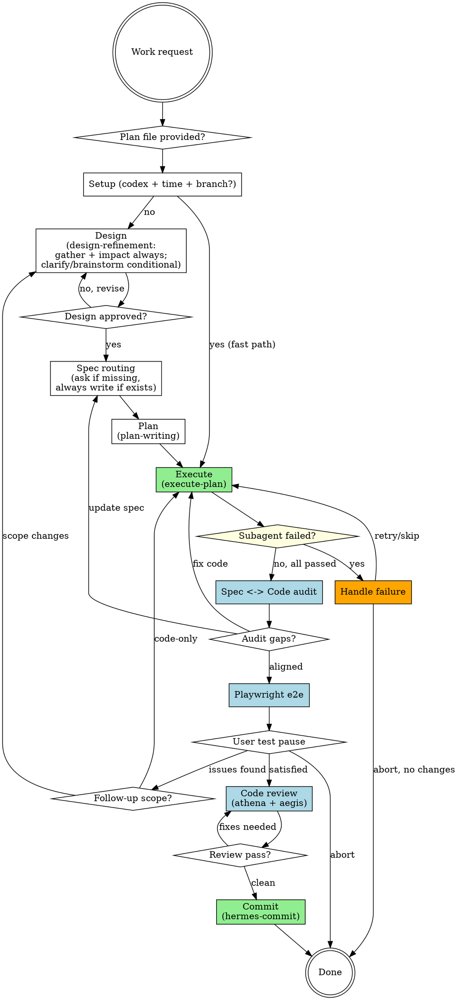

# Pandahrms Atlas Pipeline Orchestrator

<SINGLE-INSTANCE>
Only one atlas-pipeline-orchestrator pipeline runs per session. Before starting, check whether a plan file exists with an `## Atlas Progress` section that has incomplete steps. If so, STOP and ask via AskUserQuestion: "An atlas-pipeline-orchestrator run is already in progress for plan '<path>'. How would you like to proceed?" with options: "Resume existing run", "Abort existing and start fresh", "Cancel this invocation". Do not silently start a parallel run.
</SINGLE-INSTANCE>

<STATE-FILES>
Atlas Pipeline Orchestrator state lives ONLY in:
- Design doc at `docs/pandahrms/designs/<...>.md`
- Plan file's `## Atlas Progress` section
- Updated `.feature` spec files in `pandahrms-spec`
- Staged code changes via implementer subagents (Steps 4 and 9)
- Commit history once Step 10 completes

Do NOT create any other state, log, tracking, scratch, or progress files. Do NOT create README.md, NOTES.md, CHANGELOG entries, summary docs, or any markdown file outside design doc and plan file. Step 7 Development Summary (user-test handoff) is delivered in chat, not as a file. Do NOT write to `~/.claude/bridge/` unless the user explicitly instructs you to.
</STATE-FILES>

<CANONICAL-LABELS>
All AskUserQuestion option labels in this skill are CANONICAL. Use verbatim -- do not paraphrase, shorten, expand, or reorder. All announcement strings shown in quoted form (e.g. "Skipping Aegis -- ...") are also canonical -- emit verbatim with only bracketed placeholders substituted.
</CANONICAL-LABELS>

## Overview

Atlas drives the full Pandahrms work lifecycle from user prompt to committed code, in a single orchestrated run. The 11 internal atlas steps map to the 15-step user-visible lifecycle:

| Atlas Step | User lifecycle |
|------------|----------------|
| Pre-flight: optimise-prompt | 2 |
| 0. Setup (codex + time tracking + conditional branch reminder) | -- |
| 1. Design (gather + impact always; clarify/brainstorm conditional, via pandahrms:design-refinement) | 3-6 |
| 2. Spec routing (ask if missing; always write if exists) | 7 |
| 3. Plan (pandahrms:plan-writing) | 8 |
| 4. Execute (pandahrms:execute-plan) | 9 |
| 5. Spec <-> Code audit | 10 |
| 6. Playwright e2e (conditional) | 11 |
| 7. User test pause | 12 |
| 8. Follow-up loop (back to Step 1 if scope changes, Step 4 if code-only) | 13 |
| 9. Code review (athena + aegis; athena runs simplify on its findings) | 14 |
| 10. Commit (hermes-commit, pure) | 15 |

Atlas runs single-stage review by default for Step 4 (execute), opts into a second-stage spec-compliance reviewer only for tasks the plan tags `**Risk:** high`.

**Role split between Codex and Claude** (active when user opts in to Codex at Step 0): when `codex_enabled` is `true`, **Codex implements** (Step 4 dispatches, Step 8 follow-up re-dispatches, Step 9 review-driven fixes) and **Claude plans and audits** (Steps 1, 2, 3 planning; Steps 5, 9 review; Step 6 exploration; second-stage reviewer for `Risk: high`). Codex never reviews its own output. When user picks "No" at Step 0, the split collapses -- Claude handles every step including implementation. See [Codex Usage](#codex-usage) for full policy and announcement strings.

**Announce at start:** "I'm using Pandahrms atlas-pipeline-orchestrator to drive design through commit."

## Pre-Flight: Optimise the prompt (mandatory before any other step)

If `pandahrms:optimise-prompt` has not run on the current user message, invoke it via Skill tool with no arguments before the start announcement. Wait for return, emit start announcement, then continue using the confirmed intent as the canonical request for the rest of the pipeline.

Skip this pre-flight when:
- Standalone pre-flight already ran on the current user message and locked an intent. Reuse the locked intent.
- Current message is a direct reply to an AskUserQuestion the assistant just sent.
- Current message is a one-word ack ("yes", "ok", "no", "go", "continue").
- optimise-prompt is already running in the current call stack.
- Atlas is on Fast Path or Resume Path AND plan file already contains a confirmed intent line.

**Re-invoke on mid-pipeline fresh directives.** After pre-flight, every user message received between Atlas steps MUST be classified per the [Follow-up Directives](../optimise-prompt/SKILL.md#follow-up-directives) section of optimise-prompt. Continuation replies, control acks, and in-flight clarifications are absorbed by the current step. Fresh directives (new verb, new top-level object, scope expansion, contradiction of locked intent, mid-pipeline redirect) MUST pause the current step and re-invoke `pandahrms:optimise-prompt` before Atlas acts on them. Announce in B2 English which path Atlas took: replace-and-restart, add-and-continue, or switch-skill.

See [optimise-prompt](../optimise-prompt/SKILL.md) for the full algorithm.

## Fast Path (plan provided)

When `/atlas-pipeline-orchestrator` is invoked with a positional argument that is NOT `--resume` or `--skip-e2e`, treat it as a plan file path. Before skipping any steps:

1. Verify the path exists and is readable via Read tool.
2. If path is missing, unreadable, or does not contain a recognizable plan structure, STOP and respond verbatim: "Plan file '<path>' not found or unreadable. Provide a valid path or run /atlas-pipeline-orchestrator with no arguments to start fresh." Do not auto-create the file.

If validation passes, run Step 0 (Setup) FIRST, THEN announce "Executing existing plan -- skipping Steps 1-3, starting at Execute.", THEN skip directly to Step 4 (Execute). After Step 4, atlas continues through the remaining steps in order (5 audit, 6 e2e, 7 user test, 8 follow-up if needed, 9 review, 10 commit).

- Step 0 runs in full -- codex detection and time tracking init still happen on Fast Path.
- On Fast Path entry, before Step 4 invokes pandahrms:execute-plan, atlas reconciles the `Codex execution mode:` line in the existing plan against the user's Step 0 choice:
  - If `codex_enabled` is true and line is missing or set to `none`, overwrite to `full` (policy default). Announce: `"Codex enabled -- setting execution mode to 'full' (atlas policy default)."`
  - If `codex_enabled` is true and line is already `full`, leave alone.
  - If `codex_enabled` is false, force line to `none` regardless of previous value.

  Do NOT prompt via AskUserQuestion to confirm. User can override by editing the line manually before Step 4 starts.

Fast Path still runs Step 5 (Spec<->Code audit) post-execute to catch drift between pre-existing plan/spec and freshly-implemented code.

## Resume Path

If invoked with `/atlas-pipeline-orchestrator --resume`:

1. Read plan file's `## Atlas Progress` section to determine which steps completed and their timing.
2. Validate the section: MUST have a parseable step table AND `Atlas started:` AND `Codex enabled:` lines. If any are missing or malformed, STOP and ask via AskUserQuestion: "Plan file's Atlas Progress section is malformed or unparseable. How would you like to proceed?" with options: "Start fresh (overwrite progress section)", "Abort so I can fix it manually". Do not auto-recover.
3. Announce: "Resuming atlas-pipeline-orchestrator from step N -- [step name]."
4. Continue from the next incomplete step with full time tracking.
5. If no plan file exists, announce: "No atlas-pipeline-orchestrator state found -- starting fresh." and begin from Step 0 (Setup), then Step 1.
6. If a plan file exists but has no `## Atlas Progress` section, STOP and prompt via AskUserQuestion: "Plan file exists but has no atlas-pipeline-orchestrator state. How would you like to proceed?" with canonical options: "Treat as Fast Path (start at Step 4)", "Start fresh (overwrite plan)", "Cancel". Do not silently fall through to Step 1.
7. After resuming, run all remaining incomplete steps in order through Step 10 inclusive. Resume mode does NOT change which steps run -- only which step the run starts at. Step 10 termination rules apply identically to resumed runs.

## Scope Profile

After design is approved (end of Step 1), classify the work into a **Scope Profile** so downstream steps scale ceremony to feature size.

Three profiles. Classification has two stages, applied in order: hard promotors first, then a risk score.

### Stage 1 -- hard promotors (any one match -> `heavyweight`)

If ANY of these hold, profile is `heavyweight` regardless of score:

- Touches existing auth/authz logic (modifies a `requireRole`, permission check, JWT/session middleware, login flow, or any pre-existing authorization rule). Adding a `requireRole(...)` guard to a brand-new route does NOT match -- that is additive.
- Destructive schema change: `DROP COLUMN`, `DROP TABLE`, type change on a populated column, or NOT NULL added to an existing column with rows.
- Schema change to a multi-tenant boundary table (organisations, users, memberships, permissions, roles).
- Touches billing, payment, invoicing, or subscription code paths.
- Touches PII serialization, export, or audit-log content.
- Breaking API change: removed/renamed endpoint, removed required field, or added required field to an existing request shape.

### Stage 2 -- risk score (only when no hard promotor hit)

Sum points across every row that applies. Score 0-3 -> `lightweight`. Score 4+ -> `standard`.

| Trigger | Points |
|---------|--------|
| Production source files (see [Production Source File](#production-source-file)): 1-3 / 4-8 / 9-15 / 16+ | 0 / 1 / 2 / 3 |
| Plan task estimate: <6 / 6-9 / 10-14 / 15+ | 0 / 1 / 2 / 3 |
| Schema: none / additive column on existing table / additive new table | 0 / 1 / 1 |
| New form with validation rules (FE) | 1 |
| Touches hot-path handler (auth login, signup, primary list endpoints, order/ticket create, payment) | 2 |
| New cross-package boundary (touches `packages/shared-*` for shared-types / shared-constants) | 1 |

### Tier behaviour

| Profile | Design approval cadence | Plan + execute ceremony | Step 5 audit | Step 9 Aegis |
|---------|------------------------|-------------------------|--------------|---------------|
| **lightweight** | 1 gate (end-of-design) | Plan targets 5-7 tasks, strict-wiring collapse, design batches 2-4 causally independent multiple-choice questions into one AskUserQuestion call | Sample mode (up to 5 scenarios per file) | Auto-skip unless design touched validation, permission, or data-state code |
| **standard** | 3 grouped gates (see Question Pacing > Section approval gates in [design-refinement](../design-refinement/SKILL.md#question-pacing)) | Default plan decomposition (8-15 tasks); default execute behaviour | Full sweep | Run normally |
| **heavyweight** | 8 per-section gates | Default plan decomposition; mandatory `Risk: high` tagging on every task touching auth/schema/PII/billing | Full sweep | Always runs (never skipped) |

### How to set it

1. After Step 1 approval, before invoking spec routing, run Stage 1 then Stage 2. Announce verbatim: `"Scope Profile: <profile> (<rationale>)."` -- always include rationale. Rationale names the promotor that hit (heavyweight) OR the score breakdown (lightweight/standard) -- e.g. `"Scope Profile: lightweight (score 2: 4-8 files +1, additive new table +1, no hot path)."`
2. Persist to plan's Atlas Progress section once plan is created (Step 3): `Scope Profile: lightweight|standard|heavyweight`. Resumed runs read it back; do not re-classify on resume.
3. Do NOT proactively offer override via AskUserQuestion. Only re-classify if user explicitly objects to the announced profile in their next message.

### Production Source File

For Scope Profile classification (the file-count row of the Stage 2 risk score), "production source file" means any file under the project's source tree (`src/`, `Pandahrms.*/` for BE) EXCLUDING:

- Generated types (`*.d.ts`, OpenAPI client output, `routeTree.gen.ts`)
- Test files (`*.test.*`, `*.spec.*`, `*Tests.cs`)
- `.feature` spec files
- Storybook stories (`*.stories.*`)
- Config-only files (`.editorconfig`, `tsconfig.json`, `appsettings.*.json`, `*.csproj`)

EF migration files COUNT as production source files for this rule. CSS/Tailwind class changes inside an existing component file count as one file modification, not zero.

### Display in Development Summary

Step 7 displays the profile in the summary header so user can see why ceremony was tightened or expanded:

```
Development Summary [Scope: lightweight] (active work time, ...)
```

## Codex Usage

At Step 0 (Setup, including Fast Path and Resume Path), decide whether to use Codex for code implementation in this run. Two-step gate:

1. **Detect installation.** Run `command -v codex` via Bash. Treat as installed ONLY if exit code is 0 AND stdout is non-empty AND resolved path exists.
2. **If installed, ask the user.** Call AskUserQuestion: `"Use Codex for code implementation in this run? (Codex implements, Claude reviews. Pick 'No' to keep Claude for everything.)"` with canonical options:
   - `"Yes, use Codex"` -- set `codex_enabled=true` in conversation context.
   - `"No, Claude does everything"` -- set `codex_enabled=false`.
3. **If not installed, skip the prompt.** Set `codex_enabled=false` automatically and continue silently.

Persist result into plan file's `## Atlas Progress` section once plan exists, on a `Codex enabled: true|false` line, so resumed runs do not re-detect or re-prompt.

### Role split (active ONLY when `codex_enabled` is true)

| Layer | Owner | Steps |
|-------|-------|-------|
| **Implementation / fix** | Codex (`codex:codex-rescue`) | Step 4 implementer dispatch, Subagent Failure Handling re-dispatch on `insufficient reasoning`, Step 8 code-only follow-up iterations, Step 9 review-driven fixes (athena + aegis, including simplify findings) |
| **Planning** | Claude (local `Agent` tool) | Step 1 design, Step 2 spec routing (delegates to spec-writing), Step 3 plan-writing |
| **Auditing / review of Codex output** | Claude (local `Agent` tool) | Step 5 Spec<->Code audit, Step 9 athena + aegis review, second-stage spec-compliance reviewer for `Risk: high` tasks |
| **Exploration** | Claude (local `Agent` tool) | Step 6 Playwright e2e, ad-hoc codebase exploration during design/plan |

When `codex_enabled` is `false`, the split collapses -- Claude does both planning/audit AND implementation across all steps.

**Step 4 codex execution mode**

Codex execution mode is binary: `full` (every implementer dispatches via `codex:codex-rescue`) or `none` (every implementer dispatches via the regular Agent tool). No in-between.

When `codex_enabled` is `true`, atlas sets Step 4 [Codex Execution Mode](../execute-plan/SKILL.md#codex-execution-mode) to **`full`** and writes `Codex execution mode: full` into plan file's `## Atlas Progress` section at plan creation (Step 3). User can override to `none` by editing the line before Step 4 starts.

When `codex_enabled` is `false`, atlas writes `Codex execution mode: none`.

### Reviews never route to codex

When `codex_enabled` is `true`:

- Step 5 (Spec<->Code audit) and Step 9 (athena + aegis) all run via local `Agent` tool -- not `codex:codex-rescue`. These are auditing tasks; Claude is the auditor.
- The second-stage spec-compliance reviewer dispatched by `pandahrms:execute-plan` for `Risk: high` tasks also runs via Agent, even when codex implemented the task. Codex output is reviewed by Claude; see `pandahrms:execute-plan` Reviewer Verdict Handling.
- Do NOT use `READ-ONLY REVIEW` prefix in atlas. Atlas does not dispatch reviews to codex.

### Codex failure mid-run

If a `codex:codex-rescue` dispatch fails (timeout, runtime error, quota exhausted, non-zero exit): pause execution and ask via AskUserQuestion: `"Codex dispatch failed: [one-line error]. How would you like to proceed?"` with options:

- `"Switch to Claude for the rest of this run"` -- flip `codex_enabled` to `false`, persist `Codex enabled: true (switched to false at step N)` in Atlas Progress section, flip `Codex execution mode:` line to `none`, re-dispatch the failing task via regular `Agent` tool.
- `"Retry the same dispatch"` -- re-issue codex dispatch once; if it fails again, this option is not offered.

### Start announcements

- `codex_enabled=true`: `"Codex on -- implementations via codex, reviews on Claude."`
- `codex_enabled=false` (either user chose No or codex not installed): silent. No announcement; proceed to Step 1 directly.

<HARD-GATE>
AUTHORITY HIERARCHY:

**Design time (Steps 1-3):** Discussion/decisions are source of truth. If a discussion or decision diverges from the existing spec, UPDATE the spec before writing the plan. Never write a plan that contradicts the spec -- update spec first, then plan from updated spec.

**Execution time (Step 4):** Plan is source of truth for each implementer subagent. But implementers MUST cross-check against the spec. If plan and spec disagree, STOP and report -- never silently pick one.

**Post-execution audit (Step 5):** Spec is source of truth for what behavior must exist. Code is audited against the spec, not against the plan. If code and spec diverge, fix the code (loop back to Step 4) or update the spec (loop back to Step 2) per rules in [Spec<->Code Audit](#spec-code-audit).

**Never silently reconcile.** When authority sources disagree and loop-back rules cannot resolve them, STOP and present the conflict inline in chat (with file:line references for spec and code), then ask inline in plain text "How would you like to resolve?" listing the canonical options for the user to type back: "Update spec to match implementation", "Fix code to match spec", "Abort atlas". Never silently pick a side; never just print a warning and continue.
</HARD-GATE>

<HARD-GATE>
NO COMMITS DURING EXECUTION OR REVIEW. Implementer subagents (Step 4, Step 8 follow-up code-only) and review agents (Step 9 athena + aegis) stage changes (`git add`) but never run `git commit`. Commits happen ONLY at Step 10 via `pandahrms:hermes-commit`.

GIT COMMAND ALLOWLIST. Implementer subagents, atlas itself, and audit/review agents may ONLY run these git verbs without user approval: `add`, `diff`, `status`, `log`, `show`, `ls-files`, `rev-parse`, `blame`. Any other git verb (`commit`, `push`, `checkout`, `restore`, `reset`, `stash`, `rebase`, `merge`, `branch`, `tag`, `clean`, `rm`, `mv`, `cherry-pick`, `revert`) requires explicit user approval via AskUserQuestion before invocation. Exception is Step 10 (`pandahrms:hermes-commit`) which is authorized to run `git commit` as its core operation. Read-only inspections of git state are always permitted.
</HARD-GATE>

## Pipeline



## Checklist

Create a task for each item and complete in order. Apply [Time Tracking](#time-tracking) to every step -- record start/end times and pause during user prompts.

0. **Setup** -- run [Codex Usage](#codex-usage) prompt and Time Tracking initialization (see [Time Tracking > On atlas start](#time-tracking)). MUST complete before Step 1 begins. Persist results to conversation context until plan file is created.

   **Branch reminder (conditional, pre-design).** Before invoking Step 1, check the working project's current branch with `git rev-parse --abbrev-ref HEAD`. If branch matches one of `main`, `master`, `development`, `develop`, emit ONE short reminder via AskUserQuestion: `"You're on the <branch> branch -- this is usually protected. Atlas does not manage branches. Switch now (e.g. via pandahrms:branching) before Step 1 begins, or continue if this is intentional. How would you like to proceed?"` with options `"Continue on <branch>"` and `"Pause -- I'll switch branches first"`. On `Continue`, proceed to Step 1 immediately. On `Pause`, stop and wait for user to switch and then say to resume. On any branch NOT in the protected list, skip reminder silently and proceed directly to Step 1. Do NOT auto-create or auto-switch branches; do NOT re-prompt later in the pipeline; do NOT emit branch-related Manual Gates in any plan downstream.

1. **Design** -- invoke `pandahrms:design-refinement`. The skill runs two always-on phases and two conditional ones, mapping to user lifecycle Steps 3-6:
   - (a) **Gather (always)** -- read spec files, test files, and code files relevant to the request.
   - (b) **Repeat-back clarify (conditional)** -- runs only on heavyweight scope or when gather reveals real divergence from the prompt. Otherwise skipped.
   - (c) **Brainstorm (conditional)** -- proposes 2-3 approaches only on heavyweight scope or a genuine fork. Otherwise the chosen approach is stated inline.
   - (d) **Impact section (always)** -- list before/after for code paths, DB schema/migrations, and business logic / business rules. User must understand what changes in business rules. The impact section also folds in coverage thinking: list any spec scenarios the design implies but does not yet write, so spec-writing in Step 2 can pick them up.

   The skill saves an uncommitted design doc to `docs/pandahrms/designs/<...>.md` covering spec impact, test impact, implementation approach, and the impact section above. **Immediately after Step 1 approval, in this exact order:** (a) classify work using [Scope Profile](#scope-profile), (b) announce result verbatim per format in Scope Profile > How to set it, (c) persist Scope Profile to conversation context (plan file write happens at Step 3), (d) THEN proceed to Step 2.

2. **Spec routing** -- determine whether to write/update specs:
   - **UI-only auto-skip**: if the work changes ONLY: CSS/Tailwind classes, color tokens, layout primitives (flex/grid props), animation timings, breakpoint behavior, dark-mode tokens, or static copy in components -- AND does NOT change form validation logic, API calls, conditional rendering driven by data, role/permission checks, route guards, or any handler/effect logic -- announce `"Skipping spec-writing -- UI-only change with no business behavior impact"` and proceed to Step 3.
   - **Otherwise**: detect whether a relevant `.feature` file exists for the feature area in `pandahrms-spec` (use file paths surfaced by design-refinement's gather phase in Step 1). Two sub-cases:
     - **Spec exists** -- always invoke `pandahrms:spec-writing` to update it. Do NOT ask the user; design discussion is authoritative and spec must reflect it. Announce: `"Updating existing spec at <path> with design decisions."`
     - **Spec missing** -- use AskUserQuestion: `"No spec exists for this feature. Would you like to write one before proceeding to the plan?"` with options `"Yes, write a spec"` and `"Skip specs"`. If yes, invoke `pandahrms:spec-writing`; if no, proceed to Step 3 with no spec.
   - When specs are written or updated, present them to user for review before proceeding to Step 3.

3. **Plan** -- invoke `pandahrms:plan-writing`. The skill produces a plan with:
   - **Spec ref** on every business-behavior task (when specs exist)
   - **Test ref** on every production-code task with Red-before-Green ordering
   - **Depends on:** marker on every task (atlas reads this in Step 4 to parallel-dispatch)
   - **Risk:** tag on tasks needing second-stage review (auth, multi-tenant, billing, schema, PII)
   - **No commit steps** -- plans stage changes only; Step 10 owns commits

   At plan creation, atlas appends `## Atlas Progress` section (see [On plan creation](#on-plan-creation-step-3)) with all 11 steps initialised.

4. **Execute plan** -- invoke `pandahrms:execute-plan`. The skill reads the plan, reads the `Codex execution mode:` line from Atlas Progress section (atlas pre-set this at plan creation), groups tasks by `Depends on:`, parallel-dispatches independent batches (cap 5 per batch, Agent + codex counted together), runs single-stage review by default, opts into second-stage spec-compliance review only for tasks tagged `**Risk:** high`. Implementer subagents stage changes but never commit. Time tracking records the step as a whole (wall-clock from first dispatch to last return). If a subagent fails, follow [Subagent Failure Handling](#subagent-failure-handling).

   **Step 4 completion is reached when one of:** (a) all dispatched tasks return success or skipped status, OR (b) user chooses "Abort atlas" in the failure-handling flow. Time tracking ends at that moment regardless of outcome.

   **Plan-file mutations allowed during Step 4:** (i) checking off completed tasks (`[ ]` -> `[x]`), (ii) updating Atlas Progress table, (iii) appending Step 4 Task Timing block, (iv) annotating individual failed task entries with final status (`failed-skipped`, `failed-aborted`, `succeeded-after-retry-N`). Do NOT modify task definitions, dependencies, risk tags, spec refs, or test refs during execution. Any task-definition change requires looping back to `pandahrms:plan-writing` first.

5. **Spec <-> Code audit** -- after Step 4 completes successfully, audit implementation against the spec. See [Spec<->Code Audit](#spec-code-audit) for full mechanics, skip conditions, and resolution paths. Auto-loops back to Step 4 (fix code) or Step 2 (update spec) on gaps; only prompts user on irreconcilable conflicts.

6. **Playwright e2e (conditional)** -- if Playwright MCP toolset is available in current session, run an e2e pass on this session's changes. See [Playwright E2E Step](#playwright-e2e-step) for detection and execution rules. Skip silently when Playwright MCP tools are not available. (Standalone Simplify is removed; athena runs `/simplify` on its own findings at Step 9.)

7. **User test pause** -- present Development Summary. If plan file's `## Atlas Progress` section has an `### Acknowledged Gaps` block, surface each gap with: `"**Acknowledged gaps to verify manually:** [gap list]."` Mark Step 7 row in Atlas Progress table with status `awaiting-user-test` (Write plan file). Then announce verbatim and STOP the turn -- no AskUserQuestion, no further tool calls:

   ```
   Development complete. Please test your changes locally.

   When done, reply with what you found, or run /atlas-pipeline-orchestrator --resume.
   ```

   On atlas re-entry (next user message or `/atlas-pipeline-orchestrator --resume`), if Step 7 status is `awaiting-user-test`, classify user's most recent message:
   - **Looks good** (positive confirmation, e.g. "looks good", "all working", "ship it", "proceed"): proceed directly to Step 9 (Step 8 bypassed).
   - **Issues described** (concrete bug, mismatch, or behavioral problem in the reply): proceed to Step 8 with the described issue.
   - **Abort** (e.g. "abort", "discard", "drop this", "cancel"): announce `"Atlas aborted at user-test stage. Staged changes remain uncommitted. Use git restore --staged to discard or hermes-commit later to keep them."` and terminate.
   - **Ambiguous** (cannot classify with confidence): ask via AskUserQuestion `"How would you like to proceed?"` with canonical options `"Looks good -- proceed to code review"`, `"Found issues -- I'll describe them"`, `"Abort -- discard this run"`. On `"Found issues -- I'll describe them"`, wait for user's next message describing the issue, then proceed to Step 8.

8. **Follow-up loop** -- user has described issues. Classify scope of change:
   - **Scope change** (user's report implies a new feature, removed feature, changed business rule, or different approach) -- loop back to Step 1. Before re-invoking design-refinement, run a context-refresh: re-read the design doc and any spec/test/code files that may have changed since execute. If files have changed since original Step 1 gather, re-run gather; otherwise jump straight to brainstorm. Announce: `"Looping back to design -- scope change detected: [one-line summary]."`
   - **Code-only change** (user's report is a bug fix, typo, behavior mismatch with existing spec, or styling tweak with no new business rule) -- loop back to Step 4. Generate a minimal fix-plan (1-3 tasks) and dispatch via pandahrms:execute-plan. Announce: `"Looping back to execute -- code-only fix: [one-line summary]."`

   Classification is decided by atlas based on user's described issue. If unsure, ask via AskUserQuestion: `"Is this a scope change or a code-only fix?"` with canonical options `"Scope change (re-design)"`, `"Code-only fix"`, `"Abort atlas"`. After loop-back completes, atlas re-enters audit -> e2e -> user-test cycle. No cap on follow-up iterations; user terminates the loop by choosing `"Looks good -- proceed to code review"` at Step 7.

9. **Code review (athena + aegis)** -- run code review explicitly before commit:
    - **athena-code-review** -- invoke `pandahrms:athena-code-review`. Reviews changed files against the standard checklist (TDD compliance, SOLID, quality, format/lint/tests). Can fix issues directly (no commits) and runs `/simplify` on its own findings.
    - **aegis-security-review** -- invoke `pandahrms:aegis-security-review` if ANY:
      - Scope Profile is `standard`, OR
      - Scope Profile is `heavyweight` (always runs at heavyweight; never skipped), OR
      - Design touched auth, multi-tenant, billing, payment, PII, validation, permission, or data-state code.

      Otherwise (Scope Profile is `lightweight` and design did not touch sensitive areas) auto-skip with announcement: `"Skipping Aegis -- lightweight scope with no security-sensitive touches."`

    Both reviewers stage fixes but do not commit. If either reviewer reports unresolved findings the user must decide on, present the findings inline in chat, then ask inline in plain text listing these canonical options for the user to type back: `"Apply the suggested fixes and re-run review"`, `"Accept findings as known limitations"`, `"Abort atlas"`. On `"Apply the suggested fixes and re-run review"`, re-dispatch the relevant reviewer; on accept, persist findings to plan's `### Acknowledged Gaps` block and proceed to Step 10. On abort, terminate with announcement: `"Atlas aborted at code-review stage. Staged changes remain uncommitted."`

10. **Commit** -- invoke `pandahrms:hermes-commit`. The skill verifies a clean working tree (0 test failures, 0 lint errors, 0 format errors), plans atomic commits across staged changes, and executes them. hermes-commit only commits; review already ran at Step 9. Time tracking ends when hermes-commit returns.

    **Atlas terminates the moment hermes-commit reports successful commits.** Emit final summary line: `"Atlas complete -- N commit(s) created on branch <branch>. Push when ready."` After this line is sent, atlas is fully terminated.

    After termination, do NOT: re-invoke any skill, offer to `/schedule` any agent, propose follow-up work, summarize what was done a second time, suggest next steps, comment on the diff, or continue producing analysis. Next user message restarts evaluation from system prompt; treat as unrelated unless it begins with `/atlas-pipeline-orchestrator`, `/atlas-pipeline-orchestrator <plan-path>`, or `/atlas-pipeline-orchestrator --resume`.

## Time Tracking

Track **active work time** across the full atlas run -- time spent by Claude doing work, excluding time waiting for user input or blocked on external factors. Display summary at Step 7 (user-test handoff) and update after Step 10 (commit).

### How to track

1. **On step start** -- record current time (use `date +%s` via Bash)
2. **Before any user prompt** -- record a pause timestamp. Includes:
   - AskUserQuestion calls (design approval, spec routing decisions, audit conflict prompts, user-test response, follow-up classification, code-review findings prompts, subagent-failure prompts)
   - Any blocker requiring user action (e.g., environment issue, missing access)
   - Presenting results and waiting for user response
3. **After user responds** -- record a resume timestamp. Add paused duration to step's excluded time.
4. **On step completion** -- calculate: `duration = (end - start) - total_excluded_time`. Display: `"Step N completed in Xm Ys (active work)"`
5. **At Step 7 (user-test handoff)** -- display summary:

```
Development Summary [Scope: lightweight] (active work time, excludes user-wait)
===========================
Design                       --  12m 34s
Spec routing                 --   8m 21s
Plan                         --  15m 02s
Execute                      --  18m 14s
  Dispatch-prep              --     0m 21s (1.9%)
  Subagent-active            --  17m 53s (98.1%)
    Test runtime sum         --   3m 12s
    Risk:high tasks          --   0 of 7
    Idle-wait observed       --     1m 19s (Batch 2: T3 waited on T2)
Spec <-> Code audit          --   1m 30s
Playwright e2e               --   2m 06s
===========================
Through user-test (active)   --     58m 47s
Total wall-clock so far      --  1h 32m 11s
User-wait time so far        --     33m 24s
```

6. **At Step 10 termination** -- append post-test segment (Code review, Commit) to summary and report the grand total.

### What counts as paused time

| Paused (exclude from timing) | Active (include in timing) |
|------------------------------|---------------------------|
| Waiting for user to answer AskUserQuestion | Claude processing after user responds |
| User reviewing a design doc or spec | Designing, writing specs, planning |
| User testing staged changes (between Step 7 and the user's reply) | Subagent execution |
| User fixing an environment issue | Reading files, running commands |
| Blocked on external dependency | -- |

### Implementation

Use the plan file as the single source of truth for both progress tracking and timing. Before plan file exists (Steps 1-2), hold timestamps in conversation context. Once plan is created (Step 3), persist everything into the plan file.

Use Read and Write tools for all plan file I/O. Only use Bash for `date +%s`.

**On atlas start:**

1. Run `date +%s` in Bash to get the epoch
2. Hold atlas start time and step timestamps in conversation context until plan file is created

### On plan creation (Step 3)

Append a `## Atlas Progress` section to plan file. Backfill timing for whichever of Steps 1-2 actually ran in this session. For Fast Path entries (Steps 1-3 skipped), mark those rows as `skipped (Fast Path)` with no duration. Use canonical skip-reason strings in [Skipped duration format](#skipped-duration-format) section below.

**Compose the full block first (step table + all metadata lines + empty Acknowledged Gaps block) and write it in a SINGLE Write tool call.** Do not split into multiple writes -- a single write avoids interleaving with concurrent reads and keeps Atlas Progress section atomic.

```markdown
## Atlas Progress

| Step | Status | Duration |
|------|--------|----------|
| 1. Design | done | 12m 34s |
| 2. Spec routing | done | 8m 21s |
| 3. Plan | done | 15m 02s |
| 4. Execute | pending | -- |
| 5. Spec <-> Code audit | pending | -- |
| 6. Playwright e2e | pending | -- |
| 7. User test pause | pending | -- |
| 8. Follow-up loop | pending | -- |
| 9. Code review | pending | -- |
| 10. Commit | pending | -- |

Atlas started: 1718000000
Codex enabled: true
Codex execution mode: full
Playwright e2e: auto-detect
Scope Profile: lightweight

### Acknowledged Gaps

(Populated only when the user chose "Accept findings as known limitations" during Step 9, or "Proceed anyway -- mark as known gap" during Step 5. One bullet per gap. Step 7 surfaces this list to the user.)
```

**On each step completion:**

1. Run `date +%s` in Bash to get timestamp
2. Use **Read** tool to load plan file. **If plan file is missing or unreadable, STOP and respond verbatim: "Plan file '<path>' is missing or unreadable. atlas cannot continue without state. Restore the file or abort." Do NOT auto-recreate the plan file.**
3. Update step's row in Atlas Progress table (status and duration)
4. Use **Write** tool to save plan file back

### Skipped duration format

For skipped steps, Duration column shows exactly one of these canonical strings (substitute bracketed value where indicated):

- `skipped (lightweight)` -- Scope Profile is lightweight and step's lightweight-skip rule applied
- `skipped (no specs)` -- no specs exist or were created in this session
- `skipped (BE-only)` -- session changes have no FE-visible surface (Step 6 only)
- `skipped (Playwright MCP not available)` -- Step 6 only
- `skipped (--skip-e2e)` -- user requested e2e skip via flag or progress section
- `skipped (Fast Path)` -- step bypassed because /atlas-pipeline-orchestrator was invoked with a plan-file path
- `skipped (aborted - nothing to test)` -- Step 4 ended with no completed tasks
- `skipped (UI-only)` -- Step 2 only, when UI-only auto-skip applied
- `skipped (bypassed - user satisfied)` -- Step 8 only, when user picked "Looks good" at Step 7

Do not paraphrase these strings. If a new skip reason appears, add it to this list before using it.

**On task completion (Step 4):**

When a subagent completes a plan task, update the task's checkbox in plan file from `- [ ]` to `- [x]`, then update Atlas Progress table for Step 4's running duration.

Active duration = `(end - start) - sum(resume - pause for each pause)`

Format durations by computing in your reasoning: `Xm YYs`. Skipped steps use canonical strings from [Skipped duration format](#skipped-duration-format) -- never the bare `-- skipped` placeholder.

### Execution step timing

Step 4 (execute plan) is tracked as a single step at orchestrator level (wall-clock from first subagent dispatch to last subagent completion), AND with per-task / per-batch breakdown for benchmarking.

**Roll-up duration** -- headline number shown in Development Summary header for Step 4 is wall-clock from first dispatch to last return.

**Breakdown** -- pandahrms:execute-plan populates a `### Step 4 Task Timing` block beneath Atlas Progress table as each batch completes. See [pandahrms:execute-plan Step 6 Timing Breakdown](../execute-plan/SKILL.md#step-6-timing-breakdown) for exact schema (per-task: dispatcher, type, wall-clock, test runtime, risk, status; per-batch: prep time, wall-clock, idle-wait notes).

**Surfacing in Development Summary** -- after Execute row, append a sub-block summarizing the breakdown so user gets benchmarking data without opening plan file. (Note: execute-plan skill uses its own internal "Step 6" naming for the breakdown block name; atlas treats that as the breakdown of atlas Step 4.)

```
Execute                      --  18m 14s
  Dispatch-prep              --     0m 21s (1.9%)
  Subagent-active            --  17m 53s (98.1%)
    Test runtime sum         --   3m 12s
    Risk:high tasks          --   1 of 8 (T4 -- 3m 22s incl. 0m 41s review)
    Idle-wait observed       --   2m 03s (Batch 4: T5 waited on T4)
```

If a field can't be measured (e.g. a single-task batch has no idle-wait), omit the line rather than show `0`.

## Subagent Failure Handling

When a subagent returns `Status: BLOCKED`, `Status: NEEDS_CONTEXT`, or any non-success exit (build error, test failure, merge conflict):

1. **Pause execution** -- wait for all in-flight subagents in current parallel batch to return, then do not dispatch any further batches until user decides how to proceed.
2. **Check retry counter** -- a single task may be re-dispatched at MOST 3 times across all classifications, counted in conversation context per task name. If the failing task has already been re-dispatched 3 times, do NOT offer "Re-dispatch with added context" or "Re-dispatch with stronger model" options. Only offer "Send back to plan/spec", "Skip and continue", and "Abort atlas".
3. **Classify the failure** -- before offering retry, identify the failure mode. Avoids blind retries that waste time:
   - **Missing context** (typically `Status: NEEDS_CONTEXT`) -- implementer prompt was missing a file, type, scenario, or env var the task requires. Resolution: re-dispatch with missing context added.
   - **Insufficient reasoning** -- subagent attempted the task but produced incorrect or incomplete code (e.g. failed verification it should have passed). Resolution: re-dispatch via `codex:codex-rescue` if `codex_enabled` is true. If `codex_enabled` is false, re-dispatch via regular Agent tool with explicit user-supplied guidance.
   - **Task too large** -- subagent partially completed work but scope exceeds what fits in one dispatch. Resolution: return to `pandahrms:plan-writing` to split the task; do not retry as-is.
   - **Plan or spec error** (typically `Status: BLOCKED` with conflict details) -- plan and spec disagree, spec is internally contradictory, or plan references something that doesn't exist. Resolution: escalate to user; loop back to `pandahrms:spec-writing` or `pandahrms:plan-writing` as appropriate.
4. **Present error and classification** -- show failing subagent's name, task description, returned status, error output, classification, and current retry count for that task.
5. **Ask the user inline in plain text**: present the failing subagent's name, task, status, error output, classification, and retry count, then on a new line ask "How would you like to proceed?" listing the options below for the user to type back (omit retry options if 3-retry cap has been hit):
   - **"Re-dispatch with added context"** (missing context) -- user provides missing piece, atlas re-dispatches same task and increments retry counter.
   - **"Re-dispatch with stronger model"** (insufficient reasoning) -- atlas re-dispatches via codex per resolution rule above and increments retry counter.
   - **"Send back to plan/spec"** (task too large or plan/spec error) -- atlas pauses execute, loops back to relevant skill, then resumes; resets retry counter for that task.
   - **"Skip and continue"** -- note failed task in conversation and proceed with remaining tasks.
   - **"Abort atlas"** -- stop execution, display Development Summary with Execute step marked failed, and end with: "Atlas aborted. Completed tasks remain uncommitted. Run /hermes-commit when ready or discard with git restore."

When the implementer returns `Status: DONE_WITH_CONCERNS`, do NOT silently mark the task complete. Present the concerns inline in chat, then ask inline in plain text listing these canonical option labels for the user to type back: "Accept (mark complete)", "Re-dispatch with guidance", "Escalate to design/plan".

Failures do not alter the step-level Development Summary other than annotating Execute step's outcome (e.g. `Execute -- 18m 14s (1 task failed, skipped)`).

## Spec <-> Code Audit

Step 5 runs an audit comparing spec against freshly-implemented code. Catches gaps that only show up once code exists -- incomplete handlers, missed conditional branches, dropped validation rules.

### Skip Condition

Skip only when NO specs in the affected area. Detect by:
- No `.feature` files were created or updated in this session, AND
- No in-scope `.feature` files exist for feature area in `pandahrms-spec`

Covers UI-only work and "skip specs" path. Announce: `"Skipping Spec <-> Code audit -- no specs for this feature."`

### Sample mode (lightweight scope)

When [Scope Profile](#scope-profile) is `lightweight`, run audit in sample mode:

- Read every in-scope `.feature` file.
- Sample up to 5 scenarios per file (first 3 + any 2 tagged `validation`, `permission`, or `boundary`).
- For each sampled scenario, locate code path that should implement it and verify implementation covers the Given/When/Then.

Announce when sample mode is in effect: `"Spec <-> Code audit running in sample mode (lightweight scope) -- sampling up to 5 scenarios per file."`

For `standard` and `heavyweight` profiles, run full sweep (every scenario in every in-scope file).

### How to audit

Spec <-> Code audit is an audit task -- ALWAYS run inline via local `Agent` tool, regardless of `codex_enabled` or Scope Profile. Reviews stay on Claude in this pipeline. Do NOT route to `codex:codex-rescue`; do NOT use `READ-ONLY REVIEW` prefix.

Inline review steps:

1. Read every in-scope `.feature` file (full content for `standard` and `heavyweight`; sampled per rule above for `lightweight`).
2. For each scenario, identify the production code path it covers. Use test file names from plan's Test refs as a starting point; the spec scenario -> test -> code chain is the audit trail.
3. Read relevant code files (via Read) and verify implementation matches Given/When/Then steps. Look specifically for:
   - **Missing branches** -- scenario covers an error path the code never enters.
   - **Wrong outcomes** -- scenario expects "request rejected" but code returns success.
   - **Validation drift** -- scenario specifies a range/format/constraint the code doesn't enforce.
   - **Authorization drift** -- scenario specifies a role check the code skipped.
   - **Cascade misses** -- scenario implies a side-effect (audit log, notification, related-record update) the code doesn't trigger.
4. Generate a findings report partitioned by scenario. Do NOT prompt user with AskUserQuestion at this point. Use the report internally to drive automatic loop-backs per Handling Results below. Surface findings to user only via announcement strings specified in Handling Results.

### Handling Results

- **All scenarios covered correctly** -- announce `"Spec <-> Code audit: code matches all scenarios. Proceeding to Playwright e2e."` Go to Step 6.
- **Gaps found** -- auto-resolve where possible; only ask user on irreconcilable conflicts.
  - **Code missing a scenario** -- loop back to Step 4. Generate a minimal fix-task list (1-3 tasks) and dispatch via `pandahrms:execute-plan`. Announce: `"Spec <-> Code audit found N missing scenarios in code -- looping back to Execute with fix tasks."`
  - **Code implements behavior the spec doesn't describe** -- usually fine (spec is intentionally minimal) BUT if the behavior is user-visible and load-bearing, loop back to Step 2 (Spec routing) to add a scenario. Announce: `"Spec <-> Code audit found N undocumented behaviors -- updating spec."` On unclear cases, fall through to irreconcilable-conflict branch.
  - **Scenario and code disagree on outcome** -- authority conflict (per [Authority Hierarchy](#hard-gate) HARD-GATE). Prompt via AskUserQuestion: `"Spec <-> Code conflict: scenario '[name]' expects [X], code does [Y]. How would you like to resolve?"` with canonical options: `"Fix code to match spec"` (loops back to Step 4), `"Update spec to match code"` (loops back to Step 2), `"Proceed anyway -- mark as known gap"` (appends to `### Acknowledged Gaps` and continues to Step 6), `"Abort atlas"`.

When user selects `"Proceed anyway -- mark as known gap"`, append a single bullet to `### Acknowledged Gaps` block of plan file's Atlas Progress section: `- [Step 5 conflict description] -- acknowledged at [ISO 8601 timestamp].`

After any loop-back resolution (fix code OR update spec), atlas re-runs Step 5 on freshly-changed state. No iteration cap on Step 5; loop terminates when audit returns zero gaps OR user picks `"Proceed anyway"` / `"Abort atlas"` on an irreconcilable conflict.

Do not proceed to Step 6 while real gaps remain unresolved.

## Playwright E2E Step

Step 6 runs an end-to-end pass via **Playwright MCP** (browser-automation tools, not the project's CLI test runner) after the spec<->code audit and before handing the run to user for testing, but only when Playwright MCP toolset is available in the current session. Catches UI-level regressions on this session's changes before user takes over.

Every "Playwright" reference in this skill means Playwright MCP (`mcp__playwright__*` tools). The project's own `playwright test` CLI runner -- if the project happens to have one -- is out of scope for this step.

### Detection

Check whether Playwright MCP is available in current session, in this order. First match wins; stop checking once one is found.

1. `mcp__playwright__*` tools appear in current session's tool roster (loaded at session start) or in the deferred-tool list visible to `ToolSearch`.
2. At least one `mcp__playwright__*` tool call has succeeded (returned a non-error result) earlier in the CURRENT atlas conversation. Authorization in a prior session does not count.

If neither match, announce `"Skipping Playwright e2e -- Playwright MCP is not available in this session."` and proceed to Step 7. Do not install or configure anything on user's behalf.

### Scope: changes made this session

Run e2e only against user-visible flows touched in this session, not the entire project's e2e suite. Identify scope from staged diff:

1. Run `git diff --name-only --cached` (and `git diff --name-only` for unstaged) to list files changed in this session.
2. Map FE files to user-visible routes/components. Examples:
   - `src/routes/admin/appraisals/**` -> appraisals admin pages.
   - `src/lib/components/forms/<Form>.svelte` -> any page that mounts that form.
3. Map BE files via consuming endpoints, then to FE pages that call them.
4. If no FE-visible change is detected (BE-only refactor, EF migration, internal helper), announce `"Skipping Playwright e2e -- session changes have no FE-visible surface."` and proceed.

### Execution

Use `mcp__playwright__*` MCP tools (browser automation) so user can watch the pass. This step never invokes a project-level `playwright test` CLI -- the entire "Playwright e2e" step is MCP-only. Load toolset via `ToolSearch` with this exact query string (do NOT shorten, paraphrase, or use ellipses):

```
select:mcp__playwright__browser_navigate,mcp__playwright__browser_click,mcp__playwright__browser_snapshot,mcp__playwright__browser_fill_form,mcp__playwright__browser_type,mcp__playwright__browser_press_key,mcp__playwright__browser_console_messages,mcp__playwright__browser_network_requests,mcp__playwright__browser_wait_for,mcp__playwright__browser_take_screenshot
```

For each scoped flow:
1. Navigate to the route the changed code controls (`browser_navigate`).
2. Execute golden-path interaction (click, fill, submit) per design doc's "happy path" description.
3. Take a snapshot (`browser_snapshot`) so result is visible to user.
4. Test exactly one failure mode that design's "unhappy path" section or any spec scenario tagged `validation`, `permission`, or `error` explicitly defines. If no such failure mode is documented, run only the golden path and note `no documented failure mode -- only golden path tested` in the report.
5. Capture console errors (`browser_console_messages`) and network failures (`browser_network_requests`).

### Reporting

After e2e pass, append a `### Playwright E2E` block to Development Summary in Step 7:

```
### Playwright E2E

| Flow | Result | Notes |
|------|--------|-------|
| <route or page> | pass | golden path + 1 failure-mode |
| <route or page> | fail | <one-line failure summary> |
```

If any flow failed, surface failures in plain language to user as part of Step 7 user-test prompt -- they decide whether the failure is real (loop back via Step 8) or a flaky test (proceed). Do NOT auto-rerun failed flows. Report each failure once; if user asks for a rerun, run it exactly once and report the second result. Never run a flow more than twice without explicit user direction.

### Skip conditions

Skip Step 6 entirely (with announcement) when any of these hold:
- Playwright MCP toolset is not available in this session (per Detection).
- Session's changes have no FE-visible surface.
- User types `/atlas-pipeline-orchestrator --skip-e2e` or has set `Playwright e2e: skip` in plan's `## Atlas Progress` section.
- Step 4 was aborted with no completed tasks (nothing to test).

## Red Flags

| Thought | Reality |
|---------|---------|
| "I'll skip the design step since the user described what they want" | Step 1 is mandatory. pandahrms:design-refinement enforces approval before implementation. |
| "I'll just invoke pandahrms:execute-plan on a plan that has no Depends on: markers" | Reject the plan and loop back to pandahrms:plan-writing. Missing markers serialize the run -- atlas can't parallel-dispatch. |
| "I'll mark every task Risk: high to be safe" | Atlas defaults to single-stage review. Tag `Risk: high` only on auth, multi-tenant, billing, schema, PII, or design-flagged risky tasks. |
| "I'll skip Scope Profile classification -- it's obvious" | No. Always announce profile after Step 1 with rationale. Profile gates design's conditional repeat-back/brainstorm, Spec<->Code audit sample mode, and aegis-at-Step-9 -- silent classification means downstream behavior changes without an audit trail. |
| "Plan has 12 numbered tasks for a 1-property feature -- looks thorough" | Over-decomposition. Use the Collapse Rule in pandahrms:plan-writing: strictly-sequential wiring tasks merge into one. For lightweight scope, target 5-7 tasks. |
| "I'll number `pnpm openapi-ts` as Task 9" | Mechanical commands are Gates, not tasks. They don't run through implementer subagents. Use Auto Gate for local mechanical commands (regen, local EF migrate, local docker rebuild) and Manual Gate only for genuine operator actions (prod deploy, DBA-led migration). |
| "I'll mark `pnpm openapi-ts` as Manual Gate so user can confirm the regen finished" | No. Local mechanical commands are Auto Gates -- orchestrator runs them automatically with a one-line announcement. User's BE-then-deploy-then-FE rule is a sequencing rule, not a pause rule. |
| "Discussion decided X but spec still says Y, I'll implement X" | Stop. Update spec to reflect the decision FIRST (Step 2 spec routing), then plan. Never leave the spec outdated. |
| "Spec exists -- I'll ask user whether to update it" | No. When spec exists, Step 2 ALWAYS updates it from design decisions. Only ask user when spec is missing. |
| "Spec <-> Code audit found a missing scenario -- I'll AskUserQuestion how to resolve" | Don't ask. Code-missing-scenario auto-loops back to Step 4 with a fix-task list. Only ask user when spec and code disagree on outcome (irreconcilable conflict). |
| "User said the feature works -- I'll skip code review and commit directly" | No. Step 9 runs athena (and aegis when applicable) regardless of user satisfaction. User-test pass at Step 7 covers behavior; Step 9 covers code quality and security. |
| "I'll silently invoke aegis at Step 9 even on lightweight scope" | No. Aegis at Step 9 auto-skips on `lightweight` scope UNLESS design touched validation, permission, or data-state code. On `standard` and `heavyweight` it always runs. Announce skip with canonical string. |
| "hermes-commit will re-run athena on the diff, so Step 9 is optional" | No. hermes-commit only commits. Step 9 is the only place athena (and its folded-in simplify) runs in the pipeline. Skipping it commits unreviewed code. |
| "I'll let an implementer commit since the plan says to commit" | Plans should not contain `git commit` steps. pandahrms:execute-plan strips them on dispatch. Step 10 owns commits. |
| "Codex is installed -- I'll route the Spec<->Code audit through codex too, for second-opinion depth" | No. Reviews always run on Claude (per Codex Usage role split). Codex never reviews its own output. |
| "I'll prefix the Spec<->Code audit dispatch with READ-ONLY REVIEW" | No. Atlas does not dispatch reviews to codex, so read-only prefix has no purpose here. |
| "Codex is enabled but I'll ask user which mode they want before Step 4" | No -- atlas pre-sets `Codex execution mode: full` when `codex_enabled` is true. User can edit line manually to override; do not prompt. |
| "I'll let Claude implement Step 4 tasks even though codex is enabled" | No. When `codex_enabled` is true, Step 4 implementations route to codex per the role split. Claude reviews codex's output, not produces production code. |
| "User said 'looks good' to user-test prompt -- I'll terminate atlas and let them commit manually" | No. Atlas drives full lifecycle through commit. On `"Looks good -- proceed to code review"`, atlas continues to Step 9 (review) and Step 10 (commit). Termination is at end of Step 10, not Step 7. |
| "User reported a styling tweak -- I'll loop back to design (Step 1)" | No. Styling tweaks with no business-rule change are code-only fixes. Loop back to Step 4 with a minimal fix-plan. Only loop to Step 1 when the report implies a scope change (new feature, removed feature, changed business rule, different approach). |
| "Branch is `feature/foo` -- I'll show the branch reminder anyway" | No. Branch reminder only fires on `main`, `master`, `development`, `develop`. Any other branch skips reminder silently. |

## When to Use

- Any work request needing design, specs, plan, execution, review, OR commit -- atlas is the single entry point.
- Natural-language triggers: "start new work", "build a feature", "add functionality", "fix a bug", "refactor X", "brainstorm", "design", "write a plan", "execute the plan", "ship this", "do the whole flow".
- Slash invocations: `/atlas-pipeline-orchestrator`, `/atlas-pipeline-orchestrator <plan-path>` (Fast Path), `/atlas-pipeline-orchestrator --resume`, `/atlas-pipeline-orchestrator --skip-e2e`.

## When NOT to Use

- Quick fixes that don't need design (typos, config-only changes, dependency bumps, formatting fixes) -- handle directly without orchestrator.
- Writing specs for existing functionality without a new design -- use `pandahrms:spec-writing` directly.
- Pure code review of working-tree changes -- use `pandahrms:athena-code-review` directly.
- Pure security audit -- use `pandahrms:aegis-security-review` directly.
- Committing already-reviewed changes that did NOT go through atlas -- use `pandahrms:hermes-commit` directly.
