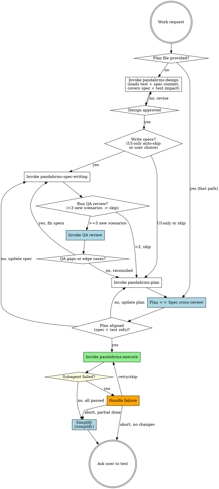

# Pandahrms Atlas

<MANUAL-ONLY>
This skill is invoked only by forge's Pipeline Selection step or by an explicit `/atlas` slash command. Do NOT auto-activate from work-start triggers, brainstorming triggers, planning triggers, or execution triggers -- forge owns the entry point for all such phrases. If the conversation does not show evidence of forge dispatching here (or an explicit /atlas), STOP and route the user to forge instead.
</MANUAL-ONLY>

## Overview

Unified Pandahrms-native pipeline: design, spec writing, QA review, implementation planning, Plan <-> Spec cross-review, and subagent-driven execution -- all in a single session, with no superpowers dependency.

Atlas is the no-superpowers cousin of `forge`. The pipeline shape is the same; the component skills swap from `superpowers:*` to `pandahrms:*`. The biggest practical difference is per-task throughput: atlas runs single-stage review by default and only opts into a second-stage spec-compliance reviewer for tasks the plan tags `**Risk:** high`. This was the v4->v5 superpowers change that produced the largest slowdown.

**Announce at start:** "I'm using Pandahrms atlas to orchestrate design through execution (no-superpowers mode). Routed here from forge."

## Fast Path (plan provided)

If invoked with a plan file path (e.g., `/atlas path/to/plan.md`), skip steps 1-4 and start directly at step 5 (Plan <-> Spec cross-review), then step 6 (Execute plan).

- Initialize time tracking as normal
- Announce: "Executing existing plan -- running Plan <-> Spec cross-review, then execution."
- Still run step 5 to catch drift between the pre-existing plan and current specs
- After execution, still run step 7 (simplify) and step 8 (ask user to test) with the Development Summary

## Resume Path

If invoked with `/atlas --resume`:

1. Read the plan file's `## Atlas Progress` section to determine which steps completed and their timing
2. Announce: "Resuming atlas from step N -- [step name]."
3. Continue from the next incomplete step with full time tracking
4. If no plan file exists or has no progress section, announce: "No atlas state found -- starting fresh." and begin from step 1

## Codex Availability

At the very start of every atlas run (before step 1, including Fast Path and Resume Path), detect whether Codex is available locally.

1. Run `command -v codex` via Bash. Empty stdout means unavailable.
2. Store the result in conversation context as `codex_available` (true/false). Persist it into the plan file's `## Atlas Progress` section once the plan exists, on a `Codex available: true|false` line, so resumed runs do not need to re-detect.

When `codex_available` is true, dispatch these review-only steps to the `codex:codex-rescue` subagent for a second-opinion pass:

- **Step 3** -- QA Review Agent
- **Step 5** -- Plan <-> Spec cross-review

These are analysis-only tasks. The dispatched prompt MUST begin with `READ-ONLY REVIEW. Do not modify files. Do not run --write. Return findings only.` so codex does not edit the working tree. Findings come back as the rescue subagent's stdout and are reconciled exactly as if the regular `Agent` tool had been used. The skip conditions for each step still apply -- detection only changes who runs the review, not whether it runs.

When `codex_available` is false, fall back to the regular `Agent` tool with the prompts shown in each section.

Announce at start: `"Codex detected -- routing QA review and Plan <-> Spec cross-review to codex:codex-rescue."` or `"Codex not detected -- using local agents for reviews."`

<HARD-GATE>
AUTHORITY HIERARCHY:

**Design time (steps 1-4):** Discussion/decisions are the source of truth. If a discussion or decision diverges from the existing spec, UPDATE the spec before writing the plan. Never write a plan that contradicts the spec -- update the spec first, then plan from the updated spec.

**Execution time (step 6):** The plan is the source of truth for each implementer subagent. But implementers MUST cross-check against the spec. If plan and spec disagree, STOP and report -- never silently pick one.

**Never silently reconcile.** Always ask the user or flag the conflict when authority sources disagree.
</HARD-GATE>

<HARD-GATE>
NO COMMITS DURING EXECUTION. Implementer subagents stage changes (`git add`) but never run `git commit`. The user tests first, then runs `/hermes-commit` to plan and execute atomic commits across the full set of changes. This rule lives in `pandahrms:execute` -- atlas just trusts the component skill to enforce it.
</HARD-GATE>

## Pipeline



## Checklist

You MUST create a task for each of these items and complete them in order. Apply [Time Tracking](#time-tracking) to every step -- record start/end times and pause during user prompts.

1. **Design** -- invoke `pandahrms:design`. The skill loads test + spec context, asks one question at a time, proposes 2-3 approaches, presents the design in sections, and saves an uncommitted design doc to `docs/pandahrms/designs/<...>.md` covering spec impact, test impact, and implementation approach.
2. **Write or update specs?** -- two routing decisions in one place:
   - **UI-only auto-skip**: if the work is purely UI/presentation (styling, layout, component design, theming, responsiveness, animations, dark mode, visual polish), announce "Skipping spec-writing -- UI-only change with no business behavior impact" and proceed to step 4 (QA auto-skipped too).
   - **Otherwise**: use AskUserQuestion: "Would you like to write/update Gherkin specs before proceeding to the implementation plan?" with options "Yes, write/update specs" and "Skip specs". Users may skip if the session is purely exploratory or open discussion. If yes, invoke `pandahrms:spec-writing` to write or update specs in pandahrms-spec. **Discussion/decisions are authoritative** -- if the design produced decisions that diverge from existing specs, update the spec to reflect the new decisions BEFORE writing the plan. Never leave an outdated spec to be reconciled later. Present the written/updated specs to the user for review before proceeding.
3. **QA review (conditional)** -- skip when EITHER no specs exist OR fewer than 3 NEW scenarios were added in step 2 (modifications to existing scenarios do not count -- step 1's design already covered impact for small changes). Otherwise dispatch the QA-review sub-agent (two-pass: design<->spec coverage + edge cases) and wait for it to complete. See [QA Review Agent](#qa-review-agent) for dispatch prompt, skip-condition detection, and result handling. If QA surfaces coverage gaps or new scenarios, loop back to `pandahrms:spec-writing` to update the specs, then re-run QA. When QA returns zero blocking findings (or the user chooses to proceed), move on to step 4.
4. **Create implementation plan** -- invoke `pandahrms:plan`. The skill produces a plan with:
   - **Spec ref** on every business-behavior task (when specs exist)
   - **Test ref** on every production-code task with Red-before-Green ordering
   - **Depends on:** marker on every task (atlas reads this in step 6 to parallel-dispatch)
   - **Risk:** tag on tasks that need second-stage review (auth, multi-tenant, billing, schema, PII)
   - **No commit steps** -- plans stage changes only; /hermes-commit owns commits
5. **Plan <-> Spec cross-review** -- after the plan is written (or at Fast Path entry), verify three directions: (a) every plan task references a real spec scenario, (b) every in-scope spec scenario has at least one plan task, and (c) every plan task that touches production code names a test reference with Red-before-Green ordering. The (c) check is the only test-ref validator on Fast Path -- do not skip it. If gaps exist, fix them before execution. See [Plan-Spec Cross-Review](#plan-spec-cross-review) for skip conditions and resolution paths.
6. **Execute plan** -- invoke `pandahrms:execute`. The skill reads the plan, resolves the codex execution mode (asks the user once if `codex_available` is true and the mode isn't already set in the progress section), groups tasks by `Depends on:`, parallel-dispatches independent batches (cap 5 per batch, Agent + codex counted together), runs single-stage review by default, and opts into second-stage spec-compliance review only for tasks tagged `**Risk:** high` (reviewer routes through codex when available). Implementer subagents stage changes but never commit. Time tracking records the step as a whole (wall-clock from first dispatch to last return). If a subagent fails, follow [Subagent Failure Handling](#subagent-failure-handling).
7. **Simplify** -- once Step 6 has finished and at least one subagent reported success, invoke the `simplify` skill to review the changed files for reuse, quality, and efficiency, and to fix any issues it finds. Skip this step if Step 6 was aborted with no completed tasks (nothing to simplify). All resulting changes remain uncommitted -- the user still tests in Step 8 before /hermes-commit.
8. **Ask user to test** -- present the Development Summary. If the plan file's `## Atlas Progress` section has an `### Acknowledged Gaps` block (gaps the user chose to "Proceed anyway" past during Step 5), surface each gap with: "**Acknowledged gaps to verify manually:** [gap list]." Then end with: "Please test your changes, then run /hermes-commit when ready."

## Time Tracking

Track **active work time** across the full atlas run -- time spent by Claude doing work, excluding time waiting for user input or blocked on external factors. Display a summary when execution completes.

### How to track

1. **On step start** -- record the current time (use `date +%s` via Bash)
2. **Before any user prompt** -- record a pause timestamp. This includes:
   - AskUserQuestion calls (design approval, "write specs?", "add QA findings to specs?", "how to resolve Plan <-> Spec gaps?", subagent-failure prompts)
   - Any blocker requiring user action (e.g., environment issue, missing access)
   - Presenting results and waiting for user to respond
3. **After user responds** -- record a resume timestamp. Add the paused duration to the step's excluded time.
4. **On step completion** -- calculate: `duration = (end - start) - total_excluded_time`. Display: `"Step N completed in Xm Ys (active work)"`
5. **On final step completion** -- display a summary:

```
Development Summary (active work time, excludes user-wait)
===========================
Design                       --  12m 34s
Write specs                  --   8m 21s
QA review                    --   2m 45s
Create implementation plan   --  15m 02s
Plan <-> Spec cross-review   --   1m 30s
Execute plan                 --  18m 14s
Simplify                     --   3m 12s
===========================
Grand total (active)         --  1h 01m 38s
Total wall-clock time        --  1h 42m 11s
User-wait time               --     40m 33s
```

### What counts as paused time

| Paused (exclude from timing) | Active (include in timing) |
|------------------------------|---------------------------|
| Waiting for user to answer AskUserQuestion | Claude processing after user responds |
| User reviewing a design doc or spec | Designing, writing specs, planning |
| User fixing an environment issue | Subagent execution |
| Blocked on external dependency | Reading files, running commands |

### Implementation

Use the plan file as the single source of truth for both progress tracking and timing. Before the plan file exists (steps 1-3), hold timestamps in conversation context. Once the plan is created (step 4), persist everything into the plan file.

Use the Read and Write tools for all plan file I/O. Only use Bash for `date +%s`.

**On atlas start:**

1. Run `date +%s` in Bash to get the epoch
2. Hold the atlas start time and step timestamps in conversation context until the plan file is created

**On plan creation (step 4):**

Append a `## Atlas Progress` section to the plan file. Backfill steps 1-3 timing from conversation context:

```markdown
## Atlas Progress

| Step | Status | Duration |
|------|--------|----------|
| 1. Design | done | 12m 34s |
| 2. Write specs | done | 8m 21s |
| 3. QA review | skipped | -- |
| 4. Create implementation plan | done | 15m 02s |
| 5. Plan <-> Spec cross-review | pending | -- |
| 6. Execute plan | pending | -- |
| 7. Simplify | pending | -- |
| 8. Ask user to test | pending | -- |

Atlas started: 1718000000
Codex available: true
Codex execution mode: none

### Acknowledged Gaps

(Populated only when the user chose "Proceed anyway" during Step 5. One bullet per gap. Step 8 surfaces this list to the user.)
```

**On each step completion:**

1. Run `date +%s` in Bash to get the timestamp
2. Use the **Read** tool to load the plan file
3. Update the step's row in the Atlas Progress table (status and duration)
4. Use the **Write** tool to save the plan file back

**On task completion (step 6):**

When a subagent completes a plan task, update the task's checkbox in the plan file from `- [ ]` to `- [x]`, then update the Atlas Progress table for step 6's running duration.

Active duration = `(end - start) - sum(resume - pause for each pause)`

Format durations by computing in your reasoning: `Xm YYs`. Skipped steps show `-- skipped`.

### Execution step timing

Step 6 (execute plan) is tracked as a single step:

- **Duration** = wall-clock time from first subagent dispatch to last subagent completion
- Per-subagent timing is NOT tracked. If multiple subagents run in parallel, they overlap inside this one duration.

## Subagent Failure Handling

When a subagent reports a failure (build error, test failure, merge conflict, or any non-zero exit):

1. **Pause execution** -- wait for all in-flight subagents in the current parallel batch to return, then do not dispatch any further batches until the user decides how to proceed
2. **Present the error** -- show the failing subagent's name, task description, and error output
3. **Ask the user** via AskUserQuestion: "Subagent '[task name]' failed. How would you like to proceed?" with options:
   - **"Retry"** -- re-dispatch the same subagent with the same prompt
   - **"Skip and continue"** -- note the failed task in the conversation and proceed with remaining tasks
   - **"Abort atlas"** -- stop execution, display the Development Summary with the Execute step marked failed, and end with: "Atlas aborted. Completed tasks remain uncommitted. Run /hermes-commit when ready or discard with git restore."

Failures do not alter the step-level Development Summary other than annotating the Execute step's outcome (e.g. `Execute plan -- 18m 14s (1 task failed, skipped)`).

## QA Review Agent

In step 3, after specs are written/updated, dispatch a sub-agent to audit the specs in two passes in a single run. The agent runs in the foreground -- wait for it to return and reconcile findings before moving on to plan-writing (step 4).

1. **Design<->Spec structural coverage** -- does every design requirement have a corresponding spec scenario? (replaces the standalone spec-review step)
2. **Edge-case hunt** -- what did both the design and spec miss? Unhappy paths, boundary conditions, implicit requirements.

### Skip Condition

Skip this step when EITHER condition holds:

**A. No specs to review** -- detect by:
- No `.feature` files were created or updated in this session, AND
- No in-scope `.feature` files exist for the feature area in `pandahrms-spec`

Covers UI-only work, "skip specs" path, and any invocation against a spec-less feature.

**B. Light spec changes** -- specs were edited but fewer than 3 NEW scenarios were added in step 2. Modifications to existing scenarios DO NOT count. Step 1's design already covered impact for small edits, so a fresh edge-case hunt isn't worth the cost.

To count new scenarios, run `git diff` on the spec files updated in this session and count `^+\s*Scenario:` and `^+\s*Scenario Outline:` lines (added scenario headers only). If the count is < 3, skip.

Announce the skip reason -- e.g. `"Skipping QA review -- no specs to review."` or `"Skipping QA review -- only N new scenario(s) added (threshold: 3)."`

### Agent Dispatch

If `codex_available` is true, dispatch via the `codex:codex-rescue` subagent. Otherwise dispatch via the regular `Agent` tool. In both cases, prefix the prompt with `READ-ONLY REVIEW. Do not modify files. Do not run --write. Return findings only.` followed by a blank line, then the body below.

Replace the placeholders:
- `{design_doc_path}` -- path to the approved design document
- `{spec_file_paths}` -- paths to all written spec files
- `{scope_notes}` -- brief "in scope / out of scope" summary extracted from the design doc, so the agent doesn't flag edge cases for deferred features

```
prompt: |
  You are a QA reviewer. Your job has TWO parts, completed in one pass:

  **Part A: Design<->Spec structural coverage** -- verify every design
  requirement has a corresponding Gherkin scenario.

  **Part B: Edge-case hunt** -- identify missed edge cases, unhappy paths,
  boundary conditions, and implicit requirements.

  ## Inputs

  Design document: {design_doc_path}
  Spec files: {spec_file_paths}
  Scope: {scope_notes}

  Read the design document and all spec files. The scope section defines
  what is in-scope and out-of-scope for this iteration. Only flag edge
  cases for in-scope functionality -- do not report findings for features
  explicitly marked as deferred or out-of-scope.

  ## Part A: Structural coverage

  For every functional requirement in the design doc, check whether at
  least one spec scenario covers it. Report any design requirement that
  has NO spec scenario as a "coverage gap".

  ## Part B: What to Look For

  1. **Unhappy paths** -- What happens when the user provides invalid input,
     cancels mid-flow, loses connectivity, or hits a timeout?
  2. **Boundary conditions** -- Empty lists, maximum lengths, zero values,
     exactly-at-limit values, off-by-one scenarios.
  3. **Concurrent/conflicting actions** -- Two users editing the same record,
     duplicate submissions, race conditions.
  4. **Permission edge cases** -- User's role changes mid-session, permission
     revoked after page load, cross-tenant access attempts.
  5. **Data state edge cases** -- Soft-deleted records, archived entities,
     null/missing optional fields, migrated legacy data.
  6. **Implicit requirements** -- Behavior the design assumes but never states
     (e.g., audit logging, notification triggers, cascade effects).

  ## Output Format

  Return a structured report:

  ### Coverage Gaps (Part A)

  For each design requirement without spec coverage:
  - **ID**: COV-1, COV-2, etc.
  - **Design requirement**: Quote or summary from the design doc
  - **Suggested scenario**: A Gherkin scenario outline that would cover it

  ### Edge Cases Found (Part B)

  For each finding:
  - **ID**: QA-1, QA-2, etc.
  - **Category**: (unhappy path | boundary | concurrency | permission | data state | implicit requirement)
  - **Description**: What the edge case is
  - **Suggested scenario**: A Gherkin scenario outline (Given/When/Then) that would cover it
  - **Severity**: (high | medium | low) -- high means likely to cause a bug in production

  ### Summary

  - Coverage gaps: [count]
  - Total edge-case findings: [count]
  - High severity: [count]
  - Medium severity: [count]
  - Low severity: [count]

  If you find zero edge cases, state that explicitly -- do not invent findings.
  Focus on quality over quantity. Only report genuine gaps, not theoretical
  scenarios that the feature's scope clearly excludes.

description: "QA review specs for edge cases"
```

### Handling Results

After the agent returns:

- **Zero findings (both parts)** -- announce "QA review complete -- coverage is complete and no additional edge cases found." Proceed to step 4.
- **Findings returned** -- present the agent's report to the user, then use AskUserQuestion: "QA review found [coverage_count] coverage gaps and [edge_count] edge cases ([high_count] high severity). Would you like to add these to the specs?" with options:
  - **"Yes, add to specs"** -- loop back to `pandahrms:spec-writing` to incorporate coverage gaps AND high/medium severity edge-case findings as new scenarios. Then re-run QA review on the updated specs.
  - **"No, proceed"** -- proceed to step 4. The findings are still visible in the conversation for reference during planning and implementation.

## Plan-Spec Cross-Review

After `pandahrms:plan` produces the plan file (or when entering Fast Path with an externally-authored plan), verify the plan's integrity against both specs and tests before executing anything.

This step is the only validator for fast-path plans -- since Fast Path skips Step 4's plan-requirements check, Step 5 must cover those guarantees too.

### Skip Condition

Skip only when there are NO specs AND NO existing tests in the affected area. Detect this by:
- The plan file contains zero spec references, AND
- No `.feature` files exist for the feature area in `pandahrms-spec`, AND
- No test files exist in the affected codebase

This covers UI-only work with no tests, "skip specs" path with a spec-less and test-less area, and fast-path invocations against truly content-less features.

Announce the applicable skip reason -- e.g. `"Skipping Plan <-> Spec cross-review -- no specs or tests for this feature."`

### How to Review

If `codex_available` is true, dispatch this review to the `codex:codex-rescue` subagent with a prompt that lists the plan file path, the in-scope `.feature` file paths, the test file inventory from step 1, and the three checks below. Prefix the prompt with `READ-ONLY REVIEW. Do not modify files. Do not run --write. Return findings only.`. Treat the subagent's output as the review report.

If `codex_available` is false, perform the review inline:

1. Read the plan file and extract every task's spec reference and test reference.
2. Read every in-scope `.feature` file for the feature.
3. Check three directions:
   - **Plan -> Spec** -- does every plan task that touches business behavior reference a real spec scenario? Flag tasks with no spec reference or broken references. (Skip this check if no specs exist.)
   - **Spec -> Plan** -- does every in-scope spec scenario have at least one plan task implementing it? Flag uncovered scenarios. (Skip this check if no specs exist.)
   - **Plan -> Test** -- does every plan task that touches production code name at least one test file/case it will add or modify, with an explicit Red-before-Green ordering? Flag any production-code task that lacks a test reference. (This check runs whenever any tests exist OR whenever the plan modifies production code.)
4. Present findings to the user.

### Handling Results

- **All directions covered** -- announce "Plan, spec, and tests aligned. Proceeding to execution." Go to step 6.
- **Gaps found** -- present the report. Use AskUserQuestion to ask how to resolve:
  - **"Update the plan"** -- loop back to `pandahrms:plan` to add missing tasks, spec references, or test references. For fast-path plans, edit the plan file directly to add the missing references rather than re-running the plan skill.
  - **"Update the spec"** -- loop back to `pandahrms:spec-writing` to remove or adjust scenarios that aren't planned.
  - **"Proceed anyway"** -- append the gap as a bullet to the `### Acknowledged Gaps` block beneath the Atlas Progress table (create the block if it doesn't exist), then continue. Step 8 will surface every entry there to the user so they can verify the missing behavior manually or queue a follow-up atlas run.

Do not proceed to execution while gaps remain unresolved unless the user explicitly acknowledges them.

## Red Flags

| Thought | Reality |
|---------|---------|
| "I'll skip the design step since the user described what they want" | Step 1 is mandatory. pandahrms:design enforces approval before implementation. |
| "It's a bug fix, no need to discuss tests upfront" | Bug fixes especially need a failing test that would have caught the bug. The design proposes that test before the fix. |
| "I'll just invoke pandahrms:execute on a plan that has no Depends on: markers" | Reject the plan and loop back to pandahrms:plan. Missing markers serialize the run -- atlas can't parallel-dispatch. |
| "I'll mark every task Risk: high to be safe" | The default single-stage review is the point of atlas. Tag only auth, multi-tenant, billing, schema, PII, or design-flagged risky tasks. |
| "I'll skip the QA review since specs look fine" | QA is conditional. Run it whenever >=3 NEW scenarios were added in step 2; skip it for smaller edits. Don't skip a qualifying run on a hunch. |
| "Discussion decided X but spec still says Y, I'll implement X" | Stop. Update the spec to reflect the decision FIRST, then plan. Never leave the spec outdated. |
| "Plan has no spec refs, but I'll just execute it" | Plans without spec refs (when specs exist) must be rewritten before execution. No shortcuts. |
| "Spec scenario has no plan task, but the plan looks complete" | Bi-directional coverage required. Either add a task or remove the scenario -- don't execute around it. |
| "Codex is installed but I'll just dispatch the local agent" | If `codex_available` is true, route QA review and Plan <-> Spec cross-review through `codex:codex-rescue`. |
| "I'll send the codex review prompt without the read-only prefix" | Codex defaults to `--write`. Every review dispatch MUST start with `READ-ONLY REVIEW. Do not modify files. Do not run --write. Return findings only.` so codex doesn't edit the working tree. |
| "I'll let an implementer commit since the plan says to commit" | Plans should not contain `git commit` steps. pandahrms:execute strips them on dispatch. /hermes-commit owns commits. |

## When to Use

- **Only** when forge's Pipeline Selection routes here (user picked "Atlas")
- **Only** when the user explicitly invokes `/atlas`, `/atlas <plan-path>`, or `/atlas --resume`
- Otherwise: route the user to `forge` -- it owns the entry point for all design/plan/execute work in Pandahrms projects.

## When NOT to Use

- ANY auto-trigger from natural-language phrases ("start new work", "build feature", "brainstorm", "design", "write a plan", "execute"). Forge owns those triggers and decides whether to hand off here.
- Quick fixes that don't need design (typos, config changes) -- handle directly without any orchestrator.
- Non-Pandahrms projects (use `superpowers:brainstorming` directly).
- Writing specs for existing functionality without a new design (use `pandahrms:spec-writing` directly).
- When the user explicitly wants the superpowers-based pipeline (use `forge` instead).
