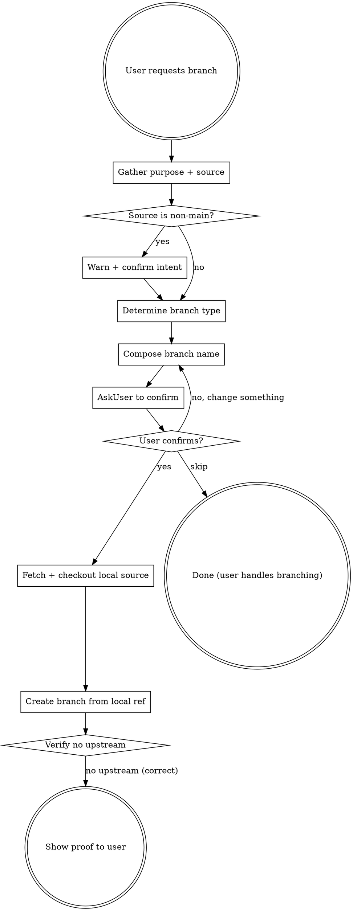

# Branching

## Overview

Safely creates git branches with folder-based naming and correct upstream tracking. Prevents the dangerous scenario where branching from a remote tracking branch silently inherits the parent's upstream, causing pushes to go to the wrong remote branch.

## The Danger This Skill Prevents

When you branch from a remote ref like `origin/feature/other-work`, git automatically sets that as the upstream. Every `git push` then goes to `origin/feature/other-work` instead of creating your own remote branch. This corrupts a shared branch with no PR review.

**The fix is simple: always branch from local refs, never from `origin/` refs.** Local-to-local branching does not inherit any upstream, so the problem never occurs.

## Process



## Step-by-Step

### 1. Gather Purpose and Source Branch

If the user already provided the purpose and/or source branch in their message, confirm them. Otherwise, use AskUserQuestion to ask:

- **Purpose:** What is this branch for?
- **Source branch:** Which branch should it be created from? (Default recommendation: `main`)

### 2. Warn if Branching from a Non-Main Branch

If the source branch is NOT `main` or `develop`, explicitly warn the user:

> "You are branching from `feature/other-work`, which is a feature branch -- not main. This means your branch will be based on in-progress work. Are you sure?"

Use AskUserQuestion to confirm intent before proceeding.

### 3. Determine Branch Type

Map the purpose to a conventional folder prefix:

| Prefix | When to Use |
|--------|-------------|
| `feature/` | New functionality or capability |
| `fix/` | Bug fix |
| `hotfix/` | Urgent production fix |
| `chore/` | Maintenance, dependencies, config |
| `refactor/` | Code restructuring without behavior change |
| `docs/` | Documentation only |
| `test/` | Adding or updating tests |
| `ci/` | CI/CD pipeline changes |
| `style/` | Formatting, whitespace (no logic change) |
| `perf/` | Performance improvements |

If the purpose is ambiguous, ask the user to pick the type.

### 4. Compose Branch Name

Format: `{type}/{short-kebab-description}`

Rules:
- All lowercase
- Use kebab-case for the description
- Keep it concise but descriptive
- No spaces, underscores, or special characters besides `/` and `-`

Examples:
- `feature/assessment-template`
- `fix/login-redirect-loop`
- `chore/update-dependencies`

### 5. Confirm Before Creating (MANDATORY)

Before creating the branch, you MUST use AskUserQuestion to confirm. Present:

- **Branch name:** `{type}/{short-kebab-description}`
- **Purpose:** {what the user described}
- **Source branch:** `{source-branch}`

Ask: "Should I create this branch?" with options like "Yes, create it", "No, let me change something", and "Skip".

Do NOT proceed to create the branch until the user explicitly confirms.

If the user chooses **Skip**, stop the branch creation process entirely and let them manage branching on their own. Continue with whatever task triggered the branch creation.

### 6. Fetch and Create from Local Ref

**CRITICAL: Never branch from `origin/` refs. Always branch from a local branch.**

Branching from a local ref does not inherit any upstream, so there is nothing to fix afterward.

```bash
# Fetch latest from remote
git fetch origin

# Ensure the source branch exists locally and is up to date
git checkout {source-branch}
git pull

# Create the new branch from the local ref
git checkout -b {branch-name}
```

### 7. Verify No Upstream (CRITICAL -- NEVER SKIP)

After creation, ALWAYS verify that no upstream was inherited:

```bash
git branch -vv
```

The new branch should show **no upstream** (no `[origin/...]` tracking ref). If it does have one, something went wrong — unset it immediately with `git branch --unset-upstream`.

Show the user the `git branch -vv` output as proof. Inform them that on first push, they must use:

```bash
git push -u origin {branch-name}
```

## Safety Checklist

After branch creation, verify ALL of these:

- [ ] Branch name follows `{type}/{description}` format
- [ ] Branch was created from the correct source
- [ ] User was warned if source was a non-main branch
- [ ] Branch was created from a **local** ref (never `origin/`)
- [ ] `git branch -vv` shows no upstream (none inherited)
- [ ] User knows to use `git push -u origin {branch-name}` on first push

## Red Flags

| Situation | Action |
|-----------|--------|
| `git branch -vv` shows `[origin/other-branch]` | STOP. Unset upstream immediately. Likely branched from `origin/` ref by mistake. |
| Branching from `origin/branch-name` | NEVER do this. Always checkout the local branch first, then branch from it. |
| User wants `f-something` or flat naming | Redirect to folder-based naming convention. |
| User wants to push without setting upstream | Ensure `git push -u origin {branch-name}` is used for first push. |
| Creating from a non-main branch | Warn user, confirm intent (Step 2). |

## Quick Reference

```bash
# Safe branch creation (full sequence)
git fetch origin
git checkout main && git pull        # Ensure local source is up to date
git checkout -b feature/my-feature   # Branch from local ref — no upstream inherited

# Verify no upstream was inherited
git branch -vv

# On first push, set correct upstream:
git push -u origin feature/my-feature

# Fix wrong upstream on existing branch
git branch --unset-upstream
git push -u origin $(git branch --show-current)
```
