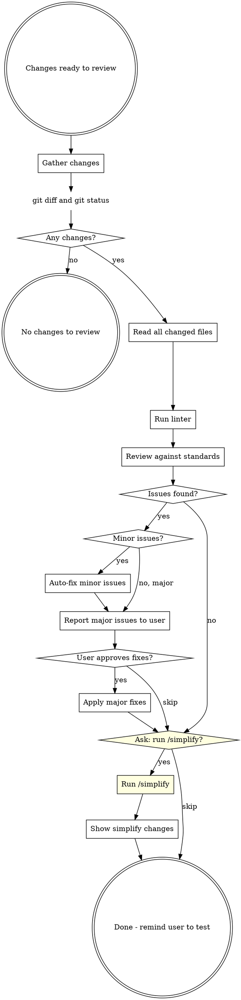

# Code Review

## Overview

Review all git working tree changes against code quality standards, fix issues found, and optionally run /simplify. This skill changes code but never commits. Run /commit separately after testing.

## When to Use

- After finishing a chunk of implementation work, before testing and committing
- On explicit invocation to review current changes
- As the first step in the "review -> test -> commit" cycle

## Workflow

## Phase 1: Gather Changes

Run in parallel:
- `git status` - see all modified, added, untracked files
- `git diff` - see unstaged changes
- `git diff --cached` - see staged changes

Read the full content of every changed file. You need full context to review properly.

### Run Linter (if available)

Detect the project's linter by checking for config files or `package.json` scripts:
- `biome.json` / `biome.jsonc` -> `pnpm biome check` or `npx biome check`
- `.eslintrc.*` / `eslint.config.*` -> `pnpm lint` or `npx eslint`
- `dotnet format` for .NET projects (check if `dotnet-format` tool is available)
- Any `lint` script in `package.json` -> `pnpm lint` or `yarn lint`

Run the linter on changed files only if possible. Include lint errors in the Phase 2 review findings.

## Phase 2: Review

Apply these checks to every changed file. Include any lint/format violations from Phase 1 in the findings.

### Review Checklist

**Architecture and Design:**

| Check | What to Look For |
|-------|-----------------|
| **God class / giant class** | Classes doing too much (100+ lines of logic, multiple unrelated methods). Split into focused classes. |
| **Single Responsibility** | Each class/function has one reason to change. Handlers should only orchestrate, not contain business logic. |
| **Open/Closed** | New behavior via extension, not modification. Check for long switch/if-else chains that should be polymorphic. |
| **Liskov Substitution** | Subtypes behave correctly when substituted for base types. No surprising overrides. |
| **Interface Segregation** | Interfaces are small and focused. No "fat" interfaces forcing unused method implementations. |
| **Dependency Inversion** | Dependencies injected via constructor, not instantiated with `new`. No service locator anti-pattern. |
| **DI registration** | *Only if project uses DI.* New interfaces/services are registered in DI container (e.g., `ServiceCollectionExtensions`, `Program.cs`, or relevant module registration). New repositories, services, and handlers must be wired up. |

**Security:**

| Check | What to Look For |
|-------|-----------------|
| **Injection** | SQL injection (raw string queries), command injection, XSS in responses. Use parameterized queries. |
| **Authentication/Authorization** | Endpoints have proper `[Authorize]` attributes. Role/policy checks enforced. No endpoints accidentally left open. |
| **Secrets** | No hardcoded API keys, connection strings, passwords, or tokens in code. Check for `.env` files staged. |
| **Input validation** | User inputs validated and sanitized. Request DTOs have proper validation attributes/rules. |
| **Data exposure** | Responses don't leak sensitive fields (passwords, internal IDs, PII). DTOs properly restrict what's returned. |

**Auditing and Observability:**

*Applies to backend projects (API, MVC5, monorepo with backend). If the project is frontend-only, skip this section.*

| Check | What to Look For |
|-------|-----------------|
| **Audit fields** | Entities that need tracking have `CreatedBy`, `CreatedAt`, `ModifiedBy`, `ModifiedAt` fields populated. |
| **Audit trail on all API endpoints** | Every state-changing API endpoint (POST, PUT, PATCH, DELETE) must have audit trail logging -- who did what, when, and on which resource. Check that new or modified endpoints follow the project's existing audit pattern (e.g., base entity audit, middleware audit, or explicit audit log calls). Endpoints without audit trail are a **major** issue. |
| **Audit trail consistency** | Verify the audit mechanism matches the project's existing pattern. Check for: base entity auto-population, audit middleware, or explicit audit service calls. New endpoints must use the same approach as existing ones. |
| **Logging** | Important operations have appropriate log levels. Errors are logged with context. No sensitive data in logs. |

**Code Quality:**

| Check | What to Look For |
|-------|-----------------|
| **Reuse before creating** | Before new code is added, check if an existing function, class, component, helper, or utility already does the same thing. Search the codebase for similar patterns. Flag duplicated logic that should reuse what already exists. |
| **Test coverage** | New/changed functionality has corresponding tests. Edge cases and error paths covered. |
| **Error handling** | Specific exceptions caught, meaningful messages, no swallowed errors. Consistent error response format. |
| **Readability** | Self-documenting code. No unnecessary complexity or over-engineering. Clear naming. |
| **Dead code** | No commented-out code, unused variables, unreachable branches, or leftover debugging code. |
| **Async correctness** | `async`/`await` used properly. No `async void` (except event handlers). No blocking on async (`.Result`, `.Wait()`). |

### Categorize Issues

- **Minor** (auto-fix): lint/format violations, naming inconsistencies, missing access modifiers, trivial formatting, simple null checks, obvious missing `readonly`, dead code removal, missing `async` keyword
- **Major** (ask first): SOLID violations, god classes, duplicated logic that should reuse existing code, missing DI registration, missing audit fields, missing audit trail on API endpoints, security vulnerabilities, missing test coverage, architectural concerns, missing authorization attributes

## Phase 3: Fix

1. **Auto-fix minor issues** silently - apply fixes, then list what was changed in a summary
2. **Report major issues** clearly - for each, explain: what the issue is, why it matters, proposed fix
3. **Ask user** whether to fix major issues or skip them
4. Apply approved fixes

## Phase 4: Simplify (interactive)

### Step 1: Ask before running

Use `AskUserQuestion` to ask the user whether they want to run `/simplify`:

> "Ready to run /simplify to check for reuse opportunities, code quality, and efficiency improvements. Run it?"

- If user says **yes** -> proceed to Step 2
- If user says **skip** -> go to Phase 5

### Step 2: Run /simplify

Invoke the `/simplify` skill. This launches three parallel review agents (Code Reuse, Code Quality, Efficiency) against the current changes. Apply any valid findings.

### Step 3: Show changes

After `/simplify` completes and fixes are applied, show the user a summary of what changed.

## Phase 5: Done

Summarize all changes made during the review:
- Minor issues auto-fixed
- Major issues fixed (if any)
- /simplify changes (if run)

End with this message:

> "Code review complete. Please test your changes, then run /commit when ready."

## Red Flags - STOP

- Running `/simplify` without asking the user first - always use AskUserQuestion
- About to commit - this skill NEVER commits. That's /commit's job.
- Skipping review because "changes are small" - review everything
- Reviewing only the diff, not the full file - always read full files

## Common Mistakes

| Mistake | Fix |
|---------|-----|
| Reviewing only the diff, not the full file | Always read full file for context |
| Fixing issues without telling the user | Always summarize what was auto-fixed |
| Committing after review | Never commit. Remind user to test then /commit |
