# Code Review

## Overview

Diff-scoped LLM-judgment review over the git working-tree changes. Judges SOLID intent, naming meaning, semantic reuse, audit-pattern conformance, input-validation adequacy, PII/data-exposure, error-handling adequacy, readability, and spec meaning. Fixes issues and runs /simplify. Changes code, never commits directly. May invoke `/commit` in Phase 7.

## Flags

- `--approve` -- auto-pick the "proceed" choice at every AskUserQuestion in this skill. No pauses. See per-phase defaults below.
- `--skip` -- forwarded to `/commit` at Phase 7. Calls `/commit --skip` so the commit step bypasses its own gate. No effect on code-review phases.
- `--no-commit` -- review-only mode. Skip Phase 7's commit question and `/commit` invocation. Emit the Phase 7 summary and return control to the caller.
- `--codex` -- force the Codex second-opinion dispatch even when the diff-type guard would skip it.
- `--no-codex` -- force-skip the Codex dispatch even on a sensitive/behaviour diff.
- `--security-deferred` -- a caller will run the deeper `/security-review` pass itself. Trims the Phase-2 Security checklist to a one-line deferral note. Only the caller that owns and WILL run the deep pass passes this.

Per-phase `--approve` defaults:

| Phase | Prompt | `--approve` choice |
|-------|--------|--------------------|
| 0 | Small change: review or commit? | review (full review) |
| 3 | Apply major fixes? | yes, fix all |
| 4 | Run /security-review? | yes |
| 5 | Create/update specs? | skip (record gap, do not invoke /spec) |
| 7 | Commit or test first? | commit (invoke /commit, forwarding `--skip` if passed) |

When `--approve` set, announce the auto-pick on one line at each phase (e.g., `--approve: running full review`) before proceeding. Do NOT call AskUserQuestion for any prompt in the table above.

## Lint-gate consumption

Code review reads a `/lint-gate` result when one is provided (the dev or the orchestrator runs `/lint-gate` and passes its output; code-review does NOT run `/lint-gate` itself). A provided result has two parts:

1. **`OWNED: <categories>` line** -- a comma-separated list from the fixed vocab `todo, secrets, debug-leftover, repo-conventions, dead-code, async, god-class, long-switch, new-of-service, empty-catch, exact-dup, traceability`. For EVERY category in `OWNED:`, DROP its matching judgment row in Phase 2 -- do not re-detect it. The mapping:

   | OWNED category | Dropped Phase-2 row |
   |----------------|---------------------|
   | `todo` | No silent TODOs |
   | `secrets` | Secrets |
   | `debug-leftover` | leftover-debug part of Readability/dead-code |
   | `repo-conventions` | Repo conventions |
   | `dead-code` | Dead code (unused/unreachable) |
   | `async` | Async correctness |
   | `god-class` | god-class size DETECTION (SRP judgment stays) |
   | `long-switch` | long-switch chain DETECTION (Open/Closed judgment stays) |
   | `new-of-service` | `new`-of-service DETECTION (DIP judgment stays) |
   | `empty-catch` | empty-catch DETECTION (error-handling judgment stays) |
   | `exact-dup` | exact-duplication DETECTION (semantic reuse judgment stays) |
   | `traceability` | L1->L2 traceability (owned entirely by lint-gate) |

   For the structural rows (`god-class`/`long-switch`/`new-of-service`/`empty-catch`/`exact-dup`): lint-gate owns the mechanical DETECTION; the LLM JUDGMENT half stays in this skill and uses the tool's hit as the trigger. For categories NOT in `OWNED:`, code-review keeps the whole judgment row as fallback.

2. **`[tool:*]` findings** -- merge these into the finding set as context. Treat them as already-detected facts; reason only about their severity and judgment implication, never re-detect.

**No lint-gate result provided:** run the full judgment checklist with every row active. State `Lint-gate: not provided` in the Phase 7 summary.

## Workflow

```dot
digraph code_review {
    "Assess change size" [shape=doublecircle];
    "Small change?" [shape=diamond];
    "Ask: review or commit?" [shape=diamond];
    "Run /commit directly" [shape=box, style=filled, fillcolor=lightgreen];
    "Gather changes" [shape=box];
    "git diff and git status" [shape=plaintext];
    "Any changes?" [shape=diamond];
    "No changes to review" [shape=doublecircle];
    "Read all changed files" [shape=box];
    "Consume lint-gate OWNED line" [shape=box];
    "Codex installed?" [shape=diamond, style=filled, fillcolor=lavender];
    "Dispatch Codex reviewer" [shape=box, style=filled, fillcolor=lavender];
    "Review against judgment checklist" [shape=box];
    "Merge Codex findings" [shape=box, style=filled, fillcolor=lavender];
    "Issues found?" [shape=diamond];
    "Minor issues?" [shape=diamond];
    "Auto-fix minor issues" [shape=box];
    "Report major issues to user" [shape=box];
    "User approves fixes?" [shape=diamond];
    "Apply major fixes" [shape=box];
    "Security-sensitive changes?" [shape=diamond, style=filled, fillcolor=lightpink];
    "Run /security-review" [shape=box, style=filled, fillcolor=lightpink];
    "UI-only changes?" [shape=diamond, style=filled, fillcolor=lightblue];
    "Check spec discrepancy" [shape=box, style=filled, fillcolor=lightblue];
    "Spec covers changes?" [shape=diamond, style=filled, fillcolor=lightblue];
    "Ask: create/update spec?" [shape=diamond, style=filled, fillcolor=lightblue];
    "Run /spec" [shape=box, style=filled, fillcolor=lightblue];
    "Run /simplify" [shape=box, style=filled, fillcolor=lightyellow];
    "Show simplify changes" [shape=box];
    "Review summary" [shape=box];
    "Ask: /commit or test first?" [shape=diamond, style=filled, fillcolor=lightgreen];
    "Run /commit" [shape=box, style=filled, fillcolor=lightgreen];
    "Done - user will test" [shape=doublecircle];

    "Assess change size" -> "Small change?";
    "Small change?" -> "Ask: review or commit?" [label="yes"];
    "Small change?" -> "Gather changes" [label="no, full review"];
    "Ask: review or commit?" -> "Run /commit directly" [label="commit"];
    "Ask: review or commit?" -> "Gather changes" [label="review"];
    "Gather changes" -> "git diff and git status";
    "git diff and git status" -> "Any changes?";
    "Any changes?" -> "No changes to review" [label="no"];
    "Any changes?" -> "Read all changed files" [label="yes"];
    "Read all changed files" -> "Consume lint-gate OWNED line";
    "Consume lint-gate OWNED line" -> "Codex installed?";
    "Codex installed?" -> "Dispatch Codex reviewer" [label="yes, parallel"];
    "Codex installed?" -> "Review against judgment checklist" [label="no"];
    "Dispatch Codex reviewer" -> "Review against judgment checklist";
    "Review against judgment checklist" -> "Merge Codex findings" [label="if dispatched"];
    "Review against judgment checklist" -> "Issues found?" [label="no Codex"];
    "Merge Codex findings" -> "Issues found?";
    "Issues found?" -> "Security-sensitive changes?" [label="no"];
    "Issues found?" -> "Minor issues?" [label="yes"];
    "Minor issues?" -> "Auto-fix minor issues" [label="yes"];
    "Minor issues?" -> "Report major issues to user" [label="no, major"];
    "Auto-fix minor issues" -> "Report major issues to user";
    "Report major issues to user" -> "User approves fixes?";
    "User approves fixes?" -> "Apply major fixes" [label="yes"];
    "User approves fixes?" -> "Security-sensitive changes?" [label="skip"];
    "Apply major fixes" -> "Security-sensitive changes?";
    "Security-sensitive changes?" -> "Run /security-review" [label="yes"];
    "Security-sensitive changes?" -> "UI-only changes?" [label="no"];
    "Run /security-review" -> "UI-only changes?";
    "UI-only changes?" -> "Run /simplify" [label="yes, skip spec check"];
    "UI-only changes?" -> "Check spec discrepancy" [label="no"];
    "Check spec discrepancy" -> "Spec covers changes?";
    "Spec covers changes?" -> "Run /simplify" [label="yes"];
    "Spec covers changes?" -> "Ask: create/update spec?" [label="no or missing"];
    "Ask: create/update spec?" -> "Run /spec" [label="yes"];
    "Ask: create/update spec?" -> "Run /simplify" [label="skip"];
    "Run /spec" -> "Run /simplify";
    "Run /simplify" -> "Show simplify changes";
    "Show simplify changes" -> "Review summary";
    "Review summary" -> "Ask: /commit or test first?";
    "Ask: /commit or test first?" -> "Run /commit" [label="commit"];
    "Ask: /commit or test first?" -> "Done - user will test" [label="test first"];
}
```



**Phase 0: Triage**

Run `git diff` and `git diff --cached` to assess change size.

**Small change definition (literal):** diff has **<= 20 changed lines total across <= 2 files**, AND no `.cs` / `.ts` / `.tsx` / `.py` files contain new functions, classes, or exported symbols. If both conditions hold, change is small. Otherwise not small. Do not classify by file type alone.

**If `--no-commit` set:** skip this triage question, proceed directly to Phase 1. Never offer the commit shortcut.

**If small** (and not `--no-commit`): use `AskUserQuestion` to ask:

> "Small change detected. Would you like to run a full code review, or commit directly?"

- **review** -> proceed to Phase 1
- **commit** -> invoke `/commit` and end flow
- If answer off-list, re-ask once with same options. If second response still off-list, stop skill, summarize state in one line, let user direct next steps.

If `--approve` set, skip the question, announce `--approve: running full review` and proceed to Phase 1.

**If not small**: proceed directly to Phase 1.

**Phase 1: Gather Changes**

Run in parallel:
- `git status` - all modified, added, untracked files
- `git diff` - unstaged changes
- `git diff --cached` - staged changes

**No changes detected:** If `git status`, `git diff`, and `git diff --cached` together produce no output, respond exactly: "No changes detected in the working tree. Nothing to review." Then exit skill. Do NOT proceed to Phase 2, do NOT dispatch Codex.

Read full content of every changed file. Full context required to review properly.

### Consume the lint-gate result

Apply the "Lint-gate consumption" rules above: read the provided `OWNED:` line, drop each named judgment row in the Phase-2 checklist, and stage the `[tool:*]` findings into the merged finding set as already-detected context. If no result was provided, keep every judgment row active and record `Lint-gate: not provided` for Phase 7.

### Second Opinion: Dispatch Codex Reviewer (if installed and diff warrants it)

If Codex plugin is installed in this session AND the diff warrants a second opinion, dispatch a parallel review by Codex.

**Detection.** Codex is installed if EITHER: (1) system reminder lists a skill prefixed `codex:` in the available-skills block, OR (2) user invoked any `codex:*` skill earlier in this conversation. If neither, treat Codex as not installed, skip silently, proceed to Phase 2 -- do not announce skip.

**Diff-type guard (gate on content, not size).** Even when Codex is installed, SKIP the dispatch for diffs that gain little from a second opinion:

- SKIP for objectively test-only, verification-only (config/mapping/DTO), or pure structural-refactor diffs (rename, move, extract with no behaviour change).
- KEEP for security-sensitive diffs (auth, tenant, PII) and behaviour-changing logic diffs.
- A small diff is NOT a skip reason -- a small auth change still dispatches Codex.

Overrides: `--codex` forces dispatch; `--no-codex` forces skip. Record the outcome in the Phase 7 summary (`Codex: ran` / `Codex: skipped (test-only diff)` / `Codex: skipped (--no-codex)` / `Codex: not installed`).

**Dispatch pattern.** Dispatch exactly ONE Codex agent for the entire diff via Agent tool with `subagent_type: "codex:codex-rescue"`. Do NOT split per file, per category, or per phase.

**Dispatch timing (strict sequencing):**

1. Phase 1 file reads complete first.
2. The lint-gate consumption step completes.
3. Single message that begins Phase 2 contains, in parallel: (a) Codex Agent dispatch tool call, AND (b) any additional grep/read calls Claude needs for Phase 2 checklist context.

Do not dispatch Codex before the file reads complete. Do not wait for Codex before starting Claude's own checklist.

**Codex prompt template** (self-contained -- Codex has no conversation context):

```
Perform an independent code review of the working-tree changes in the
current repository. Do not execute the plan, do not commit, do not
modify files -- review only.

Scope: all files reported by `git status` and all hunks in
`git diff` and `git diff --cached`. Read each changed file in full for
context (not just the hunks).

Review against:
1. SOLID principles (single responsibility, DI, interface size)
2. Security (injection, authz, input validation, data exposure)
3. Audit trail on state-changing endpoints (backend projects only)
4. Code quality (reuse before creating, test coverage, error handling)
5. Any project-specific CLAUDE.md rules you can find at the repo root.

Return findings as a JSON block with this shape, nothing else in the
response except the block:

{
  "findings": [
    {
      "severity": "minor" | "major",
      "category": "solid" | "security" | "audit" | "quality" | "other",
      "file": "relative/path.ext",
      "line": 42,
      "issue": "one-line description",
      "suggested_fix": "one-line suggested fix"
    }
  ],
  "summary": "2-3 sentences -- overall assessment"
}

If you find nothing, return {"findings": [], "summary": "..."}.
```

Use Agent tool's `description` field: `"Codex second-opinion review"`.

### Handling Codex output

When Codex returns:
- **Parse JSON findings.** If parsing fails, classify entire Codex output as a single Major finding with category `other`, attribution `[Codex - unparsed]`, and surface raw text to user verbatim under that finding. Do not auto-fix any portion of unparsed Codex output.
- **Dedupe against Claude's findings.** If Claude's checklist and Codex both flag same file+line+category, merge into one finding and credit both reviewers (`[Claude + Codex]`).
- **Keep Codex-only findings** as separate entries tagged `[Codex]`.
- **Keep Claude-only findings** tagged `[Claude]`.
- **Treat Codex severity as advisory.** When Claude and Codex disagree on severity, use the higher.

If Codex fails or times out, do not block review -- note "Codex unavailable, proceeding with Claude-only review" and continue.

**Phase 2: Review (LLM judgment)**

Apply these judgment checks to every changed file. Merge the lint-gate `[tool:*]` findings as already-detected context.

**Evaluation order (strict):** Complete each checklist section across ALL changed files before moving to next section. Do NOT parallelize sections or interleave per file.

1. Architecture and Design
2. Security
3. Auditing and Observability
4. Code Quality

**End-of-phase merge sequence (when Codex was dispatched):**

1. Wait for Codex to return (or its timeout).
2. Parse Codex JSON per "Handling Codex output" rules above.
3. Dedupe Claude + Codex findings.
4. Run "Categorize Issues" step (Minor vs Major) over **merged** set, applying higher-severity rule when reviewers disagree.

Categorization always runs on merged set.

### Review Checklist

Each row whose category appears in the lint-gate `OWNED:` line is DROPPED per the "Lint-gate consumption" mapping. Structural rows keep their JUDGMENT half and use the lint-gate hit as the trigger.

**Architecture and Design:**

| Check | What to Look For |
|-------|-----------------|
| **God class / giant class** | When `god-class` is OWNED, the size DETECTION came from lint-gate; judge whether the flagged size signals mixed responsibilities and propose a split. When not OWNED, the LLM judges size + responsibilities itself. Also flag three or more unrelated public methods. Do NOT split classes during this skill -- splitting requires a separate plan. Report location, the responsibilities the class is mixing, and a suggested split, then ask user. |
| **Single Responsibility** | Each class/function has one reason to change. Handlers orchestrate, not contain business logic. |
| **Open/Closed** | New behaviour via extension, not modification. When `long-switch` is OWNED, the long switch/if-else chain DETECTION came from lint-gate; judge whether the flagged chain should be polymorphic. When not OWNED, the LLM finds the chain and judges. |
| **Liskov Substitution** | Subtypes behave correctly when substituted for base types. No surprising overrides. |
| **Interface Segregation** | Interfaces are small and focused. No "fat" interfaces forcing unused method implementations. |
| **Dependency Inversion** | Dependencies injected via constructor, not `new`. No service locator anti-pattern. When `new-of-service` is OWNED, the `new`/service-locator DETECTION came from lint-gate; judge whether the flagged `new`/lookup breaks DIP intent. When not OWNED, the LLM finds and judges. |
| **DI registration** | *Only if project uses DI.* Project "uses DI" if ANY of: `Program.cs` calls `builder.Services.Add*`, `Startup.cs` exists with `ConfigureServices`, `ServiceCollectionExtensions` file present, or `package.json` / `*.csproj` references a DI container (`Microsoft.Extensions.DependencyInjection`, `tsyringe`, `inversify`, `awilix`). If none detected after a single grep, skip and note `DI registration: not applicable` in Phase 7. When DI is in use, new interfaces/services must be registered. New repositories, services, handlers must be wired up. |

**Security:**

**If `--security-deferred` set:** a deeper `/security-review` pass will run for this diff (the caller owns it). Reduce this Security section to a one-line note -- `Security: deferred to /security-review (deep pass)` -- and do NOT run the checklist below. Without the flag, run the full Security checklist -- it is then the only security review, so it must run. Never produce zero security review: either this shallow pass runs, or the deep pass does.

| Check | What to Look For |
|-------|-----------------|
| **Injection** | SQL injection (raw string queries), command injection, XSS in responses. Use parameterized queries. |
| **Authentication/Authorization** | Endpoints have proper `[Authorize]` attributes. Role/policy checks enforced. No endpoints accidentally left open. |
| **Input validation** | User inputs validated and sanitized. Request DTOs have proper validation attributes/rules. |
| **Data exposure** | Responses don't leak sensitive fields (passwords, internal IDs, PII). DTOs properly restrict what's returned. |

(The `Secrets` row is OWNED by lint-gate's `secrets` category and dropped when present -- reason only about a provided `[tool:*]` secret finding's severity.)

**Auditing and Observability:**

*Applies to backend projects (API, MVC5, monorepo with backend). If frontend-only, skip this section.*

| Check | What to Look For |
|-------|-----------------|
| **Audit fields** | Entities needing tracking have `CreatedBy`, `CreatedAt`, `ModifiedBy`, `ModifiedAt` fields populated. |
| **Audit trail on all API endpoints** | Every state-changing API endpoint (POST, PUT, PATCH, DELETE) must have audit trail logging -- who did what, when, on which resource. Check new or modified endpoints follow the project's existing audit pattern (base entity audit, middleware audit, or explicit audit log calls). Endpoints without audit trail are **major**. |
| **Audit trail consistency** | Verify the audit mechanism matches the project's existing pattern. New endpoints must use the same approach as existing ones. |
| **Logging** | Important operations have appropriate log levels. Errors logged with context. No sensitive data in logs. |

**Code Quality:**

| Check | What to Look For |
|-------|-----------------|
| **Reuse before creating** | When `exact-dup` is OWNED, exact copy-paste DETECTION came from lint-gate; the SEMANTIC reuse judgment stays here -- before new code is added, check whether an existing function, class, component, helper, or utility already does the same thing; search the codebase for similar patterns and flag logic that should reuse what exists. When not OWNED, the LLM judges exact + semantic duplication. |
| **Test coverage** | New/changed functionality has corresponding tests. Edge cases and error paths covered. |
| **Error handling** | Specific exceptions caught, meaningful messages, consistent error response format. When `empty-catch` is OWNED, empty/swallowing-catch DETECTION came from lint-gate; judge whether the handling is adequate (right exception type, meaningful message, recovery vs rethrow). When not OWNED, the LLM finds empty catches and judges. |
| **Readability** | Self-documenting code. No unnecessary complexity or over-engineering. Clear, meaningful naming. Commented-out code is a finding. |

### Categorize Issues

**Minor (auto-fix without asking) is restricted to this enumerated list. Anything outside this list is Major.**

(a) Missing access modifiers on private members
(b) Removal of unused imports
(c) Removal of unused private fields/locals
(d) Addition of `readonly` to private fields never reassigned outside constructor
(e) Addition of missing `async` keyword on methods that use `await`

**Major (ask first):** SOLID violations, god classes, duplicated logic that should reuse existing code, missing DI registration, missing audit fields, missing audit trail on API endpoints, security vulnerabilities, missing test coverage, architectural concerns, missing authorization attributes, and anything not enumerated in the Minor list above.

**Phase 3: Fix**

Work from the merged finding set (Claude judgment checklist + Codex second opinion if dispatched + lint-gate `[tool:*]` findings). Preserve `[Claude]` / `[Codex]` / `[Claude + Codex]` / `[tool:<name>]` attribution in the user-facing report.

**Scope of edits (literal):** Apply fixes ONLY to files that already appear in `git status` as modified/added, OR to the single file required to wire up a finding (e.g., DI registration file for a missing-DI-registration finding). Never refactor adjacent code, fix pre-existing issues unrelated to the diff, or "tidy up" files opened for context only.

1. **Auto-fix minor issues** silently - apply fixes, then list what was changed in a summary (with attribution).
2. **Report major issues** clearly - for each, explain: what the issue is, why it matters, proposed fix, and attribution.
3. **Ask user inline in plain text** whether to fix major issues or skip. After emitting the question, STOP and wait for the user's response. Do NOT stage, edit, or pre-write any major fix in the same turn as the question. Edit tool may be used only after the user explicitly approves a specific finding.
4. Apply approved fixes (still bound by the scope-of-edits rule above).

If the user's answer does not match offered options, re-ask the same question once. If second response still off-list, stop skill and let the user direct next steps.

If `--approve` set, skip the question, announce `--approve: applying all major fixes` and apply every major finding (still bound by the scope-of-edits rule).

**Phase 4: Security Review (/security-review)**

Phase 2 catches obvious security issues. The security review is the deeper pass: OWASP Top 10, tenant isolation, PII handling, audit-trail completeness, dependency scanning.

**If `--no-commit` set:** SKIP this whole phase. The caller that owns the commit gate also owns `/security-review`. Do NOT invoke or offer security-review here. Record `Security review: deferred to caller` in the Phase 7 summary and proceed to Phase 5.

### Skip Conditions

Skip this phase entirely if **any** apply:

- **UI-only changes** - see precise definition below
- **Docs/spec/config-only changes** - README, markdown, `.feature` files, lint config, CI config with no production impact
- **No security-relevant surface** - no new or modified auth, authorization, endpoints, request handlers, persistence writes, file I/O, secrets, PII fields, or cross-tenant operations

**UI-only changes (literal definition, also used by Phase 5):** Every changed file matches `*.css` / `*.scss` / `*.tailwind.config.*`, OR is a `.tsx` / `.svelte` / `.vue` file where diff hunks contain ONLY: JSX/template markup changes, className/style attribute changes, import additions for UI primitives, or text/copy changes. If any hunk modifies a function body, hook, store, API call, or event handler, change is NOT UI-only. When uncertain, treat as not-UI-only and run all phases.

When skipped, announce: "Skipping security review -- no security-relevant surface in these changes." and proceed to Phase 5.

**Step 1: Detect Security-Relevant Changes**

From the diff already gathered in Phase 1, check for any of:

- New or modified routes/endpoints/controllers/handlers
- Changes to `[Authorize]`, authorization policies, role/policy checks, middleware order
- Request DTOs, form handlers, or any code accepting user input
- Token/session/cookie/password handling
- File upload, download, or path construction from user input
- Persistence writes crossing tenant boundaries, or queries missing tenant filters
- PII fields added to responses, logs, or exceptions
- Secrets, API keys, connection strings, environment variable additions
- Dependency additions in `package.json`, `.csproj`, `requirements.txt`, etc.

If none apply, apply the skip condition above. Otherwise continue.

**Step 2: Invoke /security-review**

Use `AskUserQuestion` to confirm:

> "Changes include security-sensitive surface ([summary of what was detected]). Run /security-review for a deeper OWASP + Pandahrms security audit?"

Options:
- **Run /security-review** -> invoke `security-review --no-commit` against the working tree. The security review reports findings, optionally applies approved fixes, returns control here.
- **Skip** -> note skip in the review summary and proceed to Phase 5.
- If answer off-list, re-ask once. If still off-list, stop skill.

If `--approve` set, skip the question, announce `--approve: running /security-review` and invoke `security-review --no-commit`.

When security-review returns, treat any approved fixes as already applied. Do not re-ask about committing. If security-review errors or times out, see "Sub-Skill Failure Handling".

**Step 3: Record Outcome**

Capture security-review outcome for the Phase 7 summary:
- **Skipped** -- no security surface, or user declined
- **Clean** -- ran, zero findings
- **Fixes applied** -- ran, N findings, M fixed
- **Findings acknowledged** -- ran, findings reported, user chose not to fix

Then proceed to Phase 5.

**Phase 5: Spec Discrepancy Check**

**Skip this phase entirely if changes are UI-only** (use the precise UI-only definition from Phase 4).

**Step 1: Locate pandahrms-spec**

Resolve the spec repo path using this order (use the FIRST that exists):

1. `$(dirname $PWD)/pandahrms-spec`
2. `$PWD/../../pandahrms-spec`
3. `$HOME/Developer/pandaworks/_pandahrms/pandahrms-spec`

If none exist, report "Spec repo not found at any expected location" and proceed to Phase 6. Do not block review.

**Step 2: Identify affected specs**

From git changes gathered in Phase 1, determine:
1. **What module** the changes belong to (performance, recruitment, hr, leave, campaign, etc.)
2. **What feature area** is affected (template management, review lifecycle, leave application, etc.)
3. **What business behaviours** were added, changed, or removed

Search `pandahrms-spec/specs/` for existing spec files covering the affected feature area. Use Glob and Grep to find relevant `.feature` files by module directory and keyword.

**Step 3: Compare changes against specs (MEANING)**

For each behavioural change in the git diff, judge whether the spec's MEANING still covers it:

- **New endpoint/action added** -- is there a scenario for this behaviour?
- **Validation rule changed** -- does a `@validation` scenario reflect the new rule?
- **Status transition modified** -- does a `@status` scenario match the new flow?
- **Permission/authorization changed** -- does an `@authorization` scenario cover it?
- **Bug fix** -- is there a `@bugfix` scenario capturing the correct behaviour?

Categorize:
- **Covered** -- spec exists and matches implementation
- **Outdated** -- spec exists but describes old behaviour that no longer matches
- **Missing** -- no spec covers the new/changed behaviour

**Step 4: Report and ask**

If all changes covered, report: "Specs are in sync with changes." and move to Phase 6.

If **outdated or missing specs**, report discrepancies clearly:

> **Spec discrepancy found:**
> - [Missing/Outdated]: [description of behaviour not covered or out of date]
> - ...

Then ask inline in plain text:

> "Specs are out of sync with your changes. Would you like to create/update specs now? (This will invoke /spec)"

- **yes** -> invoke `/spec`, then continue to Phase 6
- **skip** -> record gap in the Phase 7 summary and move to Phase 6
- If answer off-list, re-ask once. If still off-list, stop skill.

If `--approve` set, skip the question, announce `--approve: skipping spec update, recording gap` and proceed to Phase 6. Do NOT invoke `/spec` under `--approve`.

**Never write `.feature` files yourself in this skill.** The only path to spec creation/update is invoking `/spec`. If the user declines, do NOT draft spec content. If `/spec` errors, see "Sub-Skill Failure Handling".

**Phase 6: Simplify**

Run `/simplify` automatically. Launches three parallel review agents (Code Reuse, Code Quality, Efficiency) against the current changes.

**Acceptance criteria for /simplify findings (literal):** Accept and apply a finding only if BOTH hold:

1. Does not contradict a fix already applied in Phase 3.
2. Fix is mechanical (rename, dead-code removal, single-helper extraction).

For findings involving behaviour changes, surface them inline in chat and wait for the user to type a decision before applying.

If `/simplify` errors or times out, record `Simplify: failed - <reason>` in the Phase 7 summary and proceed. Do not retry.

After `/simplify` completes and fixes are applied, show the user a summary of what changed.

**Phase 7: Done**

Summarize all changes made during review:
- Minor issues auto-fixed (with `[Claude]` / `[Codex]` / `[Claude + Codex]` / `[tool:<name>]` attribution)
- Major issues fixed (if any, with attribution)
- Lint-gate: `consumed (OWNED: <list>)` or `not provided`
- Codex review status (dispatched and merged, unavailable, or not installed)
- Security review outcome (skipped, clean, fixes applied, or findings acknowledged)
- Spec discrepancy status (in sync, updated, or skipped)
- /simplify changes

**If `--no-commit` set:** emit the summary above and STOP. Do NOT ask the commit/test question, do NOT invoke `/commit`. Return control to the caller.

Then use `AskUserQuestion` to ask:

> "Code review complete. Would you like to proceed to /commit, or test first?"

- **commit** -> invoke `/commit`. When `/commit` returns control, **code-review is complete**. Do not produce further output, do not re-summarize, do not offer next steps.
- **test** -> end flow with: "Sounds good. Run /commit when you're ready."
- If answer off-list, re-ask once. If still off-list, stop skill.

If `--approve` set, skip the question, announce `--approve: invoking /commit` and invoke the commit skill. Forward `--skip` if the code-review invocation included it: call `/commit --skip` when both flags were passed, `/commit` otherwise. When `/commit` returns, code-review ends.

## Red Flags - STOP

- Running `/spec` without asking the user first - always use AskUserQuestion
- Running `/security-review` without asking the user first - always use AskUserQuestion in Phase 4
- Committing without asking the user first - always ask commit vs test in Phase 7 (unless `--approve` auto-picks commit; or `--no-commit` skips the commit step)
- Auto-skipping review because "changes are small" without asking - Phase 0 ALWAYS asks via AskUserQuestion when small
- Reviewing only the diff, not the full file - always read full files
- Running the linter, a build, tests, migrations, or dev servers during this skill - the only commands this skill runs are `git status`, `git diff`, `git diff --cached`, file reads, and the sub-skill invocations defined in phases (`/simplify`, `/security-review`, `/spec`, `/commit`)
- Re-detecting a category named in the lint-gate `OWNED:` line - that judgment row is dropped; reason only about the provided `[tool:*]` finding
- Running spec check on UI-only changes - skip Phase 5 for styling/layout/theming work
- Running security review on UI-only or docs-only changes - skip Phase 4 when skip conditions apply
- Waiting for Codex before starting Claude's own checklist - dispatch Codex in the same tool-call batch as the first Phase 2 read
- Blocking review when Codex fails or times out - note failure and proceed with Claude-only findings
- Announcing "Codex not installed" when it isn't - silent skip only
- Dispatching multiple Codex agents - exactly ONE Codex agent for the entire diff
- Editing files outside the `git status` changed set when applying fixes - only touch changed files plus the single file needed to wire up a finding
- Writing `.feature` files yourself in Phase 5 - the only path to spec creation/update is `/spec`
- Splitting / refactoring a god class during this skill - flag as a Major finding only
- Continuing after `/commit` returns - skill ends
- Producing commit messages, PR descriptions, changelogs, migration plans, test scaffolds, new docs, design docs, memory entries, or branch/PR creation - see "Out of Scope"

## Common Mistakes

| Mistake | Fix |
|---------|-----|
| Reviewing only the diff, not the full file | Always read the full file for context |
| Re-detecting an OWNED category | Drop the row; consume the `[tool:*]` finding instead |
| Running the linter / build / tests inside this skill | Out of scope -- those belong to `/lint-gate` and `/verify` |
| Fixing issues without telling the user | Always summarize what was auto-fixed |
| Committing without asking | Always ask: /commit or test first? (unless `--approve` / `--no-commit`) |
| Blocking review when the spec repo is missing | Report it and move on |
| Running spec check on UI-only changes | Skip Phase 5 for the precise UI-only definition |
| Running /security-review on UI-only or docs-only changes | Skip Phase 4 when no security-relevant surface exists |
| Invoking /security-review without user confirmation | Always ask in Phase 4 first |
| Running Claude's checklist first then Codex | Dispatch in parallel -- same tool-call batch as the first Phase 2 read |
| Announcing "Codex not installed" | Silent skip -- no user-facing message when absent |
| Treating Codex output as authoritative | Advisory only -- dedupe, merge attribution, use higher severity when classifications differ |
| Editing AND asking in the same turn | After AskUserQuestion in Phase 3, STOP. No Edit calls until the user approves. |
| "Tidying up" files opened only for context | Only touch files in `git status` plus the DI-registration wiring file |
| Drafting `.feature` content as a courtesy | Spec writes go through `/spec` only |

## Out of Scope

Code Review does NOT produce or run any of the following. If one would be useful, mention it as a one-line suggestion in the Phase 7 summary and let the user decide:

- The project linter, a build / type-check, tests, coverage, or any deterministic guard (TODO/secrets/debug/repo-conventions/structural/traceability) -- those belong to `/lint-gate` and `/verify`
- Commit messages, PR descriptions, changelogs
- Migration plans, test scaffolds, new documentation files
- Design docs, memory entries
- Branch creation, PR creation, push operations
- Database migrations, dev-server starts, deployment builds

## Sub-Skill Failure Handling

Applies whenever code-review invokes `/simplify`, `/security-review`, `/spec`, or `/commit`:

- If a sub-skill errors or times out, record the failure as `<skill>: failed - <reason>` in the Phase 7 summary and continue to the next phase. Do NOT retry in this run.
- If a sub-skill returns control with its own pending question, treat that question as belonging to the sub-skill -- surface it verbatim, then resume code-review once the user answered through the sub-skill.
