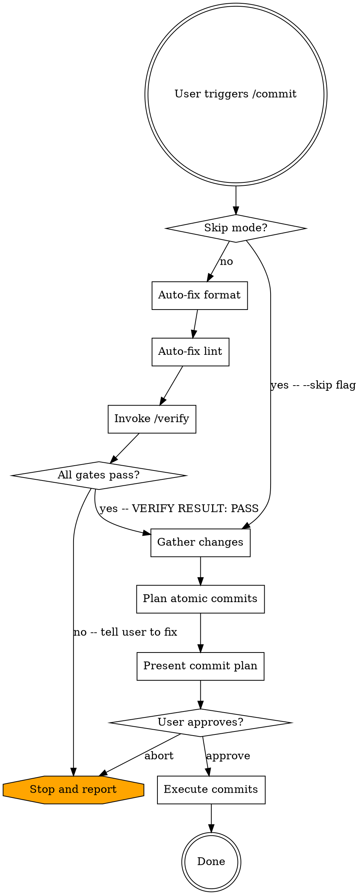

# Commit

## Overview

Branch-scope commit step. Verify the whole branch's working tree is clean, then plan and execute atomic commits across the branch.

**Phase 1 is a HARD GATE.** Before any commit, the working tree must have:

- 0 format errors
- 0 lint errors
- `VERIFY RESULT: PASS` from `/verify` (build + test)

This applies **even when the failures are pre-existing or unrelated to the current session's changes**. The only escape hatches are the explicit `/commit --skip` flag (see Skip Mode) and the "Tool missing" branch in Phase 1A/1B. Never bypass the gate any other way.

Phase 1A/1B auto-fix mechanical format/lint violations by invoking formatter and linter in write mode (`dotnet format`, `biome check --write`, `eslint --fix`, etc.); those fixes get pulled into the commit plan in Phase 3. Format and lint run BEFORE `/verify` so `/verify` sees the post-fix tree. For non-mechanical failures (a `/verify` FAIL, lint diagnostics that cannot be auto-fixed), the skill STOPS and tells the user what to fix -- it does not make judgment-call code edits itself.

## Skip Mode

`/commit --skip` bypasses Phase 1 entirely. Skill starts at Phase 2 (Gather Changes), then Phase 3, 4, 5 as normal.

Detection: enter skip mode when the user's invocation message contains the literal token `--skip` (whitespace-delimited, case-sensitive).

In skip mode:

- Skip Phase 1A (format auto-fix), 1B (lint auto-fix), and the Phase 1C `/verify` invocation. No formatter, linter, or `/verify` build + test run.
- Before Phase 2, emit verbatim: `Skip mode: Phase 1 gate bypassed. Format, lint, and /verify (build + tests) will NOT run. Proceeding directly to commit planning.`
- All other phases run unchanged. Every Red Flag still applies -- no `git add -A`, no committing secrets, no `--amend`, no `--no-verify`, no destructive git commands.

## Workflow



## Execution Order

Phases execute strictly in order: Phase 1 -> Phase 2 -> Phase 3 -> Phase 4 -> Phase 5. Do not begin a phase until the prior phase has fully completed.

If `--skip` is set per the Skip Mode section, skip Phase 1 entirely and start at Phase 2.

Within Phase 1, sub-steps run strictly in this order: Phase 1A (format auto-fix) -> Phase 1B (lint auto-fix) -> Phase 1C (`/verify` build + test). Format and lint run first so `/verify` executes against the final post-fix tree.

Within Phase 2, the four `git` commands listed run in parallel; that is the only parallelism allowed in this workflow.

**Phase 1: Hard Gate (Format + Lint + /verify)**

This phase is a **HARD GATE** unless `--skip` is set. The skill cannot proceed past Phase 1 unless format reports 0 errors, lint reports 0 errors, and `/verify` returns `VERIFY RESULT: PASS`. The gate applies **even when failures are pre-existing or unrelated to the current session's changes** -- if the working tree is broken, the commit does not happen until the working tree is fixed.

Two documented escape hatches exist:

1. `--skip` flag -- bypasses the entire phase. See Skip Mode section.
2. "Tool missing" branch in Failure Handling -- bypasses a single format/lint sub-step when a required tool is not installed.

No other bypass is allowed.

### Detection

Detect ALL project types present in the workspace for the format/lint sub-steps (not just the changed-files set -- the gate covers the whole working tree):

- `.csproj` / `.sln` anywhere in the workspace -> run .NET format/lint.
- `package.json` anywhere in the workspace -> run JS/TS format/lint.
- Mixed repos: run BOTH for every sub-step. Aggregate results. STOP if any sub-step fails.
- If neither matches, emit verbatim: `No format/lint configuration recognized for this repo; proceeding to the /verify sub-step.` Then continue to Phase 1C. Do not invent or guess at commands.

`/verify` owns build/test detection -- Phase 1C invokes it; this skill does not detect or run build/test commands itself.

**Phase 1A: Format Auto-Fix**

Run the formatter in **write mode** to auto-fix mechanical formatting violations. Files modified by this step get picked up by Phase 2 and included in the commit plan in Phase 3.

- **.NET**: `dotnet format` on the solution/project (no `--verify-no-changes` flag -- this is the write pass).
- **JS/TS** (detection precedence, first match wins):
  1. `biome.json` / `biome.jsonc` -> `pnpm biome format --write .`
  2. `.prettierrc.*` or `prettier` key in `package.json` -> `pnpm prettier --write .`
  3. Otherwise: skip dedicated format step and rely on Phase 1B's linter to format.

After the write pass, run verification to confirm 0 remaining issues:

- **.NET**: `dotnet format --verify-no-changes`
- **JS/TS**: `pnpm biome format .` (verify) or `pnpm prettier --check .`

If verification still reports issues, STOP and emit diagnostic output verbatim followed by:

`Format errors remain after auto-fix. Likely cause: a generated/vendored file the formatter cannot reach, or a syntax error that broke the parser. Inspect each failing file above. Generated or vendored -> add to .editorconfig / biome.json / .prettierignore. Real source -> fix the syntax that defeated the formatter. Re-run /commit when verify passes.`

**Phase 1B: Lint Auto-Fix**

Run the linter in **fix mode** to auto-fix mechanical lint violations, then run it in verify mode.

- **.NET**: `dotnet format` already covers analyzer-driven lint warnings; no separate step.
- **JS/TS** (detection precedence, first match wins):
  1. `biome.json` / `biome.jsonc` -> `pnpm biome check --write .` then `pnpm biome check .` (verify).
  2. `eslint.config.*` (flat config) -> `pnpm lint --fix` then `pnpm lint` (verify).
  3. `.eslintrc.*` (legacy config) -> same as above.
  4. `package.json` has a `lint:fix` script -> run that, then `pnpm lint`.
  5. `package.json` has a `lint` script only -> run `pnpm lint` in verify mode (no auto-fix available).
  6. None of the above -> skip lint sub-step.

If the verify pass shows remaining errors (i.e. errors the linter could not auto-fix), STOP and emit violations verbatim followed by:

`Lint errors remain after auto-fix. These are real code issues that need targeted edits. For each violation above: fix the offending code, or add a one-line "// reason" suppression when the rule does not apply here. Re-run /commit when verify passes.`

**Phase 1C: /verify (Build + Test)**

Invoke `/verify` (no args) over the whole branch's working tree. `/verify` runs the full whole-graph build / type-check + full test suite + changed-file coverage gate and emits one structured result. Run it AFTER Phase 1A/1B so it sees the post-fix tree.

Read the returned result block:

```
VERIFY RESULT: <PASS|FAIL>
- build: ...
- tests: ...
- coverage: ...
```

- `VERIFY RESULT: PASS` -> the build/test gate is met. Continue to Phase 2.
- `VERIFY RESULT: FAIL` -> STOP. Emit the `/verify` result block and its captured error output / failing test names verbatim, followed by:

`/verify failed (build or test). Read each failure above, decide regression vs environment flake, and fix the underlying cause -- never edit a test to silence a failure or patch a type to match broken usage. Re-run /commit when /verify returns PASS.`

The coverage line is advisory -- a non-empty uncovered list does NOT block the gate. Surface it to the user but proceed when the overall result is `PASS`.

### Failure Handling

- **Tool missing in Phase 1A/1B** (command not found, exit code 127): emit `[tool name] is not installed. Install it or skip this sub-step?` and ask the user via `AskUserQuestion` with options "Install and re-run" (STOP, await fix) or "Skip this sub-step" (continue past this single format/lint sub-step only -- the rest of the gate still applies). Do not auto-skip. Tool-missing inside `/verify` is `/verify`'s own concern -- it records the stage `not-configured` and the result still drives the gate.
- **Auto-fix made changes**: expected. Note in the Phase 3 commit plan that pre-existing format/lint fixes are included.
- **Verify-pass errors after format/lint auto-fix**: STOP per sub-step instructions above. Do not retry, do not attempt manual edits, do not bypass.

**Phase 2: Gather Changes**

Run these four commands in parallel:

- `git status` - see all modified, added, untracked files.
- `git diff` - see unstaged changes.
- `git diff --cached` - see staged changes.
- `git log --oneline -5` - recent commits for message style reference.

If `git status` reports a clean tree and no untracked files, STOP and emit verbatim: `Working tree is clean. Nothing to commit.` Do not enter Phase 3.

If `git diff --cached` shows pre-existing staged changes, unstage them automatically with `git reset` (no flags, no `--hard`). This only clears the index -- file edits stay intact. Announce: `Unstaging N pre-existing staged file(s) so the commit plan can group from scratch.` Then re-run the four gather commands above to refresh the diff view.

Read every changed file in the diff using the `Read` tool, with these exceptions:

- Skip files matched by typical generated-content patterns (lock files, `*.min.*`, build artifacts, `dist/`, `node_modules/`).
- For files over 1000 lines, read only diff hunks via `git diff <file>`.
- For binary files, note their presence but do not read.

**Phase 3: Plan Atomic Commits**

Group changes into logical commits. Each commit MUST be:

- **Self-contained** - builds independently.
- **Single purpose** - one logical change.
- **Properly ordered** - dependencies committed first.

Reject any candidate commit that fails any of the three rules; re-plan instead of relaxing them.

### Grouping Strategy

1. Identify logical units of change (feature, bugfix, refactor, test addition).
2. Within each unit, order by dependency layer:
   - Domain/Core entities and interfaces first.
   - Business logic / use cases second.
   - Infrastructure / persistence third.
   - API / presentation fourth.
   - Tests last (or alongside their layer).
3. Keep changes in one commit when ALL of the following hold:
   - Total diff is under 150 lines added+removed.
   - All files share a single logical purpose (one entity, one bugfix, one refactor).
   - Splitting by layer would produce a commit that does not build on its own.

   Otherwise, split by layer per the ordering rules above.

### Commit Message Format

Use conventional commits: `type(scope): description`

| Type | When |
|------|------|
| `feat` | New feature / wholly new functionality |
| `fix` | Bug fix |
| `refactor` | Code restructuring, no behavior change |
| `test` | Adding or updating tests only |
| `docs` | Documentation only |
| `chore` | Maintenance, dependency updates |

**Read `git log --oneline -5`** to match the repository's existing commit message style.

Do NOT add: `Generated with Claude Code`, `Co-Authored-By: Claude`, any AI attribution trailer, or any signature line. Commit messages contain only the conventional commit body.

### Present the Plan

Show a numbered table:

```
| # | Type | Files | Message |
|---|------|-------|---------|
| 1 | feat(core) | Entity.cs, IRepo.cs | add Widget entity and repository interface |
| 2 | feat(usecase) | Handler.cs, Dto.cs | implement CreateWidget command handler |
| 3 | feat(api) | Endpoint.cs | expose CreateWidget endpoint |
| 4 | test(widget) | HandlerTests.cs | add CreateWidget handler unit tests |
```

After presenting the plan, ask inline in plain text: "Proceed with this commit plan?" listing the two canonical options inline for the user to type back:

- **"Approve -- execute the commits"** -> Phase 4.
- **"Abort -- leave the working tree untouched"** -> STOP. Do not commit.

**Phase 4: Execute Commits**

For each commit N in the plan, in order:

1. `git add <specific files for commit N>`.
2. `git commit -m "<message N>"` using a HEREDOC for the message body.
3. `git status` immediately after the commit completes.
4. If commit N failed (non-zero exit, hook rejection, or `git status` shows files still staged), STOP. Do not proceed to commit N+1. Report the failure verbatim and wait for user instruction.

Do not batch the per-commit `git status` to the end of the loop -- run it after every commit.

**NEVER** use `git add -A` or `git add .` -- always stage specific files.

**Phase 5: Terminate**

After the last commit's `git status` verification, emit a one-line summary in this exact format:

`Committed N atomic commits. Working tree clean.`

Then STOP. Do not push, do not offer to push, do not propose follow-up work, do not run any further commands. Skill ends here.

## Red Flags - STOP

Each item below is a HARD rule. Hitting any of them means STOP in the current response.

- About to make a logic / judgment-call code edit during commit -> STOP. Mechanical auto-fix via formatter or linter (`dotnet format`, `biome check --write`, `eslint --fix`) is allowed and expected; hand-editing source to silence a lint diagnostic or pass a test is NOT.
- About to bypass the Phase 1 gate (skip format, skip lint, skip `/verify`, "just this once") -> STOP, unless the user explicitly invoked `/commit --skip` (whole gate) or the Tool-missing branch applies to a format/lint sub-step. Those two branches are the only documented escape hatches; no other bypass is allowed.
- About to `git add -A` or `git add .` -> stage specific files only.
- Committing `.env`, credentials, or secrets -> warn the user and STOP.
- Committing `settings.json`, `appsettings.*.json`, `config.json`, `application.yml`, `.npmrc`, or similar config files -> scan file content for API keys, tokens, passwords, connection strings, OAuth client secrets, or other sensitive values BEFORE staging. If any are found, STOP and surface the exact line(s) to the user to redact (move to env var, secret manager, or local-only file ignored by git). Do not commit "I'll redact it later" placeholders.
- Commit message describes "what" instead of "why" (e.g. `add if statement` instead of `support widget filtering`) -> rewrite it. The message must explain purpose, not mechanics.
- Commit message doesn't match the actual changes -> rewrite it.
- Format or lint errors remain after Phase 1A/1B auto-fix, or `/verify` returns `VERIFY RESULT: FAIL` -> STOP. Tell the user to fix and re-invoke `/commit`.
- NEVER push, force-push, tag, create branches, or open PRs. This skill commits only. Stop after Phase 5's `git status` verification.
- NEVER use `--amend`, `--no-verify`, `--no-gpg-sign`, or any flag that bypasses hooks/signing. If a hook fails, STOP and report the failure to the user; do not retry with bypass flags.
- NEVER run `git reset --hard`, `git checkout --`, `git restore`, `git clean`, or any destructive command. The only `git reset` permitted is the no-flag form in Phase 2 to auto-unstage pre-existing staged changes (file edits preserved).
