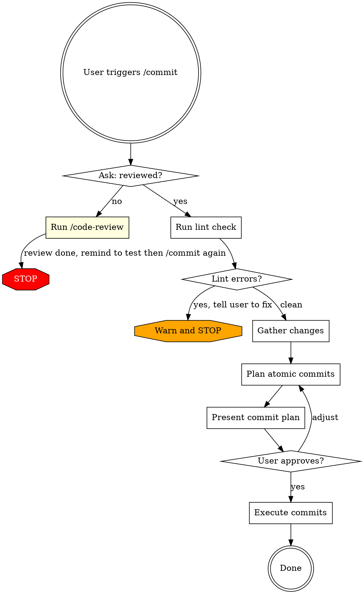

# Commit

## Overview

Verify that changes are reviewed and clean, then plan and execute atomic commits. This skill never changes code -- if something is wrong, it stops and tells you to fix it first.

## When to Use

- When you're ready to commit after coding and reviewing
- After running /code-review and testing

## Workflow



## Phase 1: Gate Check

Use `AskUserQuestion`:

> "Have you run /code-review on these changes?"

- **Yes** -> proceed to Phase 2
- **No** -> invoke `/code-review`, then STOP with message: "Review complete. Please test your changes, then run /commit again."

The gate ensures all code changes happen during review (where they can be tested), not during commit.

## Phase 2: Lint Verification

Run the project's linter in **check-only mode** (no auto-fix):
- `biome.json` / `biome.jsonc` -> `pnpm biome check` (without `--write`)
- `.eslintrc.*` / `eslint.config.*` -> `pnpm lint`
- .NET projects -> `dotnet format --verify-no-changes` (if available)
- Any `lint` script in `package.json` -> `pnpm lint` or `yarn lint`

If lint errors exist:
> "Lint errors found. Please fix these before committing, then run /commit again."

Show the errors and STOP. Do not fix them -- that's code-review's job.

## Phase 3: Gather Changes

Run in parallel:
- `git status` - see all modified, added, untracked files
- `git diff` - see unstaged changes
- `git diff --cached` - see staged changes
- `git log --oneline -5` - recent commits for message style reference

Read all changed files to understand what's being committed.

## Phase 4: Plan Atomic Commits

Group changes into logical commits. Each commit should be:
- **Self-contained** - builds independently
- **Single purpose** - one logical change
- **Properly ordered** - dependencies committed first

### Grouping Strategy

1. Identify logical units of change (a feature, a bugfix, a refactor, a test addition)
2. Within each unit, order by dependency layer:
   - Domain/Core entities and interfaces first
   - Business logic / use cases second
   - Infrastructure / persistence third
   - API / presentation fourth
   - Tests last (or alongside their layer)
3. If a unit is small and tightly coupled across layers, keep as single commit

### Commit Message Format

Use conventional commits: `type(scope): description`

| Type | When |
|------|------|
| `feat` | New feature / wholly new functionality |
| `fix` | Bug fix |
| `refactor` | Code restructuring, no behavior change |
| `test` | Adding or updating tests only |
| `docs` | Documentation only |
| `chore` | Maintenance, dependency updates |

**Read `git log --oneline -5`** to match the repository's existing commit message style.

### Present the Plan

Show a numbered table:

```
| # | Type | Files | Message |
|---|------|-------|---------|
| 1 | feat(core) | Entity.cs, IRepo.cs | add Widget entity and repository interface |
| 2 | feat(usecase) | Handler.cs, Dto.cs | implement CreateWidget command handler |
| 3 | feat(api) | Endpoint.cs | expose CreateWidget endpoint |
| 4 | test(widget) | HandlerTests.cs | add CreateWidget handler unit tests |
```

Ask user to approve, adjust ordering, or merge/split commits.

## Phase 5: Execute Commits

For each commit in the plan:
1. Stage only the specific files for that commit: `git add file1 file2 ...`
2. Create the commit with the agreed message (use HEREDOC for formatting)
3. Verify with `git status` after each commit

**NEVER** use `git add -A` or `git add .` - always stage specific files.

## Red Flags - STOP

- About to fix code during commit - STOP. Tell user to run /code-review and test first.
- About to `git add -A` or `git add .` - stage specific files only
- Committing `.env`, credentials, or secrets - warn the user
- Commit message doesn't match the actual changes - rewrite it
- Lint errors detected - STOP. Tell user to fix first.
- Skipping the review gate - always ask

## Common Mistakes

| Mistake | Fix |
|---------|-----|
| Fixing code during commit | Never change code. That's /code-review's job. |
| Grouping unrelated changes in one commit | Split by logical unit, not by file proximity |
| Writing commit messages about "what" not "why" | Focus on purpose: "support widget filtering" not "add if statement" |
| Staging files that weren't reviewed | Only commit files that passed review |
| Skipping lint check | Always verify lint is clean before committing |
