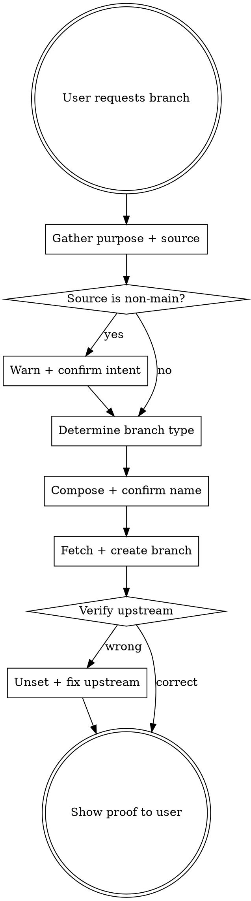

# Create Branch

## Overview

Safely creates git branches with folder-based naming and correct upstream tracking. Prevents the dangerous scenario where branching from a remote tracking branch silently inherits the parent's upstream, causing pushes to go to the wrong remote branch.

## The Danger This Skill Prevents

When you `git checkout -b feature/my-work` while on `origin/feature/other-work`, git automatically sets `origin/feature/other-work` as the upstream. Every `git push` then goes to `origin/feature/other-work` instead of creating `origin/feature/my-work`. This corrupts a shared branch with no PR review.

## Process



## Step-by-Step

### 1. Gather Purpose and Source Branch

If the user already provided the purpose and/or source branch in their message, confirm them. Otherwise, use AskUserQuestion to ask:

- **Purpose:** What is this branch for?
- **Source branch:** Which branch should it be created from? (Default recommendation: `main`)

### 2. Warn if Branching from a Non-Main Branch

If the source branch is NOT `main` or `develop`, explicitly warn the user:

> "You are branching from `feature/other-work`, which is a feature branch -- not main. This means your branch will be based on in-progress work. Are you sure?"

Use AskUserQuestion to confirm intent before proceeding.

### 3. Determine Branch Type

Map the purpose to a conventional folder prefix:

| Prefix | When to Use |
|--------|-------------|
| `feature/` | New functionality or capability |
| `fix/` | Bug fix |
| `hotfix/` | Urgent production fix |
| `chore/` | Maintenance, dependencies, config |
| `refactor/` | Code restructuring without behavior change |
| `docs/` | Documentation only |
| `test/` | Adding or updating tests |
| `ci/` | CI/CD pipeline changes |
| `style/` | Formatting, whitespace (no logic change) |
| `perf/` | Performance improvements |

If the purpose is ambiguous, ask the user to pick the type.

### 4. Compose Branch Name

Format: `{type}/{short-kebab-description}`

Rules:
- All lowercase
- Use kebab-case for the description
- Keep it concise but descriptive
- No spaces, underscores, or special characters besides `/` and `-`

Examples:
- `feature/assessment-template`
- `fix/login-redirect-loop`
- `chore/update-dependencies`

Present the proposed name to the user for confirmation before proceeding.

### 5. Fetch and Create

```bash
# Fetch latest from remote
git fetch origin

# Verify source branch exists
git branch -r | grep {source-branch}

# Create branch from the chosen source
git checkout -b {branch-name} origin/{source-branch}
```

### 6. Verify and Fix Upstream (CRITICAL -- NEVER SKIP)

After creation, ALWAYS check the upstream tracking:

```bash
git branch -vv
```

The upstream will almost always be wrong after branching. **Always unset it:**

```bash
# Unset the inherited upstream
git branch --unset-upstream
```

Show the user the `git branch -vv` output as proof that no wrong upstream is set. Inform them that on first push, they must use:

```bash
git push -u origin {branch-name}
```

## Safety Checklist

After branch creation, verify ALL of these:

- [ ] Branch name follows `{type}/{description}` format
- [ ] Branch was created from the correct source
- [ ] User was warned if source was a non-main branch
- [ ] `git branch -vv` shows no upstream (it was unset)
- [ ] User knows to use `git push -u origin {branch-name}` on first push

## Red Flags

| Situation | Action |
|-----------|--------|
| `git branch -vv` shows `[origin/other-branch]` | STOP. Unset upstream immediately. |
| User wants `f-something` or flat naming | Redirect to folder-based naming convention. |
| User wants to push without setting upstream | Ensure `git push -u origin {branch-name}` is used for first push. |
| Creating from a non-main branch | Warn user, confirm intent (Step 2). |

## Quick Reference

```bash
# Safe branch creation (full sequence)
git fetch origin
git checkout -b feature/my-feature origin/main
git branch --unset-upstream
# On first push, set correct upstream:
git push -u origin feature/my-feature

# Verify upstream is correct
git branch -vv

# Fix wrong upstream on existing branch
git branch --unset-upstream
git push -u origin $(git branch --show-current)
```
