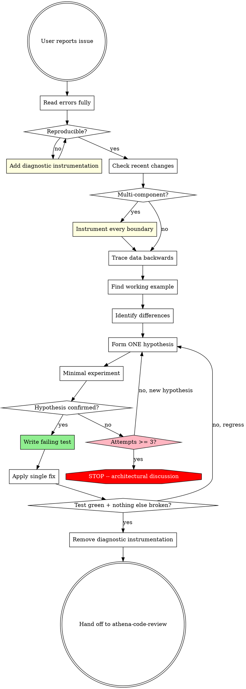

# Debugging

## Overview

Random fixes waste time and create new bugs. Quick patches mask the underlying cause and re-surface elsewhere. This skill is the discipline backstop for ad-hoc bug investigations -- the cases where atlas-pipeline-orchestrator is not the right entry point because no new feature is being designed, just an existing one diagnosed.

**Core principle:** find the root cause before attempting any fix. A symptom fix is a failed debug.

## The Iron Law

```
NO FIXES WITHOUT ROOT CAUSE INVESTIGATION FIRST
```

If Phase 1 has not been completed, no Edit, Write, or refactor tool call is allowed. Diagnostic instrumentation (logging, dump statements, console output) is allowed and encouraged in Phase 1.

## When to Use

Any technical issue that came in as a complaint, not a feature request:

- Test failures (unit, integration, e2e)
- Bugs reported by the user or QA
- Unexpected runtime behavior
- Performance regressions
- Build / type-check failures the user wants explained
- API <-> FE integration issues (bridge-file communication, mismatched DTOs, 4xx/5xx)
- EF Core migration failures or schema drift

**Use this ESPECIALLY when:**

- Time pressure is making "just one quick fix" tempting
- Two or more fix attempts have already failed
- You don't fully understand the failure
- The bug spans both backend (Performance/Recruitment API) and frontend (Pandahrms-Performance)

## When NOT to Use

- New feature work, behavioral changes, or refactors -> route through `atlas-pipeline-orchestrator`
- Code review of a clean working tree -> `athena-code-review`
- The user is just narrating a CI failure they will fix themselves -> respond conversationally
- The user has identified the line and just wants the edit -> apply the edit; do not run a 4-phase investigation against a 1-line change

## Workflow



## Phase 1: Root Cause Investigation

You MUST complete this phase before proposing any fix.

### 1. Read errors carefully

- Read the full stack trace, not just the top frame
- Note line numbers, file paths, error codes, request IDs
- Capture the exact error string verbatim -- it is often searchable
- Distinguish "the code threw" from "the test assertion failed" -- they are different categories of evidence

### 2. Reproduce consistently

- Can you trigger the bug reliably? Document the exact steps.
- If it is intermittent, gather more data before guessing -- intermittent failures usually reveal timing, ordering, or shared-state bugs that random fixes will miss.
- For Pandahrms FE/BE bugs, reproduce the failing request via DevTools network panel or Postman before touching either side.

### 3. Check recent changes

Run in parallel:

- `git log --oneline -20` -- recent commits
- `git status` and `git diff` -- uncommitted changes
- `git diff <last-known-good>..HEAD` -- if the user can name a known-good ref

If the bug appeared after a specific commit, read that commit in full.

### 4. Trace data flow backwards (when error is deep in a call stack)

Bugs deep in a stack frame are usually fixed at the source of the bad value, not where it explodes.

```
- Where does the bad value originate?
- What called this function with that value?
- Trace upward until you find the source.
- Fix at the source, not at the symptom.
```

The symptom location is often where the value is *consumed*, not where it is *produced*. Fixing at consumption masks the bug for the next caller.

### 5. Multi-component evidence (FE <-> BE, CI <-> build, API <-> service <-> DB)

When the system has multiple components and the failure could plausibly live in any of them, do NOT guess which one is broken. Add diagnostic instrumentation at every boundary, run once, and let the evidence point at the failing component.

**Pandahrms boundary checklist:**

| Boundary | What to log |
|----------|-------------|
| Browser -> API | Request payload (DevTools), response status, response body |
| API controller -> service | Method args, return value, any thrown exception |
| Service -> repository / EF | Generated SQL (`Microsoft.EntityFrameworkCore.Database.Command` at Information level), query parameters |
| Repository -> MSSQL | Run the generated SQL directly against the local Docker MSSQL (`pandahrms-sqlserver`) to confirm the DB layer behavior |
| EF migration | `dotnet ef migrations script` -- inspect the actual SQL the migration emits |
| Cross-session FE/BE | Use the bridge-file skill to capture the symptom on the side that observed it, then read it on the other side |

After instrumenting, run the failing scenario once. The first boundary where input is good but output is wrong is your failing component. Investigate inside that component next.

**Remove all diagnostic instrumentation before handing off in Phase 4.** Diagnostic logs, console statements, and dump calls must not survive into the commit.

## Phase 2: Pattern Analysis

Before forming a hypothesis, find the pattern.

1. **Find a working example.** Locate similar code in the same codebase that *does* work. Examples: another endpoint of the same shape, a sibling EF entity that maps correctly, a sister Svelte route that renders fine.

2. **Compare against the working example.** Read it completely -- not just the parts that look relevant. Patterns break in places you didn't think mattered.

3. **List every difference.** Even differences you think "can't matter." Differences in attribute order, casing, DI registration, package version, namespace, file location have all caused real Pandahrms bugs.

4. **Understand dependencies.** What other components, settings, or environment does the broken code need? Is anything missing or misconfigured?

## Phase 3: Hypothesis and Testing

Scientific method, not pattern matching.

1. **State one hypothesis explicitly.** Format: "I think `<X>` is the root cause because `<Y>`." Write it out -- don't keep it in your head. Vague hypotheses produce vague fixes.

2. **Test minimally.** Make the smallest possible change that proves or disproves the hypothesis. One variable at a time. If you change two things and it works, you don't know which one was the fix.

3. **Verify before continuing.**
   - Hypothesis confirmed -> proceed to Phase 4.
   - Hypothesis disproved -> form a NEW hypothesis. Do NOT add a second fix on top of the first guess.

4. **When you don't know, say so.** "I don't understand why X is happening" is a valid state. Ask the user, search the codebase further, or read more of the framework source. Do not pretend to know.

## Phase 4: Implementation

Fix the root cause, not the symptom.

### 1. Write a failing test FIRST (TDD)

This is non-negotiable. Reference: `~/.claude/rules/TDD.md` and the RED/GREEN markers used in plan-writing/execute-plan.

- The test must fail for the right reason (the bug), not for an unrelated reason (missing setup, wrong assertion).
- For Pandahrms backends: `dotnet test --filter "FullyQualifiedName~<TestName>"` against the relevant test project.
- For Pandahrms-Performance frontend: `pnpm vitest run <path>` or `pnpm playwright test <spec>` depending on the layer.
- If the bug is in code that genuinely has no test infrastructure path, surface that to the user before continuing -- do not silently skip the test.

The failing test is the proof you understood the bug. Without it, "the fix worked" only proves the fix changed *something*.

### 2. Apply a single fix

- Address the root cause identified in Phase 1.
- One change at a time.
- No "while I'm here" cleanups, no bundled refactors, no opportunistic renames.
- If you notice a separate issue in the same file, surface it to the user as a follow-up rather than fixing it inline.

### 3. Verify

- The failing test from step 1 now passes.
- No previously passing tests are now failing.
- The original symptom (the user's report) is actually gone -- not just the test green.

### 4. If the fix doesn't work

STOP. Count attempts.

- **< 3 attempts:** Return to Phase 1 with the new information from this attempt. Do NOT layer another fix.
- **>= 3 attempts:** STOP and surface this to the user via `AskUserQuestion`. Three failed fixes in the same area is signal that the architecture is wrong, not that the next fix needs to be cleverer.

### 5. Architectural escalation (after 3+ failed fixes)

When each fix reveals a new problem in a different place, or each fix requires "massive refactoring" to land, the pattern is wrong, not the implementation.

Surface the situation to the user with concrete observations:

- What you tried (each fix attempt, what it changed, why it failed)
- The pattern across the failures (e.g. "every fix exposes shared state in `FooService`")
- Your read on whether this is a refactor candidate or a deeper architecture rethink

If the user agrees a refactor is warranted, hand off to `atlas-pipeline-orchestrator` for design-refinement, not back into another fix attempt. This skill does not design refactors.

## Hand-off

When the fix is verified:

1. Remove all diagnostic instrumentation added in Phase 1.
2. Confirm the working tree contains: the fix, the failing test (now green), and nothing else.
3. Tell the user the bug is resolved and that the next step is `/athena-code-review` (which will then route to `/hermes-commit`).

This skill does NOT invoke `/athena-code-review` or `/hermes-commit` directly. The user controls when review and commit happen.

## Red Flags -- STOP

If you catch yourself thinking any of the following, return to Phase 1:

- "Quick fix for now, investigate later"
- "Just try changing X and see if it works"
- "Skip the test, I'll manually verify"
- "It's probably X, let me fix that"
- "I don't fully understand it but this might work"
- "Pattern says X but I'll adapt it differently"
- "Here are the main problems: [lists fixes without investigation]"
- "One more fix attempt" (when 2+ have already failed)
- Each fix reveals a new problem in a different place

If 3+ fixes have failed -> escalate to architectural discussion (Phase 4 step 5).

## Signals from the user that you're off-track

| User says | What it means |
|-----------|---------------|
| "Is that not happening?" | You assumed without verifying |
| "Will it show us...?" | You should have added evidence gathering |
| "Stop guessing" | You're proposing fixes without understanding |
| "Ultrathink this" | Question fundamentals, not just symptoms |
| "We're stuck?" | Your approach isn't working -- restart Phase 1 |

When you see these, STOP and return to Phase 1 -- don't argue or defend the approach.

## Common Rationalizations

| Excuse | Reality |
|--------|---------|
| "Issue is simple, don't need process" | Simple bugs have root causes too. Phase 1 takes minutes for simple bugs. |
| "Emergency, no time for process" | Systematic is faster than guess-and-check thrashing. |
| "Just try this first, then investigate" | The first fix sets the pattern. Do it right from the start. |
| "I'll write the test after confirming the fix" | Untested fixes regress. Failing-test-first proves you understood the bug. |
| "Multiple fixes at once saves time" | You can't isolate which one worked. Causes new bugs. |
| "Reference is too long, I'll adapt the pattern" | Partial understanding guarantees a second bug. Read it completely. |
| "I see the problem, let me fix it" | Seeing the symptom is not understanding the root cause. |
| "One more fix attempt" (after 2+ failures) | 3+ failures means the architecture is wrong, not the next fix. |

## Out of Scope

This skill does NOT:

- Commit, stage, push, or open a PR -- `/hermes-commit` owns commits
- Run `/athena-code-review` automatically -- the user invokes it after the fix lands
- Invoke `atlas-pipeline-orchestrator` -- atlas is for new work; this skill is for existing-bug diagnosis
- Design refactors -- when 3+ fixes fail, escalate to the user, who chooses whether to start an atlas pipeline
- Write new specs or update Gherkin features -- if a bug fix changes documented behavior, surface it as a follow-up; spec updates go through `/spec-writing`
- Run database migrations, restore .bak files, or modify the local Docker MSSQL state outside of read-only diagnostic queries

## Common Mistakes

| Mistake | Fix |
|---------|-----|
| Proposing a fix in the same turn as the user reports the bug | Phase 1 first. Read errors, reproduce, check changes. |
| Fixing at the symptom site, not the source | Trace data flow backwards (Phase 1 step 4). |
| Layering a second fix on top of an unconfirmed first guess | One hypothesis at a time. Disprove before pivoting. |
| Skipping the failing test "because the fix is obvious" | The failing test is the proof of understanding. Always write it. |
| Leaving `console.log` / `Console.WriteLine` / dump statements in the commit | Remove all diagnostic instrumentation in the hand-off step. |
| Fixing the FE side first when the bug is in the API | Per global rule: settle the backend first, deploy, then the frontend. |
| Editing types in the FE OpenAPI client to "match" a buggy backend | Never. Fix the backend, regenerate types, then the FE. |
| Continuing past 3 failed fixes | Stop. Architectural escalation via `AskUserQuestion`. |
| Running `/hermes-commit` when the fix is verified | This skill hands off; the user invokes `/athena-code-review` next. |
