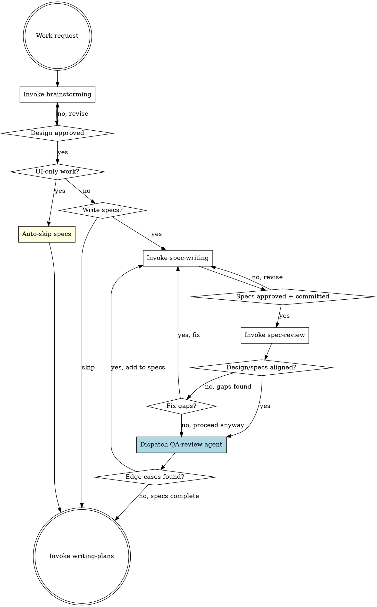

# Pandahrms Design Pipeline

## Overview

Orchestrates the design phase for Pandahrms projects: brainstorming, spec writing, spec review, and implementation planning. This skill exists because `superpowers:brainstorming` hardcodes its terminal state to invoke `writing-plans` directly, which skips the required `pandahrms:spec-writing` step.

**Use this skill INSTEAD of invoking `superpowers:brainstorming` directly** in any Pandahrms project.

**Announce at start:** "I'm using the design-pipeline skill to orchestrate the Pandahrms design phase."

<HARD-GATE>
OVERRIDE: When the brainstorming skill completes and instructs you to "invoke writing-plans", do NOT invoke writing-plans. Instead, return to THIS pipeline and ask the user whether they want to write specs first.

The brainstorming skill says: "The ONLY skill you invoke after brainstorming is writing-plans." In Pandahrms projects, this instruction is OVERRIDDEN by this pipeline. You MUST ask the user before proceeding.
</HARD-GATE>

## Pipeline



## Time Tracking

Track elapsed time for every task across the full development lifecycle. Pipeline timing is persisted into the plan file so the executing-plans session can read it and produce a combined summary.

### How to track

1. **On task start** -- record the current time (use `date +%s` via Bash)
2. **On task completion** -- record the end time, calculate the duration, and display it: `"Task N completed in Xm Ys"`
3. **On final task completion** -- display a summary table

Skipped tasks show `-- skipped` instead of a duration.

### Pipeline session: persist timing into the plan file

After the pipeline checklist completes (step 7), append a `## Pipeline Timing` section to the **bottom** of the generated plan file:

```markdown
## Pipeline Timing

<!-- Auto-generated by design-pipeline. Do not edit. -->
| Phase | Duration |
|-------|----------|
| Brainstorm the design | 12m 34s |
| Check: UI-only work? | 0m 5s |
| Ask: Write specs? | 8m 21s |
| Review specs against design | 3m 10s |
| QA review: edge cases | 2m 45s |
| Create implementation plan | 15m 02s |
| **Pipeline total** | **41m 57s** |
| Skills invoked | 4 (brainstorming, spec-writing, spec-review, writing-plans) |
| Agents spawned | 3 |
```

This ensures the timing data travels with the plan file into the next session.

### Executing-plans session: read pipeline timing and show combined summary

When executing a plan via `superpowers:executing-plans`:

1. **On start** -- check if the plan file contains a `## Pipeline Timing` section. If found, parse the pipeline total duration.
2. **Track each execution task** -- same start/end timestamp approach.
3. **On completion** -- display the combined summary:

```
Development Summary
===========================
Pipeline (design + specs)    -- 39m 12s
---------------------------
Task 1: Set up structure     --  3m 12s
Task 2: Create data models   --  5m 45s
Task 3: Implement endpoints  -- 12m 08s
...
---------------------------
Execution total              -- 42m 31s
Agents spawned               -- 5
===========================
Grand total                  -- 1h 21m 43s
```

If no `## Pipeline Timing` section exists in the plan file, show only the execution summary without the pipeline row.

## Checklist

You MUST create a task for each of these items and complete them in order:

1. **Brainstorm the design** -- invoke `superpowers:brainstorming` to explore the idea, propose approaches, and present design. Do NOT auto-commit the design doc -- leave it uncommitted for the user to review. When brainstorming tells you to "invoke writing-plans", STOP and return here instead.
2. **Check: UI-only work?** -- If the work is purely UI/presentation (styling, layout, component design, theming, responsiveness, animations, dark mode, visual polish), auto-skip specs and go directly to step 6. Announce: "Skipping spec-writing -- this is a UI-only change with no business behavior impact."
3. **Ask: Write specs?** (non-UI work only) -- use AskUserQuestion to ask: "Would you like to write Gherkin specs before proceeding to the implementation plan?" with options: "Yes, write specs" and "Skip specs". Users may skip if the session is purely exploratory or an open discussion without concrete implementation targets. If yes, invoke `pandahrms:spec-writing` to write or update specs in pandahrms-spec based on the approved design doc.
4. **Review specs against design** -- invoke `pandahrms:spec-review` to cross-check the design doc against the written specs. This ensures every design requirement has spec coverage and nothing was missed. If no specs were written (user skipped step 3), this step is automatically skipped. If gaps are found, ask the user whether to fix them (loop back to spec-writing) or proceed anyway.
5. **QA review: edge cases** -- dispatch a QA-review sub-agent (using the Agent tool) to independently review the feature specs for missed edge cases, unhappy paths, boundary conditions, and implicit requirements not explicitly stated in the design. If no specs were written (user skipped step 3), this step is automatically skipped. See [QA Review Agent](#qa-review-agent) for the agent prompt and workflow.
6. **Create implementation plan** -- invoke `superpowers:writing-plans` to plan the implementation based on the approved design and specs.
7. **Prompt execution** -- display a copy-paste ready message for the user to execute the plan in a new session:

```
Design pipeline complete. To execute the plan, open a new session and run:
/execution-pipeline {absolute_path_to_plan_file}
```

## QA Review Agent

After spec-review confirms alignment (or the user proceeds despite gaps), dispatch a sub-agent to independently audit the specs for completeness. This agent looks for what the spec author and reviewer might have missed -- edge cases that only surface when you ask "what could go wrong?"

### Skip Condition

Skip this step entirely when:
- No specs were written (user skipped step 3)
- The work is UI-only (auto-skipped at step 2)

Announce: "Skipping QA review -- no specs to review."

### Agent Dispatch

Use the Agent tool with the following prompt structure. Replace the placeholders with actual file paths.

```
prompt: |
  You are a QA reviewer. Your job is to review Gherkin feature specs for a
  Pandahrms feature and identify missed edge cases, unhappy paths, boundary
  conditions, and implicit requirements.

  ## Inputs

  Design document: {design_doc_path}
  Spec files: {spec_file_paths}

  Read the design document and all spec files.

  ## What to Look For

  1. **Unhappy paths** -- What happens when the user provides invalid input,
     cancels mid-flow, loses connectivity, or hits a timeout?
  2. **Boundary conditions** -- Empty lists, maximum lengths, zero values,
     exactly-at-limit values, off-by-one scenarios.
  3. **Concurrent/conflicting actions** -- Two users editing the same record,
     duplicate submissions, race conditions.
  4. **Permission edge cases** -- User's role changes mid-session, permission
     revoked after page load, cross-tenant access attempts.
  5. **Data state edge cases** -- Soft-deleted records, archived entities,
     null/missing optional fields, migrated legacy data.
  6. **Implicit requirements** -- Behavior the design assumes but never states
     (e.g., audit logging, notification triggers, cascade effects).

  ## Output Format

  Return a structured report:

  ### Edge Cases Found

  For each finding:
  - **ID**: QA-1, QA-2, etc.
  - **Category**: (unhappy path | boundary | concurrency | permission | data state | implicit requirement)
  - **Description**: What the edge case is
  - **Suggested scenario**: A Gherkin scenario outline (Given/When/Then) that would cover it
  - **Severity**: (high | medium | low) -- high means likely to cause a bug in production

  ### Summary

  - Total findings: [count]
  - High severity: [count]
  - Medium severity: [count]
  - Low severity: [count]

  If you find zero edge cases, state that explicitly -- do not invent findings.
  Focus on quality over quantity. Only report genuine gaps, not theoretical
  scenarios that the feature's scope clearly excludes.

description: "QA review specs for edge cases"
```

### Handling Results

After the agent returns:

- **Zero findings** -- announce "QA review complete -- no additional edge cases found." Proceed to step 6.
- **Findings returned** -- present the agent's report to the user, then use AskUserQuestion: "QA review found [count] edge cases ([high_count] high severity). Would you like to add these to the specs?" with options:
  - **"Yes, add to specs"** -- loop back to `pandahrms:spec-writing` to incorporate the high and medium severity findings as new scenarios. Low severity findings are included only if the user explicitly asks.
  - **"No, proceed to planning"** -- proceed to step 6. The findings are still visible in the conversation for reference during implementation.

## Critical Override: Brainstorming Terminal State

The `superpowers:brainstorming` skill's step 6 says:

> "Transition to implementation -- invoke writing-plans skill to create implementation plan"

In Pandahrms projects, this step is REPLACED by:

> "Ask the user whether to write specs -- if yes, invoke pandahrms:spec-writing to write Gherkin specs based on the approved design. If the user skips, proceed directly to writing-plans."

Only after the user has been asked (and specs are written if requested) should you invoke `superpowers:writing-plans`.

## Critical Override: Store Plans Inside the Project

Design docs and implementation plans MUST be stored inside the **current project's** `docs/plans/` directory -- NOT in the skills repo or any other location.

The superpowers skills (brainstorming, writing-plans) save to `docs/plans/` relative to the working directory. Ensure the working directory is the project itself so files land in the right place:

```
<workspace>/
├── pandahrms-web/                # current project
│   └── docs/plans/               # <-- design docs and plans go here
│       ├── 2026-03-13-feature-name-design.md
│       └── 2026-03-13-feature-name.md
├── pandahrms-spec/
└── ...
```

If you are running from a different directory (e.g., the workspace root), explicitly set the output path to `<project>/docs/plans/` when saving.

## Critical Override: Always Use Parallel Session

When `superpowers:writing-plans` completes and offers the execution choice between "Subagent-Driven (this session)" and "Parallel Session (separate)", you MUST always select **Parallel Session (separate)**.

Do NOT offer or use "Subagent-Driven (this session)" in Pandahrms projects. After the plan is saved, display a copy-paste ready message that includes the plan file path:

```
To execute: Open a new session and run:
/execution-pipeline {absolute_path_to_plan_file}
```

Replace `{absolute_path_to_plan_file}` with the actual path where the plan was saved (e.g., `/Users/kyson/Developer/.../docs/plans/2026-03-13-feature-name.md`).

## Red Flags

| Thought | Reality |
|---------|---------|
| "Brainstorming said invoke writing-plans" | This pipeline overrides that for Pandahrms projects |
| "I'll skip specs without asking" | Always ask the user. They decide whether specs are needed. |
| "The design doc is enough" | Design doc captures WHAT. Specs capture BEHAVIOR. Ask the user. |
| "Specs look fine, skip the review" | Always run spec-review after writing specs. It catches gaps you won't notice manually. |
| "Specs are aligned, skip QA review" | The QA agent finds what both author and reviewer miss -- edge cases, unhappy paths, implicit requirements. Always run it after spec-review. |
| "This change is too small for specs" | Don't assume -- ask the user. They may still want specs (unless it's UI-only, then auto-skip). |
| "Let me use subagent-driven execution" | Pandahrms always uses Parallel Session (separate) via execution-pipeline. |
| "Let me execute the plan in this session" | Always hand off to a new session with /execution-pipeline. |

## When to Use

- Any development work in a Pandahrms project that would normally trigger brainstorming
- Features, bug fixes, refactors, or behavioral changes
- Any work where you'd invoke `superpowers:brainstorming`

## When NOT to Use

- Quick fixes that don't need brainstorming (typos, config changes)
- Non-Pandahrms projects (use brainstorming directly)
- Writing specs for existing functionality without a new design (use `pandahrms:spec-writing` directly)
- Work that already has both a design doc and specs (go straight to `superpowers:writing-plans`)
