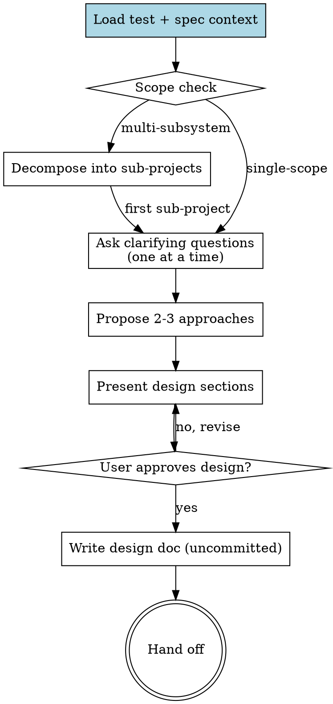

# Pandahrms Design Refinement

## Overview

Turn a rough idea into a fully formed design through collaborative dialogue. Load existing test + spec context first so the design respects current behavior contracts. Refine the idea one question at a time, propose 2-3 approaches with trade-offs, present the design in sections with approval, then save the design doc uncommitted for the user to review.

This skill is invoked by forge-pipeline-orchestrator in step 1, and can be invoked directly when refining a design outside the forge-pipeline-orchestrator pipeline.

**Announce at start:** "I'm using Pandahrms design-refinement to refine this into a spec."

<HARD-GATE>
Do NOT invoke any implementation skill, write any code, scaffold any project, or take any implementation action until you have presented a design and the user has approved it. This applies to EVERY project regardless of perceived simplicity.

Reads (Read, Grep, Glob) are permitted for context loading. Edits (Edit, Write, NotebookEdit) on any file other than the final design doc are forbidden until handoff. Do NOT create, write, or scaffold ANY file -- including the design doc itself, empty directories, stub modules, test files, or placeholder configs -- before user approval of all design sections. The first Write tool call permitted by this skill is the design doc Write call after the final section is approved.
</HARD-GATE>

<HARD-GATE>
LOAD TEST + SPEC CONTEXT BEFORE DESIGNING. Applies to every invocation -- features, bug fixes, refactors. Skipping this produces designs that ignore current behavior contracts and retrofit tests after the fact.

Run substeps 1-5 strictly sequentially. Do NOT issue Read/Grep/Glob calls for spec files until substep 2 (branch alignment) has completed and reported its outcome. Do NOT batch substeps 3 and 4 in parallel -- substep 4 may rely on substep 3's results.

1. **Identify the affected area** -- which modules, features, or files the change will touch. Ask the user if unclear.
2. **Align `pandahrms-spec` branch with the working project** -- before reading any spec, check that the `pandahrms-spec` repo is on the SAME branch as the current working project. See [Spec Branch Alignment](#spec-branch-alignment) for the exact procedure. Skip this substep ONLY if all of the following are true: (a) the working project's CLAUDE.md does not mention pandahrms-spec, (b) no directory named `pandahrms-spec` exists under the workspace root or any of its sibling directories, AND (c) the user, when asked, confirms the project is not part of the Pandahrms suite. If any check is uncertain, ask the user before skipping.
3. **Read related specs** -- every `.feature` file in `pandahrms-spec` for that area (use Grep/Glob). If none exist, note "no existing specs".
4. **Read related tests** -- every unit/integration test file in the affected codebase (`*.test.ts`, `*.spec.ts`, `*Tests.cs`, `*_test.go`, etc.). If none exist, note "no existing tests".
5. **Summarize and confirm** -- emit one short message: `"Loaded N spec scenarios and M test files for this area (pandahrms-spec on branch <name>). Key behaviors covered: [1-2 line summary]."` Then call AskUserQuestion with: `{ 'Scope is correct, refine the idea', 'Scope is wrong -- I will correct it', 'Add more files/specs to the load' }`. Proceed to refinement only on the first option. Free-text replies like "ok", "sure", "go on" do NOT count as confirmation -- restate the AskUserQuestion call instead.

Treat this skill as forge-pipeline-orchestrator-invoked if and only if forge-pipeline-orchestrator has announced "Step 1: Design" in the current conversation OR the prior assistant turn explicitly invoked this skill from a forge-pipeline-orchestrator step. Otherwise treat as standalone.

When forge-pipeline-orchestrator-invoked, the orchestrator may have already loaded this context -- still confirm by stating what was loaded (including the spec branch) before asking the first refinement question. When standalone, run substeps 1-5 in full.
</HARD-GATE>

## Spec Branch Alignment

Reading specs from the wrong branch produces designs that contradict in-flight spec changes -- e.g. you design against `main` while a teammate (or a previous session of yours) already updated specs on the feature branch. Always align `pandahrms-spec` to the working project's branch before reading.

### Procedure

All Read/Grep/Glob calls against `pandahrms-spec` are forbidden until step 6 (Announce the final state) of this procedure has executed. Run steps 1-6 sequentially; do NOT batch them with spec content reads.

1. **Locate `pandahrms-spec`** -- it is typically a sibling directory of the working project (e.g. `~/Developer/pandaworks/_pandahrms/pandahrms-spec`). Use `git rev-parse --show-toplevel` from the working project, then look for `pandahrms-spec` as a sibling under the parent. If not found, call AskUserQuestion with: `{ 'Path is <X>', 'No pandahrms-spec in this workspace -- skip alignment and treat as non-Pandahrms', 'Stop -- I will set this up first' }`. Do NOT proceed past step 6 until one of those options is chosen.
2. **Read the working project's branch** -- `git -C <project> rev-parse --abbrev-ref HEAD`.
3. **Read the spec repo's current branch** -- `git -C <spec-repo> rev-parse --abbrev-ref HEAD`.
4. **If they match** -- announce `"pandahrms-spec already on branch <name>."` and proceed to read specs.
5. **If they differ** -- check whether the working project's branch exists in `pandahrms-spec`:
   - **Branch exists locally in pandahrms-spec** (`git -C <spec-repo> show-ref --verify --quiet refs/heads/<name>`): check it out with `git -C <spec-repo> checkout <name>`. If pandahrms-spec has uncommitted changes that would block the checkout, STOP and surface them to the user -- do not stash or discard.
   - **Branch exists only on remote** (`git -C <spec-repo> ls-remote --exit-code --heads origin <name>` succeeds): fetch then checkout (`git -C <spec-repo> fetch origin <name>:<name> && git -C <spec-repo> checkout <name>`).
   - **Branch does not exist anywhere** -- this is normal for fresh feature work where specs haven't been touched yet. Announce: `"Working project on branch <name>; no matching branch in pandahrms-spec. Reading specs from <spec-current-branch> -- spec branch will be created later by spec-writing if needed."` and proceed. Do NOT auto-create the spec branch here -- creation belongs to the spec-writing step.
6. **Announce the final state** -- include the spec branch in the load summary so the user can verify (`"pandahrms-spec on <branch>"`).

### Edge cases

- **Working project branch is `main` or `master`** -- align spec to the same; this is the steady-state case.
- **Detached HEAD in pandahrms-spec** -- treat as a mismatch and ask the user how to proceed.
- **Working project has uncommitted spec-related work in pandahrms-spec already** -- if `git -C <spec-repo> status --porcelain` is non-empty, surface the changes to the user before any branch operation. The user may have in-progress spec edits that a checkout would lose.

## Anti-Pattern: "This Is Too Simple To Need A Design"

Every project goes through this process. A todo list, a single-function utility, a config change -- all of them. "Simple" projects are where unexamined assumptions cause the most wasted work. The design can be short (a few sentences for truly simple projects), but you MUST present it and get approval.

## Checklist

Create a task for each item and complete them in order.

1. **Load test + spec context** -- per the HARD-GATE above (or confirm forge-pipeline-orchestrator already did)
2. **Scope check** -- if the request describes multiple independent subsystems, decompose first; do not refine details of a project that needs to be split
3. **Ask clarifying questions** -- one at a time, multiple-choice preferred, focused on purpose / constraints / success criteria
4. **Propose 2-3 approaches** -- with trade-offs and your recommendation
5. **Present design** -- in sections scaled to complexity, get user approval after each section, covering spec impact / test impact / implementation
6. **Write design doc** -- save to `docs/pandahrms/designs/YYYY-MM-DD-<topic>-design.md`. Do NOT commit -- leave uncommitted for the user to review.
7. **Hand off** -- announce that design is complete; return control to forge-pipeline-orchestrator (or to whatever the user requests next). Do NOT invoke any downstream skill in the same turn. End the turn after the handoff message.

## Process Flow

## The Process

**Scope check first:**

- If the request describes multiple independent subsystems (e.g., "build a platform with chat, file storage, billing, and analytics"), flag this immediately. Don't spend questions refining details of a project that needs to be decomposed.
- For a project that's too large for a single design, help the user split into sub-projects: what are the independent pieces, how do they relate, what order should they be built? Then design the first sub-project through the normal flow. Each sub-project gets its own design → spec → plan → implementation cycle.

**Understanding the idea:**

- Use multiple-choice questions. Use open-ended questions ONLY when no exhaustive set of 2-5 discrete options exists for the decision (e.g. naming a thing, freeform constraint description). State the reason in one line when going open-ended.
- Focus on purpose, constraints, success criteria
- The design output MUST address, in this order: (a) **spec impact** -- which scenarios change/add/remove and why, (b) **test impact** -- which test files/cases change/add and what each new test will assert in failing-test-first framing, then (c) **implementation approach**

### Question Pacing

Ask exactly one question per AskUserQuestion call. The only exception is the explicit batching rule below (2-4 causally independent multiple-choice questions). Outside that exception, batching is forbidden.

**Use a single AskUserQuestion with multiple questions when ALL of these hold:**

- The questions are **causally independent** -- the answer to one does NOT change the framing or options of another. Example: "wizard placement" and "validation range" are independent; "approach A vs B vs C" and "should we add a cache?" are NOT independent (cache only matters under approach B).
- Each question has clear, exhaustive multiple-choice options.
- The total number of questions in the batch is **2-4**. Never batch 5+ -- that's a design that hasn't been refined enough yet.

**Always ask one at a time when:**

- The next question's framing depends on the previous answer.
- The question is open-ended (no good multiple-choice options exist).
- You're in section-approval mode (presenting a design section -- one approval at a time).
- Approach selection (2-3 approaches with trade-offs) -- this gets its own dedicated AskUserQuestion since it shapes everything downstream.

**Section approval gates** for `lightweight` Scope Profile (set after Step 1 in atlas-pipeline-orchestrator/forge-pipeline-orchestrator): a single end-of-section approval is enough; do not gate per-section. For `standard` or `heavyweight`, keep the per-section approval flow. If invoked standalone (not from atlas-pipeline-orchestrator/forge-pipeline-orchestrator), no Scope Profile exists -- treat the design as `standard` and gate per-section. Lightweight gating applies ONLY when atlas-pipeline-orchestrator/forge-pipeline-orchestrator has set Scope Profile = lightweight in the conversation; do not infer lightweight from project size or vibe.

**Exploring approaches:**

- Propose 2-3 different approaches with trade-offs
- Present options conversationally with your recommendation and reasoning
- Lead with your recommended option and explain why
- If the user rejects all proposed approaches, ask one clarifying question about the constraint that ruled them out, then propose 2-3 new approaches incorporating that constraint. Repeat at most twice. After the third rejection, stop and ask the user to describe the desired approach in their own words.

**Presenting the design:**

- Begin design presentation only after: (a) scope check is complete, (b) clarifying questions have answered every Unknown listed during the question round, and (c) the chosen approach from the 2-3 proposals is selected by the user. If any of those are still open, ask the next blocking question instead.
- Each section: 2-6 sentences by default. Expand to a maximum of 300 words ONLY if the section contains: more than one architectural component, a non-obvious trade-off, OR an externally-visible API contract. State which of those triggered the expansion in one line.
- After each section, call AskUserQuestion with a single multiple-choice question: `{ 'Approve this section', 'Revise -- I will tell you what to change', 'Stop -- rethink approach' }`. Treat anything other than the first option as not-approved and act accordingly.
- Present sections in this exact order: (1) Spec impact, (2) Test impact, (3) Architecture, (4) Components, (5) Data flow, (6) Error handling, (7) Testing approach. Skip a section only when it does not apply, and state the skip reason in one line. Do NOT reorder.
- If a later section reveals that an earlier section's assumption is wrong, return to the earlier section, mark it "Revising", restate the change, and re-request approval before continuing.
- Do NOT call the Write tool on the design doc path until every section has received an explicit "Approve this section" answer. If section approvals are still pending, the design doc MUST NOT exist on disk.

**Design for isolation and clarity:**

- Break the system into smaller units that each have one clear purpose, communicate through well-defined interfaces, and can be understood and tested independently
- For each unit, you should be able to answer: what does it do, how do you use it, what does it depend on?
- **Boundary test** -- for each proposed unit, check both directions: (a) can a caller use this unit without reading its internals? (b) can the unit's internals change without breaking its consumers? If either answer is no, the boundary or interface needs revision before the design is approved.
- Smaller, well-bounded units are easier to reason about and produce more reliable edits

**Working in existing codebases:**

- Explore the current structure before proposing changes; follow existing patterns
- Include a refactor in the design ONLY when one of the following is true: (a) a file you must edit exceeds 500 lines, (b) the function you must edit has more than one responsibility that the new behavior would compound, (c) an interface boundary you must change is unclear and would force the new code to leak details. List the trigger reason next to each refactor item.
- Don't propose unrelated refactoring -- stay focused on what serves the current goal

## After the Design

**Documentation:**

- Write the validated design to `docs/pandahrms/designs/YYYY-MM-DD-<topic>-design.md`
  - User preferences for design location override this default
- Invoke the `elements-of-style:writing-clearly-and-concisely` skill via the Skill tool. If the Skill tool returns "unknown skill", proceed without it and note `"elements-of-style skill unavailable; wrote design doc unaided"` in the handoff message.
- **Do NOT commit the design doc** -- it stays uncommitted so the user can review before specs/plans build on it

**Self-review (fresh eyes, before handoff):**

Run the four checks in this exact sequence, one full pass per check. After each pass, re-read the file before starting the next pass. Do NOT collapse the passes into one read.

1. **Placeholder scan** -- any "TBD", "TODO", incomplete sections, or vague requirements? Replace with the chosen value.
2. **Internal consistency** -- do any sections contradict each other? Does the architecture match the feature descriptions? Reconcile.
3. **Scope drift** -- does the doc include anything beyond the approved design (features the user didn't sign off on, speculative extensions, unrelated refactors)? Remove it.
4. **Ambiguity** -- could any requirement be interpreted two ways? Pick one and make it explicit.

Self-review is exactly the four ordered passes above. Apply all fixes during each pass via Edit calls. Do NOT loop back to pass 1 after pass 4. Do NOT re-read the file after pass 4. The user reviews the file later; this pass catches the obvious gaps before they propagate to specs and plans.

**Hand off:**

- When invoked from forge-pipeline-orchestrator, return to forge-pipeline-orchestrator's checklist (forge-pipeline-orchestrator will route to spec-writing next)
- When invoked standalone, announce: "Design complete and saved to `<path>`. Ready to write specs or move to planning when you are."
- Do NOT invoke spec-writing, plan-writing, execute-plan, or any other downstream skill in the same turn as the handoff. Emit only the handoff announcement and stop. The next skill is invoked by forge-pipeline-orchestrator or by an explicit user message.
- After emitting the handoff message, the assistant turn MUST end. Do NOT add follow-up analysis, do NOT call any further tool, do NOT pre-empt the next skill. The handoff message is the LAST content of the turn.

## Key Principles

- **One question per AskUserQuestion call** -- batch 2-4 only when questions are causally independent and multiple-choice (see [Question Pacing](#question-pacing))
- **Multiple choice required** -- open-ended only when no exhaustive 2-5 option set exists
- **YAGNI ruthlessly** -- remove unnecessary features from all designs
- **Explore alternatives** -- always propose 2-3 approaches before settling
- **Incremental validation** -- present design in sections, get approval after each via the structured AskUserQuestion call
- **Approval requires a structured selection** -- approval requires an explicit "Approve this section" selection from the AskUserQuestion call. Free-text replies like "ok", "sure", "go on", "next" do NOT count as approval. If the user replies that way, restate the approval question via AskUserQuestion.
- **Spec + test impact first** -- the design must address what specs and tests change before describing implementation
- **No commits** -- the design doc stays uncommitted until the user reviews

## Red Flags

| Thought | Reality |
|---------|---------|
| "I'll batch a 5+ question survey to be efficient" | Cap at 2-4 batched questions, and only when they're causally independent and have clear multiple-choice options. 5+ means the design isn't refined enough yet -- ask the most-blocking question first and let the answer narrow the rest. |
| "These two questions feel related, but I'll batch them anyway to save a round-trip" | If the second question's framing depends on the first's answer, ask sequentially. Batching dependent questions produces shallow or contradictory answers. |
| "I'll skip reading existing specs/tests" | Required. Designs without that grounding miss compatibility issues. |
| "pandahrms-spec is on main but the project is on a feature branch -- close enough" | No. Align the spec repo to the project's branch BEFORE reading specs. Reading from the wrong branch hides in-flight spec edits and produces designs that contradict them. See [Spec Branch Alignment](#spec-branch-alignment). |
| "It's a bug fix, no need to discuss tests upfront" | Bug fixes especially need a failing test that would have caught the bug. The design proposes that test before the fix. |
| "I'll auto-commit the design doc when I save it" | Never. The design doc stays uncommitted for user review. |
| "This is too small for a design" | Every project. The design can be a few sentences, but it must be presented and approved. |
| "I'll propose one approach since it's obviously right" | Always 2-3 approaches with trade-offs. The "obvious" one is often wrong on rereading. |
| "I'll jump to implementation since the user described what they want" | HARD-GATE. No implementation action until a design is presented and approved. |
| "I'll offer a visual companion in case it's useful" | Not in this skill. Visual companion is a superpowers feature, dropped here for round-trip efficiency. |
| "I'll re-ask the user to review the saved spec" | No. Forge-pipeline-orchestrator step 5 (Plan ↔ Spec cross-review) covers that. Don't add a redundant gate here. |

## Forbidden Outputs

This skill MUST NOT produce, write, or stage any of the following:

- Source code files (`.cs`, `.ts`, `.tsx`, `.py`, `.go`, etc.)
- Test files
- EF migration files
- Spec / `.feature` files (those belong to spec-writing)
- Implementation plan files (those belong to plan-writing)
- Git commits or stashes
- Code blocks longer than 20 lines inside the design doc (use prose + interface signatures instead)

## When to Use

- Any development work in a Pandahrms project that needs design before code
- Features, bug fixes, refactors, behavioral changes
- Invoked by forge-pipeline-orchestrator (most common path) or directly by the user

## When NOT to Use

- Quick fixes that don't need brainstorming (typos, config changes)
- Pure spec writing for existing functionality (use `pandahrms:spec-writing` directly)
- Plan execution (use `pandahrms:execute-plan` -- planned, not yet built)
- Non-Pandahrms projects (use `superpowers:brainstorming` directly)
