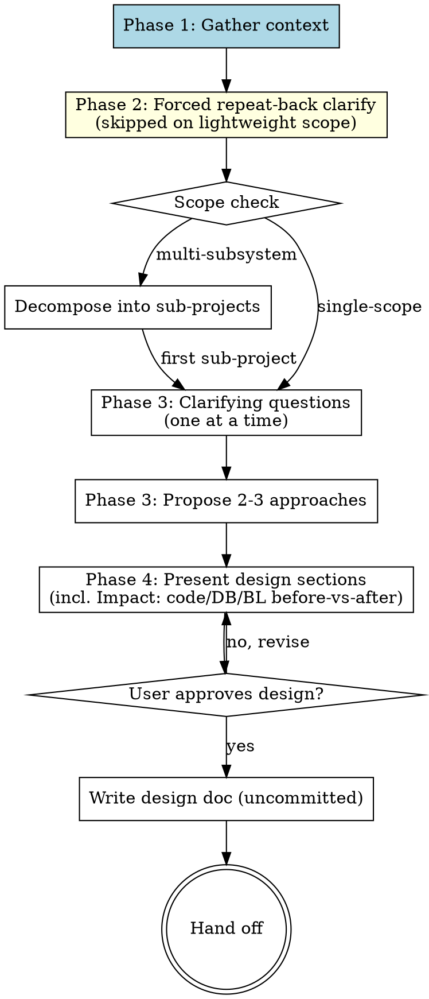

# Pandahrms Design Refinement

<HARD-GATE>
This skill runs ONLY when invoked from atlas-pipeline-orchestrator (atlas Step 1 design, or atlas Step 9 follow-up loop-back to design). Before ANY other action -- including the pre-flight, gather phase, or even the start announcement -- verify the invocation context.

Treat as atlas-invoked if and only if ONE of:
- atlas-pipeline-orchestrator has emitted its start announcement ("I'm using Pandahrms atlas-pipeline-orchestrator to drive design through commit.") earlier in the current conversation, AND the conversation has not since terminated atlas (no "Atlas complete -- N commit(s) created..." line), OR
- The prior assistant turn explicitly invoked this skill from an atlas step via the Skill tool.

If neither holds, STOP immediately. Emit verbatim: `"design-refinement runs inside atlas-pipeline-orchestrator. Run /atlas-pipeline-orchestrator instead -- atlas will invoke this skill at Step 1 (design) when needed."` Do NOT proceed to the pre-flight or any other action.
</HARD-GATE>

## Overview

Turn a rough idea into a fully formed design through a four-phase flow:

1. **Gather** -- load existing spec, test, and code context so the design respects current behavior contracts.
2. **Forced repeat-back clarify** -- after context is loaded, repeat the user's intent in B2 English and ask the user to confirm or correct. Always runs on `standard` and `heavyweight` Scope Profile; skipped on `lightweight`.
3. **Brainstorm** -- propose 2-3 approaches with trade-offs and let the user pick.
4. **Impact section** -- list before/after for code paths, DB schema/migrations, and business logic / business rules so the user understands what changes. Also fold coverage thinking (spec scenarios the design implies but does not yet write) into this section.

Save the design doc uncommitted and hand back to atlas.

**Announce at start:** "I'm using Pandahrms design-refinement to refine this into a spec."

## Mid-Refinement Fresh Directives

Atlas has already optimised the prompt before invoking this skill, so design-refinement does not run optimise-prompt itself. But user messages received between design phases still need classifying.

Every user message received between phases MUST be classified per the [Follow-up Directives](../optimise-prompt/SKILL.md#follow-up-directives) section of optimise-prompt. Continuation replies to refinement questions, control acks, and small refinements ("the cap is 50 not 100") are absorbed by the current phase. Fresh directives (new top-level feature, scope expansion to a different module, "redo the design with X approach instead") MUST pause the current phase and re-invoke `pandahrms:optimise-prompt` before refinement acts on them.

<HARD-GATE>
Do NOT invoke any implementation skill, write any code, scaffold any project, or take any implementation action until you have presented a design and the user has approved it. This applies to EVERY project regardless of perceived simplicity.

Reads (Read, Grep, Glob) are permitted for context loading in Phase 1 (Gather). Edits (Edit, Write, NotebookEdit) on any file other than the final design doc are forbidden until handoff. Do NOT create, write, or scaffold ANY file -- including the design doc itself, empty directories, stub modules, test files, or placeholder configs -- before user approval of all design phases. The first Write tool call permitted by this skill is the design doc Write call after the final phase is approved.
</HARD-GATE>

<HARD-GATE>
PHASE 1 (GATHER) IS MANDATORY. Applies to every invocation -- features, bug fixes, refactors. Skipping this produces designs that ignore current behavior contracts and retrofit tests after the fact.

Run substeps 1-5 strictly sequentially. Do NOT issue Read/Grep/Glob calls for spec files until substep 2 (branch alignment) has completed and reported its outcome. Do NOT batch substeps 3 and 4 in parallel -- substep 4 may rely on substep 3's results.

1. **Identify the affected area** -- which modules, features, or files the change will touch. Ask the user if unclear.
2. **Align `pandahrms-spec` branch with the working project** -- before reading any spec, check that the `pandahrms-spec` repo is on the SAME branch as the current working project. See [Spec Branch Alignment](#spec-branch-alignment) for the exact procedure. Skip this substep ONLY if all of the following are true: (a) the working project's CLAUDE.md does not mention pandahrms-spec, (b) no directory named `pandahrms-spec` exists under the workspace root or any of its sibling directories, AND (c) the user, when asked, confirms the project is not part of the Pandahrms suite. If any check is uncertain, ask the user before skipping.
3. **Read related specs** -- every `.feature` file in `pandahrms-spec` for that area (use Grep/Glob). If none exist, note "no existing specs".
4. **Read related tests** -- every unit/integration test file in the affected codebase (`*.test.ts`, `*.spec.ts`, `*Tests.cs`, `*_test.go`, etc.). If none exist, note "no existing tests".
5. **Read related code** -- every production source file directly relevant to the request (handler, service, validator, route, component, repository). Use Grep to locate by symbol name and Read the matches. If the area is greenfield, note "no existing code".
6. **Summarize and confirm scope** -- emit one short message: `"Loaded N spec scenarios, M test files, and K code files for this area (pandahrms-spec on branch <name>). Key behaviors covered: [1-2 line summary]."` Then call AskUserQuestion with: `{ 'Scope is correct, proceed to clarify', 'Scope is wrong -- I will correct it', 'Add more files/specs to the load' }`. Proceed to Phase 2 only on the first option. Free-text replies like "ok", "sure", "go on" do NOT count as confirmation -- restate the AskUserQuestion call instead.

Run substeps 1-6 in full. atlas may have surfaced area hints earlier in the conversation, but design-refinement still owns the gather pass -- the early HARD-GATE guarantees this skill is atlas-invoked, so confirm by stating what was loaded (including the spec branch) before asking the first refinement question.
</HARD-GATE>

## Spec Branch Alignment

Reading specs from the wrong branch produces designs that contradict in-flight spec changes -- e.g. you design against `main` while a teammate (or a previous session of yours) already updated specs on the feature branch. Always align `pandahrms-spec` to the working project's branch before reading.

### Procedure

All Read/Grep/Glob calls against `pandahrms-spec` are forbidden until step 6 (Announce the final state) of this procedure has executed. Run steps 1-6 sequentially; do NOT batch them with spec content reads.

1. **Locate `pandahrms-spec`** -- it is typically a sibling directory of the working project (e.g. `~/Developer/pandaworks/_pandahrms/pandahrms-spec`). Use `git rev-parse --show-toplevel` from the working project, then look for `pandahrms-spec` as a sibling under the parent. If not found, call AskUserQuestion with: `{ 'Path is <X>', 'No pandahrms-spec in this workspace -- skip alignment and treat as non-Pandahrms', 'Stop -- I will set this up first' }`. Do NOT proceed past step 6 until one of those options is chosen.
2. **Read the working project's branch** -- `git -C <project> rev-parse --abbrev-ref HEAD`.
3. **Read the spec repo's current branch** -- `git -C <spec-repo> rev-parse --abbrev-ref HEAD`.
4. **If they match** -- announce `"pandahrms-spec already on branch <name>."` and proceed to read specs.
5. **If they differ** -- check whether the working project's branch exists in `pandahrms-spec`:
   - **Branch exists locally in pandahrms-spec** (`git -C <spec-repo> show-ref --verify --quiet refs/heads/<name>`): check it out with `git -C <spec-repo> checkout <name>`. If pandahrms-spec has uncommitted changes that would block the checkout, STOP and surface them to the user -- do not stash or discard.
   - **Branch exists only on remote** (`git -C <spec-repo> ls-remote --exit-code --heads origin <name>` succeeds): fetch then checkout (`git -C <spec-repo> fetch origin <name>:<name> && git -C <spec-repo> checkout <name>`).
   - **Branch does not exist anywhere** -- this is normal for fresh feature work where specs haven't been touched yet. Announce: `"Working project on branch <name>; no matching branch in pandahrms-spec. Reading specs from <spec-current-branch> -- spec branch will be created later by spec-writing if needed."` and proceed. Do NOT auto-create the spec branch here -- creation belongs to the spec-writing step.
6. **Announce the final state** -- include the spec branch in the load summary so the user can verify (`"pandahrms-spec on <branch>"`).

### Edge cases

- **Working project branch is `main` or `master`** -- align spec to the same; this is the steady-state case.
- **Detached HEAD in pandahrms-spec** -- treat as a mismatch and ask the user how to proceed.
- **Working project has uncommitted spec-related work in pandahrms-spec already** -- if `git -C <spec-repo> status --porcelain` is non-empty, surface the changes to the user before any branch operation. The user may have in-progress spec edits that a checkout would lose.

## Anti-Pattern: "This Is Too Simple To Need A Design"

Every project goes through this process. A todo list, a single-function utility, a config change -- all of them. "Simple" projects are where unexamined assumptions cause the most wasted work. The design can be short (a few sentences for truly simple projects), but you MUST present it and get approval.

## Checklist

Create a task for each item and complete them in order.

1. **Phase 1 -- Gather context** -- per the HARD-GATE above. Output: a short summary of N spec scenarios, M test files, K code files loaded.
2. **Phase 2 -- Forced repeat-back clarify** -- after context is loaded, repeat the user's intent in B2 English and confirm via AskUserQuestion. See [Forced Repeat-Back Clarify](#forced-repeat-back-clarify) for the exact procedure and skip rule.
3. **Scope check** -- if the request describes multiple independent subsystems, decompose first; do not refine details of a project that needs to be split.
4. **Phase 3 -- Ask clarifying questions** -- one at a time by default; batched into a single AskUserQuestion when 2-4 are causally independent and multiple-choice. Focused on purpose / constraints / success criteria.
5. **Phase 3 -- Propose 2-3 approaches** -- with trade-offs and your recommendation. Let the user pick one.
6. **Phase 4 -- Present design** -- in sections scaled to complexity. Each section covered below. The **impact section** is required and MUST include code/DB/BL before-vs-after plus coverage thinking.
7. **Write design doc** -- save to `docs/pandahrms/designs/YYYY-MM-DD-<topic>-design.md`. Do NOT commit -- leave uncommitted for the user to review.
8. **Hand off** -- announce that design is complete and return control to atlas. Do NOT invoke any downstream skill in the same turn. End the turn after the handoff message.

## Process Flow



## Forced Repeat-Back Clarify

After Phase 1 (gather) completes, before any other refinement question, repeat the user's intent back in B2 English and confirm.

### When to run

- **Always** run when no Scope Profile is yet set in conversation context (atlas classifies Scope Profile AFTER Step 1 approval, so this is the normal first-invocation state).
- **Always** run when `Scope Profile: standard` or `Scope Profile: heavyweight` is set.
- **Skip** when `Scope Profile: lightweight` is set. Announce: `"Skipping forced repeat-back -- lightweight scope, original intent is clear."`

On re-entry from atlas Step 9 (follow-up loop), Scope Profile is already locked in conversation context; honor it.

### Procedure

1. Read the user's original request (the prompt, plus any clarification turns from the gather phase).
2. Re-state the intent as one short paragraph in B2 English. State what is in scope, what is out of scope, and the success criteria implied by the request. Use everyday vocabulary; pick one idea per sentence.
3. Call AskUserQuestion: `"I want to confirm I understood. Here's what I'm planning to design: [paragraph]. Is this correct?"` with canonical options:
   - `"Yes -- proceed"`
   - `"No, I will clarify more"`

4. **On `"Yes -- proceed"`** -- proceed to Phase 3 (clarifying questions).
5. **On `"No, I will clarify more"`** -- wait for the user's clarification. Fold it into the intent and re-state once more, then ask the same question. Do not loop more than 3 times -- on the 3rd loop, switch to one-question-at-a-time clarification mode and let the user steer. If the clarification implies a different feature area (not just a refinement), re-run Phase 1 gather before the next re-state.

### Why it exists

The forced repeat-back catches divergence between the optimise-prompt pre-flight (which only saw the raw prompt) and the now-loaded context (which reveals what the area actually looks like). On `standard` or `heavyweight` scope, the cost of one extra prompt is far smaller than discovering 30 minutes into design that the user meant something different.

## The Process

**Scope check first:**

- If the request describes multiple independent subsystems (e.g., "build a platform with chat, file storage, billing, and analytics"), flag this immediately. Don't spend questions refining details of a project that needs to be decomposed.
- For a project that's too large for a single design, help the user split into sub-projects: what are the independent pieces, how do they relate, what order should they be built? Then design the first sub-project through the normal flow. Each sub-project gets its own design -> spec -> plan -> implementation cycle.

**Understanding the idea:**

- Use multiple-choice questions. Use open-ended questions ONLY when no exhaustive set of 2-5 discrete options exists for the decision (e.g. naming a thing, freeform constraint description). State the reason in one line when going open-ended.
- Focus on purpose, constraints, success criteria.
- The design output MUST address, in this order: (a) **spec impact** -- which scenarios change/add/remove and why, (b) **test impact** -- which test files/cases change/add and what each new test will assert in failing-test-first framing, (c) **implementation approach**, (d) **impact section** -- before/after for code paths, DB schema, business logic, plus coverage thinking. See [Impact Section](#impact-section) for the required format.

### Question Pacing

Ask exactly one question per AskUserQuestion call. The only exception is the explicit batching rule below (2-4 causally independent multiple-choice questions). Outside that exception, batching is forbidden.

**Use a single AskUserQuestion with multiple questions when ALL of these hold:**

- The questions are **causally independent** -- the answer to one does NOT change the framing or options of another. Example: "wizard placement" and "validation range" are independent; "approach A vs B vs C" and "should we add a cache?" are NOT independent (cache only matters under approach B).
- Each question has clear, exhaustive multiple-choice options.
- The total number of questions in the batch is **2-4**. Never batch 5+ -- that's a design that hasn't been refined enough yet.

**Always ask one at a time when:**

- The next question's framing depends on the previous answer.
- The question is open-ended (no good multiple-choice options exist).
- You're in section-approval mode (presenting a design section -- one approval at a time).
- Approach selection (2-3 approaches with trade-offs) -- this gets its own dedicated AskUserQuestion since it shapes everything downstream.

**Section approval gates** scale to Scope Profile. Atlas classifies AFTER Step 1 approval, so the first-ever Step 1 run (before classification) follows the `standard` 3-gate flow. Scope Profile applies from the next design or atlas Step 9 follow-up.

| Scope Profile | Gate count | What each gate covers | Approval option label |
|---------------|------------|----------------------|-----------------------|
| `lightweight` | 1 end-of-design gate | All 8 sections presented in order, then a single approval for the whole design | `"Approve this design"` |
| `standard` | 3 grouped gates | Direction (sections 1-3: Spec impact + Test impact + Architecture); Detail (sections 4-6: Components + Data flow + Error handling); Impact (sections 7-8: Testing approach + Impact section) | `"Approve this direction"` / `"Approve this detail"` / `"Approve this impact"` |
| `heavyweight` | 8 per-section gates | One approval after each of the 8 sections in the standard order | `"Approve this section"` |

Within a gate, sections still present in order. The approval question fires once per gate, not once per section, with the option label from the table above. The other two options stay the same across all tiers: `"Revise -- I will tell you what to change"`, `"Stop -- rethink approach"`. Tier gating applies ONLY when the named Scope Profile is explicitly set in conversation context; do not infer scope from project size or vibe.

Revisions still scope to the originating section. If a later gate reveals an earlier-section flaw, return to that section, mark it `Revising`, restate the change, then re-request approval for the current gate (which now includes the revised section).

**Exploring approaches:**

- Propose 2-3 different approaches with trade-offs.
- If you have identified 4+ viable approaches, do NOT present them all. Pick the 3 with the widest trade-off spread (e.g. simplest-but-limited / balanced / most-flexible-but-costly) and mention the pruned alternatives in one line so the user can pull one back if they care: `"Also considered: X (similar to A but with Y), Z (variant of B). Skipping unless you'd rather discuss them."`
- If you have identified exactly 1 approach, do NOT force a second one for the sake of the rule -- announce: `"Only one viable approach surfaced: [name]. Proceeding without alternatives."` and continue. Inventing weak alternatives wastes user time and contaminates the trade-off discussion.
- Present options conversationally with your recommendation and reasoning.
- Lead with your recommended option and explain why.
- If the user rejects all proposed approaches, ask one clarifying question about the constraint that ruled them out, then propose 2-3 new approaches incorporating that constraint. Repeat at most twice. After the third rejection, stop and ask the user to describe the desired approach in their own words.

**Presenting the design:**

- Begin design presentation only after: (a) Phase 1 (gather) is complete, (b) Phase 2 (forced repeat-back, when applicable) is confirmed, (c) scope check is complete, (d) clarifying questions have answered every Unknown listed during the question round, (e) the chosen approach from the 2-3 proposals is selected by the user. If any of those are still open, ask the next blocking question instead.
- Each section: 2-6 sentences by default. Expand to a maximum of 300 words ONLY if the section contains: more than one architectural component, a non-obvious trade-off, OR an externally-visible API contract. State which of those triggered the expansion in one line.
- After each approval gate (gate boundaries depend on Scope Profile -- see **Section approval gates** above in Question Pacing), call AskUserQuestion with a single multiple-choice question: `{ <tier-specific Approve label>, 'Revise -- I will tell you what to change', 'Stop -- rethink approach' }`. Treat anything other than the first option as not-approved and act accordingly.
- Present sections in this exact order: (1) Spec impact, (2) Test impact, (3) Architecture, (4) Components, (5) Data flow, (6) Error handling, (7) Testing approach, (8) **Impact section** (code/DB/BL before-vs-after + coverage). Skip a section only when it does not apply, and state the skip reason in one line. Do NOT reorder.
- If a later section reveals that an earlier section's assumption is wrong, return to the earlier section, mark it "Revising", restate the change, and re-request approval before continuing.
- Do NOT call the Write tool on the design doc path until every section has received an explicit "Approve this section" answer. If section approvals are still pending, the design doc MUST NOT exist on disk.

**Design for isolation and clarity:**

- Break the system into smaller units that each have one clear purpose, communicate through well-defined interfaces, and can be understood and tested independently.
- For each unit, you should be able to answer: what does it do, how do you use it, what does it depend on?
- **Boundary test** -- for each proposed unit, check both directions: (a) can a caller use this unit without reading its internals? (b) can the unit's internals change without breaking its consumers? If either answer is no, the boundary or interface needs revision before the design is approved.
- Smaller, well-bounded units are easier to reason about and produce more reliable edits.

**Working in existing codebases:**

- Explore the current structure before proposing changes; follow existing patterns.
- Include a refactor in the design ONLY when one of the following is true: (a) a file you must edit exceeds 500 lines, (b) the function you must edit has more than one responsibility that the new behavior would compound, (c) an interface boundary you must change is unclear and would force the new code to leak details. List the trigger reason next to each refactor item.
- Don't propose unrelated refactoring -- stay focused on what serves the current goal.

## Impact Section

The impact section is the final mandatory section of every design. It exists so the user can see exactly what changes before approving, instead of inferring impact from architecture diagrams.

### Required structure

The impact section MUST contain these four sub-blocks, in this order. Use a table for each block. Skip a block only when it genuinely does not apply (e.g. no DB change at all) and state the skip reason in one line.

**1. Code paths -- before vs after**

For each affected code path or module, one row:

```
| Code path | Before | After |
|-----------|--------|-------|
| handlers/CreateOrderHandler | validates qty 1-100 | validates qty 1-50 |
| services/InventoryService.Reserve | reserves on success | reserves and emits InventoryReserved event |
```

**2. Database -- schema and migration**

If the change touches DB schema (tables, columns, indexes, constraints, EF mapping):

```
| Object | Before | After | Migration impact |
|--------|--------|-------|------------------|
| orders.status | nvarchar(20) NOT NULL | nvarchar(50) NOT NULL | ALTER COLUMN (online) |
| orders_audit | (new) | new audit table | CREATE TABLE + backfill 0 rows |
```

If no DB change: write one line `"No DB changes."` and skip the table.

**3. Business logic / business rules -- before vs after**

This is the most important block. Capture every rule change in user-facing language so the user can sanity-check the business impact.

```
| Rule | Before | After |
|------|--------|-------|
| Order quantity limit | 1-100 per line | 1-50 per line (reduces fraud exposure) |
| Refund window | 30 days from purchase | 14 days from purchase OR 7 days from delivery (whichever is later) |
| Manager approval for refund | required above $500 | required above $200 |
```

If no business rule change (pure refactor, internal helper): write one line `"No business rule changes."` and skip the table.

**4. Coverage thinking**

List any spec scenarios this design implies but does not yet write. spec-writing downstream picks these up.

```
| Implied scenario | Why it matters | Tag |
|------------------|----------------|-----|
| User submits qty=51 -> validation error "must be 1-50" | enforces new limit | validation |
| Manager rejects refund > $200 -> request stays in pending state | enforces new approval rule | permission |
| Refund requested 15 days after purchase, 8 days after delivery -> rejected | enforces refund-window OR clause | boundary |
```

Also list unhappy paths, boundary conditions, concurrency edge cases, permission edge cases, data-state edge cases, and implicit requirements (audit logging, notifications, cascades) the design assumes but does not explicitly state. These become spec scenarios downstream.

### Why this section is mandatory

Downstream spec-vs-code audits compare the implemented code against the spec. If the impact section is missing or vague, the audit cannot tell whether a deviation is a bug or an undocumented intentional change. Writing the impact section now -- when the user is still in the loop -- prevents irreconcilable conflicts later.

## After the Design

**Documentation:**

- Write the validated design to `docs/pandahrms/designs/YYYY-MM-DD-<topic>-design.md`.
  - User preferences for design location override this default.
- **Do NOT commit the design doc** -- it stays uncommitted so the user can review before specs/plans build on it.

**Self-review (fresh eyes, before handoff):**

Run the four checks in this exact sequence, one full pass per check. After each pass, re-read the file before starting the next pass. Do NOT collapse the passes into one read.

1. **Placeholder scan** -- any "TBD", "TODO", incomplete sections, or vague requirements? Replace with the chosen value.
2. **Internal consistency** -- do any sections contradict each other? Does the architecture match the feature descriptions? Reconcile.
3. **Scope drift** -- does the doc include anything beyond the approved design (features the user didn't sign off on, speculative extensions, unrelated refactors)? Remove it.
4. **Ambiguity** -- could any requirement be interpreted two ways? Pick one and make it explicit.

Self-review is exactly the four ordered passes above. Apply all fixes during each pass via Edit calls. Do NOT loop back to pass 1 after pass 4. Do NOT re-read the file after pass 4. The user reviews the file later; this pass catches the obvious gaps before they propagate to specs and plans.

After self-review, hand off per Phase 8 of the [Checklist](#checklist) using this exact announcement: `"Design complete and saved to <path>."`

## Key Principles

- **Four phases in order** -- gather -> forced repeat-back (when applicable) -> brainstorm -> impact section. Each phase has its own approval gate where applicable.
- **One question per AskUserQuestion call** -- batch 2-4 only when questions are causally independent and multiple-choice (see [Question Pacing](#question-pacing)).
- **Multiple choice required** -- open-ended only when no exhaustive 2-5 option set exists.
- **YAGNI ruthlessly** -- remove unnecessary features from all designs.
- **Explore alternatives** -- always propose 2-3 approaches before settling.
- **Incremental validation** -- present design in sections, then call AskUserQuestion at every approval gate per Scope Profile (lightweight: 1 end-of-design gate; standard: 3 grouped gates; heavyweight: 8 per-section gates).
- **Approval requires a structured selection** -- approval requires an explicit selection of the tier-specific Approve option (`"Approve this design"` / `"Approve this direction"` / `"Approve this detail"` / `"Approve this impact"` / `"Approve this section"`) from the AskUserQuestion call. Free-text replies like "ok", "sure", "go on", "next" do NOT count as approval. If the user replies that way, restate the approval question via AskUserQuestion.
- **Impact section is mandatory** -- the design must show code/DB/BL before-vs-after plus coverage thinking. This is what spec-writing uses to draft scenarios downstream.
- **No commits** -- the design doc stays uncommitted until the user reviews.

## Red Flags

| Thought | Reality |
|---------|---------|
| "I'll skip Phase 1 (gather) since the user already described the change" | Required. Phase 1 (gather) is a HARD-GATE. Designs without that grounding miss compatibility issues with existing specs/tests/code. |
| "Phase 2 (forced repeat-back) feels redundant when the prompt is clear" | Default behavior is to ALWAYS run it on `standard` and `heavyweight` scope. Only `Scope Profile: lightweight` skips it. The cost of one extra prompt is far smaller than discovering wrong intent 30 minutes into design. |
| "I'll batch a 5+ question survey to be efficient" | Cap at 2-4 batched questions, and only when they're causally independent and have clear multiple-choice options. 5+ means the design isn't refined enough yet -- ask the most-blocking question first and let the answer narrow the rest. |
| "These two questions feel related, but I'll batch them anyway to save a round-trip" | If the second question's framing depends on the first's answer, ask sequentially. Batching dependent questions produces shallow or contradictory answers. |
| "pandahrms-spec is on main but the project is on a feature branch -- close enough" | No. Align the spec repo to the project's branch BEFORE reading specs. Reading from the wrong branch hides in-flight spec edits and produces designs that contradict them. See [Spec Branch Alignment](#spec-branch-alignment). |
| "It's a bug fix, no need to discuss tests upfront" | Bug fixes especially need a failing test that would have caught the bug. The design proposes that test before the fix. |
| "I'll auto-commit the design doc when I save it" | Never. The design doc stays uncommitted for user review. |
| "I'll propose one approach since it's obviously right -- skip the 2-3 rule" | Default is 2-3 approaches with trade-offs. If exactly one viable approach truly surfaces, announce `"Only one viable approach surfaced: [name]. Proceeding without alternatives."` and continue. But do NOT shortcut here just because one feels "obvious" -- the obvious option is often wrong on rereading. |
| "I'll jump to implementation since the user described what they want" | HARD-GATE. No implementation action until a design is presented and approved. |
| "I'll re-ask the user to review the saved spec" | No. Atlas Step 5 (Spec <-> Code audit) handles post-execute validation. Don't add a redundant gate here. |
| "I'll skip the impact section -- the architecture section already covers it" | No. The impact section captures before/after for code/DB/BL and lists coverage scenarios. Architecture describes structure; impact describes change. Both are required. |
| "Pure refactor -- I'll write 'no impact' for the whole impact section" | No. Refactors still have a code paths block (which functions changed signature, which internal types moved). They may legitimately have empty DB and BL blocks (state that explicitly). Coverage thinking still lists test scenarios that protect against regressions. |

## Forbidden Outputs

This skill MUST NOT produce, write, or stage any of the following:

- Source code files (`.cs`, `.ts`, `.tsx`, `.py`, `.go`, etc.)
- Test files
- EF migration files
- Spec / `.feature` files (those belong to spec-writing)
- Implementation plan files (those belong to plan-writing)
- Git commits or stashes
- Code blocks longer than 20 lines inside the design doc (use prose + interface signatures instead)

## When to Use

- Only when atlas-pipeline-orchestrator invokes this skill at Step 1 (initial design) or Step 9 (follow-up loop-back to design after scope-change feedback).
- Direct user invocation (e.g. `/design-refinement`) is rejected by the HARD-GATE at the top of this file.

## When NOT to Use

- Outside atlas. Direct invocation STOPs with a message redirecting the user to run /atlas-pipeline-orchestrator.
- Quick fixes that don't need brainstorming (typos, config changes) -- handle directly without atlas at all.
- Pure spec writing for existing functionality (use `pandahrms:spec-writing` directly).
- Plan execution (use `pandahrms:execute-plan` directly).
