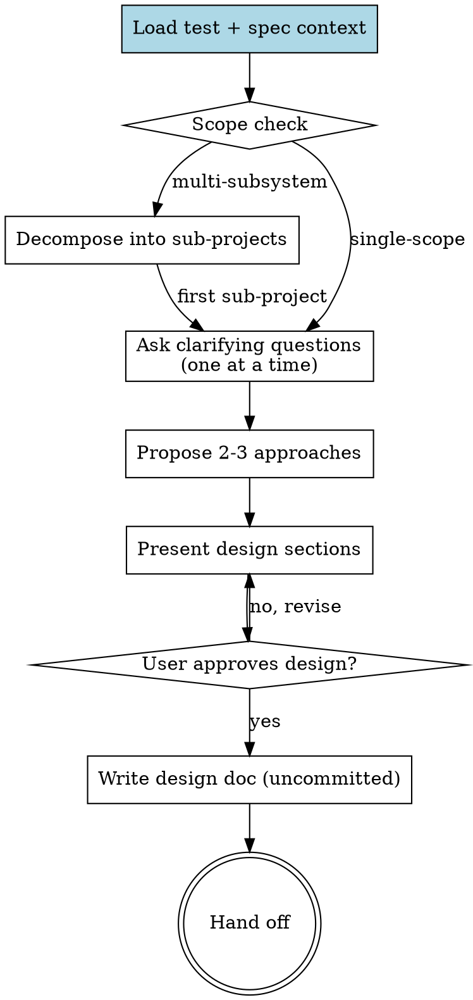

# Pandahrms Design

## Overview

Turn a rough idea into a fully formed design through collaborative dialogue. Load existing test + spec context first so the design respects current behavior contracts. Refine the idea one question at a time, propose 2-3 approaches with trade-offs, present the design in sections with approval, then save the design doc uncommitted for the user to review.

This skill is invoked by forge in step 1, and can be invoked directly when refining a design outside the forge pipeline.

**Announce at start:** "I'm using Pandahrms design to refine this into a spec."

<HARD-GATE>
Do NOT invoke any implementation skill, write any code, scaffold any project, or take any implementation action until you have presented a design and the user has approved it. This applies to EVERY project regardless of perceived simplicity.
</HARD-GATE>

<HARD-GATE>
LOAD TEST + SPEC CONTEXT BEFORE DESIGNING. Applies to every invocation -- features, bug fixes, refactors. Skipping this produces designs that ignore current behavior contracts and retrofit tests after the fact.

1. **Identify the affected area** -- which modules, features, or files the change will touch. Ask the user if unclear.
2. **Align `pandahrms-spec` branch with the working project** -- before reading any spec, check that the `pandahrms-spec` repo is on the SAME branch as the current working project. See [Spec Branch Alignment](#spec-branch-alignment) for the exact procedure. Skip this substep only when the project is non-Pandahrms (no `pandahrms-spec` repo in the workspace).
3. **Read related specs** -- every `.feature` file in `pandahrms-spec` for that area (use Grep/Glob). If none exist, note "no existing specs".
4. **Read related tests** -- every unit/integration test file in the affected codebase (`*.test.ts`, `*.spec.ts`, `*Tests.cs`, `*_test.go`, etc.). If none exist, note "no existing tests".
5. **Summarize and pause** -- one short message: `"Loaded N spec scenarios and M test files for this area (pandahrms-spec on branch <name>). Key behaviors covered: [1-2 line summary]."` Wait for the user to confirm scope before refining the idea.

When invoked from forge, the orchestrator may have already loaded this context -- still confirm by stating what was loaded (including the spec branch) before asking the first refinement question. When invoked standalone, run substeps 1-5 in full.
</HARD-GATE>

## Spec Branch Alignment

Reading specs from the wrong branch produces designs that contradict in-flight spec changes -- e.g. you design against `main` while a teammate (or a previous session of yours) already updated specs on the feature branch. Always align `pandahrms-spec` to the working project's branch before reading.

### Procedure

1. **Locate `pandahrms-spec`** -- it is typically a sibling directory of the working project (e.g. `~/Developer/pandaworks/_pandahrms/pandahrms-spec`). Use `git rev-parse --show-toplevel` from the working project, then look for `pandahrms-spec` as a sibling under the parent. If not found, ask the user for the path.
2. **Read the working project's branch** -- `git -C <project> rev-parse --abbrev-ref HEAD`.
3. **Read the spec repo's current branch** -- `git -C <spec-repo> rev-parse --abbrev-ref HEAD`.
4. **If they match** -- announce `"pandahrms-spec already on branch <name>."` and proceed to read specs.
5. **If they differ** -- check whether the working project's branch exists in `pandahrms-spec`:
   - **Branch exists locally in pandahrms-spec** (`git -C <spec-repo> show-ref --verify --quiet refs/heads/<name>`): check it out with `git -C <spec-repo> checkout <name>`. If pandahrms-spec has uncommitted changes that would block the checkout, STOP and surface them to the user -- do not stash or discard.
   - **Branch exists only on remote** (`git -C <spec-repo> ls-remote --exit-code --heads origin <name>` succeeds): fetch then checkout (`git -C <spec-repo> fetch origin <name>:<name> && git -C <spec-repo> checkout <name>`).
   - **Branch does not exist anywhere** -- this is normal for fresh feature work where specs haven't been touched yet. Announce: `"Working project on branch <name>; no matching branch in pandahrms-spec. Reading specs from <spec-current-branch> -- spec branch will be created later by spec-writing if needed."` and proceed. Do NOT auto-create the spec branch here -- creation belongs to the spec-writing step.
6. **Announce the final state** -- include the spec branch in the load summary so the user can verify (`"pandahrms-spec on <branch>"`).

### Edge cases

- **Working project branch is `main` or `master`** -- align spec to the same; this is the steady-state case.
- **Detached HEAD in pandahrms-spec** -- treat as a mismatch and ask the user how to proceed.
- **Working project has uncommitted spec-related work in pandahrms-spec already** -- if `git -C <spec-repo> status --porcelain` is non-empty, surface the changes to the user before any branch operation. The user may have in-progress spec edits that a checkout would lose.

## Anti-Pattern: "This Is Too Simple To Need A Design"

Every project goes through this process. A todo list, a single-function utility, a config change -- all of them. "Simple" projects are where unexamined assumptions cause the most wasted work. The design can be short (a few sentences for truly simple projects), but you MUST present it and get approval.

## Checklist

Create a task for each item and complete them in order.

1. **Load test + spec context** -- per the HARD-GATE above (or confirm forge already did)
2. **Scope check** -- if the request describes multiple independent subsystems, decompose first; do not refine details of a project that needs to be split
3. **Ask clarifying questions** -- one at a time, multiple-choice preferred, focused on purpose / constraints / success criteria
4. **Propose 2-3 approaches** -- with trade-offs and your recommendation
5. **Present design** -- in sections scaled to complexity, get user approval after each section, covering spec impact / test impact / implementation
6. **Write design doc** -- save to `docs/pandahrms/designs/YYYY-MM-DD-<topic>-design.md`. Do NOT commit -- leave uncommitted for the user to review.
7. **Hand off** -- announce that design is complete; return control to forge (or to whatever the user requests next)

## Process Flow

## The Process

**Scope check first:**

- If the request describes multiple independent subsystems (e.g., "build a platform with chat, file storage, billing, and analytics"), flag this immediately. Don't spend questions refining details of a project that needs to be decomposed.
- For a project that's too large for a single design, help the user split into sub-projects: what are the independent pieces, how do they relate, what order should they be built? Then design the first sub-project through the normal flow. Each sub-project gets its own design → spec → plan → implementation cycle.

**Understanding the idea:**

- Ask questions **one at a time** to refine the idea -- never batch
- Prefer multiple-choice questions when possible; open-ended is fine when needed
- Only one question per message -- if a topic needs more exploration, break it into multiple questions
- Focus on purpose, constraints, success criteria
- The design output MUST address, in this order: (a) **spec impact** -- which scenarios change/add/remove and why, (b) **test impact** -- which test files/cases change/add and what each new test will assert in failing-test-first framing, then (c) **implementation approach**

**Exploring approaches:**

- Propose 2-3 different approaches with trade-offs
- Present options conversationally with your recommendation and reasoning
- Lead with your recommended option and explain why

**Presenting the design:**

- Once you understand what you're building, present the design in sections
- Scale each section to its complexity: a few sentences if straightforward, up to 200-300 words if nuanced
- Ask after each section whether it looks right so far
- Cover: spec impact, test impact, architecture, components, data flow, error handling, testing approach
- Be ready to go back and clarify if something doesn't fit

**Design for isolation and clarity:**

- Break the system into smaller units that each have one clear purpose, communicate through well-defined interfaces, and can be understood and tested independently
- For each unit, you should be able to answer: what does it do, how do you use it, what does it depend on?
- **Boundary test** -- for each proposed unit, check both directions: (a) can a caller use this unit without reading its internals? (b) can the unit's internals change without breaking its consumers? If either answer is no, the boundary or interface needs revision before the design is approved.
- Smaller, well-bounded units are easier to reason about and produce more reliable edits

**Working in existing codebases:**

- Explore the current structure before proposing changes; follow existing patterns
- Where existing code has problems that affect the work (a file that's grown too large, unclear boundaries, tangled responsibilities), include targeted improvements as part of the design
- Don't propose unrelated refactoring -- stay focused on what serves the current goal

## After the Design

**Documentation:**

- Write the validated design to `docs/pandahrms/designs/YYYY-MM-DD-<topic>-design.md`
  - User preferences for design location override this default
- Use elements-of-style:writing-clearly-and-concisely if available
- **Do NOT commit the design doc** -- it stays uncommitted so the user can review before specs/plans build on it

**Self-review (fresh eyes, before handoff):**

After writing the design doc, re-read it once before handing off. Fix inline:

- **Placeholder scan** -- any "TBD", "TODO", incomplete sections, or vague requirements? Replace with the chosen value.
- **Internal consistency** -- do any sections contradict each other? Does the architecture match the feature descriptions? Reconcile.
- **Scope drift** -- does the doc include anything beyond the approved design (features the user didn't sign off on, speculative extensions, unrelated refactors)? Remove it.
- **Ambiguity** -- could any requirement be interpreted two ways? Pick one and make it explicit.

Fix issues inline. No need to re-review -- just fix and move on. The user reviews the file later; this pass catches the obvious gaps before they propagate to specs and plans.

**Hand off:**

- When invoked from forge, return to forge's checklist (forge will route to spec-writing next)
- When invoked standalone, announce: "Design complete and saved to `<path>`. Ready to write specs or move to planning when you are."

## Key Principles

- **One question at a time** -- never batch clarifying questions
- **Multiple choice preferred** -- easier to answer than open-ended when possible
- **YAGNI ruthlessly** -- remove unnecessary features from all designs
- **Explore alternatives** -- always propose 2-3 approaches before settling
- **Incremental validation** -- present design in sections, get approval after each
- **Spec + test impact first** -- the design must address what specs and tests change before describing implementation
- **No commits** -- the design doc stays uncommitted until the user reviews

## Red Flags

| Thought | Reality |
|---------|---------|
| "I'll batch a few questions to save round-trips" | One question at a time. Batching loses focus and produces shallow answers. |
| "I'll skip reading existing specs/tests" | Required. Designs without that grounding miss compatibility issues. |
| "pandahrms-spec is on main but the project is on a feature branch -- close enough" | No. Align the spec repo to the project's branch BEFORE reading specs. Reading from the wrong branch hides in-flight spec edits and produces designs that contradict them. See [Spec Branch Alignment](#spec-branch-alignment). |
| "It's a bug fix, no need to discuss tests upfront" | Bug fixes especially need a failing test that would have caught the bug. The design proposes that test before the fix. |
| "I'll auto-commit the design doc when I save it" | Never. The design doc stays uncommitted for user review. |
| "This is too small for a design" | Every project. The design can be a few sentences, but it must be presented and approved. |
| "I'll propose one approach since it's obviously right" | Always 2-3 approaches with trade-offs. The "obvious" one is often wrong on rereading. |
| "I'll jump to implementation since the user described what they want" | HARD-GATE. No implementation action until a design is presented and approved. |
| "I'll offer a visual companion in case it's useful" | Not in this skill. Visual companion is a superpowers feature, dropped here for round-trip efficiency. |
| "I'll re-ask the user to review the saved spec" | No. Forge step 5 (Plan ↔ Spec cross-review) covers that. Don't add a redundant gate here. |

## When to Use

- Any development work in a Pandahrms project that needs design before code
- Features, bug fixes, refactors, behavioral changes
- Invoked by forge (most common path) or directly by the user

## When NOT to Use

- Quick fixes that don't need brainstorming (typos, config changes)
- Pure spec writing for existing functionality (use `pandahrms:spec-writing` directly)
- Plan execution (use `pandahrms:execute` -- planned, not yet built)
- Non-Pandahrms projects (use `superpowers:brainstorming` directly)
