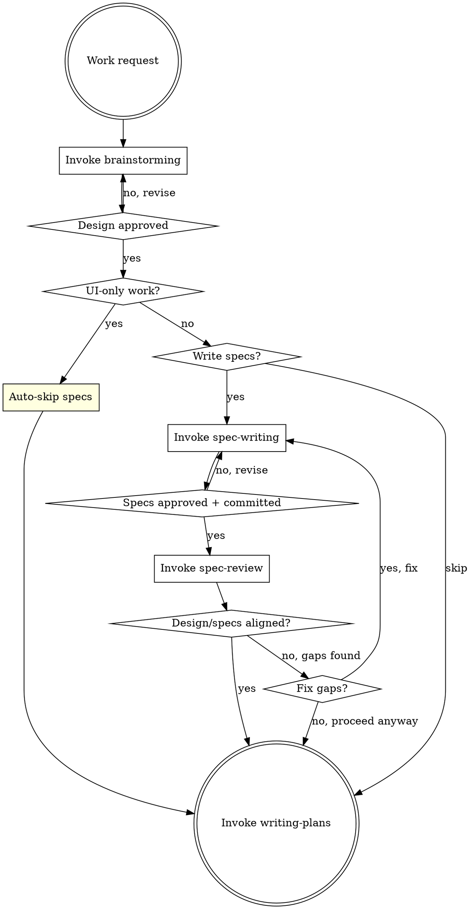

# Pandahrms Development Workflow

## Overview

Orchestrates the correct development pipeline for Pandahrms projects. This skill exists because `superpowers:brainstorming` hardcodes its terminal state to invoke `writing-plans` directly, which skips the required `pandahrms:spec-writing` step.

**Use this skill INSTEAD of invoking `superpowers:brainstorming` directly** in any Pandahrms project.

**Announce at start:** "I'm using the development-workflow skill to orchestrate the Pandahrms pipeline."

<HARD-GATE>
OVERRIDE: When the brainstorming skill completes and instructs you to "invoke writing-plans", do NOT invoke writing-plans. Instead, return to THIS pipeline and ask the user whether they want to write specs first.

The brainstorming skill says: "The ONLY skill you invoke after brainstorming is writing-plans." In Pandahrms projects, this instruction is OVERRIDDEN by this pipeline. You MUST ask the user before proceeding.
</HARD-GATE>

## Pipeline



## Time Tracking

Track elapsed time for each checklist task:

1. **On task start** -- record the current time (use `date +%s` via Bash)
2. **On task completion** -- record the end time, calculate the duration, and display it: `"Task N completed in Xm Ys"`
3. **On final task completion** -- display a summary table with each task's duration and the total pipeline time:

```
Pipeline Time Summary
---------------------
Task 1: Brainstorm the design       -- 12m 34s
Task 2: Check: UI-only work?        --  0m  5s
Task 3: Ask: Write specs?           --  8m 21s
Task 4: Review specs against design --  3m 10s
Task 5: Create implementation plan  -- 15m 02s
---------------------
Total                               -- 39m 12s
```

Skipped tasks show `-- skipped` instead of a duration. Time includes any user interaction wait time (that is expected -- these tasks involve user decisions).

Additionally, track and display:
- **Agents spawned** -- count each Agent tool invocation (subagents) during the pipeline
- **Skills invoked** -- list each Skill tool invocation by name

Include these in the final summary:

```
Pipeline Summary
---------------------
Task 1: Brainstorm the design       -- 12m 34s
Task 2: Check: UI-only work?        --  0m  5s
Task 3: Ask: Write specs?           --  8m 21s
Task 4: Review specs against design --  3m 10s
Task 5: Create implementation plan  -- 15m 02s
---------------------
Total time                          -- 39m 12s
Skills invoked                      -- 4 (brainstorming, spec-writing, spec-review, writing-plans)
Agents spawned                      -- 2
```

## Checklist

You MUST create a task for each of these items and complete them in order:

1. **Brainstorm the design** -- invoke `superpowers:brainstorming` to explore the idea, propose approaches, and present design. Do NOT auto-commit the design doc -- leave it uncommitted for the user to review. When brainstorming tells you to "invoke writing-plans", STOP and return here instead.
2. **Check: UI-only work?** -- If the work is purely UI/presentation (styling, layout, component design, theming, responsiveness, animations, dark mode, visual polish), auto-skip specs and go directly to step 4. Announce: "Skipping spec-writing -- this is a UI-only change with no business behavior impact."
3. **Ask: Write specs?** (non-UI work only) -- use AskUserQuestion to ask: "Would you like to write Gherkin specs before proceeding to the implementation plan?" with options: "Yes, write specs" and "Skip specs". Users may skip if the session is purely exploratory or an open discussion without concrete implementation targets. If yes, invoke `pandahrms:spec-writing` to write or update specs in pandahrms-spec based on the approved design doc.
4. **Review specs against design** -- invoke `pandahrms:spec-review` to cross-check the design doc against the written specs. This ensures every design requirement has spec coverage and nothing was missed. If no specs were written (user skipped step 3), this step is automatically skipped. If gaps are found, ask the user whether to fix them (loop back to spec-writing) or proceed anyway to implementation planning.
5. **Create implementation plan** -- invoke `superpowers:writing-plans` to plan the implementation based on the approved design and specs.

## Critical Override: Brainstorming Terminal State

The `superpowers:brainstorming` skill's step 6 says:

> "Transition to implementation -- invoke writing-plans skill to create implementation plan"

In Pandahrms projects, this step is REPLACED by:

> "Ask the user whether to write specs -- if yes, invoke pandahrms:spec-writing to write Gherkin specs based on the approved design. If the user skips, proceed directly to writing-plans."

Only after the user has been asked (and specs are written if requested) should you invoke `superpowers:writing-plans`.

## Critical Override: Store Plans Inside the Project

Design docs and implementation plans MUST be stored inside the **current project's** `docs/plans/` directory -- NOT in the skills repo or any other location.

The superpowers skills (brainstorming, writing-plans) save to `docs/plans/` relative to the working directory. Ensure the working directory is the project itself so files land in the right place:

```
<workspace>/
├── pandahrms-web/                # current project
│   └── docs/plans/               # <-- design docs and plans go here
│       ├── 2026-03-13-feature-name-design.md
│       └── 2026-03-13-feature-name.md
├── pandahrms-spec/
└── ...
```

If you are running from a different directory (e.g., the workspace root), explicitly set the output path to `<project>/docs/plans/` when saving.

## Critical Override: Always Use Parallel Session

When `superpowers:writing-plans` completes and offers the execution choice between "Subagent-Driven (this session)" and "Parallel Session (separate)", you MUST always select **Parallel Session (separate)**.

Do NOT offer or use "Subagent-Driven (this session)" in Pandahrms projects. After the plan is saved, display a copy-paste ready message that includes the plan file path:

```
To execute: Open a new session and run:
/executing-plans {absolute_path_to_plan_file}
```

Replace `{absolute_path_to_plan_file}` with the actual path where the plan was saved (e.g., `/Users/kyson/Developer/.../docs/plans/2026-03-13-feature-name.md`).

## Critical Override: Executing Plans Behavior

When executing a plan via `superpowers:executing-plans` in Pandahrms projects:

1. **Never commit during execution** -- Do NOT run `git commit` after individual tasks or batches. All changes remain uncommitted until the entire plan is complete. Committing is a separate step handled by `pandahrms:commit` after all work is done.
2. **Finish all tasks without stopping** -- Do NOT stop after batches of 3 for review. Execute ALL tasks in the plan continuously from start to finish. Only stop if you hit an actual blocker (missing dependency, test fails repeatedly, unclear instruction).

## Red Flags

| Thought | Reality |
|---------|---------|
| "Brainstorming said invoke writing-plans" | This pipeline overrides that for Pandahrms projects |
| "I'll skip specs without asking" | Always ask the user. They decide whether specs are needed. |
| "The design doc is enough" | Design doc captures WHAT. Specs capture BEHAVIOR. Ask the user. |
| "Specs look fine, skip the review" | Always run spec-review after writing specs. It catches gaps you won't notice manually. |
| "This change is too small for specs" | Don't assume -- ask the user. They may still want specs (unless it's UI-only, then auto-skip). |
| "Let me use subagent-driven execution" | Pandahrms always uses Parallel Session (separate). No exceptions. |
| "Let me commit after this task" | Never commit during plan execution. All commits happen after via code-review and commit. |
| "Let me stop for a batch review" | Finish all tasks without stopping. Only stop on actual blockers. |

## When to Use

- Any development work in a Pandahrms project that would normally trigger brainstorming
- Features, bug fixes, refactors, or behavioral changes
- Any work where you'd invoke `superpowers:brainstorming`

## When NOT to Use

- Quick fixes that don't need brainstorming (typos, config changes)
- Non-Pandahrms projects (use brainstorming directly)
- Writing specs for existing functionality without a new design (use `pandahrms:spec-writing` directly)
- Work that already has both a design doc and specs (go straight to `superpowers:writing-plans`)
