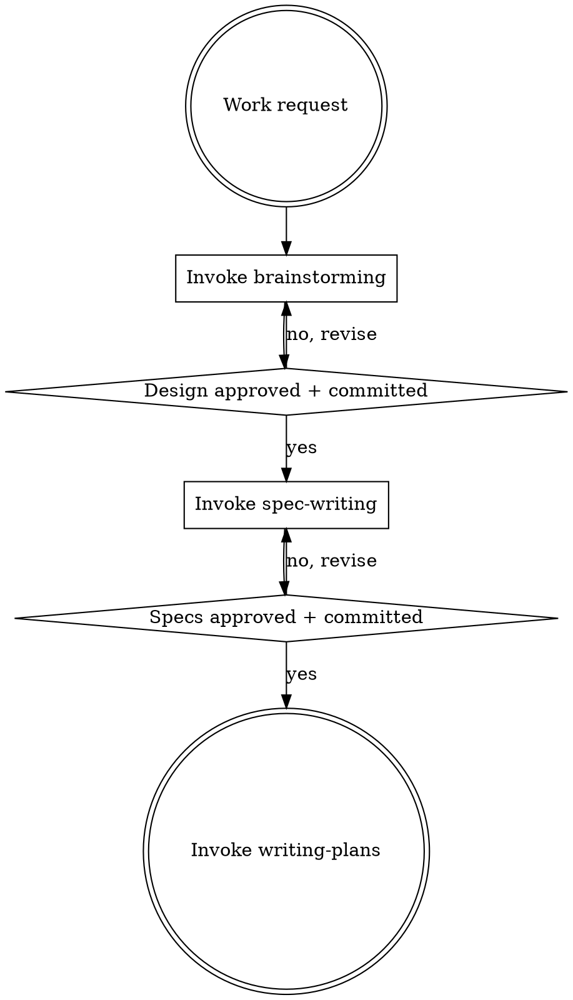

# PandaHRMS Development Workflow

## Overview

Orchestrates the correct development pipeline for PandaHRMS projects. This skill exists because `superpowers:brainstorming` hardcodes its terminal state to invoke `writing-plans` directly, which skips the required `pandahrms:spec-writing` step.

**Use this skill INSTEAD of invoking `superpowers:brainstorming` directly** in any PandaHRMS project.

**Announce at start:** "I'm using the development-workflow skill to orchestrate the PandaHRMS pipeline."

<HARD-GATE>
OVERRIDE: When the brainstorming skill completes and instructs you to "invoke writing-plans", do NOT invoke writing-plans. Instead, return to THIS pipeline and invoke pandahrms:spec-writing next.

The brainstorming skill says: "The ONLY skill you invoke after brainstorming is writing-plans." In PandaHRMS projects, this instruction is OVERRIDDEN by this pipeline. Spec-writing is mandatory before writing-plans.
</HARD-GATE>

## Pipeline

## Checklist

You MUST create a task for each of these items and complete them in order:

1. **Brainstorm the design** -- invoke `superpowers:brainstorming` to explore the idea, propose approaches, present design, and commit the design doc. When brainstorming tells you to "invoke writing-plans", STOP and return here instead.
2. **Write Gherkin specs** -- invoke `pandahrms:spec-writing` to write or update specs in pandahrms-spec based on the approved design doc.
3. **Create implementation plan** -- invoke `superpowers:writing-plans` to plan the implementation based on the approved design and specs.

## Critical Override

The `superpowers:brainstorming` skill's step 6 says:

> "Transition to implementation -- invoke writing-plans skill to create implementation plan"

In PandaHRMS projects, this step is REPLACED by:

> "Transition to spec writing -- invoke pandahrms:spec-writing to write Gherkin specs based on the approved design"

Only after specs are approved and committed should you invoke `superpowers:writing-plans`.

## Red Flags

| Thought | Reality |
|---------|---------|
| "Brainstorming said invoke writing-plans" | This pipeline overrides that for PandaHRMS projects |
| "Specs can come later" | Specs are a hard gate. No implementation without them. |
| "The design doc is enough" | Design doc captures WHAT. Specs capture BEHAVIOR. Both required. |
| "This change is too small for specs" | All changes need specs: features, bug fixes, refactors. |

## When to Use

- Any development work in a PandaHRMS project that would normally trigger brainstorming
- Features, bug fixes, refactors, or behavioral changes
- Any work where you'd invoke `superpowers:brainstorming`

## When NOT to Use

- Quick fixes that don't need brainstorming (typos, config changes)
- Non-PandaHRMS projects (use brainstorming directly)
- Writing specs for existing functionality without a new design (use `pandahrms:spec-writing` directly)
- Work that already has both a design doc and specs (go straight to `superpowers:writing-plans`)
