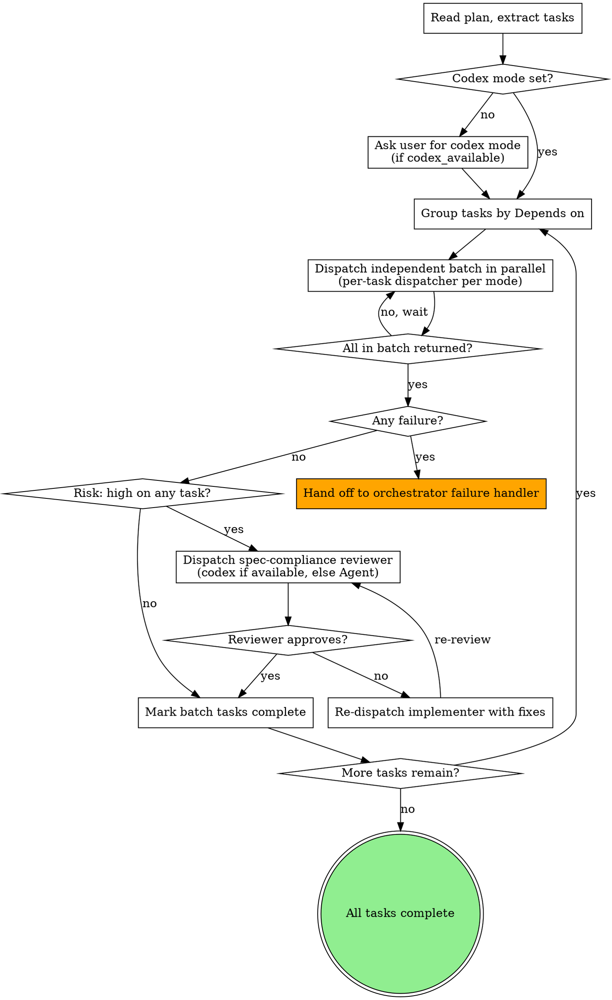

# Pandahrms Execute Plan

## Overview

Implement a plan task-by-task by dispatching a fresh implementer subagent per task. Single-stage review by default: the implementer self-reports compliance via the structured `Status:` line in its report, and the orchestrator validates the report's required fields (Status, TDD log with RED/GREEN or VERIFICATION markers, Test runtime, Files staged) before marking the task complete. There is no separate review subagent unless the task is tagged `**Risk:** high`. Tasks tagged `**Risk:** high` opt into a second-stage spec-compliance reviewer subagent. Tasks marked `Depends on: none` dispatch in parallel batches.

This skill replaces `superpowers:subagent-driven-development` for Pandahrms work. It deliberately drops the v5 mandatory two-stage review on every task -- that change is the largest contributor to slow per-task throughput. We pay that cost only when the plan tags a task as high-risk.

## Step 0 — Announcement (before any tool call)

Output exactly this text before any tool call:

`I'm using Pandahrms execute-plan to dispatch implementer subagents.`

Then proceed to Step 1 (Read plan).

<HARD-GATE>
NO COMMITS. Every implementer subagent dispatch prompt MUST instruct the subagent to **stage changes only** (`git add`) and never run `git commit`. The user tests first, then runs `/hermes-commit` to plan and execute atomic commits across the full set of changes.

This applies even if the plan accidentally contains a `git commit` step -- the dispatch prompt overrides it. Strip any commit instructions before dispatching.
</HARD-GATE>

<HARD-GATE>
EXECUTION STANDARDS. Every implementer subagent prompt MUST include the [Execution Standards Prefix](#execution-standards-prefix) below before the task-specific instructions. The prefix enforces: plan-driven execution, spec cross-check, TDD, SOLID, DDD. Subagents that skip these are out of policy -- their output is rejected and the task re-dispatches.
</HARD-GATE>

## Codex Execution Mode

If Codex is available locally (orchestrator already detected `codex_available: true`, or `command -v codex` returns a path), execution can be partly or fully delegated to the `codex:codex-rescue` subagent. Codex offers a second implementation engine; the user picks how heavily to use it.

### Detect mode

Before dispatching the first batch, check the plan file's `## Atlas Progress` (or `## Forge Progress`) section for a `Codex execution mode:` line. Possibilities:

1. **Line exists with a valid value** -- read the value. If it is exactly `full`, `partial-parallel`, or `none`, use it. No question.
2. **Line exists with an invalid value** (typo, unknown variant) -- treat it as missing. Re-ask the user via AskUserQuestion and overwrite the line with the answer.
3. **Line missing AND codex_available is true** -- ask the user via AskUserQuestion (see below), then persist the answer.
4. **codex_available is false** -- mode is implicitly `none`. Skip the question and proceed.

### The mode question

```
question: "Codex is available locally. How would you like to use it for this execution run?"
header: "Codex mode"
options:
  - label: "None (Recommended for short plans)"
    description: "Every task dispatches via Agent. Fastest per-task, lowest cost. Default behavior."
  - label: "Partial / parallel"
    description: "Tasks tagged `Risk: high` dispatch via codex:codex-rescue; standard-risk tasks via Agent. Both run in the same parallel batch -- mixed dispatchers, single batch."
  - label: "Full Codex"
    description: "Every implementer dispatches via codex:codex-rescue. Highest review depth, slowest per-task. Use when the entire plan touches risky areas."
```

After the user answers, append `Codex execution mode: <value>` to the orchestrator's progress section so resumed runs don't re-ask.

### Per-task dispatcher selection

For each task in a batch, choose the dispatcher based on the mode:

| Mode | Standard-risk task | `Risk: high` task |
|------|--------------------|-------------------|
| `none` | Agent | Agent |
| `partial-parallel` | Agent | codex:codex-rescue |
| `full` | codex:codex-rescue | codex:codex-rescue |

The implementer prompt body is identical regardless of dispatcher -- only the dispatch tool changes. **Do NOT prefix codex implementation prompts with `READ-ONLY REVIEW`** -- that prefix is for review-only dispatches (atlas-pipeline-orchestrator's QA review and Plan-Spec cross-review). Implementation prompts let codex write.

### Mixing dispatchers in a parallel batch

In `partial-parallel` mode, a single batch can contain both Agent and codex:codex-rescue dispatches. Issue them in the same message via multiple tool calls -- they run concurrently regardless of dispatcher. Wait for all to return before evaluating the batch.

The 5-per-batch parallelism cap (see [Parallel Dispatch Mechanics](#parallel-dispatch-mechanics)) counts BOTH dispatcher types together. A batch of 3 Agent + 2 codex tasks is at the cap; a batch of 5 Agent + 1 codex tasks must split.

### When second-stage review runs in codex mode

The conditional second-stage spec-compliance reviewer (for `Risk: high` tasks) ALWAYS routes through `codex:codex-rescue` when `codex_available` is true, regardless of the implementer's dispatcher. Reviewer prompts use the read-only prefix.

If `codex_available` is false, the second-stage reviewer runs via Agent.

## Process Flow



## The Process

### 1. Load plan, resolve codex mode, group tasks

1. **Verify Pandahrms project context** -- before reading the plan, verify the working directory is a Pandahrms project (the project root contains a `Pandahrms.*` solution file, a `pandahrms-*` package name in `package.json`, or matches a Pandahrms project listed in CLAUDE.md). If not, stop and tell the user to use `superpowers:subagent-driven-development` instead.
2. **Verify approval (standalone invocation only)** -- if the skill was invoked directly by the user (not from atlas-pipeline-orchestrator/forge-pipeline-orchestrator), the plan file's frontmatter MUST contain `status: approved` (or equivalent). If missing, stop and ask the user to confirm approval before proceeding. When invoked by atlas-pipeline-orchestrator/forge-pipeline-orchestrator, skip this check (the orchestrator already gated approval).
3. Read the plan file
4. Extract every task with its full text, files, spec ref, test ref, `Depends on:` markers, and `Risk:` tag (if any). If the plan has zero tasks, stop and report `BLOCKED -- plan contains no tasks` to the orchestrator (or the user, if standalone).
5. **Detect codex availability** -- if the orchestrator passed `codex_available`, use that value. Otherwise run `command -v codex`: if it returns a path, `codex_available = true`; else `false`.
6. **Resolve codex mode** -- read the plan's progress section for `Codex execution mode:`. If present and valid (`full`, `partial-parallel`, `none`), use it. If present but invalid, treat as missing. If missing AND `codex_available` is true, ask the user (see [Codex Execution Mode](#codex-execution-mode)) and persist the answer. If missing AND `codex_available` is false, set `mode = none` without asking.
7. **Persist mode answer** -- if you collected a new mode answer, append `Codex execution mode: <value>` to the plan's `## Atlas Progress` (or `## Forge Progress`) section. If the plan has no progress section at all, create one as `## Atlas Progress` immediately after the frontmatter, with the `Codex execution mode:` line as its first entry. Do NOT silently skip persistence.
8. Build batches by dependency level:
   - **Batch 0** = tasks with `Depends on: none`
   - **Batch N** = tasks whose `Depends on:` IDs are all in batches < N
9. Create a TodoWrite entry per task

### 2. Dispatch each batch in parallel

**Sequential -- do not parallelize.** Each numbered sub-step below runs sequentially in the order listed. Do NOT parallelize sub-steps -- only the dispatches inside sub-step 5 run in parallel, and only via multiple tool calls in a single message.

For each batch (smallest batch number first):

1. **Capture batch_prep_start** -- run `date +%s` and store as the moment you started building prompts for this batch. (See [Step 6 Timing Breakdown](#step-6-timing-breakdown).)
2. Build one implementer prompt per task in the batch (see [Implementer Prompt Template](#implementer-prompt-template))
3. **Pick the dispatcher per task** based on the codex mode:
   - `none` -- always Agent
   - `partial-parallel` -- Agent for standard-risk, codex:codex-rescue for `Risk: high`
   - `full` -- always codex:codex-rescue
4. **Capture dispatched_at** for the batch -- run `date +%s` immediately before the dispatch message. Record it as the per-task `dispatched_at` for every task in this batch (they all start in the same message). The delta `dispatched_at - batch_prep_start` is the batch's **dispatch-prep time**.
5. Dispatch all tasks in the batch **in a single message with multiple tool calls** -- this is what "parallel dispatch" means in this skill, and it works whether the dispatchers are all Agent, all codex, or a mix
6. Wait for all subagents in the batch to return before evaluating any of them
7. **Capture returned_at** for the batch -- run `date +%s` once all subagents have returned. Record as per-task `returned_at`. Per-task wall-clock = `returned_at - dispatched_at` (in a parallel batch this is identical for every task because the batch waits on the slowest one; that's correct for measurement purposes -- the **subagent-active time** for each task is the slowest run, and the difference between fastest and slowest is **idle-wait time**).
8. Collect each subagent's report. Extract the optional `Test runtime: <s>` field from each TDD log entry if the subagent reported it.
9. **Persist the per-task timing row** to the plan file's `### Step 6 Task Timing` table (see [Step 6 Timing Breakdown](#step-6-timing-breakdown) for format). Update once per batch, not per task.

If a subagent fails (build error, test failure, merge conflict, non-zero exit), stop dispatching further batches. Do NOT silently retry, skip, or guess. Hand off based on invocation context:

- **Invoked by atlas:** read `../atlas-pipeline-orchestrator/SKILL.md#subagent-failure-handling` and follow it.
- **Invoked by forge:** read `../forge-pipeline-orchestrator/SKILL.md` for its failure section; if missing, fall to standalone behavior.
- **Standalone:** print a structured failure report (failed task ID, batch number, status returned, blocker details) and ask the user via AskUserQuestion how to proceed (Retry / Skip task / Abort run). Do NOT decide on the user's behalf.

The timing row for the failed task records `Wall-clock: <duration>` and `Status: <failure status>`.

### 3. Conditional second-stage review

For each task in the completed batch, check if the plan tagged it `**Risk:** high`:

- **No high-risk tasks** -- mark the batch complete and proceed to the next batch.
- **One or more high-risk tasks** -- dispatch a spec-compliance reviewer subagent for each high-risk task (see [Spec Reviewer Prompt Template](#spec-reviewer-prompt-template)). Reviewer routes through `codex:codex-rescue` when `codex_available` is true (regardless of the implementer's dispatcher), else through Agent. Apply [Reviewer Verdict Handling](#reviewer-verdict-handling) to the returned report.

The default is single-stage. The plan author decides which tasks pay the second-stage cost.

#### Reviewer Verdict Handling

On reviewer return:

- **All scenarios Pass** -- mark task complete, proceed to next batch.
- **One or more Gap, zero Conflict** -- re-dispatch the implementer with the gap evidence. Cap at 2 re-dispatches (3 implementer attempts total). If the third reviewer pass still flags Gap, stop dispatching and hand off to the orchestrator's failure handler with `Status: BLOCKED -- reviewer failed to approve after 3 implementer attempts` and the gap report attached.
- **One or more Conflict** -- stop dispatching. Conflicts indicate plan/spec disagreement that the implementer cannot resolve. Hand off to the orchestrator's failure handler with the conflict evidence; do NOT re-dispatch the implementer.

### 4. Mark complete

When all tasks have returned successfully and any required reviews have approved:

1. Update each task's checkbox in the plan file from `- [ ]` to `- [x]`
2. Mark all TodoWrite entries complete
3. Announce based on invocation context:
   - **Invoked by atlas-pipeline-orchestrator/forge-pipeline-orchestrator:** `"All N tasks executed. Changes are staged but uncommitted. Returning to atlas-pipeline-orchestrator for /simplify and the user-test step."`
   - **Standalone invocation (direct user invocation, no orchestrator):** `"All N tasks executed. Changes are staged but uncommitted. Recommended next steps: run /simplify, then test the changes manually, then run /hermes-commit. I will not invoke these automatically -- they are yours to run."`

Track which path applies via the orchestrator's invocation arguments. Do NOT invoke `/simplify`, `athena-code-review`, or `/hermes-commit` yourself in either case. Atlas-pipeline-orchestrator owns the post-execution flow when present; the user owns it when standalone.

**After the completion announcement, the skill terminates.** Do NOT produce additional analysis, summaries, retrospectives, or unsolicited recommendations. The next user message (or the orchestrator's next step) is the only thing that should advance the conversation.

## Parallel Dispatch Mechanics

Tasks marked `Depends on: none` (or whose dependencies are all in earlier completed batches) MUST dispatch in a single Agent-tool message with multiple tool calls. This is the only way to actually run subagents concurrently in Claude Code.

Sequential `Agent` calls -- even within the same response -- run one after another. To parallelize, every `Agent` invocation goes in the same message.

Cap parallelism at **5 subagents per batch**. If a batch has more than 5 independent tasks, split it into chunks of 5 and dispatch chunks sequentially -- still using parallel dispatch within each chunk.

Never merge tasks from different dependency batches into the same parallel dispatch -- even if both batches are small. Batch N must fully complete (all subagents returned, all reviews approved if applicable) before any Batch N+1 task dispatches. The 5-task cap is a per-batch upper bound, not a target to fill.

### Display vocabulary

When announcing the dispatch plan or progress to the user, always call these groupings **"Batch"** (e.g. "Batch 1: T1", "Batch 2: T2, T5 (parallel)"). Do NOT use synonyms like "Wave", "Round", "Phase", or "Tier" -- they introduce vocabulary drift between the skill's internal terminology (Batch 0, Batch 1, ...) and the user-facing announcement. One word, used everywhere.

## Step 6 Timing Breakdown

The orchestrator records Step 6 wall-clock as a single number (first dispatch -> last return). That hides where the time actually went. For benchmarking and future tuning, capture per-task and per-batch timing as you go and persist it to the plan file.

### What to record per task

| Field | Source | How |
|-------|--------|-----|
| `dispatched_at` | orchestrator | `date +%s` immediately before the dispatch message |
| `returned_at` | orchestrator | `date +%s` once all subagents in the batch have returned |
| `wall_clock` | derived | `returned_at - dispatched_at` (seconds) |
| `dispatcher` | orchestrator | `Agent` or `codex:codex-rescue` -- determined by codex mode + task risk |
| `task_type` | plan | `test-ref` or `verification` (from the plan task's slot) |
| `batch_n` | orchestrator | the batch number this task ran in |
| `test_runtime` | subagent | the `Test runtime: <s>` line in the task report (or `--` if not reported) |
| `risk_high` | plan | `yes` if the plan tagged the task `**Risk:** high`, else `no` |
| `status` | subagent | the `Status:` line from the report |

### What to record per batch

| Field | Source | How |
|-------|--------|-----|
| `batch_prep_seconds` | orchestrator | `dispatched_at - batch_prep_start` |
| `batch_wall_clock` | orchestrator | `returned_at - dispatched_at` (same for every task in the batch) |
| `idle_wait_seconds` | derived | for parallel batches: `batch_wall_clock - max(per-task active time)`. Since we don't know per-task active time directly, approximate: if a batch has 3 tasks and 2 of them clearly finished early (their reports include early file writes vs the late task's writes), idle-wait = duration the early-finishers waited. Leave `--` if any of these apply: (a) the value depends on per-task active time which the parallel batch obscured, (b) you would have to estimate within ±50% accuracy, (c) the batch had only one task so idle-wait is N/A. Otherwise compute and record the value. |

### Where to store

Append a `### Step 6 Task Timing` block beneath the Atlas Progress table, after each batch completes. The orchestrator updates this section incrementally -- not at the end -- so a partial run still has data.

```markdown
### Step 6 Task Timing

| Task | Batch | Dispatcher | Type | Wall-clock | Test runtime | Risk | Status | Notes |
|------|-------|------------|------|------------|--------------|------|--------|-------|
| T1   | 1     | Agent      | test-ref     | 2m 14s | 12s | no  | DONE | |
| T2   | 2     | Agent      | test-ref     | 1m 47s |  8s | no  | DONE | |
| T3   | 2     | Agent      | verification | 0m 33s |  4s | no  | DONE | EF mapping verified via ProbationApiTests |
| T4   | 4     | codex      | test-ref     | 3m 22s | 18s | yes | DONE | second-stage review +0m 41s |
| T5   | 4     | Agent      | test-ref     | 2m 03s | 11s | no  | DONE | idle-wait 1m 19s (batch slowed by T4) |

**Batch summary:**

| Batch | Prep | Wall-clock | Tasks | Notes |
|-------|------|------------|-------|-------|
| 1 | 4s | 2m 14s | 1 | sequential entry |
| 2 | 6s | 1m 47s | 2 | T2+T3 parallel; T3 finished 1m 14s earlier |
| 4 | 11s | 4m 03s | 2 | T4+T5 parallel; T4 dominated wall-clock; second-stage review for T4 added 41s |
```

### Why the buckets matter

- **Dispatch-prep time** (sum of `batch_prep_seconds`) -- how much the orchestrator spends building prompts and reading the plan. If this grows linearly with task count, the plan reading is a bottleneck.
- **Subagent-active time** (sum of `wall_clock` per batch, NOT per task) -- the real cost of execution. This is the dominant component on most runs.
- **Test runtime** (sum across tasks) -- how much of subagent-active time was the test runner itself. If high, the test suite is slow; if low, the implementer is spending most of its time on thinking/code generation.
- **Idle-wait time** (sum across batches) -- wall-clock lost to fast tasks waiting for slow tasks in the same batch. If high, the batch composition is uneven (mix a 30s task with a 3m task and you waste 2.5m on the fast one).
- **Risk: high tax** -- compare wall-clock of `risk_high=yes` tasks to standard tasks. The second-stage review adds wall-clock; this surfaces how much.

### Recording rules

The point is data, not precision. If a value is hard to capture exactly, leave `--` rather than fabricate. The orchestrator's job is to record what's easy to know (dispatched_at, returned_at, dispatcher, type) and let the subagent self-report what only it knows (test runtime).

Always record `batch_prep_seconds` and `batch_wall_clock`. Record `idle_wait_seconds` only when the batch has 2+ tasks AND a per-task active-time signal is available from subagent reports; otherwise leave `--`. Skipping `dispatch_prep` entirely is only allowed for single-task batches.

## Placeholder Resolution

Before dispatch, resolve every `{...}` placeholder in the prompt templates below. Required sources:

- `{worktree_or_repo_path}` -- the absolute path the orchestrator passed in. If absent, use the current working directory captured via `pwd`.
- `{plan_path}` -- the absolute path of the plan file you read in step 1.
- `{N}`, `{task name}`, `{task files block from the plan}`, `{task spec ref, or "no spec ref (UI-only / skip-specs path)"}`, `{task test ref}`, `{full step-by-step block from the plan, including code blocks}` -- extracted from the plan task being dispatched.
- `{spec_refs}` -- the `Spec ref:` line(s) on the task. If the task has no spec ref, substitute `no spec ref (UI-only / skip-specs path)`.
- `{staged_files}` -- for the spec reviewer prompt only, the `Files staged:` list from the implementer's returned report.

If any placeholder cannot be resolved, do NOT dispatch with literal `{...}` text in the prompt. Stop and report `BLOCKED -- missing placeholder <name>` to the orchestrator.

## Implementer Prompt Template

Every implementer dispatch uses this structure. Substitute placeholders before sending.

The implementer prompt MUST contain only the single task being executed. Do NOT include adjacent tasks, batch summaries, or unrelated plan sections in the prompt body -- even when "for context" seems helpful. Cross-task context is the controller's responsibility, not the implementer's.

```
[Execution Standards Prefix block here -- see below]

## Your Task

You are implementing **Task {N}: {task name}**.

The controller has provided the full task content below -- this is your complete
context. Do NOT re-read the entire plan file or attempt to infer broader session
history; if anything you need is missing, return Status: NEEDS_CONTEXT in your
final report.

### Task Files

{task files block from the plan}

### Spec Reference

{task spec ref, or "no spec ref (UI-only / skip-specs path)"}

### Test Reference

{task test ref}

### Plan Steps

{full step-by-step block from the plan, including code blocks}

## Constraints

- Work from: `{worktree_or_repo_path}`
- **Stage changes only -- do NOT run `git commit`.** The user tests first, then runs `/hermes-commit`.
- Follow each step exactly. Run the verifications the plan specifies.
- Red-before-Green: never write production code without a failing test in place first (when the plan task has a `Test ref:`). Always announce the explicit `RED -- <test name> failing with <reason>` and `GREEN -- <test name> passing` markers in your task report. Tasks using a `Verification:` slot (No-Test-Pattern Categories only) report a single `VERIFICATION -- <category>: <command output>` line instead.
- If the plan and the spec disagree, STOP and return Status: BLOCKED with the conflict in your report.

## Report (end of your response)

Start your final report with one of these statuses on its own line:

- `Status: DONE` -- task complete, all verifications passed, no concerns
- `Status: DONE_WITH_CONCERNS` -- task complete but you noticed something the orchestrator should review (unexpected coupling, fragile assumption, hidden dependency, ambiguous spec). Concerns are NOT failures, but they need controller attention before the task is marked complete.
- `Status: NEEDS_CONTEXT` -- you cannot proceed because required context (a file, a type, a spec scenario, an env var) is missing from this prompt. Do NOT guess; do NOT read the broader codebase trying to find it. List exactly what's missing.
- `Status: BLOCKED` -- a plan/spec conflict, a failing verification you couldn't resolve, or a structural issue (e.g. an existing test that contradicts the new test) blocks completion. Describe the blocker; do not try to work around it.

Then provide:

- Plan task completed: [task name, or "incomplete -- see Status"]
- Spec scenarios verified: [list, or "n/a"]
- Existing tests read before writing: [list of test files]
- TDD log: required on every task. Format depends on the plan task's slot:
  - **Test-ref tasks** -- one pair of entries per test, in order:
    - `RED -- <test name> failing with <one-line reason>`
    - `GREEN -- <test name> passing`
  - **Verification-slot tasks** (No-Test-Pattern Categories only) -- one entry naming the category and command output:
    - `VERIFICATION -- <category>: <command output summary>`
  A `Status: DONE` task report missing the appropriate entries is out of policy. The controller re-dispatches the same implementer with this added instruction at the top of its prompt: "Your previous report was rejected because it omitted the required <RED/GREEN | VERIFICATION> markers in the TDD log. Re-run the work and produce a report that includes them verbatim." Cap at 2 re-dispatches per task; after the third malformed report, escalate to the orchestrator as `BLOCKED -- implementer failed to produce TDD markers after 3 attempts`.
- Test runtime: the wall-clock seconds your test runner spent (sum across all RED + GREEN runs in this task). Format: `Test runtime: 14s` (whole seconds is enough). For Verification-slot tasks, report the verification command's runtime instead. This lets the orchestrator separate test-execution time from implementer thinking time when benchmarking.
- SOLID/DDD decisions: [brief notes on boundaries, DI choices, aggregates]
- Plan <-> spec conflicts raised: [list or "none"]
- Concerns (only for DONE_WITH_CONCERNS): [list]
- Missing context (only for NEEDS_CONTEXT): [list]
- Blocker details (only for BLOCKED): [describe]
- Files staged: [list of paths git-added, or "none"]
```

## Controller Behavior Per Status

When an implementer subagent returns:

| Status | Controller action |
|--------|-------------------|
| `DONE` | Mark batch task complete; proceed to second-stage review (if `Risk: high`) or next batch. |
| `DONE_WITH_CONCERNS` | Surface the concerns to the user before marking the task complete. The user decides: accept (mark complete), re-dispatch with guidance, or escalate. |
| `NEEDS_CONTEXT` | Re-dispatch the same implementer with the missing context filled in. Cap at 2 re-dispatches per task (3 attempts total). After the third `NEEDS_CONTEXT` return, stop dispatching this task and report `BLOCKED -- repeated NEEDS_CONTEXT after 3 attempts` to the orchestrator. If the missing context isn't available before reaching the cap, escalate to the user via [Subagent Failure Handling](#when-to-stop-and-ask-the-orchestrator). Do NOT guess. |
| `BLOCKED` | Stop dispatching further batches. Hand off to the orchestrator's failure handler with the blocker details. |

## Spec Reviewer Prompt Template

Used only for tasks tagged `**Risk:** high`. Read-only review -- no file modifications.

```
READ-ONLY REVIEW. Do not modify files. Do not run --write. Return findings only.

You are auditing a high-risk implementation against its spec.

## Inputs

- Task: **Task {N}: {task name}** from `{plan_path}`
- Spec scenarios the task is supposed to satisfy: {spec_refs}
- Files the task changed: {staged_files}

## Audit

For each spec scenario:
1. Read the scenario.
2. Read the relevant changed code.
3. Decide whether the code satisfies the scenario's Given/When/Then.

## Output

For each scenario:
- **Scenario**: [name]
- **Verdict**: pass | gap | conflict
- **Evidence**: file:line references
- **Notes**: what's missing or what to fix (only if not "pass")

End with:
- Total scenarios: [count]
- Pass: [count]
- Gap: [count]
- Conflict: [count]

If everything passes, say so explicitly. Do not invent findings.
```

## Execution Standards Prefix

Every implementer subagent dispatch prompt MUST include this block BEFORE the task-specific instructions. Substitute `{spec_refs}` with the spec scenario references from the plan task.

```
## Standards

Execute the plan task as written -- the plan is the source of truth for
what to build.

1. **Plan-driven** -- complete the task exactly as specified in the plan.
2. **Spec cross-check** -- before writing code, read the spec scenario(s):
   {spec_refs}
   Verify your implementation will satisfy them. If plan and spec
   disagree, STOP and report the conflict -- do not silently pick one.
3. **TDD** (when the plan task has a `Test ref:`) -- Red-Green-Refactor.
   Before writing your test, READ every existing test file in the
   affected area so your new test coexists with current ones (replace,
   extend, or add -- never duplicate). Then:

   a. Write the failing test named in the plan task.
   b. Run it and confirm it fails. **Announce: `RED -- <test name> failing
      with <one-line reason>`** in your task report so the orchestrator
      and user can see the failure phase.
   c. Write minimal code to pass.
   d. Run the test again and confirm it passes. **Announce: `GREEN --
      <test name> passing`** in your task report.
   e. Refactor only the code you wrote in steps c-d. Do NOT refactor
      surrounding code outside the task's scope. After refactoring,
      re-run the test from step b and confirm it still passes. If you
      make no changes in step e, that is acceptable -- note `no refactor
      needed` in the TDD log.

   The RED and GREEN call-outs are required output for any task with a
   `Test ref:`. A task report that skips them is treated as failing the
   TDD check even if the code looks correct.

   **Verification-slot exemption** -- if the plan task uses a
   `Verification:` slot instead of `Test ref:` (only allowed for the
   closed list of No-Test-Pattern Categories: EF mapping, EF migration,
   read DTO + projection, API regen, pure config), there is no test to
   write. Run the verification command stated in the plan, capture its
   output, and report it under the `TDD log` field as
   `VERIFICATION -- <category>: <command output summary>`. RED and GREEN
   markers do not apply to these tasks.
4. **SOLID** -- follow `~/.claude/rules/SOLID.md`. Single responsibility
   per class, dependency injection (no `new` of collaborators inside
   domain code), small focused interfaces, no god objects.
5. **DDD** -- use the spec's ubiquitous language in names (entities,
   value objects, aggregates, domain events). Respect bounded contexts.
   Do not leak infrastructure (DbContext, HTTP, file I/O) into domain
   logic. Keep aggregates transactionally consistent.
6. **Stage only, never commit** -- end your task by `git add`-ing the
   files you touched. Do NOT run `git commit`. /hermes-commit owns the
   commit step.
```

## When to Tag Tasks `Risk: high`

The plan author decides. Recommended triggers:

- Touches authentication, authorization, or session management
- Touches multi-tenant data boundaries (tenant_id filters, row-level security, cross-tenant access checks)
- Touches money, billing, or payment flows
- Modifies database schema, migrations, or data-rewrite scripts
- Touches PII handling, audit logging, or data retention
- Implements a spec scenario the design doc explicitly flagged as risky

A task is tagged with a `**Risk:** high` line in its header (alongside `**Files:**`, `**Spec ref:**`, etc.). Untagged tasks are treated as standard risk and skip the second-stage reviewer.

## When to Stop and Ask the Orchestrator

Stop dispatching and report up immediately when:

- Any subagent reports a failure (build/test/merge)
- A subagent reports a plan <-> spec conflict
- The plan has structural gaps preventing execution (missing files for a task, broken spec reference, etc.)
- A subagent's verification fails repeatedly across re-dispatches

The orchestrator (atlas-pipeline-orchestrator, or whoever invoked you) decides whether to retry, skip, or abort. Don't decide on your own.

## Red Flags

| Thought | Reality |
|---------|---------|
| "I'll dispatch tasks sequentially with one Agent call per response" | That's not parallel. All independent tasks in a batch go in ONE message with multiple tool calls (Agent or codex:codex-rescue). |
| "I'll run the spec-compliance reviewer on every task to be safe" | No. The default is single-stage. Only `Risk: high` tasks pay the second-stage cost. |
| "I'll let the implementer commit since the plan says to commit" | Override the plan. Implementers stage only. /hermes-commit owns commits. |
| "I'll silently retry a failed subagent" | Stop and report. The orchestrator decides retry vs skip vs abort. |
| "I'll skip the standards prefix to keep prompts short" | Required on every dispatch. Skipping it means TDD/SOLID/DDD aren't enforced. |
| "I'll dispatch 12 tasks in parallel since they're all independent" | Cap at 5 per batch. Cap counts Agent + codex dispatches together. Larger batches overwhelm the harness and produce stragglers. |
| "I'll add a final whole-codebase reviewer subagent at the end" | No. Atlas-pipeline-orchestrator runs `/simplify` and athena-code-review post-execution. Don't duplicate. |
| "I'll hand off to finishing-a-development-branch when done" | No. Atlas-pipeline-orchestrator owns the user-test + /hermes-commit step. Just announce completion. |
| "The plan task has no test ref but I'll just implement it" | Stop and report -- the plan is missing required references. Atlas-pipeline-orchestrator decides whether to fix the plan or proceed. |
| "Codex is available so I'll just route everything to codex" | Ask the user the mode question. `none` is the recommended default; `full` is opt-in for risky-heavy plans. Don't pick on their behalf. |
| "I'll prefix the codex implementer dispatch with READ-ONLY REVIEW" | No. The read-only prefix is for atlas-pipeline-orchestrator's QA review and Plan-Spec cross-review only. Implementation prompts let codex write. |
| "Codex mode is `partial-parallel` but I'll dispatch the codex tasks in a separate message to be safe" | Same batch, same message. Mixing Agent + codex in one parallel batch is the whole point of `partial-parallel`. |
| "I'll re-ask the codex mode question on every batch" | Ask once. Persist the answer to the orchestrator's progress section. Resumed runs read it back. |
| "I'll call the dispatch groupings 'Wave' (or 'Round' / 'Phase') in the user-facing plan" | No. The vocabulary is **Batch**, used everywhere. Synonyms cause confusion when the user reads the skill text. See [Display vocabulary](#display-vocabulary). |

## When to Use

- After `pandahrms:plan-writing` produces a plan with bite-sized tasks, spec/test refs, and dependency markers
- Invoked by atlas-pipeline-orchestrator in step 6, or directly when given a complete plan file path

## When NOT to Use

- Plans without dependency markers or test refs (send back to `pandahrms:plan-writing` to fix first)
- Tightly-coupled tasks where each builds on the previous in subtle ways: do NOT use this skill. Stop and tell the user the plan is unsuitable for subagent-driven execution and recommend manual implementation.
- Non-Pandahrms projects (use `superpowers:subagent-driven-development` directly)
