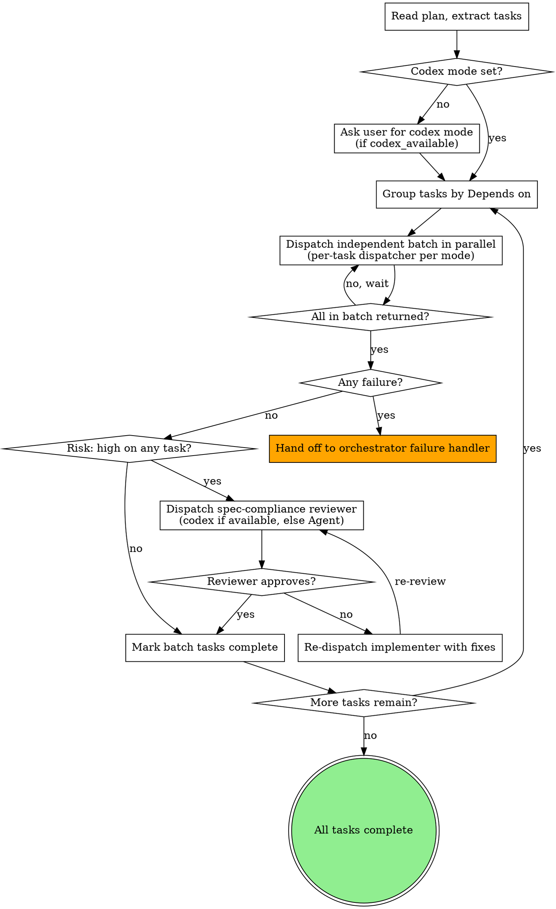

# Pandahrms Execute

## Overview

Implement a plan task-by-task by dispatching a fresh implementer subagent per task. Single-stage review by default (the implementer self-reports compliance, atlas spot-checks). Tasks tagged `**Risk:** high` opt into a second-stage spec-compliance reviewer subagent. Tasks marked `Depends on: none` dispatch in parallel batches.

This skill replaces `superpowers:subagent-driven-development` for Pandahrms work. It deliberately drops the v5 mandatory two-stage review on every task -- that change is the largest contributor to slow per-task throughput. We pay that cost only when the plan tags a task as high-risk.

**Announce at start:** "I'm using Pandahrms execute to dispatch implementer subagents."

<HARD-GATE>
NO COMMITS. Every implementer subagent dispatch prompt MUST instruct the subagent to **stage changes only** (`git add`) and never run `git commit`. The user tests first, then runs `/hermes-commit` to plan and execute atomic commits across the full set of changes.

This applies even if the plan accidentally contains a `git commit` step -- the dispatch prompt overrides it. Strip any commit instructions before dispatching.
</HARD-GATE>

<HARD-GATE>
EXECUTION STANDARDS. Every implementer subagent prompt MUST include the [Execution Standards Prefix](#execution-standards-prefix) below before the task-specific instructions. The prefix enforces: plan-driven execution, spec cross-check, TDD, SOLID, DDD. Subagents that skip these are out of policy -- their output is rejected and the task re-dispatches.
</HARD-GATE>

## Codex Execution Mode

If Codex is available locally (orchestrator already detected `codex_available: true`, or `command -v codex` returns a path), execution can be partly or fully delegated to the `codex:codex-rescue` subagent. Codex offers a second implementation engine; the user picks how heavily to use it.

### Detect mode

Before dispatching the first batch, check the plan file's `## Atlas Progress` (or `## Forge Progress`) section for a `Codex execution mode:` line. Three possibilities:

1. **Line exists** -- read the value (`full`, `partial-parallel`, or `none`) and use it. No question.
2. **Line missing AND codex_available is true** -- ask the user via AskUserQuestion (see below), then persist the answer.
3. **codex_available is false** -- mode is implicitly `none`. Skip the question and proceed.

### The mode question

```
question: "Codex is available locally. How would you like to use it for this execution run?"
header: "Codex mode"
options:
  - label: "None (Recommended for short plans)"
    description: "Every task dispatches via Agent. Fastest per-task, lowest cost. Default behavior."
  - label: "Partial / parallel"
    description: "Tasks tagged `Risk: high` dispatch via codex:codex-rescue; standard-risk tasks via Agent. Both run in the same parallel batch -- mixed dispatchers, single batch."
  - label: "Full Codex"
    description: "Every implementer dispatches via codex:codex-rescue. Highest review depth, slowest per-task. Use when the entire plan touches risky areas."
```

After the user answers, append `Codex execution mode: <value>` to the orchestrator's progress section so resumed runs don't re-ask.

### Per-task dispatcher selection

For each task in a batch, choose the dispatcher based on the mode:

| Mode | Standard-risk task | `Risk: high` task |
|------|--------------------|-------------------|
| `none` | Agent | Agent |
| `partial-parallel` | Agent | codex:codex-rescue |
| `full` | codex:codex-rescue | codex:codex-rescue |

The implementer prompt body is identical regardless of dispatcher -- only the dispatch tool changes. **Do NOT prefix codex implementation prompts with `READ-ONLY REVIEW`** -- that prefix is for review-only dispatches (atlas's QA review and Plan-Spec cross-review). Implementation prompts let codex write.

### Mixing dispatchers in a parallel batch

In `partial-parallel` mode, a single batch can contain both Agent and codex:codex-rescue dispatches. Issue them in the same message via multiple tool calls -- they run concurrently regardless of dispatcher. Wait for all to return before evaluating the batch.

The 5-per-batch parallelism cap (see [Parallel Dispatch Mechanics](#parallel-dispatch-mechanics)) counts BOTH dispatcher types together. A batch of 3 Agent + 2 codex tasks is at the cap; a batch of 5 Agent + 1 codex tasks must split.

### When second-stage review runs in codex mode

The conditional second-stage spec-compliance reviewer (for `Risk: high` tasks) ALWAYS routes through `codex:codex-rescue` when `codex_available` is true, regardless of the implementer's dispatcher. Reviewer prompts use the read-only prefix.

If `codex_available` is false, the second-stage reviewer runs via Agent.

## Process Flow



## The Process

### 1. Load plan, resolve codex mode, group tasks

1. Read the plan file
2. Extract every task with its full text, files, spec ref, test ref, `Depends on:` markers, and `Risk:` tag (if any)
3. **Resolve codex mode** -- check the orchestrator's progress section for `Codex execution mode:`. If missing AND `codex_available` is true, ask the user (see [Codex Execution Mode](#codex-execution-mode)) and persist the answer. If codex_available is false, mode is `none`.
4. Build batches by dependency level:
   - **Batch 0** = tasks with `Depends on: none`
   - **Batch N** = tasks whose `Depends on:` IDs are all in batches < N
5. Create a TodoWrite entry per task

### 2. Dispatch each batch in parallel

For each batch (smallest batch number first):

1. Build one implementer prompt per task in the batch (see [Implementer Prompt Template](#implementer-prompt-template))
2. **Pick the dispatcher per task** based on the codex mode:
   - `none` -- always Agent
   - `partial-parallel` -- Agent for standard-risk, codex:codex-rescue for `Risk: high`
   - `full` -- always codex:codex-rescue
3. Dispatch all tasks in the batch **in a single message with multiple tool calls** -- this is what "parallel dispatch" means in this skill, and it works whether the dispatchers are all Agent, all codex, or a mix
4. Wait for all subagents in the batch to return before evaluating any of them
5. Collect each subagent's report

If a subagent fails (build error, test failure, merge conflict, non-zero exit), stop dispatching further batches and hand off to atlas's [Subagent Failure Handling](../atlas/SKILL.md#subagent-failure-handling) (or the equivalent in whatever orchestrator invoked you). Do NOT silently retry, skip, or guess -- the orchestrator decides.

### 3. Conditional second-stage review

For each task in the completed batch, check if the plan tagged it `**Risk:** high`:

- **No high-risk tasks** -- mark the batch complete and proceed to the next batch.
- **One or more high-risk tasks** -- dispatch a spec-compliance reviewer subagent for each high-risk task (see [Spec Reviewer Prompt Template](#spec-reviewer-prompt-template)). Reviewer routes through `codex:codex-rescue` when `codex_available` is true (regardless of the implementer's dispatcher), else through Agent. If the reviewer flags gaps, re-dispatch the original implementer with the gap report; loop until the reviewer approves.

The default is single-stage. The plan author decides which tasks pay the second-stage cost.

### 4. Mark complete

When all tasks have returned successfully and any required reviews have approved:

1. Update each task's checkbox in the plan file from `- [ ]` to `- [x]`
2. Mark all TodoWrite entries complete
3. Announce: `"All N tasks executed. Changes are staged but uncommitted. Atlas will run /simplify next."`

Atlas owns the post-execution flow (simplify, ask user to test, /hermes-commit). Don't invoke them yourself.

## Parallel Dispatch Mechanics

Tasks marked `Depends on: none` (or whose dependencies are all in earlier completed batches) MUST dispatch in a single Agent-tool message with multiple tool calls. This is the only way to actually run subagents concurrently in Claude Code.

Sequential `Agent` calls -- even within the same response -- run one after another. To parallelize, every `Agent` invocation goes in the same message.

Cap parallelism at **5 subagents per batch**. If a batch has more than 5 independent tasks, split it into chunks of 5 and dispatch chunks sequentially -- still using parallel dispatch within each chunk.

## Implementer Prompt Template

Every implementer dispatch uses this structure. Substitute placeholders before sending.

```
[Execution Standards Prefix block here -- see below]

## Your Task

You are implementing **Task {N}: {task name}** from the plan at `{plan_path}`.

Read that task carefully -- the plan is the source of truth for what to build.

### Task Files

{task files block from the plan}

### Spec Reference

{task spec ref, or "no spec ref (UI-only / skip-specs path)"}

### Test Reference

{task test ref}

### Plan Steps

{full step-by-step block from the plan, including code blocks}

## Constraints

- Work from: `{worktree_or_repo_path}`
- **Stage changes only -- do NOT run `git commit`.** The user tests first, then runs `/hermes-commit`.
- Follow each step exactly. Run the verifications the plan specifies.
- Red-before-Green: never write production code without a failing test in place first.
- If the plan and the spec disagree, STOP and report the conflict in your final report.

## Report (end of your response)

- Plan task completed: [task name]
- Spec scenarios verified: [list, or "n/a"]
- Existing tests read before writing: [list of test files]
- Tests written first (failing -> passing): [list of test names]
- SOLID/DDD decisions: [brief notes on boundaries, DI choices, aggregates]
- Plan <-> spec conflicts raised: [list or "none"]
- Files staged: [list of paths git-added]
```

## Spec Reviewer Prompt Template

Used only for tasks tagged `**Risk:** high`. Read-only review -- no file modifications.

```
READ-ONLY REVIEW. Do not modify files. Do not run --write. Return findings only.

You are auditing a high-risk implementation against its spec.

## Inputs

- Task: **Task {N}: {task name}** from `{plan_path}`
- Spec scenarios the task is supposed to satisfy: {spec_refs}
- Files the task changed: {staged_files}

## Audit

For each spec scenario:
1. Read the scenario.
2. Read the relevant changed code.
3. Decide whether the code satisfies the scenario's Given/When/Then.

## Output

For each scenario:
- **Scenario**: [name]
- **Verdict**: pass | gap | conflict
- **Evidence**: file:line references
- **Notes**: what's missing or what to fix (only if not "pass")

End with:
- Total scenarios: [count]
- Pass: [count]
- Gap: [count]
- Conflict: [count]

If everything passes, say so explicitly. Do not invent findings.
```

## Execution Standards Prefix

Every implementer subagent dispatch prompt MUST include this block BEFORE the task-specific instructions. Substitute `{spec_refs}` with the spec scenario references from the plan task.

```
## Standards

Execute the plan task as written -- the plan is the source of truth for
what to build.

1. **Plan-driven** -- complete the task exactly as specified in the plan.
2. **Spec cross-check** -- before writing code, read the spec scenario(s):
   {spec_refs}
   Verify your implementation will satisfy them. If plan and spec
   disagree, STOP and report the conflict -- do not silently pick one.
3. **TDD** -- Red-Green-Refactor. Before writing your test, READ every
   existing test file in the affected area so your new test coexists with
   current ones (replace, extend, or add -- never duplicate). Then write
   the failing test named in the plan task, confirm it fails, then write
   minimal code to pass. No production code without a failing test.
4. **SOLID** -- follow `~/.claude/rules/SOLID.md`. Single responsibility
   per class, dependency injection (no `new` of collaborators inside
   domain code), small focused interfaces, no god objects.
5. **DDD** -- use the spec's ubiquitous language in names (entities,
   value objects, aggregates, domain events). Respect bounded contexts.
   Do not leak infrastructure (DbContext, HTTP, file I/O) into domain
   logic. Keep aggregates transactionally consistent.
6. **Stage only, never commit** -- end your task by `git add`-ing the
   files you touched. Do NOT run `git commit`. /hermes-commit owns the
   commit step.
```

## When to Tag Tasks `Risk: high`

The plan author decides. Recommended triggers:

- Touches authentication, authorization, or session management
- Touches multi-tenant data boundaries (tenant_id filters, row-level security, cross-tenant access checks)
- Touches money, billing, or payment flows
- Modifies database schema, migrations, or data-rewrite scripts
- Touches PII handling, audit logging, or data retention
- Implements a spec scenario the design doc explicitly flagged as risky

A task is tagged with a `**Risk:** high` line in its header (alongside `**Files:**`, `**Spec ref:**`, etc.). Untagged tasks are treated as standard risk and skip the second-stage reviewer.

## When to Stop and Ask the Orchestrator

Stop dispatching and report up immediately when:

- Any subagent reports a failure (build/test/merge)
- A subagent reports a plan <-> spec conflict
- The plan has structural gaps preventing execution (missing files for a task, broken spec reference, etc.)
- A subagent's verification fails repeatedly across re-dispatches

The orchestrator (atlas, or whoever invoked you) decides whether to retry, skip, or abort. Don't decide on your own.

## Red Flags

| Thought | Reality |
|---------|---------|
| "I'll dispatch tasks sequentially with one Agent call per response" | That's not parallel. All independent tasks in a batch go in ONE message with multiple tool calls (Agent or codex:codex-rescue). |
| "I'll run the spec-compliance reviewer on every task to be safe" | No. The default is single-stage. Only `Risk: high` tasks pay the second-stage cost. |
| "I'll let the implementer commit since the plan says to commit" | Override the plan. Implementers stage only. /hermes-commit owns commits. |
| "I'll silently retry a failed subagent" | Stop and report. The orchestrator decides retry vs skip vs abort. |
| "I'll skip the standards prefix to keep prompts short" | Required on every dispatch. Skipping it means TDD/SOLID/DDD aren't enforced. |
| "I'll dispatch 12 tasks in parallel since they're all independent" | Cap at 5 per batch. Cap counts Agent + codex dispatches together. Larger batches overwhelm the harness and produce stragglers. |
| "I'll add a final whole-codebase reviewer subagent at the end" | No. Atlas runs `/simplify` and athena-review post-execution. Don't duplicate. |
| "I'll hand off to finishing-a-development-branch when done" | No. Atlas owns the user-test + /hermes-commit step. Just announce completion. |
| "The plan task has no test ref but I'll just implement it" | Stop and report -- the plan is missing required references. Atlas decides whether to fix the plan or proceed. |
| "Codex is available so I'll just route everything to codex" | Ask the user the mode question. `none` is the recommended default; `full` is opt-in for risky-heavy plans. Don't pick on their behalf. |
| "I'll prefix the codex implementer dispatch with READ-ONLY REVIEW" | No. The read-only prefix is for atlas's QA review and Plan-Spec cross-review only. Implementation prompts let codex write. |
| "Codex mode is `partial-parallel` but I'll dispatch the codex tasks in a separate message to be safe" | Same batch, same message. Mixing Agent + codex in one parallel batch is the whole point of `partial-parallel`. |
| "I'll re-ask the codex mode question on every batch" | Ask once. Persist the answer to the orchestrator's progress section. Resumed runs read it back. |

## When to Use

- After `pandahrms:plan` produces a plan with bite-sized tasks, spec/test refs, and dependency markers
- Invoked by atlas in step 6, or directly when given a complete plan file path

## When NOT to Use

- Plans without dependency markers or test refs (send back to `pandahrms:plan` to fix first)
- Tightly-coupled tasks where each builds on the previous in subtle ways (manual execution may be safer)
- Non-Pandahrms projects (use `superpowers:subagent-driven-development` directly)
