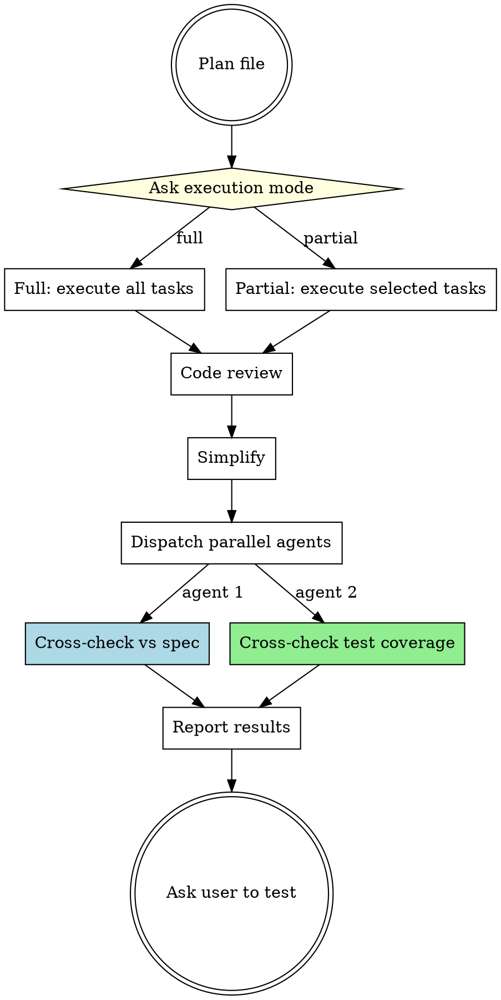

# Pandahrms Execution Pipeline

## Overview

Orchestrates the execution phase for Pandahrms projects. Wraps `superpowers:executing-plans` with mandatory post-execution quality gates: code review, simplification, parallel spec and test coverage cross-checks, and user testing.

**Announce at start:** "I'm using the execution-pipeline skill to execute the plan with quality gates."

### Where This Fits

```
pandahrms:design-pipeline (brainstorm -> specs -> plan)
    |
    v
pandahrms:execution-pipeline (THIS SKILL - execute -> review -> verify)
    |
    v
pandahrms:commit (atomic commits after user tests)
```

## Pipeline



## Checklist

You MUST create a task for each of these items and complete them in order:

1. **Ask execution mode** -- use AskUserQuestion to ask: "How would you like to execute this plan?" with options:
   - **Full (Recommended)** -- execute all tasks continuously, no commits, no stops. Only stops on actual blockers.
   - **Partial** -- user selects which tasks to execute. Useful for resuming incomplete sessions or executing specific sections.
2. **Execute the plan** -- invoke `superpowers:executing-plans` with the plan file path. Apply execution overrides based on the chosen mode (see below).
3. **Code review** -- invoke `pandahrms:code-review`. Override: skip Phase 5 (the /simplify prompt) since simplify runs as a separate mandatory step next.
4. **Simplify** -- invoke `/simplify` directly. This is mandatory in this pipeline, not optional.
5. **Dispatch parallel cross-check agents** -- dispatch both agents simultaneously using a single message with multiple Agent tool calls:
   - **Agent 1: Spec cross-check** -- compare git changes against the feature's Gherkin specs. See Spec Cross-Check Agent below. Skip if spec repo or relevant specs not found.
   - **Agent 2: Test coverage cross-check** -- verify unit tests cover all new/changed implementation. See Test Coverage Agent below. Skip if no test project found.
6. **Ask user to test** -- present both agents' results, then end with: "Please test your changes, then run /commit when ready."

## Execution Overrides

These overrides always apply regardless of mode:

1. **Never commit during execution** -- Do NOT run `git commit` after individual tasks or batches. All changes remain uncommitted until the user runs /commit after testing.
2. **Track time per task** -- Record start/end timestamps for every plan task. Read `## Pipeline Timing` from the plan file (if present) and display the combined Development Summary on completion.

### Full Mode

3. **Finish all tasks without stopping** -- Do NOT stop after batches of 3 for review. Execute ALL tasks continuously from start to finish. Only stop on actual blockers (missing dependency, repeated test failures, unclear instruction).

### Partial Mode

3. **Let user select tasks** -- read the plan file and present all tasks as a numbered list. Use AskUserQuestion (multiSelect) to let the user pick which tasks to execute. Execute only the selected tasks in plan order. Skip unselected tasks.

### Time Tracking

1. **On task start** -- record the current time (use `date +%s` via Bash)
2. **On task completion** -- record the end time, calculate the duration, and display it: `"Task N completed in Xm Ys"`
3. **On final task completion** -- display a summary:

```
Development Summary
===========================
Pipeline (design + specs)    -- 39m 12s      (from plan file, if available)
---------------------------
Task 1: Set up structure     --  3m 12s
Task 2: Create data models   --  5m 45s
Task 3: Implement endpoints  -- 12m 08s
...
---------------------------
Execution total              -- 42m 31s
Agents spawned               -- 5
===========================
Grand total                  -- 1h 21m 43s
```

If no `## Pipeline Timing` section exists in the plan file, show only the execution summary without the pipeline row.

## Code Review Override

When invoking `pandahrms:code-review` in this pipeline:

- **Skip Phase 5 (Simplify prompt)** -- Do not ask "run /simplify?" because simplify runs as the next mandatory step.
- All other phases (lint, review, fix, spec discrepancy check) run normally.

## Parallel Cross-Check Agents

After /simplify completes, dispatch both agents **in parallel** (single message, multiple Agent tool calls). Wait for both to complete, then present combined results.

---

### Agent 1: Spec Cross-Check

Verifies the implementation matches the feature specs.

**Agent task:**

1. Run `git diff` to get all working tree changes
2. Locate the spec repo at `$(dirname $PWD)/pandahrms-spec/`
3. Identify which module/feature area the changes belong to
4. Find all related `.feature` files
5. For each spec scenario, check whether the implementation satisfies it:
   - Are the described behaviors implemented?
   - Do validation rules match spec expectations?
   - Are authorization checks in place as specified?
   - Do status transitions match the spec flow?
6. Report findings

**Skip conditions:**

- Spec repo not found -- announce: "Skipping spec cross-check -- pandahrms-spec not found."
- No spec files for the feature area -- announce: "Skipping spec cross-check -- no specs found for this feature."
- Work is UI-only -- announce: "Skipping spec cross-check -- UI-only changes."

**Report format:**

```
## Spec Cross-Check Results

### Summary
- Spec scenarios checked: [count]
- Implemented: [count]
- Not implemented: [count]
- Divergent: [count]

### Issues (if any)
| # | Spec Scenario | File | Status | Notes |
|---|---|---|---|---|
| 1 | [scenario] | [file.feature] | Not implemented | [what's missing] |
| 2 | [scenario] | [file.feature] | Divergent | [how it differs] |
```

---

### Agent 2: Test Coverage Cross-Check

Verifies that unit tests cover all new and changed implementation code.

**Agent task:**

1. Run `git diff` to get all working tree changes -- focus on implementation files (not test files)
2. From the diff, extract a list of:
   - New classes, methods, and functions added
   - Modified methods with changed behavior (not just formatting)
   - New endpoints, handlers, or services
   - New validation rules or business logic branches
3. Locate the project's test directory (look for `*.Tests`, `*.UnitTests`, `__tests__`, `*.test.*`, `*.spec.*` patterns)
4. For each new/changed implementation item, search for corresponding test coverage:
   - Is there a test file for the class/module?
   - Are the new methods/functions tested?
   - Are edge cases and error paths covered?
   - Are new branches (if/else, switch) exercised?
5. Report findings

**Skip conditions:**

- No test project/directory found -- announce: "Skipping test coverage cross-check -- no test project found."
- Work is UI-only with no logic -- announce: "Skipping test coverage cross-check -- UI-only changes."

**Report format:**

```
## Test Coverage Cross-Check Results

### Summary
- New/changed implementations: [count]
- Covered by tests: [count]
- Missing test coverage: [count]

### Coverage Details
| # | Implementation | File | Test Status | Notes |
|---|---|---|---|---|
| 1 | [class/method] | [file] | Covered | [test file] |
| 2 | [class/method] | [file] | Missing | [what test is needed] |
| 3 | [class/method] | [file] | Partial | [what's missing] |
```

---

Present both agents' results to the user before asking them to test.

## Red Flags

| Thought | Reality |
|---------|---------|
| "Let me commit after execution" | Never commit. User tests first, then /commit. |
| "I'll skip /simplify, code-review already offered it" | /simplify is mandatory in this pipeline. Always run it. |
| "Cross-check seems redundant after code-review" | Code-review checks code quality. Cross-checks verify spec compliance and test coverage. Different concerns. |
| "Tests exist so coverage is fine" | Existing tests may not cover new code. The agent checks new/changed implementations specifically. |
| "I'll run agents one at a time" | Always dispatch both cross-check agents in parallel for efficiency. |
| "Let me stop for batch review" | In full mode, finish all tasks without stopping. In partial mode, only execute selected tasks. |
| "I'll default to partial mode" | Always ask the user. Full mode is recommended. |
| "Specs aren't available, skip the whole pipeline" | Only skip the cross-check step. Everything else runs normally. |
| "Let me use subagent-driven execution" | This IS the execution skill. Run executing-plans directly here, not via subagent dispatch. |
| "Let me commit between steps" | No commits at any point. All commits happen via /commit after the user tests. |

## When to Use

- Executing any implementation plan in a Pandahrms project
- After `pandahrms:design-pipeline` produces a plan file
- Any time you'd invoke `superpowers:executing-plans` in a Pandahrms project

## When NOT to Use

- Non-Pandahrms projects (use `superpowers:executing-plans` directly)
- Quick one-off changes that don't have a plan file
- Design/planning phase (use `pandahrms:design-pipeline`)
