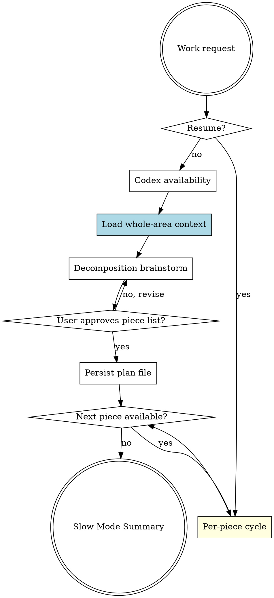
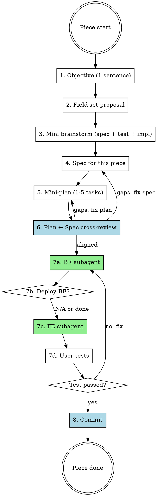

# Forge Slow Mode (Pandahrms -- Experimental)

> **Experimental skill.** This skill does not auto-trigger. Run it only when the user explicitly invokes `/pandahrms:forge-slow-mode`. Behavior may change between versions while it is being refined.

## Overview

Iterative pipeline for any project. Breaks the work into atomic **pieces** and runs a full design → build → test → commit cycle for each piece in sequence. Never discusses multiple pieces at once.

**Use this when** the user explicitly invokes the slash command and wants tight per-piece feedback. For batch-build (one big plan, then execute everything), use `pandahrms:forge-pipeline-orchestrator` instead.

**Announce at start:** `"I'm using forge-slow-mode (experimental) -- I will break this work into atomic pieces and run a full design→build→test→commit cycle on each piece, one at a time."`

## What is a "piece"?

A **piece** is a sub-feature OR a single processor (one verb / one action) of the larger work being built. The defining property: **a piece is independently testable.**

The "user" of a piece can be either:
- **An end user** -- when the work is user-facing (a button click, API endpoint, menu item, CLI command). The test is end-to-end / acceptance-level.
- **Calling code** -- when the work itself is internal (a utility library, a helper, a refactor, a parser). The test is unit-level / contract-level.

What matters is that the piece can be exercised and verified on its own, by someone or something other than the implementer reading the diff.

### When the work is user-facing

Each piece = one user-visible action with one observable outcome.

| Larger feature | Pieces |
|----------------|--------|
| Goal management (CRUD) | Create goal, Read/list goals, Update goal, Delete goal |
| Goal management with extras | (the four CRUD pieces above) + Generate goal from template + Publish goal + Archive goal |
| User onboarding | Sign up, Verify email, Complete profile, Invite teammates |
| Payroll run | Calculate gross, Apply deductions, Generate payslip, Post to ledger, Email payslip |
| Notification system | Subscribe to channel, Send notification, Mark as read, Unsubscribe |

In this mode, internal scaffolding (private helpers, DB migrations, repositories) is NOT its own piece -- fold it into the user-facing piece whose behavior depends on it.

### When the work is internal (library, helpers, refactor)

If the user explicitly asked for internal work as the deliverable -- e.g. "build a date parsing utility", "extract this logic into a helper module", "refactor the auth middleware" -- then each independently-testable unit IS a piece.

| Internal work | Pieces |
|---------------|--------|
| Date parsing utility | parseISO, parseRelative ("yesterday"), parseDuration ("2h 30m"), formatHuman |
| Validation helper module | required, minLength, email format, regex matcher |
| Auth middleware refactor | Token extraction, Token verification, User loading, Permission check |
| CSV importer library | Tokenize line, Parse row, Validate schema, Coerce types |

The test for an internal piece is a unit test against its public contract -- that is the "user interacting with it".

### Heuristics for "is this one piece or several?"

- If you'd normally write a single test (or a tight cluster of related test cases) for it, it's probably one piece.
- If a "piece" has no way to be exercised in isolation -- not even by a unit test -- it's not a piece, it's a substep of one.
- If a "piece" needs more than ~8 fields or branches into multiple distinct outcomes, split it.
- CRUD always counts as 4 pieces minimum -- never bundle them as "Manage X".
- When in doubt about whether the work is "user-facing" or "internal": ask the user. The decomposition phase is the place to settle it.

## Resume Path

If invoked with `/pandahrms:forge-slow-mode --resume`:

1. Find the slow-mode plan file (most recent `*-slow.md` in the project's plan dir or `~/.claude/plans/`)
2. Read the `## Slow Mode Progress` table to find the next piece with status `pending` or `in-progress`
3. Read the `## Pieces` section for any in-progress piece's per-piece plan
4. Announce: `"Resuming forge-slow-mode at piece N (<name>) -- last completed step: <step>."`
5. Continue from the next incomplete substep of the per-piece cycle

If no plan file exists, announce `"No slow-mode state found -- starting fresh."` and begin from the Decomposition Phase.

## Codex Availability

At the very start of every run (including Resume), detect whether Codex is available locally.

1. Run `command -v codex` via Bash. Empty stdout means unavailable.
2. Store the result in conversation context as `codex_available` (true/false). Persist it into the plan file's `## Slow Mode Progress` block once the file exists, on a `Codex available: true|false` line, so resumed runs do not need to re-detect.

When `codex_available` is true, dispatch the per-piece Plan ↔ Spec cross-review (and any per-piece QA review that runs) to the `codex:codex-rescue` subagent for a second-opinion pass. The dispatched prompt MUST begin with `READ-ONLY REVIEW. Do not modify files. Do not run --write. Return findings only.` so codex does not edit the working tree.

When `codex_available` is false, fall back to inline review using the same checks.

Announce at start: `"Codex detected -- routing per-piece reviews to codex:codex-rescue."` or `"Codex not detected -- using inline review."`

## Hard Gates

<HARD-GATE>
ONE PIECE AT A TIME -- this is the core invariant of slow mode:

1. **No high-level discussions.** Discussion happens at the level of a single piece -- never the whole feature. If the user asks a multi-piece question, answer only the part relevant to the current piece and queue the rest for its own piece's discussion.
2. **Decompose before deciding anything else.** The first action is to produce an ordered list of atomic pieces and get the user to approve it. CRUD = 4 pieces minimum. Add domain actions (Generate, Publish, Approve, Archive, etc.) as additional pieces.
3. **Finish a piece end-to-end before starting the next.** "Finish" means: design → spec (if applicable) → BE built → BE deployed (if applicable) → FE built → user tested → committed. Only then move to the next piece.
4. **Per-piece commits.** Each piece is its own commit (or set of related atomic commits). Never bundle pieces.
5. **Reuse decisions across pieces explicitly.** When piece N reuses decisions from piece N-1 (e.g., shared field definitions), say so out loud: `"Reusing the Goal entity's Title field from the Create piece."` Don't silently propagate -- name the reuse so the user can correct it.
6. **No parallelism within a piece.** BE → deploy → FE → test is sequential by construction. Cross-piece parallelism is also disallowed -- pieces run in order.
</HARD-GATE>

<HARD-GATE>
TDD + SDD AT DESIGN TIME (applied per piece):

For each piece, before writing any code:

1. **Identify the affected area for THIS piece** -- module/feature/file paths the change will touch. Ask the user if unclear.
2. **Read related specs** for THIS piece -- every spec file (`.feature`, `*.spec.md`, etc.) that covers behavior in the affected area. If none exist, note "no existing specs".
3. **Read related tests** for THIS piece -- every unit/integration test file in the affected codebase. If none exist, note "no existing tests".
4. **Brainstorm test + spec changes FIRST, then implementation** -- the per-piece brainstorm output MUST address, in this order: (a) **spec impact** for this piece, (b) **test impact** for this piece (in failing-test-first framing), then (c) **implementation approach** for this piece.
5. **Plan tasks must reference both** -- every per-piece implementation task names the spec scenario(s) it satisfies AND the test file(s)/case(s) it touches.
6. **Never write production code before the test exists** -- enforced by `superpowers:test-driven-development`. The test is shaped here at design time.

The decomposition phase loads spec/test context for the WHOLE affected area once, so per-piece context loading can focus on the specific files that piece touches.
</HARD-GATE>

<HARD-GATE>
AUTHORITY HIERARCHY:

**Design time (per piece, design substeps):** The per-piece discussion is the source of truth. If the discussion diverges from an existing spec, UPDATE the spec for this piece BEFORE writing the per-piece plan.

**Execution time (per piece, build substep):** The per-piece plan is the source of truth for the implementer subagent, but the implementer MUST cross-check against the spec for this piece. If plan and spec disagree, STOP and report -- never silently pick one.

**Never silently reconcile.** Always ask the user or flag the conflict when authority sources disagree.
</HARD-GATE>

<HARD-GATE>
EXECUTION STANDARDS (per implementer dispatch):

Every implementer subagent dispatched in a piece's BE or FE step MUST follow:

1. **Plan-driven execution** -- the per-piece plan task is the work order
2. **Spec cross-check** -- verify the implementation satisfies the spec scenarios the plan task references. If plan and spec disagree, stop and report.
3. **TDD** -- invoke `superpowers:test-driven-development`. Red-Green-Refactor, test-first, no production code without a failing test.
4. **SOLID** -- follow `~/.claude/rules/SOLID.md`. Single responsibility, dependency injection, small focused interfaces.
5. **DDD** -- use the spec's ubiquitous language in names (entities, value objects, aggregates, domain events). Respect bounded contexts -- do not leak infrastructure (DbContext, HTTP, file I/O) into domain logic. Keep aggregates transactionally consistent.

Each subagent confirms compliance in its self-report (see [Execution Standards Prefix](#execution-standards-prefix)).
</HARD-GATE>

## Pipeline





## Decomposition Phase (runs ONCE)

Before any pieces are processed, do the decomposition. This is the **only** time you discuss the whole feature.

1. **Codex availability** -- detect once and store in conversation context.
2. **Load whole-area context** -- execute substeps 1-3 of the **TDD + SDD AT DESIGN TIME** HARD-GATE for the entire affected area (not just one piece). Summarize loaded specs and tests for the user: `"Loaded N spec scenarios and M test files for this area. Key behaviors covered: [1-2 line summary]."` Wait for the user to confirm scope before brainstorming.
3. **Invoke brainstorming** with a constrained scope: the brainstorm output MUST be ONLY a decomposition into atomic pieces -- not a full design. Tell the brainstorming skill explicitly:
   ```
   Slow-mode decomposition only. Output an ordered list of atomic pieces
   that the work will be built from. A piece must be independently
   testable -- by an end user (UI/API) OR by calling code (unit test).
   For CRUD-style features, list at minimum: Create, Read, Update,
   Delete. Add domain actions (Generate, Publish, Approve, Archive,
   etc.) as separate pieces. Do NOT design fields, contracts, or
   behaviors yet -- those are designed inside each piece's own
   discussion.
   ```
4. **Present the decomposition** to the user via AskUserQuestion: `"I propose breaking this into N pieces: [list]. Ready to start with piece 1, or do you want to revise the decomposition?"` with options "Start piece 1" / "Revise decomposition" / "Reorder pieces" / "Add a piece" / "Remove a piece".
5. **Persist the decomposition** -- create a slow-mode plan file at the project's plan location (or `~/.claude/plans/<feature-slug>-slow.md` if there's no project plan dir) with this structure:

   ```markdown
   # <Feature Name> -- Slow Mode

   ## Decomposition

   1. [ ] Create -- <one-line objective placeholder>
   2. [ ] Read -- <one-line objective placeholder>
   3. [ ] Update -- <one-line objective placeholder>
   4. [ ] Delete -- <one-line objective placeholder>

   ## Slow Mode Progress

   | Piece | Status | Active Time | Committed SHA |
   |-------|--------|-------------|---------------|
   | 1. Create | pending | -- | -- |
   | 2. Read   | pending | -- | -- |
   | 3. Update | pending | -- | -- |
   | 4. Delete | pending | -- | -- |

   Run started: <epoch>
   Codex available: <true|false>

   ## Pieces

   <Each piece's per-piece plan + decisions are appended here as they are processed.>
   ```

## Per-Piece Cycle (runs ONCE PER PIECE)

For each piece in the approved decomposition, in order, run this cycle. Do NOT advance to the next piece until the current piece is committed (or the user explicitly defers it).

You MUST create a TodoWrite item for each substep below at the start of every piece, and mark each one completed as you finish it.

1. **Discuss the objective of THIS piece -- one sentence.** Use AskUserQuestion: `"Piece N: <name>. What is the objective in one sentence?"` Confirm before continuing. Update the piece's objective placeholder in the decomposition list.
2. **Discuss fields / inputs / outputs for THIS piece.** Propose the field set as a single short list (name + type + purpose, one line each). Then ask the user to confirm, add, remove, or rename. Field-level decisions happen as a focused discussion within the piece, not as one-by-one round-trips -- you need to see the fields together to reason about relationships (e.g. "if we have `dueDate`, do we also need `reminderOffset`?"). Keep the list short -- if a piece looks like it needs more than ~8 fields, that's a signal the piece itself is too large and should be split.
3. **Mini brainstorm for THIS piece** -- a constrained `superpowers:brainstorming` invocation that addresses only this piece's spec impact, test impact, and implementation approach. Reference cross-piece reuse explicitly when applicable.
4. **Spec for THIS piece** -- if the project uses specs, write/update only the scenario(s) for this piece. Detect the spec dir from the repo (look for `spec/`, `specs/`, `features/`, `*.feature` files) or ask. Skip if UI-only or specs aren't used.
5. **Mini-plan for THIS piece** -- write a small plan (1-5 tasks). Use `superpowers:writing-plans`. The plan covers BE, deploy (if applicable), FE, and test for this piece only. Keep tasks small. Each task names the spec scenario it satisfies (if specs exist) AND the test file/case it adds, with explicit Red-before-Green ordering.
6. **Plan ↔ Spec cross-review for THIS piece** -- inline check is fine for a 1-5 task plan; dispatch to `codex:codex-rescue` if `codex_available`. Verify three directions: (a) every plan task references a real spec scenario (skip if no specs), (b) every spec scenario for this piece has at least one plan task (skip if no specs), (c) every plan task that touches production code names a test file/case with Red-before-Green ordering. If gaps, loop back to step 4 or 5. If the user wants to proceed with a known gap, append it to an `### Acknowledged Gaps` block under the piece's section in the plan file.
7. **Execute the piece (in order, never in parallel within a piece):**
   - **a. BE** -- if the piece has BE work, dispatch implementer subagent with the [Execution Standards Prefix](#execution-standards-prefix). Wait for completion. For very small per-piece plans (≤2 tasks total), inline execution is allowed if dispatching a subagent would be wasteful -- announce the inline choice when taking it.
   - **b. Deploy BE** (if applicable) -- ask the user via AskUserQuestion: `"BE for piece N is built. Deploy now so the FE can use the live BE? (Skip if no separate deploy step exists or this piece is FE-only / internal-only.)"` with options "Deploy now" / "Skip deploy". If "Deploy now", carry out the deploy or hand off to the user with explicit instructions and wait for confirmation.
   - **c. FE** -- if the piece has FE work, after BE is deployed (or N/A), dispatch implementer subagent for the FE work for this piece. Same standards prefix.
   - **d. Test** -- ask the user to test this piece end-to-end. Use AskUserQuestion: `"Piece N is built. Please test it. Did it work?"` with options "Works as expected" / "Found issues -- describe in next message" / "Defer testing".
8. **Commit THIS piece** -- if testing passed:
   - Use AskUserQuestion: `"Ready to commit piece N?"` with options "Commit now" / "Wait, I want to add tweaks" / "Defer commit".
   - On "Commit now": orchestrator (this skill) prepares a commit message scoped to this piece. If `pandahrms:hermes-commit` is available in the project, suggest it; otherwise run `git add` (specific files only, never `-A`) and `git commit -m "..."`. Record the SHA in the Slow Mode Progress table.
   - On "Wait" / "Defer": pause the loop. The user will tell you when to resume; resume returns to step 7d or 8 as appropriate.
9. **Update the plan file** -- mark the piece's row in Slow Mode Progress as `done` with active time and SHA. Mark the decomposition checkbox `[x]`.
10. **Move to the next piece** -- announce: `"Piece N committed at <SHA>. Moving to piece N+1: <name>."` Then return to step 1 with the next piece. If no more pieces, present the [Slow Mode Summary](#slow-mode-summary) and end.

## Subagent Failure Handling

When an implementer subagent reports a failure (build error, test failure, merge conflict, or any non-zero exit) inside a piece:

1. **Pause the piece** -- do not proceed to the next substep until the user decides
2. **Present the error** -- show the failing subagent's name, task description, and error output
3. **Ask the user** via AskUserQuestion: `"Subagent '[task name]' failed in piece N. How would you like to proceed?"` with options:
   - **"Retry"** -- re-dispatch the same subagent with the same prompt
   - **"Skip this piece"** -- mark the piece as `failed` in Slow Mode Progress and move on to the next piece (the failed piece can be retried later)
   - **"Abort run"** -- stop execution, display the Slow Mode Summary with the failed piece annotated, and end with: `"Forge slow-mode aborted. Completed pieces have been committed. Uncommitted changes from the failed piece remain in the working tree. Restore with git restore when ready."`

## Plan ↔ Spec Cross-Review Detail

The per-piece cross-review (step 6 of each piece) verifies three directions:

- **Plan → Spec** -- does every plan task that touches business behavior reference a real spec scenario? Flag tasks with no spec reference or broken references. (Skip this check if no specs exist for the area.)
- **Spec → Plan** -- does every spec scenario for THIS piece have at least one plan task implementing it? Flag uncovered scenarios. (Skip if no specs exist for the area.)
- **Plan → Test** -- does every plan task that touches production code name at least one test file/case it will add or modify, with an explicit Red-before-Green ordering? Flag any production-code task that lacks a test reference. (This check runs whenever any tests exist OR whenever the plan modifies production code.)

If `codex_available` is true, dispatch this review to `codex:codex-rescue` with the per-piece plan, the per-piece spec scenarios, the test file inventory, and the three checks. Prefix the prompt with `READ-ONLY REVIEW. Do not modify files. Do not run --write. Return findings only.`.

If `codex_available` is false, do the review inline.

### Handling Results

- **All directions covered** -- announce `"Plan, spec, and tests aligned for this piece. Proceeding to execution."`. Go to step 7.
- **Gaps found** -- present the report. Use AskUserQuestion to ask how to resolve:
  - **"Update the plan"** -- loop back to step 5 to add missing tasks, spec references, or test references
  - **"Update the spec"** -- loop back to step 4 to remove or adjust scenarios that aren't planned
  - **"Proceed anyway"** -- append the gap as a bullet to an `### Acknowledged Gaps` block under the current piece's section in the plan file. The Slow Mode Summary surfaces these to the user at the end.

Do not proceed to execution while gaps remain unresolved unless the user explicitly acknowledges them.

## Execution Standards Prefix

Every implementer subagent dispatch prompt in step 7 (BE or FE) MUST include this prefix block BEFORE the task-specific instructions. Substitute `{spec_refs}` with the spec scenario references from the per-piece plan task -- if no specs exist, write `(no specs for this area -- skip step 2)`.

```
## Standards

Execute the per-piece plan task as written -- the plan is the source
of truth for what to build.

1. **Plan-driven** -- complete the task exactly as specified.
2. **Spec cross-check** -- before writing code, read the spec scenario(s):
   {spec_refs}
   Verify your implementation will satisfy them. If plan and spec
   disagree, STOP and report the conflict -- do not silently pick one.
3. **TDD** -- invoke `superpowers:test-driven-development`. Before
   writing your test, READ every existing test file in the affected
   area so your new test coexists with current ones (replace, extend,
   or add — never duplicate). Then Red-Green-Refactor: write the
   failing test named in the plan task, confirm it fails, then write
   minimal code to pass. No production code without a failing test.
4. **SOLID** -- follow `~/.claude/rules/SOLID.md`. Single responsibility
   per class, dependency injection (no `new` of collaborators inside
   domain code), small focused interfaces, no god objects.
5. **DDD** -- use the spec's ubiquitous language in names (entities,
   value objects, aggregates, domain events). Respect bounded contexts.
   Do not leak infrastructure (DbContext, HTTP, file I/O) into domain
   logic. Keep aggregates transactionally consistent.

## Report (end of your response)

- Plan task completed: [task name]
- Spec scenarios verified: [list or "no specs for this area"]
- Existing tests read before writing: [list of test files]
- Tests written first (failing → passing): [list of test names]
- SOLID/DDD decisions: [brief notes on boundaries, DI choices, aggregates]
- Plan ↔ spec conflicts raised: [list or "none"]
```

## Time Tracking

Track **active work time** per piece, plus a run total. Active time = wall-clock minus user-wait time.

### How to track

1. **On piece start** -- record the current time (use `date +%s` via Bash)
2. **Before any user prompt** -- record a pause timestamp (AskUserQuestion calls, user reviewing a design doc or spec, user testing a piece end-to-end, etc.)
3. **After user responds** -- record a resume timestamp. Add the paused duration to the piece's excluded time.
4. **On piece completion** -- calculate: `active_duration = (end - start) - total_excluded_time`. Update the piece's row in the Slow Mode Progress table.

### Implementation

Use the slow-mode plan file as the single source of truth for both progress tracking and timing. Hold timestamps in conversation context until the plan file exists (during the Decomposition Phase).

Use the Read and Write tools for all plan file I/O. Only use Bash for `date +%s`.

**On run start:** `date +%s` → epoch. Store in conversation context.

**On plan file creation (end of Decomposition Phase):** Backfill the `Run started` line with the captured epoch and the `Codex available` line with the detection result.

**On each piece's substep completion:** Update conversation-context running totals. On full piece completion, write the totals into the plan file's Slow Mode Progress table.

Format: `Xm YYs`. Skipped pieces show `-- skipped`. Failed pieces show `-- failed`.

## Slow Mode Summary

When all pieces have been processed (committed, skipped, or failed), present:

```
Slow Mode Summary (active work time per piece)
===========================
Piece 1. Create   --  18m 04s   (SHA abc1234)
Piece 2. Read     --   7m 22s   (SHA def5678)
Piece 3. Update   --  21m 51s   (SHA 9ab0123)
Piece 4. Delete   --   5m 47s   (SHA 4cd5678)
===========================
Grand total (active)        --  53m 04s
Total wall-clock time       --  3h 11m 12s
User-wait time              --  2h 18m 08s
```

If any piece has an `### Acknowledged Gaps` block, surface them under: `"**Acknowledged gaps to verify manually:** [gap list per piece]."`

End with: `"Slow-mode run complete. Each piece has been independently committed -- review with git log. Acknowledged gaps (if any) need manual follow-up."`

## Red Flags

| Thought | Reality |
|---------|---------|
| "The user said 'one piece at a time' so I should auto-trigger this skill" | NO. This skill is manual-only. Phrases like "slow mode" or "one piece at a time" do NOT auto-trigger it. The user must explicitly type `/pandahrms:forge-slow-mode`. If they didn't, use `pandahrms:forge-pipeline-orchestrator` or ask which they want. |
| "Slow mode is too slow, let me just batch the CRUD into one design pass" | That defeats the purpose. Slow mode exists because the user wants tight per-piece feedback. If they wanted batch, they'd have used `pandahrms:forge-pipeline-orchestrator`. |
| "I'll discuss all four CRUD pieces' fields up front to save round-trips" | No. One piece at a time. Field discussion happens INSIDE each piece's design step -- but as a single focused list per piece, not one field per round-trip. |
| "BE and FE for this piece can run in parallel" | Never within a piece. BE → deploy → FE is sequential by construction. |
| "Let me skip the per-piece commit and bundle them at the end" | Per-piece commits are the deliverable. Each piece is independently reviewable in git history. |
| "This piece is just internal scaffolding (a private helper for the next piece) -- it's still a piece, right?" | Only if internal work is the ASKED-FOR deliverable. If the user asked for a user-facing feature, the helper is a substep of the user-facing piece, not its own piece. |
| "I read the user-facing specs but skipped the existing tests when designing this piece" | Both are required per piece. Tests encode the actual implemented behavior; specs encode the intended behavior. You need both. |
| "I'll add the test after the production code is in for this piece" | Never. Per-piece plan tasks must include a Red sub-step before any Green sub-step. |
| "I'll skip specs for this piece without asking" | Always ask -- the user decides whether specs are needed. Auto-skip only for purely UI/presentation work where there's no business behavior. |
| "Discussion decided X for this piece but spec still says Y, I'll implement X" | Stop. Update the spec for this piece to reflect the decision FIRST, then plan. Never leave the spec outdated. |
| "Plan has no spec refs for this piece, but I'll just implement it" | Plans without spec refs (when specs exist) must be rewritten before execution for that piece. |
| "Spec scenario for this piece has no plan task, but the plan looks complete" | Bi-directional coverage required per piece. Either add a task or remove the scenario. |
| "TDD is overkill for this small piece task" | No size exception. Every implementer subagent follows Red-Green-Refactor. |
| "One class is fine for this piece, SOLID is over-engineering" | Follow SOLID. If it feels like over-engineering, re-read the spec -- you may be conflating concerns. |
| "I'll use technical names like `UserDto`, domain language is pedantic" | DDD requires ubiquitous language from the spec. Names come from the domain, not the tech stack. |
| "The plan said ship X, spec said ship Y, I picked the plan" | Never silently reconcile. Stop and report the conflict. Authority sources must agree before execution continues. |
| "Codex is installed but I'll just dispatch the local agent" | If `codex_available` is true, route per-piece reviews through `codex:codex-rescue`. Detection happens once at start. |
| "I'll send the codex review prompt without the read-only prefix" | Codex defaults to `--write`. Every review dispatch MUST start with `READ-ONLY REVIEW. Do not modify files. Do not run --write. Return findings only.`. |
| "User said 'looks good, go ahead' for piece 1, I can assume the same for pieces 2-4" | No. Each piece needs explicit approval at each substep that asks for it. Pieces are independent decisions. |

## When to Use

This skill is **manual-only** -- run it only when the user explicitly types `/pandahrms:forge-slow-mode`. Do NOT auto-activate based on phrasing like "slow mode" or "one piece at a time".

Once explicitly invoked, it fits:
- Iterative development where the user wants tight feedback on each atomic piece
- Building features the user wants to ship piece-by-piece (CRUD, multi-step flows, multi-action domain features)
- Building utility libraries / helpers / refactors where each unit is independently testable

## When NOT to Use

- Any case where the user did NOT explicitly type the slash command -- default to `pandahrms:forge-pipeline-orchestrator` instead
- Quick fixes that don't need brainstorming (typos, config changes)
- Single-purpose features that have only one piece (one button, one endpoint, one helper) -- just use `pandahrms:forge-pipeline-orchestrator`
- Batch work where the user wants a single design pass and one big plan -- use `pandahrms:forge-pipeline-orchestrator` instead
