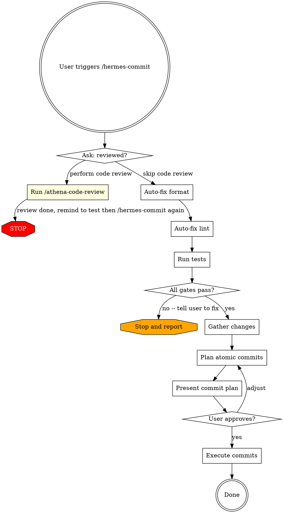

# Hermes (Commit)

## Overview

Verify that changes are reviewed and clean, then plan and execute atomic commits.

**Phase 2 is a HARD GATE.** Before any commit, the working tree must have:

- 0 test failures
- 0 lint errors
- 0 format errors

This applies **even when the failures are pre-existing or unrelated to the current session's changes**. There is no skip option for the gate itself; the only escape hatch is the explicit "Tool missing" branch.

The skill auto-fixes mechanical violations by invoking the formatter and linter in write mode (`dotnet format`, `biome check --write`, `eslint --fix`, etc.); those fixes are pulled into the commit plan in Phase 4. For non-mechanical failures (failing tests, lint diagnostics that cannot be auto-fixed), the skill STOPS and tells the user what to fix -- it does not make judgment-call code edits itself, since logic changes during a commit step are unsafe.

The skill may invoke `/athena-code-review` (which CAN modify code) only when the user picks the review option in Phase 1; in that case the skill terminates after `/athena-code-review` completes and the user must re-invoke `/hermes-commit` on the resulting clean state.

## When to Use

- When you're ready to commit after coding and reviewing
- After running /athena-code-review and testing

## Workflow



## Execution Order

Phases execute strictly in order: Phase 1 -> Phase 2 -> Phase 3 -> Phase 4 -> Phase 5 -> Phase 6. Do not begin a phase until the prior phase has fully completed.

Within Phase 2, sub-steps run strictly in this order: Phase 2A (format auto-fix) -> Phase 2B (lint auto-fix) -> Phase 2C (test suite). Tests run last so they execute on the final post-fix code state.

Within Phase 3, the four `git` commands listed run in parallel; that is the only parallelism allowed in this workflow.

## Phase 1: Gate Check

Use `AskUserQuestion` with the question "Has /athena-code-review been run on the current diff?" and exactly two options:

- **"Yes, review is complete"** -> proceed to Phase 2.
- **"No, run review now"** -> invoke `/athena-code-review`, then STOP and emit verbatim: `Review complete. Test your changes, then run /hermes-commit again.` Do NOT continue to Phase 2 in the same session.

## Phase 2: Hard Gate (Format + Lint + Tests)

This phase is a **HARD GATE**. The skill cannot proceed past Phase 2 unless all three checks (format, lint, tests) report 0 errors and 0 failures. The gate applies **even when the failures are pre-existing or unrelated to the current session's changes** -- if the working tree is broken, the commit does not happen until the working tree is fixed.

There is no skip option for the gate itself. The only escape hatch is the explicit "Tool missing" branch in the Failure Handling section below; that branch only applies when a required tool is not installed.

### Detection

Detect ALL project types present in the workspace (not just the changed-files set -- the gate covers the whole working tree):

- `.csproj` / `.sln` anywhere in the workspace -> run .NET checks.
- `package.json` anywhere in the workspace -> run JS/TS checks.
- Mixed repos: run BOTH for every sub-step. Aggregate results. STOP if any sub-step fails.
- If neither matches, emit verbatim: `No format/lint/test configuration recognized for this repo; proceeding to Phase 3 without verification.` Then continue to Phase 3. Do not invent or guess at commands.

### Phase 2A: Format Auto-Fix

Run the formatter in **write mode** to auto-fix mechanical formatting violations. Any files modified by this step will be picked up by Phase 3 and included in the commit plan in Phase 4.

- **.NET**: `dotnet format` on the solution/project (no `--verify-no-changes` flag -- this is the write pass).
- **JS/TS** (detection precedence, first match wins):
  1. `biome.json` / `biome.jsonc` -> `pnpm biome format --write .`
  2. `.prettierrc.*` or `prettier` key in `package.json` -> `pnpm prettier --write .`
  3. Otherwise: skip the dedicated format step and rely on Phase 2B's linter to format.

After the write pass, run the verification form to confirm 0 remaining issues:

- **.NET**: `dotnet format --verify-no-changes`
- **JS/TS**: `pnpm biome format .` (verify) or `pnpm prettier --check .`

If verification still reports issues, STOP and emit the diagnostic output verbatim followed by:

`Format errors remain after auto-fix. Fix these manually (or run /athena-code-review), then run /hermes-commit again.`

### Phase 2B: Lint Auto-Fix

Run the linter in **fix mode** to auto-fix mechanical lint violations, then run it in verify mode.

- **.NET**: `dotnet format` already covers analyzer-driven lint warnings; no separate step.
- **JS/TS** (detection precedence, first match wins):
  1. `biome.json` / `biome.jsonc` -> `pnpm biome check --write .` then `pnpm biome check .` (verify).
  2. `eslint.config.*` (flat config) -> `pnpm lint --fix` then `pnpm lint` (verify).
  3. `.eslintrc.*` (legacy config) -> same as above.
  4. `package.json` has a `lint:fix` script -> run that, then `pnpm lint`.
  5. `package.json` has a `lint` script only -> run `pnpm lint` in verify mode (no auto-fix available).
  6. None of the above -> skip lint sub-step.

If the verify pass shows remaining errors (i.e. errors the linter could not auto-fix), STOP and emit the violations verbatim followed by:

`Lint errors that cannot be auto-fixed remain. Fix these manually (or run /athena-code-review), then run /hermes-commit again.`

Do not attempt manual code edits to make lint pass -- judgment-call code changes during a commit step are unsafe and that is athena-code-review's job.

### Phase 2C: Test Suite

Run the full test suite for every detected project type. Tests run **after** format/lint auto-fix so they execute on the final post-fix code state.

- **.NET**: `dotnet test` on the solution.
- **JS/TS**:
  1. `package.json` has a `test` script -> `pnpm test`.
  2. Otherwise detect framework directly: `vitest`, `jest`, `playwright` -> run the appropriate command (`pnpm vitest run`, `pnpm jest`, `pnpm playwright test`).
  3. No tests detected -> skip this sub-step (do not block the gate when no tests exist).
- **Mixed**: run both. Aggregate results.

The gate is **0 failures and 0 errors**. Skipped/pending tests are allowed; failed and errored tests are not.

If any test fails, STOP and emit a concise summary of the failing test names followed by:

`Test failures detected (pre-existing or new). Fix these manually (or run /athena-code-review), then run /hermes-commit again.`

Do not attempt manual code edits to make tests pass -- that is athena-code-review's job.

### Failure Handling

- **Tool missing** (command not found, exit code 127): emit `[tool name] is not installed. Install it or skip this sub-step?` and ask the user via `AskUserQuestion` with options "Install and re-run" (STOP, await fix) or "Skip this sub-step" (continue past this single sub-step only -- the rest of the gate still applies). Do not auto-skip.
- **Auto-fix made changes**: that is expected. Note in the Phase 4 commit plan that pre-existing format/lint fixes are included.
- **Verify-pass errors after auto-fix**: STOP per the sub-step instructions above. Do not retry, do not attempt manual edits, do not bypass.

## Phase 3: Gather Changes

Run these four commands in parallel:

- `git status` - see all modified, added, untracked files.
- `git diff` - see unstaged changes.
- `git diff --cached` - see staged changes.
- `git log --oneline -5` - recent commits for message style reference.

If `git status` reports a clean tree and no untracked files, STOP and emit verbatim: `Working tree is clean. Nothing to commit.` Do not enter Phase 4.

If `git diff --cached` shows pre-existing staged changes, STOP and ask the user via `AskUserQuestion`: "There are pre-existing staged changes. How should I handle them?" with three options:

- **"Include them in the plan as-is"** -> continue to Phase 4 with the current index.
- **"Unstage and re-plan from scratch"** -> run `git reset` (no flags, no `--hard`) only after this explicit approval, then re-run Phase 3.
- **"Abort"** -> STOP and leave the working tree untouched.

Read every changed file in the diff using the `Read` tool, with these exceptions:

- Skip files matched by typical generated-content patterns (lock files, `*.min.*`, build artifacts, `dist/`, `node_modules/`).
- For files over 1000 lines, read only the diff hunks via `git diff <file>`.
- For binary files, note their presence but do not read.

## Phase 4: Plan Atomic Commits

Group changes into logical commits. Each commit MUST be:

- **Self-contained** - builds independently.
- **Single purpose** - one logical change.
- **Properly ordered** - dependencies committed first.

Reject any candidate commit that fails any of the three rules; re-plan instead of relaxing them.

### Grouping Strategy

1. Identify logical units of change (a feature, a bugfix, a refactor, a test addition).
2. Within each unit, order by dependency layer:
   - Domain/Core entities and interfaces first.
   - Business logic / use cases second.
   - Infrastructure / persistence third.
   - API / presentation fourth.
   - Tests last (or alongside their layer).
3. Keep changes in one commit when ALL of the following hold:
   - Total diff is under 150 lines added+removed.
   - All files share a single logical purpose (one entity, one bugfix, one refactor).
   - Splitting by layer would produce a commit that does not build on its own.

   Otherwise, split by layer per the ordering rules above.

### Commit Message Format

Use conventional commits: `type(scope): description`

| Type | When |
|------|------|
| `feat` | New feature / wholly new functionality |
| `fix` | Bug fix |
| `refactor` | Code restructuring, no behavior change |
| `test` | Adding or updating tests only |
| `docs` | Documentation only |
| `chore` | Maintenance, dependency updates |

**Read `git log --oneline -5`** to match the repository's existing commit message style.

Do NOT add: `Generated with Claude Code`, `Co-Authored-By: Claude`, any AI attribution trailer, or any signature line. Commit messages contain only the conventional commit body.

### Present the Plan

Show a numbered table:

```
| # | Type | Files | Message |
|---|------|-------|---------|
| 1 | feat(core) | Entity.cs, IRepo.cs | add Widget entity and repository interface |
| 2 | feat(usecase) | Handler.cs, Dto.cs | implement CreateWidget command handler |
| 3 | feat(api) | Endpoint.cs | expose CreateWidget endpoint |
| 4 | test(widget) | HandlerTests.cs | add CreateWidget handler unit tests |
```

After presenting the plan, route the user response as follows:

- "approve" / "yes" / "lgtm" -> Phase 5.
- "adjust X" / "merge Y and Z" / "split N" -> revise the plan, present again, re-ask.
- "abort" / "cancel" / "no" / "stop" -> STOP. Do not commit. Leave the working tree untouched.
- Anything else -> ask the user to choose one of the three options above. Do not guess.

## Phase 5: Execute Commits

For each commit N in the plan, in order:

1. `git add <specific files for commit N>`.
2. `git commit -m "<message N>"` using a HEREDOC for the message body.
3. `git status` immediately after the commit completes.
4. If commit N failed (non-zero exit, hook rejection, or `git status` shows files still staged), STOP. Do not proceed to commit N+1. Report the failure verbatim and wait for user instruction.

Do not batch the per-commit `git status` to the end of the loop -- run it after every commit.

**NEVER** use `git add -A` or `git add .` -- always stage specific files.

## Phase 6: Terminate

After the last commit's `git status` verification, emit a one-line summary in this exact format:

`Committed N atomic commits. Working tree clean.`

Then STOP. Do not push, do not offer to push, do not propose follow-up work, do not run any further commands. The skill ends here.

## Red Flags - STOP

Each item below is a HARD rule. Hitting any of them means STOP in the current response.

- About to make a logic / judgment-call code edit during commit -> STOP. Mechanical auto-fix via the formatter or linter (`dotnet format`, `biome check --write`, `eslint --fix`) is allowed and expected; hand-editing source to silence a lint diagnostic or pass a test is NOT.
- About to bypass the Phase 2 gate (skip tests, skip lint, skip format, "just this once") -> STOP. The gate is a HARD gate. The only branch that allows skipping a sub-step is the explicit Tool-missing branch.
- About to `git add -A` or `git add .` -> stage specific files only.
- Committing `.env`, credentials, or secrets -> warn the user and STOP.
- Commit message doesn't match the actual changes -> rewrite it.
- Test failures, format errors, or lint errors remain after the Phase 2 auto-fix passes -> STOP. Tell the user to fix and re-invoke `/hermes-commit`.
- Skipping the review gate -> always ask.
- NEVER push, force-push, tag, create branches, or open PRs. This skill commits only. Stop after Phase 6's `git status` verification.
- NEVER use `--amend`, `--no-verify`, `--no-gpg-sign`, or any flag that bypasses hooks/signing. If a hook fails, STOP and report the failure to the user; do not retry with bypass flags.
- NEVER run `git reset --hard`, `git checkout --`, `git restore`, `git clean`, or any destructive command. The only `git reset` permitted is the no-flag form in Phase 3 after explicit user approval to unstage pre-existing staged changes.

## Common Mistakes

Each row below is a HARD rule. Hitting the left column means STOP and follow the right column. Do not proceed in the same response.

| Mistake | Fix |
|---------|-----|
| Hand-editing code to make tests/lint pass during commit | Never make logic changes. Mechanical auto-fix via formatter/linter is fine; anything else is athena-code-review's job. |
| Grouping unrelated changes in one commit | Split by logical unit, not by file proximity. |
| Writing commit messages about "what" not "why" | Focus on purpose: "support widget filtering" not "add if statement". |
| Staging files that weren't reviewed | Only commit files that passed review. |
| Skipping any sub-step of the Phase 2 gate | The gate is hard. Run format auto-fix, lint auto-fix, AND tests every time. |
| Treating pre-existing failures as out-of-scope | Pre-existing failures still block the commit. The gate does not care whose code broke it. |
