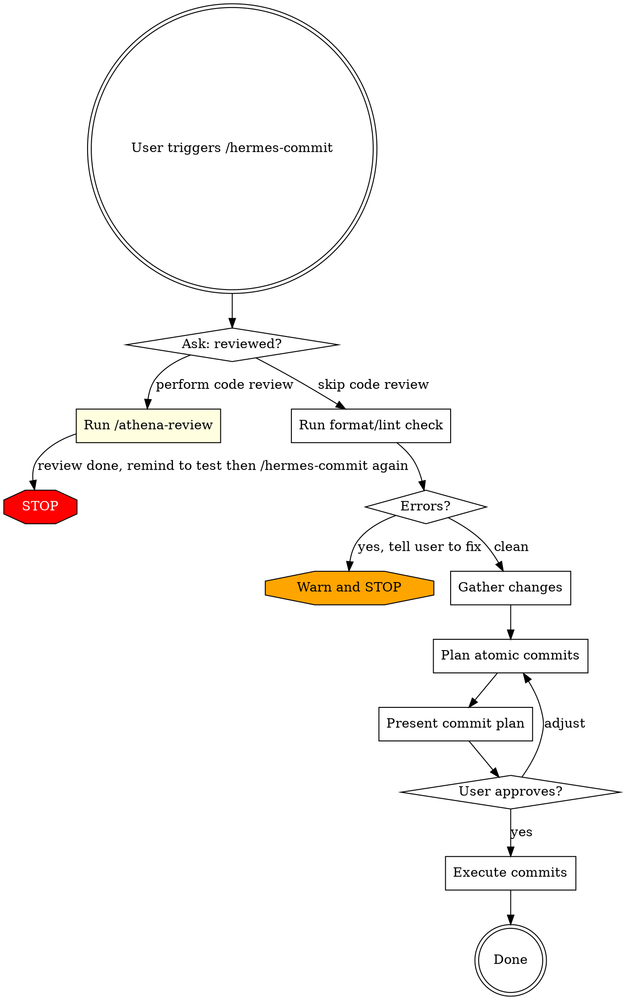

# Hermes (Commit)

## Overview

Verify that changes are reviewed and clean, then plan and execute atomic commits. This skill itself never modifies code. It may invoke `/athena-review` (which CAN modify code) only when the user picks the review option in Phase 1; in that case the skill terminates after `/athena-review` completes and the user must re-invoke `/hermes-commit` on the resulting clean state. If verification fails at any phase, this skill STOPS and tells the user what to fix -- it never auto-fixes.

## When to Use

- When you're ready to commit after coding and reviewing
- After running /athena-review and testing

## Workflow



## Execution Order

Phases execute strictly in order: Phase 1 -> Phase 2 -> Phase 3 -> Phase 4 -> Phase 5 -> Phase 6. Do not begin a phase until the prior phase has fully completed. Within Phase 3, the four `git` commands listed run in parallel; that is the only parallelism allowed in this workflow.

## Phase 1: Gate Check

Use `AskUserQuestion` with the question "Has /athena-review been run on the current diff?" and exactly two options:

- **"Yes, review is complete"** -> proceed to Phase 2.
- **"No, run review now"** -> invoke `/athena-review`, then STOP and emit verbatim: `Review complete. Test your changes, then run /hermes-commit again.` Do NOT continue to Phase 2 in the same session.

## Phase 2: Format/Lint Verification

Detect ALL project types present in the changed-files set (the files reported by `git status`):

- If any changed file is under a directory containing `.csproj` or `.sln` -> run the .NET check on that project.
- If any changed file is under a directory containing `package.json` -> run the JS/TS check.
- Mixed repos: run BOTH. Aggregate errors. Stop if either reports errors.
- If neither matches the changed files, emit verbatim: `No format/lint configuration recognized for this repo; proceeding to Phase 3 without format verification.` Then continue to Phase 3. Do not invent or guess at a lint command.

Always run in **verify-only mode** -- never auto-fix.

### .NET projects (`.sln` or `.csproj` in workspace)
- Run `dotnet format --verify-no-changes` on the solution/project.
- This checks code style, formatting, and analyzer warnings.
- Do NOT run JS/TS linters -- .NET projects do not use them.

### JavaScript/TypeScript projects

Detection precedence (first match wins):

1. `biome.json` or `biome.jsonc` -> `pnpm biome check` (without `--write`).
2. `eslint.config.*` (flat config) -> `pnpm lint`.
3. `.eslintrc.*` (legacy config) -> `pnpm lint`.
4. `package.json` `scripts.lint` present -> `pnpm lint`.

Stop at the first match.

### Failure handling

Distinguish two failure modes:

- **Tool missing** (command not found, exit code 127): emit `Format check tool [name] is not installed. Install it or skip this check?` and ask the user via `AskUserQuestion` with options "Install and re-run" (STOP, await fix) or "Skip this check" (continue to Phase 3). Do not auto-skip.
- **Style/format violations** (tool ran, returned non-zero with diagnostic output): STOP and emit the violations verbatim followed by: `Fix these before committing, then run /hermes-commit again.` Do not fix them -- that is athena's job.

## Phase 3: Gather Changes

Run these four commands in parallel:

- `git status` - see all modified, added, untracked files.
- `git diff` - see unstaged changes.
- `git diff --cached` - see staged changes.
- `git log --oneline -5` - recent commits for message style reference.

If `git status` reports a clean tree and no untracked files, STOP and emit verbatim: `Working tree is clean. Nothing to commit.` Do not enter Phase 4.

If `git diff --cached` shows pre-existing staged changes, STOP and ask the user via `AskUserQuestion`: "There are pre-existing staged changes. How should I handle them?" with three options:

- **"Include them in the plan as-is"** -> continue to Phase 4 with the current index.
- **"Unstage and re-plan from scratch"** -> run `git reset` (no flags, no `--hard`) only after this explicit approval, then re-run Phase 3.
- **"Abort"** -> STOP and leave the working tree untouched.

Read every changed file in the diff using the `Read` tool, with these exceptions:

- Skip files matched by typical generated-content patterns (lock files, `*.min.*`, build artifacts, `dist/`, `node_modules/`).
- For files over 1000 lines, read only the diff hunks via `git diff <file>`.
- For binary files, note their presence but do not read.

## Phase 4: Plan Atomic Commits

Group changes into logical commits. Each commit MUST be:

- **Self-contained** - builds independently.
- **Single purpose** - one logical change.
- **Properly ordered** - dependencies committed first.

Reject any candidate commit that fails any of the three rules; re-plan instead of relaxing them.

### Grouping Strategy

1. Identify logical units of change (a feature, a bugfix, a refactor, a test addition).
2. Within each unit, order by dependency layer:
   - Domain/Core entities and interfaces first.
   - Business logic / use cases second.
   - Infrastructure / persistence third.
   - API / presentation fourth.
   - Tests last (or alongside their layer).
3. Keep changes in one commit when ALL of the following hold:
   - Total diff is under 150 lines added+removed.
   - All files share a single logical purpose (one entity, one bugfix, one refactor).
   - Splitting by layer would produce a commit that does not build on its own.

   Otherwise, split by layer per the ordering rules above.

### Commit Message Format

Use conventional commits: `type(scope): description`

| Type | When |
|------|------|
| `feat` | New feature / wholly new functionality |
| `fix` | Bug fix |
| `refactor` | Code restructuring, no behavior change |
| `test` | Adding or updating tests only |
| `docs` | Documentation only |
| `chore` | Maintenance, dependency updates |

**Read `git log --oneline -5`** to match the repository's existing commit message style.

Do NOT add: `Generated with Claude Code`, `Co-Authored-By: Claude`, any AI attribution trailer, or any signature line. Commit messages contain only the conventional commit body.

### Present the Plan

Show a numbered table:

```
| # | Type | Files | Message |
|---|------|-------|---------|
| 1 | feat(core) | Entity.cs, IRepo.cs | add Widget entity and repository interface |
| 2 | feat(usecase) | Handler.cs, Dto.cs | implement CreateWidget command handler |
| 3 | feat(api) | Endpoint.cs | expose CreateWidget endpoint |
| 4 | test(widget) | HandlerTests.cs | add CreateWidget handler unit tests |
```

After presenting the plan, route the user response as follows:

- "approve" / "yes" / "lgtm" -> Phase 5.
- "adjust X" / "merge Y and Z" / "split N" -> revise the plan, present again, re-ask.
- "abort" / "cancel" / "no" / "stop" -> STOP. Do not commit. Leave the working tree untouched.
- Anything else -> ask the user to choose one of the three options above. Do not guess.

## Phase 5: Execute Commits

For each commit N in the plan, in order:

1. `git add <specific files for commit N>`.
2. `git commit -m "<message N>"` using a HEREDOC for the message body.
3. `git status` immediately after the commit completes.
4. If commit N failed (non-zero exit, hook rejection, or `git status` shows files still staged), STOP. Do not proceed to commit N+1. Report the failure verbatim and wait for user instruction.

Do not batch the per-commit `git status` to the end of the loop -- run it after every commit.

**NEVER** use `git add -A` or `git add .` -- always stage specific files.

## Phase 6: Terminate

After the last commit's `git status` verification, emit a one-line summary in this exact format:

`Committed N atomic commits. Working tree clean.`

Then STOP. Do not push, do not offer to push, do not propose follow-up work, do not run any further commands. The skill ends here.

## Red Flags - STOP

Each item below is a HARD rule. Hitting any of them means STOP in the current response.

- About to fix code during commit -> STOP. Tell user to run `/athena-review` and test first.
- About to `git add -A` or `git add .` -> stage specific files only.
- Committing `.env`, credentials, or secrets -> warn the user and STOP.
- Commit message doesn't match the actual changes -> rewrite it.
- Format/lint errors detected -> STOP. Tell user to fix first.
- Skipping the review gate -> always ask.
- NEVER push, force-push, tag, create branches, or open PRs. This skill commits only. Stop after Phase 6's `git status` verification.
- NEVER use `--amend`, `--no-verify`, `--no-gpg-sign`, or any flag that bypasses hooks/signing. If a hook fails, STOP and report the failure to the user; do not retry with bypass flags.
- NEVER run `git reset --hard`, `git checkout --`, `git restore`, `git clean`, or any destructive command. The only `git reset` permitted is the no-flag form in Phase 3 after explicit user approval to unstage pre-existing staged changes.

## Common Mistakes

Each row below is a HARD rule. Hitting the left column means STOP and follow the right column. Do not proceed in the same response.

| Mistake | Fix |
|---------|-----|
| Fixing code during commit | Never change code. That's athena's job. |
| Grouping unrelated changes in one commit | Split by logical unit, not by file proximity. |
| Writing commit messages about "what" not "why" | Focus on purpose: "support widget filtering" not "add if statement". |
| Staging files that weren't reviewed | Only commit files that passed review. |
| Skipping format/lint check | Always verify format/lint is clean before committing. |
