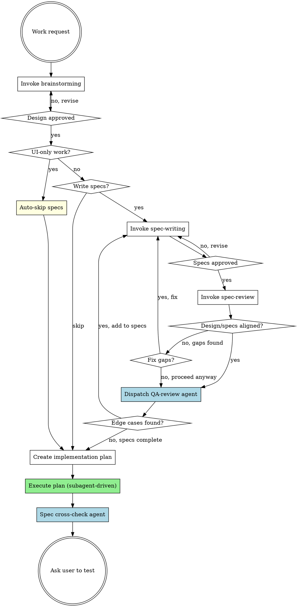

# Pandahrms Pipeline

## Overview

Unified pipeline for Pandahrms projects: brainstorm, spec writing, spec review, implementation planning, and execution -- all in a single session. This skill replaces the separate `design-pipeline` and `execution-pipeline` skills.

**Use this skill INSTEAD of invoking `superpowers:brainstorming` directly** in any Pandahrms project.

**Announce at start:** "I'm using the Pandahrms pipeline to orchestrate design through execution."

## Fast Path

If invoked with a plan file path (e.g., `/pipeline path/to/plan.md`), skip steps 1-6 and start directly at step 7 (Execute plan).

<HARD-GATE>
OVERRIDE: When the brainstorming skill completes and instructs you to "invoke writing-plans", do NOT invoke writing-plans. Instead, return to THIS pipeline and ask the user whether they want to write specs first.

The brainstorming skill says: "The ONLY skill you invoke after brainstorming is writing-plans." In Pandahrms projects, this instruction is OVERRIDDEN by this pipeline. You MUST ask the user before proceeding.
</HARD-GATE>

<HARD-GATE>
OVERRIDE: When subagent-driven-development instructs implementer subagents to commit after completing a task, DO NOT commit. Leave all changes uncommitted. The user will test first and then run /commit to commit clean, reviewed code.

This applies to ALL subagent dispatch prompts -- never include commit instructions when dispatching implementer subagents.
</HARD-GATE>

## Pipeline



## Checklist

You MUST create a task for each of these items and complete them in order:

1. **Brainstorm the design** -- invoke `superpowers:brainstorming` to explore the idea, propose approaches, and present the design. Do NOT auto-commit the design doc -- leave it uncommitted for the user to review. When brainstorming tells you to "invoke writing-plans", STOP and return here instead.
2. **Check: UI-only work?** -- If the work is purely UI/presentation (styling, layout, component design, theming, responsiveness, animations, dark mode, visual polish), auto-skip specs and go directly to step 6. Announce: "Skipping spec-writing -- this is a UI-only change with no business behavior impact."
3. **Ask: Write specs?** (non-UI work only) -- use AskUserQuestion to ask: "Would you like to write Gherkin specs before proceeding to the implementation plan?" with options: "Yes, write specs" and "Skip specs". Users may skip if the session is purely exploratory or an open discussion without concrete implementation targets. If yes, invoke `pandahrms:spec-writing` to write or update specs in pandahrms-spec based on the approved design doc.
4. **Review specs against design** -- invoke `pandahrms:spec-review` to cross-check the design doc against the written specs. This ensures every design requirement has spec coverage and nothing was missed. If no specs were written (user skipped step 3), this step is automatically skipped. If gaps are found, ask the user whether to fix them (loop back to spec-writing) or proceed anyway.
5. **QA review: edge cases** -- dispatch a QA-review sub-agent (using the Agent tool) to independently review the feature specs for missed edge cases, unhappy paths, boundary conditions, and implicit requirements not explicitly stated in the design. If no specs were written (user skipped step 3), this step is automatically skipped. See [QA Review Agent](#qa-review-agent) below.
6. **Create implementation plan** -- invoke `superpowers:writing-plans` to plan the implementation based on the approved design and specs.
7. **Execute plan** -- the plan will be executed via `superpowers:subagent-driven-development` (v5 default). Apply the no-commit override: implementer subagents must NOT commit after tasks. All changes remain uncommitted.
8. **Spec cross-check** -- after all tasks are executed, dispatch a spec cross-check agent to verify the full implementation matches the feature specs. See [Spec Cross-Check Agent](#spec-cross-check-agent) below. Skip if no specs exist.
9. **Ask user to test** -- present the spec cross-check results, then end with: "Please test your changes, then run /commit when ready."

## Time Tracking

Track elapsed time across the full pipeline. Display a summary when execution completes.

### How to track

1. **On task start** -- record the current time (use `date +%s` via Bash)
2. **On task completion** -- record the end time, calculate the duration, and display it: `"Task N completed in Xm Ys"`
3. **On final task completion** -- display a summary:

```
Development Summary
===========================
Brainstorm the design       --  12m 34s
Check: UI-only work?        --   0m 05s
Ask: Write specs?           --   8m 21s
Review specs against design --   3m 10s
QA review: edge cases       --   2m 45s
Create implementation plan  --  15m 02s
---------------------------
Design total                --  41m 57s
---------------------------
Plan Task 1: ...            --   3m 12s
Plan Task 2: ...            --   5m 45s
Plan Task 3: ...            --  12m 08s
...
---------------------------
Execution total             --  42m 31s
Spec cross-check            --   1m 20s
===========================
Grand total                 --  1h 25m 48s
```

Skipped tasks show `-- skipped` instead of a duration.

## QA Review Agent

After spec-review confirms alignment (or the user proceeds despite gaps), dispatch a sub-agent to independently audit the specs for completeness. This agent looks for what the spec author and reviewer might have missed -- edge cases that only surface when you ask "what could go wrong?"

### Skip Condition

Skip this step entirely when:
- No specs were written (user skipped step 3)
- The work is UI-only (auto-skipped at step 2)

Announce: "Skipping QA review -- no specs to review."

### Agent Dispatch

Use the Agent tool with the following prompt structure. Replace the placeholders with actual file paths.

```
prompt: |
  You are a QA reviewer. Your job is to review Gherkin feature specs for a
  Pandahrms feature and identify missed edge cases, unhappy paths, boundary
  conditions, and implicit requirements.

  ## Inputs

  Design document: {design_doc_path}
  Spec files: {spec_file_paths}

  Read the design document and all spec files.

  ## What to Look For

  1. **Unhappy paths** -- What happens when the user provides invalid input,
     cancels mid-flow, loses connectivity, or hits a timeout?
  2. **Boundary conditions** -- Empty lists, maximum lengths, zero values,
     exactly-at-limit values, off-by-one scenarios.
  3. **Concurrent/conflicting actions** -- Two users editing the same record,
     duplicate submissions, race conditions.
  4. **Permission edge cases** -- User's role changes mid-session, permission
     revoked after page load, cross-tenant access attempts.
  5. **Data state edge cases** -- Soft-deleted records, archived entities,
     null/missing optional fields, migrated legacy data.
  6. **Implicit requirements** -- Behavior the design assumes but never states
     (e.g., audit logging, notification triggers, cascade effects).

  ## Output Format

  Return a structured report:

  ### Edge Cases Found

  For each finding:
  - **ID**: QA-1, QA-2, etc.
  - **Category**: (unhappy path | boundary | concurrency | permission | data state | implicit requirement)
  - **Description**: What the edge case is
  - **Suggested scenario**: A Gherkin scenario outline (Given/When/Then) that would cover it
  - **Severity**: (high | medium | low) -- high means likely to cause a bug in production

  ### Summary

  - Total findings: [count]
  - High severity: [count]
  - Medium severity: [count]
  - Low severity: [count]

  If you find zero edge cases, state that explicitly -- do not invent findings.
  Focus on quality over quantity. Only report genuine gaps, not theoretical
  scenarios that the feature's scope clearly excludes.

description: "QA review specs for edge cases"
```

### Handling Results

After the agent returns:

- **Zero findings** -- announce "QA review complete -- no additional edge cases found." Proceed to step 6.
- **Findings returned** -- present the agent's report to the user, then use AskUserQuestion: "QA review found [count] edge cases ([high_count] high severity). Would you like to add these to the specs?" with options:
  - **"Yes, add to specs"** -- loop back to `pandahrms:spec-writing` to incorporate the high and medium severity findings as new scenarios. Low severity findings are included only if the user explicitly asks.
  - **"No, proceed to planning"** -- proceed to step 6. The findings are still visible in the conversation for reference during implementation.

## Spec Cross-Check Agent

After all plan tasks are executed, dispatch a spec cross-check agent to verify the implementation covers all feature specs. This catches scenarios that span multiple tasks, plan gaps where a spec scenario had no corresponding task, and integration gaps between tasks.

### Skip Condition

Skip when:
- No specs were written (user skipped step 3)
- The work is UI-only
- Spec repo not found

Announce the skip reason.

### Agent Dispatch

```
prompt: |
  You are a spec compliance reviewer. Your job is to verify that the
  implementation matches the feature's Gherkin specs.

  ## Task

  1. Run `git diff` to get all working tree changes
  2. Locate the spec repo at `$(dirname $PWD)/pandahrms-spec/`
  3. Identify which module/feature area the changes belong to
  4. Find all related `.feature` files
  5. For each spec scenario, check whether the implementation satisfies it:
     - Are the described behaviors implemented?
     - Do validation rules match spec expectations?
     - Are authorization checks in place as specified?
     - Do status transitions match the spec flow?
  6. Report findings

  ## Report Format

  ## Spec Cross-Check Results

  ### Summary
  - Spec scenarios checked: [count]
  - Implemented: [count]
  - Not implemented: [count]
  - Divergent: [count]

  ### Issues (if any)
  | # | Spec Scenario | File | Status | Notes |
  |---|---|---|---|---|
  | 1 | [scenario] | [file.feature] | Not implemented | [what's missing] |
  | 2 | [scenario] | [file.feature] | Divergent | [how it differs] |

  If all scenarios are covered, state that explicitly.

description: "Spec cross-check: verify implementation matches feature specs"
```

## Critical Override: Brainstorming Terminal State

The `superpowers:brainstorming` skill's terminal step says:

> "Transition to implementation -- invoke writing-plans skill to create implementation plan"

In Pandahrms projects, this step is REPLACED by:

> "Ask the user whether to write specs -- if yes, invoke pandahrms:spec-writing to write Gherkin specs based on the approved design. If the user skips, proceed directly to writing-plans."

Only after the user has been asked (and specs are written if requested) should you invoke `superpowers:writing-plans`.

## Critical Override: No Commits During Execution

When `superpowers:subagent-driven-development` dispatches implementer subagents, it instructs them to commit after completing each task. In Pandahrms projects, this is OVERRIDDEN:

- **Do NOT include commit instructions** in implementer subagent prompts
- **Do NOT run `git commit`** at any point during execution
- All changes remain uncommitted until the user tests and runs `/commit`
- If subagent-driven-development's skill text says "commit", ignore that instruction

This ensures the user can review the full feature, test it, and make atomic commits via the `/commit` skill.

## Red Flags

| Thought | Reality |
|---------|---------|
| "Brainstorming said invoke writing-plans" | This pipeline overrides that for Pandahrms projects |
| "I'll skip specs without asking" | Always ask the user. They decide whether specs are needed. |
| "The design doc is enough" | Design doc captures WHAT. Specs capture BEHAVIOR. Ask the user. |
| "Specs look fine, skip the review" | Always run spec-review after writing specs. It catches gaps you won't notice manually. |
| "Specs are aligned, skip QA review" | The QA agent finds what both author and reviewer miss -- edge cases, unhappy paths, implicit requirements. Always run it after spec-review. |
| "This change is too small for specs" | Don't assume -- ask the user. They may still want specs (unless it's UI-only, then auto-skip). |
| "Let me commit after each task" | Never commit. User tests first, then /commit. |
| "The per-task reviews covered specs" | Per-task reviews check individual tasks. The spec cross-check catches gaps across tasks and missing scenarios. Always run it. |
| "I'll skip the spec cross-check" | It's mandatory when specs exist. Only skip if no specs were written. |

## When to Use

- Any development work in a Pandahrms project that would normally trigger brainstorming
- Features, bug fixes, refactors, or behavioral changes
- Executing an existing plan file in a Pandahrms project (fast path)

## When NOT to Use

- Quick fixes that don't need brainstorming (typos, config changes)
- Non-Pandahrms projects (use brainstorming directly)
- Writing specs for existing functionality without a new design (use `pandahrms:spec-writing` directly)
