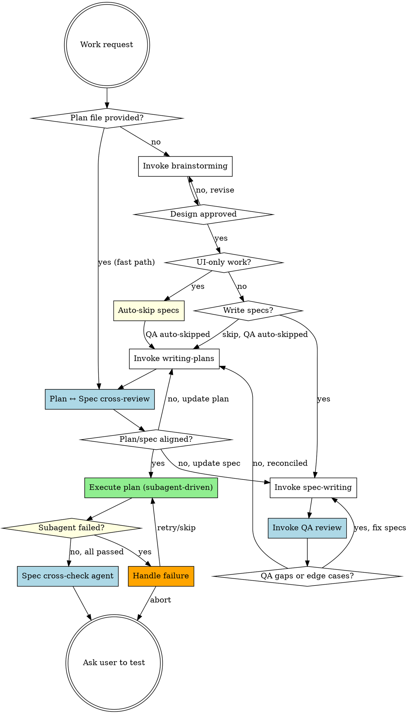

# Pandahrms Pipeline

## Overview

Unified pipeline for Pandahrms projects: brainstorm, spec writing, QA review, implementation planning, plan/spec cross-review, and execution -- all in a single session. This skill replaces the separate `design-pipeline` and `execution-pipeline` skills.

**Use this skill INSTEAD of invoking `superpowers:brainstorming` directly** in any Pandahrms project.

**Announce at start:** "I'm using the Pandahrms pipeline to orchestrate design through execution."

## Fast Path (plan provided)

If invoked with a plan file path (e.g., `/pipeline path/to/plan.md`), skip steps 1-5 and start directly at step 6 (Plan ↔ Spec cross-review), then step 7 (Execute plan).

- Initialize time tracking as normal
- Announce: "Executing existing plan -- running plan/spec cross-review, then execution."
- Still run step 6 (Plan ↔ Spec cross-review) to catch drift between the pre-existing plan and current specs
- After execution, still run step 8 (spec cross-check) if specs exist for the feature
- Still run step 9 (ask user to test) with the Development Summary

## Tiny-Task Triage

Skip this section entirely if Fast Path applies (a plan file was provided). Otherwise, before starting step 1, check whether the request is a **narrow, well-specified task** that does not warrant a full brainstorm + spec cycle. Examples:

- Single-file bug fix with a clear reproduction
- Rename/refactor with no behavior change
- Config/dependency bump
- Adjusting a specific validation rule that's already in the spec
- Adding a unit test for existing behavior

If yes, use AskUserQuestion: "This looks like a narrow task -- skip brainstorming and specs, go directly to writing a short plan?" with options:

- **"Yes, fast-track"** -- skip steps 1-4. Jump to step 5 (Create plan). No brainstorm, no spec changes, QA auto-skipped. Standards in step 7 still apply (TDD, SOLID, DDD, spec cross-check if specs exist).
- **"No, full pipeline"** -- proceed to step 1 normally.

Ask only when the scope is genuinely narrow. When in doubt, run the full pipeline -- over-triage erodes quality. Users may override either direction.

Record the triage decision in the plan file's `## Pipeline Progress` section once the plan exists.

## Resume Path

If invoked with `/pipeline --resume`:

1. Read the plan file's `## Pipeline Progress` section to determine which steps completed and their timing
2. Announce: "Resuming pipeline from step N -- [step name]."
3. Continue from the next incomplete step with full time tracking
4. If no plan file exists or has no progress section, announce: "No pipeline state found -- starting fresh." and begin from step 1

<HARD-GATE>
OVERRIDE: When the brainstorming skill completes and instructs you to "invoke writing-plans", do NOT invoke writing-plans. Instead, return to THIS pipeline and ask the user whether they want to write specs first.

The brainstorming skill says: "The ONLY skill you invoke after brainstorming is writing-plans." In Pandahrms projects, this instruction is OVERRIDDEN by this pipeline. You MUST ask the user before proceeding.
</HARD-GATE>

<HARD-GATE>
OVERRIDE: At the end of `superpowers:writing-plans`, the skill asks the user to choose between "Subagent-Driven" and "Inline Execution". DO NOT present this choice. Auto-select subagent-driven and proceed first to step 6 (Plan ↔ Spec cross-review), then to step 7 (Execute). This pipeline requires subagent-driven execution — inline execution is not an option.

Announce: "Plan complete. Running plan/spec cross-review, then subagent-driven execution."
</HARD-GATE>

<HARD-GATE>
OVERRIDE: When subagent-driven-development instructs implementer subagents to commit after completing a task, DO NOT commit. Leave all changes uncommitted. The user will test first and then run /commit to commit clean, reviewed code.

This applies to ALL subagent dispatch prompts -- never include commit instructions when dispatching implementer subagents.
</HARD-GATE>

<HARD-GATE>
AUTHORITY HIERARCHY:

**Design time (steps 1-5):** Discussion/decisions are the source of truth. If a discussion or decision diverges from the existing spec, UPDATE the spec before writing the plan. Never write a plan that contradicts the spec -- update the spec first, then plan from the updated spec.

**Execution time (step 7):** The plan is the source of truth for each implementer subagent. But implementers MUST cross-check against the spec. If plan and spec disagree, STOP and report -- never silently pick one.

**Never silently reconcile.** Always ask the user or flag the conflict when authority sources disagree.
</HARD-GATE>

<HARD-GATE>
EXECUTION STANDARDS: Every implementer subagent dispatched in step 7 MUST follow:

1. **Plan-driven execution** -- the plan task is the work order
2. **Spec cross-check** -- verify the implementation satisfies the spec scenarios the plan task references. If plan and spec disagree, stop and report.
3. **TDD** -- invoke `superpowers:test-driven-development`. Red-Green-Refactor, test-first, no production code without a failing test.
4. **SOLID** -- follow `~/.claude/rules/SOLID.md`. Single responsibility, dependency injection, small focused interfaces.
5. **DDD** -- follow Domain-Driven Design. Align code with the domain model expressed in the spec: use ubiquitous language from the spec in names (entities, value objects, aggregates, domain events). Respect bounded contexts -- do not leak infrastructure concerns into domain logic. Keep aggregates transactionally consistent.

Each subagent must confirm compliance in its self-report (see [Execution Standards Prefix](#execution-standards-prefix)). Violations trigger retry or failure handling.
</HARD-GATE>

## Pipeline



## Checklist

You MUST create a task for each of these items and complete them in order. Apply [Time Tracking](#time-tracking) to every step -- record start/end times and pause during user prompts. The timing section has full details; do not duplicate timing logic here.

1. **Brainstorm the design** -- invoke `superpowers:brainstorming` to explore the idea, propose approaches, and present the design. Do NOT auto-commit the design doc -- leave it uncommitted for the user to review. When brainstorming tells you to "invoke writing-plans", STOP and return here instead.
2. **Check: UI-only work?** -- if the work is purely UI/presentation (styling, layout, component design, theming, responsiveness, animations, dark mode, visual polish), auto-skip specs and go directly to step 5 (QA auto-skipped too since no specs). Announce: "Skipping spec-writing -- this is a UI-only change with no business behavior impact."
3. **Write or update specs?** (non-UI work only) -- use AskUserQuestion to ask: "Would you like to write/update Gherkin specs before proceeding to the implementation plan?" with options: "Yes, write/update specs" and "Skip specs". Users may skip if the session is purely exploratory or an open discussion without concrete implementation targets. If yes, invoke `pandahrms:spec-writing` to write or update specs in pandahrms-spec. **Discussion/decisions are authoritative** -- if the brainstorming produced decisions that diverge from existing specs, update the spec to reflect the new decisions BEFORE writing the plan. Never leave an outdated spec to be reconciled later. Present the written/updated specs to the user for review before proceeding.
4. **QA review** -- dispatch the QA-review sub-agent (two-pass: design↔spec coverage + edge cases) and wait for it to complete before moving on. See [QA Review Agent](#qa-review-agent) for dispatch prompt and result handling. If QA surfaces coverage gaps or new scenarios, loop back to `pandahrms:spec-writing` to update the specs, then re-run QA. When QA returns zero blocking findings (or the user chooses to proceed), move on to step 5. Skip this step entirely if no specs exist (UI-only or "skip specs" path).
5. **Create implementation plan** -- invoke `superpowers:writing-plans` to produce the plan. **Plan requirement**: if specs exist, each implementation task must reference the spec scenario(s) it satisfies (e.g. "implements `features/performance/goal-approval.feature:Scenario: approver revokes approval`"). Plans without spec references must be rewritten. If no specs exist (UI-only or "skip specs" path), this requirement does not apply. **Writing-plans must mark task dependencies explicitly** so step 7 can parallel-dispatch independent tasks.
6. **Plan ↔ Spec cross-review** -- after the plan is written, verify bi-directional coverage: (a) every plan task references a spec scenario, and (b) every in-scope spec scenario has at least one plan task. If gaps exist, fix them (update the plan, the spec, or both) before execution. Skip if no specs exist. See [Plan-Spec Cross-Review](#plan-spec-cross-review) below.
7. **Execute plan** -- the plan will be executed via `superpowers:subagent-driven-development` (v5 default). **Dispatch independent tasks in parallel** -- tasks the plan marks as having no dependencies on each other should be dispatched in a single Agent tool call batch to cut wall-clock time. Every implementer subagent dispatch prompt MUST include the standards prefix from [Execution Standards Prefix](#execution-standards-prefix) -- spec cross-check + TDD + SOLID + DDD. Apply the no-commit override: implementer subagents must NOT commit after tasks. All changes remain uncommitted. Time tracking records the step as a whole (wall-clock from first dispatch to last return); per-subagent timing is NOT tracked. If a subagent fails, follow [Subagent Failure Handling](#subagent-failure-handling).
8. **Spec cross-check** -- after all tasks are executed, dispatch a spec cross-check agent to verify the full implementation matches the feature specs. See [Spec Cross-Check Agent](#spec-cross-check-agent) below. Skip if no specs exist.
9. **Ask user to test** -- present the spec cross-check results and the Development Summary, then end with: "Please test your changes, then run /commit when ready."

## Time Tracking

Track **active work time** across the full pipeline -- time spent by Claude doing work, excluding time waiting for user input or blocked on external factors. Display a summary when execution completes.

### How to track

1. **On step start** -- record the current time (use `date +%s` via Bash)
2. **Before any user prompt** -- record a pause timestamp. This includes:
   - AskUserQuestion calls (design approval, "write specs?", "add QA findings to specs?", "how to resolve plan/spec gaps?", subagent-failure prompts)
   - Any blocker requiring user action (e.g., environment issue, missing access)
   - Presenting results and waiting for user to respond
3. **After user responds** -- record a resume timestamp. Add the paused duration to the step's excluded time.
4. **On step completion** -- calculate: `duration = (end - start) - total_excluded_time`. Display: `"Step N completed in Xm Ys (active work)"`
5. **On final step completion** -- display a summary:

```
Development Summary (active work time, excludes user-wait)
===========================
Brainstorm the design       --  12m 34s
Check: UI-only work?        --   0m 05s
Write specs                 --   8m 21s
QA review                   --   2m 45s
Create implementation plan  --  15m 02s
Plan ↔ Spec cross-review    --   1m 30s
Execute plan                --  42m 31s
Spec cross-check            --   1m 20s
===========================
Grand total (active)        --  1h 24m 08s
Total wall-clock time       --  2h 10m 15s
User-wait time              --     44m 27s
```

### What counts as paused time

| Paused (exclude from timing) | Active (include in timing) |
|------------------------------|---------------------------|
| Waiting for user to answer AskUserQuestion | Claude processing after user responds |
| User reviewing a design doc or spec | Brainstorming, writing specs, planning |
| User fixing an environment issue | Subagent execution |
| Blocked on external dependency | Reading files, running commands |

### Implementation

Use the plan file as the single source of truth for both progress tracking and timing. Before the plan file exists (steps 1-4), hold timestamps in conversation context. Once the plan is created (step 5), persist everything into the plan file.

Use the Read and Write tools for all plan file I/O. Only use Bash for `date +%s`.

**On pipeline start:**

1. Run `date +%s` in Bash to get the epoch
2. Hold the pipeline start time and step timestamps in conversation context until the plan file is created

**On plan creation (step 5):**

Append a `## Pipeline Progress` section to the plan file. Backfill steps 1-4 timing from conversation context:

```markdown
## Pipeline Progress

| Step | Status | Duration |
|------|--------|----------|
| 1. Brainstorm the design | done | 12m 34s |
| 2. Check: UI-only work? | done | 0m 05s |
| 3. Write specs | done | 8m 21s |
| 4. QA review | skipped | -- |
| 5. Create implementation plan | done | 15m 02s |
| 6. Plan-Spec cross-review | pending | -- |
| 7. Execute plan | pending | -- |
| 8. Spec cross-check | pending | -- |
| 9. Ask user to test | pending | -- |

Pipeline started: 1718000000
```

**On each step completion:**

1. Run `date +%s` in Bash to get the timestamp
2. Use the **Read** tool to load the plan file
3. Update the step's row in the Pipeline Progress table (status and duration)
4. Use the **Write** tool to save the plan file back

**On task completion (step 7):**

When a subagent completes a plan task, update the task's checkbox in the plan file from `- [ ]` to `- [x]`, then update the Pipeline Progress table for step 7's running duration.

Active duration = `(end - start) - sum(resume - pause for each pause)`

Format durations by computing in your reasoning: `Xm YYs`. Skipped steps show `-- skipped`.

### Execution step timing

Step 7 (execute plan) is tracked as a single step:

- **Duration** = wall-clock time from first subagent dispatch to last subagent completion
- Per-subagent timing is NOT tracked. If multiple subagents run in parallel, they overlap inside this one duration.

## Subagent Failure Handling

When a subagent reports a failure (build error, test failure, merge conflict, or any non-zero exit):

1. **Pause execution** -- wait for all in-flight subagents in the current parallel batch to return, then do not dispatch any further batches until the user decides how to proceed
2. **Present the error** -- show the failing subagent's name, task description, and error output
3. **Ask the user** via AskUserQuestion: "Subagent '[task name]' failed. How would you like to proceed?" with options:
   - **"Retry"** -- re-dispatch the same subagent with the same prompt
   - **"Skip and continue"** -- note the failed task in the conversation and proceed with remaining tasks
   - **"Abort pipeline"** -- stop execution, display the Development Summary with the Execute step marked failed, and end with: "Pipeline aborted. Completed tasks remain uncommitted. Run /commit when ready or discard with git restore."

Failures do not alter the step-level Development Summary other than annotating the Execute step's outcome (e.g. `Execute plan -- 42m 31s (1 task failed, skipped)`).

## QA Review Agent

In step 4, after specs are written/updated, dispatch a sub-agent to audit the specs in two passes in a single run. The agent runs in the foreground -- wait for it to return and reconcile findings before moving on to plan-writing (step 5).

1. **Design↔Spec structural coverage** -- does every design requirement have a corresponding spec scenario? (replaces the standalone spec-review step)
2. **Edge-case hunt** -- what did both the design and spec miss? Unhappy paths, boundary conditions, implicit requirements.

### Skip Condition

Skip this step entirely when no specs exist to review. Detect this by:
- No `.feature` files were created or updated in this session, AND
- No in-scope `.feature` files exist for the feature area in `pandahrms-spec`

This covers UI-only work, "skip specs" path, Tiny-Task Triage fast-track, and any invocation against a spec-less feature.

Announce: "Skipping QA review -- no specs to review."

### Agent Dispatch

Use the Agent tool with the following prompt structure. Replace the placeholders:
- `{design_doc_path}` -- path to the approved design document
- `{spec_file_paths}` -- paths to all written spec files
- `{scope_notes}` -- brief "in scope / out of scope" summary extracted from the design doc, so the agent doesn't flag edge cases for deferred features

```
prompt: |
  You are a QA reviewer. Your job has TWO parts, completed in one pass:

  **Part A: Design↔Spec structural coverage** -- verify every design
  requirement has a corresponding Gherkin scenario.

  **Part B: Edge-case hunt** -- identify missed edge cases, unhappy paths,
  boundary conditions, and implicit requirements.

  ## Inputs

  Design document: {design_doc_path}
  Spec files: {spec_file_paths}
  Scope: {scope_notes}

  Read the design document and all spec files. The scope section defines
  what is in-scope and out-of-scope for this iteration. Only flag edge
  cases for in-scope functionality -- do not report findings for features
  explicitly marked as deferred or out-of-scope.

  ## Part A: Structural coverage

  For every functional requirement in the design doc, check whether at
  least one spec scenario covers it. Report any design requirement that
  has NO spec scenario as a "coverage gap".

  ## Part B: What to Look For

  1. **Unhappy paths** -- What happens when the user provides invalid input,
     cancels mid-flow, loses connectivity, or hits a timeout?
  2. **Boundary conditions** -- Empty lists, maximum lengths, zero values,
     exactly-at-limit values, off-by-one scenarios.
  3. **Concurrent/conflicting actions** -- Two users editing the same record,
     duplicate submissions, race conditions.
  4. **Permission edge cases** -- User's role changes mid-session, permission
     revoked after page load, cross-tenant access attempts.
  5. **Data state edge cases** -- Soft-deleted records, archived entities,
     null/missing optional fields, migrated legacy data.
  6. **Implicit requirements** -- Behavior the design assumes but never states
     (e.g., audit logging, notification triggers, cascade effects).

  ## Output Format

  Return a structured report:

  ### Coverage Gaps (Part A)

  For each design requirement without spec coverage:
  - **ID**: COV-1, COV-2, etc.
  - **Design requirement**: Quote or summary from the design doc
  - **Suggested scenario**: A Gherkin scenario outline that would cover it

  ### Edge Cases Found (Part B)

  For each finding:
  - **ID**: QA-1, QA-2, etc.
  - **Category**: (unhappy path | boundary | concurrency | permission | data state | implicit requirement)
  - **Description**: What the edge case is
  - **Suggested scenario**: A Gherkin scenario outline (Given/When/Then) that would cover it
  - **Severity**: (high | medium | low) -- high means likely to cause a bug in production

  ### Summary

  - Coverage gaps: [count]
  - Total edge-case findings: [count]
  - High severity: [count]
  - Medium severity: [count]
  - Low severity: [count]

  If you find zero edge cases, state that explicitly -- do not invent findings.
  Focus on quality over quantity. Only report genuine gaps, not theoretical
  scenarios that the feature's scope clearly excludes.

description: "QA review specs for edge cases"
```

### Handling Results

After the agent returns:

- **Zero findings (both parts)** -- announce "QA review complete -- coverage is complete and no additional edge cases found." Proceed to step 5 (Create implementation plan).
- **Findings returned** -- present the agent's report to the user, then use AskUserQuestion: "QA review found [coverage_count] coverage gaps and [edge_count] edge cases ([high_count] high severity). Would you like to add these to the specs?" with options:
  - **"Yes, add to specs"** -- loop back to `pandahrms:spec-writing` to incorporate coverage gaps AND high/medium severity edge-case findings as new scenarios. Then re-run QA review on the updated specs.
  - **"No, proceed"** -- proceed to step 5 (Create implementation plan). The findings are still visible in the conversation for reference during planning and implementation.

## Plan-Spec Cross-Review

After `superpowers:writing-plans` produces the plan file, verify bi-directional coverage between the plan and the feature specs before executing anything.

### Skip Condition

Skip when no specs exist to cross-check against. Detect this by:
- The plan file contains zero spec references, AND
- No `.feature` files exist for the feature area in `pandahrms-spec`

This covers UI-only work, "skip specs" path, Tiny-Task Triage fast-track, and fast-path invocations against plans for spec-less features.

Announce: "Skipping plan ↔ spec cross-review -- no specs for this feature."

### How to Review

1. Read the plan file and extract every task's spec reference (e.g. `features/.../goal-approval.feature:Scenario: ...`)
2. Read every in-scope `.feature` file for the feature
3. Check:
   - **Plan → Spec**: Does every plan task reference a real spec scenario? Flag tasks with no spec reference or broken references.
   - **Spec → Plan**: Does every in-scope spec scenario have at least one plan task implementing it? Flag uncovered scenarios.
4. Present findings to the user.

### Handling Results

- **Both directions covered** -- announce "Plan and spec aligned. Proceeding to execution." Go to step 7.
- **Gaps found** -- present the report. Use AskUserQuestion to ask how to resolve:
  - **"Update the plan"** -- loop back to `superpowers:writing-plans` to add missing tasks or add spec references
  - **"Update the spec"** -- loop back to `pandahrms:spec-writing` to remove or adjust scenarios that aren't planned
  - **"Proceed anyway"** -- record the acknowledged gap in the plan file's Pipeline Progress section and continue. Flag gaps will surface again in step 8 spec cross-check.

Do not proceed to execution while gaps remain unresolved unless the user explicitly acknowledges them.

## Execution Standards Prefix

Every implementer subagent dispatch prompt in step 7 MUST include this prefix block BEFORE the task-specific instructions. Substitute `{spec_refs}` with the spec scenario references from the plan task.

```
## Standards

Execute the plan task as written -- the plan is the source of truth for
what to build.

1. **Plan-driven** -- complete the task exactly as specified in the plan.
2. **Spec cross-check** -- before writing code, read the spec scenario(s):
   {spec_refs}
   Verify your implementation will satisfy them. If plan and spec
   disagree, STOP and report the conflict -- do not silently pick one.
3. **TDD** -- invoke `superpowers:test-driven-development`. Red-Green-
   Refactor. Write a failing test first (ideally one test per spec
   scenario), confirm it fails, then write minimal code to pass. No
   production code without a failing test.
4. **SOLID** -- follow `~/.claude/rules/SOLID.md`. Single responsibility
   per class, dependency injection (no `new` of collaborators inside
   domain code), small focused interfaces, no god objects.
5. **DDD** -- use the spec's ubiquitous language in names (entities,
   value objects, aggregates, domain events). Respect bounded contexts.
   Do not leak infrastructure (DbContext, HTTP, file I/O) into domain
   logic. Keep aggregates transactionally consistent.

## Report (end of your response)

- Plan task completed: [task name]
- Spec scenarios verified: [list]
- Tests written first: [list of test names]
- SOLID/DDD decisions: [brief notes on boundaries, DI choices, aggregates]
- Plan ↔ spec conflicts raised: [list or "none"]
```

## Spec Cross-Check Agent

After all plan tasks are executed, dispatch a spec cross-check agent to verify the implementation covers all feature specs. This catches scenarios that span multiple tasks, plan gaps where a spec scenario had no corresponding task, and integration gaps between tasks.

### Skip Condition

Skip when no specs exist to cross-check against. Detect this by:
- No in-scope `.feature` files exist for the feature area in `pandahrms-spec`, OR
- The `pandahrms-spec` repo cannot be located from the current working directory

This covers UI-only work, "skip specs" path, Tiny-Task Triage fast-track, and fast-path invocations against spec-less features.

Announce the skip reason.

### Agent Dispatch

```
prompt: |
  You are a spec compliance reviewer. Your job is to verify that the
  implementation matches the feature's Gherkin specs.

  ## Task

  1. Run `git diff` to get all working tree changes
  2. Locate the spec repo: search for a `pandahrms-spec` directory as a
     sibling of the current working directory, then check parent directories.
     Try these in order:
     - `$(dirname $PWD)/pandahrms-spec/`
     - `$(dirname $(dirname $PWD))/pandahrms-spec/`
     - Search: `find $(dirname $PWD) -maxdepth 2 -type d -name pandahrms-spec`
     If not found, report "Spec repo not found" and skip the cross-check.
  3. Identify which module/feature area the changes belong to
  4. Find all related `.feature` files
  5. For each spec scenario, check whether the implementation satisfies it:
     - Are the described behaviors implemented?
     - Do validation rules match spec expectations?
     - Are authorization checks in place as specified?
     - Do status transitions match the spec flow?
  6. Report findings

  ## Report Format

  ## Spec Cross-Check Results

  ### Summary
  - Spec scenarios checked: [count]
  - Implemented: [count]
  - Not implemented: [count]
  - Divergent: [count]

  ### Issues (if any)
  | # | Spec Scenario | File | Status | Notes |
  |---|---|---|---|---|
  | 1 | [scenario] | [file.feature] | Not implemented | [what's missing] |
  | 2 | [scenario] | [file.feature] | Divergent | [how it differs] |

  If all scenarios are covered, state that explicitly.

description: "Spec cross-check: verify implementation matches feature specs"
```

## Red Flags

| Thought | Reality |
|---------|---------|
| "Brainstorming said invoke writing-plans" | This pipeline overrides that for Pandahrms projects |
| "I'll skip specs without asking" | Always ask the user. They decide whether specs are needed. |
| "The design doc is enough" | Design doc captures WHAT. Specs capture BEHAVIOR. Ask the user. |
| "Specs look fine, skip the review" | Always run QA review after writing specs. It catches design↔spec gaps and missed edge cases. |
| "This change is too small for specs" | Don't assume -- ask the user. They may still want specs (unless it's UI-only, then auto-skip). |
| "Let me commit after each task" | Never commit. User tests first, then /commit. |
| "I'll just execute the plan in the main session" | Never. Step 7 dispatches subagents. Main session only orchestrates. |
| "Subagent self-reports covered specs" | Self-reports check individual tasks. The spec cross-check catches gaps across tasks and missing scenarios. Always run it. |
| "I'll skip the spec cross-check" | It's mandatory when specs exist. Only skip when no specs exist for this feature (see skip conditions). |
| "Discussion decided X but spec still says Y, I'll implement X" | Stop. Update the spec to reflect the decision FIRST, then plan. Never leave the spec outdated. |
| "The plan is clear, I don't need to read the spec" | Always cross-check during execution. Plan ↔ spec conflicts must be flagged, not silently resolved. |
| "Plan has no spec refs, but I'll just implement it" | Plans without spec refs must be rewritten before execution. No shortcuts. |
| "Spec scenario has no plan task, but the plan looks complete" | Bi-directional coverage required. Either add a task or remove the scenario -- don't execute around it. |
| "TDD is overkill for this small task" | No size exception. Every implementer subagent follows Red-Green-Refactor. |
| "One class is fine, SOLID is over-engineering" | Follow SOLID. If you think it's over-engineering, re-read the spec -- you may be conflating concerns. |
| "I'll use technical names like `UserDto`, domain language is pedantic" | DDD requires ubiquitous language from the spec. Names come from the domain, not the tech stack. |
| "The plan said ship X, spec said ship Y, I picked the plan" | Never silently reconcile. Stop and report the conflict. Authority sources must agree before execution continues. |

## When to Use

- Any development work in a Pandahrms project that would normally trigger brainstorming
- Features, bug fixes, refactors, or behavioral changes
- Executing an existing plan file in a Pandahrms project (fast path)

## When NOT to Use

- Quick fixes that don't need brainstorming (typos, config changes)
- Non-Pandahrms projects (use brainstorming directly)
- Writing specs for existing functionality without a new design (use `pandahrms:spec-writing` directly)
