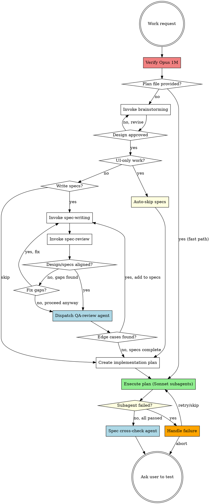

# Pandahrms Pipeline

## Overview

Unified pipeline for Pandahrms projects: brainstorm, spec writing, spec review, implementation planning, and execution -- all in a single session. This skill replaces the separate `design-pipeline` and `execution-pipeline` skills.

**Use this skill INSTEAD of invoking `superpowers:brainstorming` directly** in any Pandahrms project.

**Announce at start:** "I'm using the Pandahrms pipeline to orchestrate design through execution."

## Fast Path

If invoked with a plan file path (e.g., `/pipeline path/to/plan.md`), skip steps 1-6 and start directly at step 7 (Execute plan).

- Initialize time tracking as normal (the timing file and pipeline start time)
- Announce: "Executing existing plan -- skipping design phase."
- After execution, still run step 8 (spec cross-check) if specs exist for the feature
- Still run step 9 (ask user to test) with the Development Summary

## Resume Path

If invoked with `/pipeline --resume`:

1. Read `/tmp/pipeline-timing-latest.json` (symlink to the most recent run) to determine which steps completed
2. Announce: "Resuming pipeline from step N -- [step name]."
3. Continue from the next incomplete step with full time tracking
4. If the timing file does not exist or is corrupt, announce: "No pipeline state found -- starting fresh." and begin from step 1

<HARD-GATE>
MODEL REQUIREMENT (design phase): Steps 1-6 (brainstorm through plan creation) MUST run on Opus 1M (`claude-opus-4-6[1m]`). Before starting step 1, verify the current model ID. If the current model is not `claude-opus-4-6[1m]`, STOP and tell the user:

"This pipeline recommends Opus 1M for the design phase. Please switch to Opus 1M (`claude-opus-4-6[1m]`) and rerun, or reply 'proceed on current model' to override."

The fast path (plan-file provided) may run on any model since it starts at step 7.

**User override:** If the user explicitly instructs you to proceed on a different model (e.g. "use sonnet", "proceed on current model", "run the design on opus 4.5"), honor it. User instructions take precedence over this skill. Record the override in the timing file as `"design_model_override": "<model>"`.
</HARD-GATE>

<HARD-GATE>
EXECUTION MODEL (default Sonnet): Step 7 (execute plan) dispatches every implementer subagent with `model: "sonnet"` on the Agent tool call by default. The main Opus session orchestrates; Sonnet subagents do the code work. This applies to the fast path as well.

**User override:** If the user explicitly asks for a different execution model (e.g. "use opus for execution", "dispatch implementers on opus", "run tasks on opus 1m"), honor it and dispatch subagents with the requested model instead. Confirm once before dispatching:

"You've asked to run implementer subagents on <model> instead of the default Sonnet. That's slower and more expensive but will proceed. Confirm?"

After confirmation, use the requested model for ALL implementer subagents in this pipeline run. Record the override in the timing file as `"execution_model_override": "<model>"`. Do not re-ask on each task.

Absent an explicit user override, always pass `model: "sonnet"` explicitly -- never omit the parameter.
</HARD-GATE>

<HARD-GATE>
OVERRIDE: When the brainstorming skill completes and instructs you to "invoke writing-plans", do NOT invoke writing-plans. Instead, return to THIS pipeline and ask the user whether they want to write specs first.

The brainstorming skill says: "The ONLY skill you invoke after brainstorming is writing-plans." In Pandahrms projects, this instruction is OVERRIDDEN by this pipeline. You MUST ask the user before proceeding.
</HARD-GATE>

<HARD-GATE>
OVERRIDE: At the end of `superpowers:writing-plans`, the skill asks the user to choose between "Subagent-Driven" and "Inline Execution". DO NOT present this choice. Auto-select subagent-driven and immediately proceed to step 7. This pipeline requires Sonnet subagents for execution — inline execution is not an option.

Announce: "Plan complete. Proceeding to subagent-driven execution on Sonnet."
</HARD-GATE>

<HARD-GATE>
OVERRIDE: When subagent-driven-development instructs implementer subagents to commit after completing a task, DO NOT commit. Leave all changes uncommitted. The user will test first and then run /commit to commit clean, reviewed code.

This applies to ALL subagent dispatch prompts -- never include commit instructions when dispatching implementer subagents.
</HARD-GATE>

## Pipeline



## Checklist

You MUST create a task for each of these items and complete them in order. Apply [Time Tracking](#time-tracking) to every step -- record start/end times and pause during user prompts. The timing section has full details; do not duplicate timing logic here.

1. **Brainstorm the design** -- invoke `superpowers:brainstorming` to explore the idea, propose approaches, and present the design. Do NOT auto-commit the design doc -- leave it uncommitted for the user to review. When brainstorming tells you to "invoke writing-plans", STOP and return here instead.
2. **Check: UI-only work?** -- if the work is purely UI/presentation (styling, layout, component design, theming, responsiveness, animations, dark mode, visual polish), auto-skip specs and go directly to step 6. Announce: "Skipping spec-writing -- this is a UI-only change with no business behavior impact."
3. **Write specs?** (non-UI work only) -- use AskUserQuestion to ask: "Would you like to write Gherkin specs before proceeding to the implementation plan?" with options: "Yes, write specs" and "Skip specs". Users may skip if the session is purely exploratory or an open discussion without concrete implementation targets. If yes, invoke `pandahrms:spec-writing` to write or update specs in pandahrms-spec based on the approved design doc. Present the written specs to the user for review before proceeding.
4. **Review specs against design** -- invoke `pandahrms:spec-review` to cross-check the design doc against the written specs. This ensures every design requirement has spec coverage and nothing was missed. If no specs were written (user skipped step 3), this step is automatically skipped. If gaps are found, ask the user whether to fix them (loop back to spec-writing) or proceed anyway.
5. **QA review: edge cases** -- dispatch a QA-review sub-agent (using the Agent tool) to independently review the feature specs for missed edge cases, unhappy paths, boundary conditions, and implicit requirements not explicitly stated in the design. If no specs were written (user skipped step 3), this step is automatically skipped. See [QA Review Agent](#qa-review-agent) below.
6. **Create implementation plan** -- invoke `superpowers:writing-plans` to plan the implementation based on the approved design and specs.
7. **Execute plan** -- the plan will be executed via `superpowers:subagent-driven-development` (v5 default). Every implementer subagent MUST be dispatched with `model: "sonnet"` on the Agent tool call -- the main Opus 1M session orchestrates; Sonnet does the task work. Apply the no-commit override: implementer subagents must NOT commit after tasks. All changes remain uncommitted. Subagents must report their own duration (see [Subagent Timing](#subagent-timing)). If a subagent fails, follow [Subagent Failure Handling](#subagent-failure-handling).
8. **Spec cross-check** -- after all tasks are executed, dispatch a spec cross-check agent to verify the full implementation matches the feature specs. See [Spec Cross-Check Agent](#spec-cross-check-agent) below. Skip if no specs exist.
9. **Ask user to test** -- present the spec cross-check results and the Development Summary, then end with: "Please test your changes, then run /commit when ready."

## Time Tracking

Track **active work time** across the full pipeline -- time spent by Claude doing work, excluding time waiting for user input or blocked on external factors. Display a summary when execution completes.

### How to track

1. **On task start** -- record the current time (use `date +%s` via Bash)
2. **Before any user prompt** -- record a pause timestamp. This includes:
   - AskUserQuestion calls (design approval, "write specs?", "fix gaps?", "add edge cases?")
   - Any blocker requiring user action (e.g., environment issue, missing access)
   - Presenting results and waiting for user to respond
3. **After user responds** -- record a resume timestamp. Add the paused duration to the task's excluded time.
4. **On task completion** -- calculate: `duration = (end - start) - total_excluded_time`. Display: `"Task N completed in Xm Ys (active work)"`
5. **On final task completion** -- display a summary:

```
Development Summary (active work time, excludes user-wait)
===========================
Brainstorm the design       --  12m 34s
Check: UI-only work?        --   0m 05s
Write specs                 --   8m 21s
Review specs against design --   3m 10s
QA review: edge cases       --   2m 45s
Create implementation plan  --  15m 02s
---------------------------
Design total                --  41m 57s
---------------------------
Plan Task 1: ...            --   3m 12s
Plan Task 2: ...            --   5m 45s
Plan Task 3: ...            --  12m 08s
...
---------------------------
Execution total             --  42m 31s
Spec cross-check            --   1m 20s
===========================
Grand total (active)        --  1h 25m 48s
Total wall-clock time       --  2h 10m 15s
User-wait time              --     44m 27s
```

### What counts as paused time

| Paused (exclude from timing) | Active (include in timing) |
|------------------------------|---------------------------|
| Waiting for user to answer AskUserQuestion | Claude processing after user responds |
| User reviewing a design doc or spec | Brainstorming, writing specs, planning |
| User fixing an environment issue | Subagent execution |
| Blocked on external dependency | Reading files, running commands |

### Implementation

Persist all timestamps to a run-specific file so they survive context compression during long sessions. Use `date +%s` to capture epoch seconds.

**On pipeline start**, initialize the file with a unique name:

```bash
export PIPELINE_TIMING="/tmp/pipeline-timing-$(date +%s).json"
echo '{"tasks":[]}' > "$PIPELINE_TIMING"
```

Store the `PIPELINE_TIMING` path in conversation context. For resume support, also write the path to `/tmp/pipeline-timing-latest.json` as a symlink:

```bash
ln -sf "$PIPELINE_TIMING" /tmp/pipeline-timing-latest.json
```

**On each task event**, append to the file using a Bash `jq` command or by reading/rewriting the JSON. Each task entry has this structure:

```json
{
  "name": "Brainstorm the design",
  "start": 1718000000,
  "end": 1718000754,
  "pauses": [[1718000300, 1718000500]]
}
```

Active duration = `(end - start) - sum(resume - pause for each pause)`

**Duration formatting** -- compute in Bash to avoid platform issues:

```bash
elapsed=$((end - start - total_paused))
printf '%dm %02ds' $((elapsed / 60)) $((elapsed % 60))
```

This uses POSIX-compatible arithmetic and works on both macOS and Linux.

Skipped tasks show `-- skipped` instead of a duration.

**On pipeline end** (step 9), clean up the timing file after displaying the summary:

```bash
rm -f "$PIPELINE_TIMING" /tmp/pipeline-timing-latest.json
```

### Parallel Task Timing

When step 7 dispatches parallel subagents via `subagent-driven-development`:

- **Per-task duration** = each subagent's own active time (reported by the subagent)
- **Execution total** = wall-clock time from first subagent dispatch to last subagent completion (not the sum of individual tasks, since parallel tasks overlap)
- The summary table lists each task with its own duration, but the "Execution total" row reflects real elapsed time

## Subagent Timing

All dispatched subagents (QA review, spec cross-check, and implementer subagents) must report their own duration. Include the following timing instructions in every subagent dispatch prompt:

```
## Timing

Record your start time at the beginning of your work:
  start=$(date +%s)

When you are done, record your end time and report the duration at the end of your response:
  end=$(date +%s)
  elapsed=$((end - start))
  printf 'Agent duration: %dm %02ds\n' $((elapsed / 60)) $((elapsed % 60))

Include the "Agent duration: Xm Ys" line as the last line of your response.
```

After each subagent returns, parse the reported duration and write it to `$PIPELINE_TIMING` as the task's active time.

## Subagent Failure Handling

When a subagent reports a failure (build error, test failure, merge conflict, or any non-zero exit):

1. **Pause execution** -- do not dispatch further subagents
2. **Present the error** -- show the failing subagent's name, task description, and error output
3. **Ask the user** via AskUserQuestion: "Subagent '[task name]' failed. How would you like to proceed?" with options:
   - **"Retry"** -- re-dispatch the same subagent with the same prompt
   - **"Skip and continue"** -- mark the task as failed in the timing file and proceed with remaining tasks
   - **"Abort pipeline"** -- stop execution, display the Development Summary with completed tasks, and end with: "Pipeline aborted. Completed tasks remain uncommitted. Run /commit when ready or discard with git restore."

Record the failure and user decision in `$PIPELINE_TIMING` for the task entry:

```json
{
  "name": "Task 3: ...",
  "status": "failed",
  "error": "Build error: CS1002 ...",
  "resolution": "skipped"
}
```

Failed/skipped tasks show `-- FAILED (skipped)` or `-- FAILED (retried)` in the Development Summary.

## QA Review Agent

After spec-review confirms alignment (or the user proceeds despite gaps), dispatch a sub-agent to independently audit the specs for completeness. This agent looks for what the spec author and reviewer might have missed -- edge cases that only surface when you ask "what could go wrong?"

### Skip Condition

Skip this step entirely when:
- No specs were written (user skipped step 3)
- The work is UI-only (auto-skipped at step 2)

Announce: "Skipping QA review -- no specs to review."

### Agent Dispatch

Use the Agent tool with the following prompt structure. Replace the placeholders:
- `{design_doc_path}` -- path to the approved design document
- `{spec_file_paths}` -- paths to all written spec files
- `{scope_notes}` -- brief "in scope / out of scope" summary extracted from the design doc, so the agent doesn't flag edge cases for deferred features

```
prompt: |
  You are a QA reviewer. Your job is to review Gherkin feature specs for a
  Pandahrms feature and identify missed edge cases, unhappy paths, boundary
  conditions, and implicit requirements.

  ## Inputs

  Design document: {design_doc_path}
  Spec files: {spec_file_paths}
  Scope: {scope_notes}

  Read the design document and all spec files. The scope section defines
  what is in-scope and out-of-scope for this iteration. Only flag edge
  cases for in-scope functionality -- do not report findings for features
  explicitly marked as deferred or out-of-scope.

  ## What to Look For

  1. **Unhappy paths** -- What happens when the user provides invalid input,
     cancels mid-flow, loses connectivity, or hits a timeout?
  2. **Boundary conditions** -- Empty lists, maximum lengths, zero values,
     exactly-at-limit values, off-by-one scenarios.
  3. **Concurrent/conflicting actions** -- Two users editing the same record,
     duplicate submissions, race conditions.
  4. **Permission edge cases** -- User's role changes mid-session, permission
     revoked after page load, cross-tenant access attempts.
  5. **Data state edge cases** -- Soft-deleted records, archived entities,
     null/missing optional fields, migrated legacy data.
  6. **Implicit requirements** -- Behavior the design assumes but never states
     (e.g., audit logging, notification triggers, cascade effects).

  ## Output Format

  Return a structured report:

  ### Edge Cases Found

  For each finding:
  - **ID**: QA-1, QA-2, etc.
  - **Category**: (unhappy path | boundary | concurrency | permission | data state | implicit requirement)
  - **Description**: What the edge case is
  - **Suggested scenario**: A Gherkin scenario outline (Given/When/Then) that would cover it
  - **Severity**: (high | medium | low) -- high means likely to cause a bug in production

  ### Summary

  - Total findings: [count]
  - High severity: [count]
  - Medium severity: [count]
  - Low severity: [count]

  If you find zero edge cases, state that explicitly -- do not invent findings.
  Focus on quality over quantity. Only report genuine gaps, not theoretical
  scenarios that the feature's scope clearly excludes.

  ## Timing

  Record your start time at the beginning of your work:
    start=$(date +%s)

  When you are done, record your end time and report the duration at the end
  of your response:
    end=$(date +%s)
    elapsed=$((end - start))
    printf 'Agent duration: %dm %02ds\n' $((elapsed / 60)) $((elapsed % 60))

  Include the "Agent duration: Xm Ys" line as the last line of your response.

description: "QA review specs for edge cases"
```

### Handling Results

After the agent returns:

- **Zero findings** -- announce "QA review complete -- no additional edge cases found." Proceed to step 6.
- **Findings returned** -- present the agent's report to the user, then use AskUserQuestion: "QA review found [count] edge cases ([high_count] high severity). Would you like to add these to the specs?" with options:
  - **"Yes, add to specs"** -- loop back to `pandahrms:spec-writing` to incorporate the high and medium severity findings as new scenarios. Low severity findings are included only if the user explicitly asks.
  - **"No, proceed to planning"** -- proceed to step 6. The findings are still visible in the conversation for reference during implementation.

## Spec Cross-Check Agent

After all plan tasks are executed, dispatch a spec cross-check agent to verify the implementation covers all feature specs. This catches scenarios that span multiple tasks, plan gaps where a spec scenario had no corresponding task, and integration gaps between tasks.

### Skip Condition

Skip when:
- No specs were written (user skipped step 3)
- The work is UI-only
- Spec repo not found

Announce the skip reason.

### Agent Dispatch

```
prompt: |
  You are a spec compliance reviewer. Your job is to verify that the
  implementation matches the feature's Gherkin specs.

  ## Task

  1. Run `git diff` to get all working tree changes
  2. Locate the spec repo: search for a `pandahrms-spec` directory as a
     sibling of the current working directory, then check parent directories.
     Try these in order:
     - `$(dirname $PWD)/pandahrms-spec/`
     - `$(dirname $(dirname $PWD))/pandahrms-spec/`
     - Search: `find $(dirname $PWD) -maxdepth 2 -type d -name pandahrms-spec`
     If not found, report "Spec repo not found" and skip the cross-check.
  3. Identify which module/feature area the changes belong to
  4. Find all related `.feature` files
  5. For each spec scenario, check whether the implementation satisfies it:
     - Are the described behaviors implemented?
     - Do validation rules match spec expectations?
     - Are authorization checks in place as specified?
     - Do status transitions match the spec flow?
  6. Report findings

  ## Report Format

  ## Spec Cross-Check Results

  ### Summary
  - Spec scenarios checked: [count]
  - Implemented: [count]
  - Not implemented: [count]
  - Divergent: [count]

  ### Issues (if any)
  | # | Spec Scenario | File | Status | Notes |
  |---|---|---|---|---|
  | 1 | [scenario] | [file.feature] | Not implemented | [what's missing] |
  | 2 | [scenario] | [file.feature] | Divergent | [how it differs] |

  If all scenarios are covered, state that explicitly.

  ## Timing

  Record your start time at the beginning of your work:
    start=$(date +%s)

  When you are done, record your end time and report the duration at the end
  of your response:
    end=$(date +%s)
    elapsed=$((end - start))
    printf 'Agent duration: %dm %02ds\n' $((elapsed / 60)) $((elapsed % 60))

  Include the "Agent duration: Xm Ys" line as the last line of your response.

description: "Spec cross-check: verify implementation matches feature specs"
```

## Red Flags

| Thought | Reality |
|---------|---------|
| "Brainstorming said invoke writing-plans" | This pipeline overrides that for Pandahrms projects |
| "I'll skip specs without asking" | Always ask the user. They decide whether specs are needed. |
| "The design doc is enough" | Design doc captures WHAT. Specs capture BEHAVIOR. Ask the user. |
| "Specs look fine, skip the review" | Always run spec-review after writing specs. It catches gaps you won't notice manually. |
| "Specs are aligned, skip QA review" | The QA agent finds what both author and reviewer miss -- edge cases, unhappy paths, implicit requirements. Always run it after spec-review. |
| "This change is too small for specs" | Don't assume -- ask the user. They may still want specs (unless it's UI-only, then auto-skip). |
| "Let me commit after each task" | Never commit. User tests first, then /commit. |
| "I'll start designing on Sonnet, it's fine" | Design phase defaults to Opus 1M. Stop and ask the user to switch or explicitly override. |
| "I'll just execute the plan in the main session" | Never. Step 7 dispatches subagents. Main session only orchestrates. |
| "The Agent tool defaults to a reasonable model" | Always pass `model` explicitly — Sonnet by default, or the user's overridden model. |
| "The user said use opus for execution, but the skill says Sonnet" | User instructions override the skill. Confirm once, then dispatch on Opus. |
| "The per-task reviews covered specs" | Per-task reviews check individual tasks. The spec cross-check catches gaps across tasks and missing scenarios. Always run it. |
| "I'll skip the spec cross-check" | It's mandatory when specs exist. Only skip if no specs were written. |

## When to Use

- Any development work in a Pandahrms project that would normally trigger brainstorming
- Features, bug fixes, refactors, or behavioral changes
- Executing an existing plan file in a Pandahrms project (fast path)

## When NOT to Use

- Quick fixes that don't need brainstorming (typos, config changes)
- Non-Pandahrms projects (use brainstorming directly)
- Writing specs for existing functionality without a new design (use `pandahrms:spec-writing` directly)
