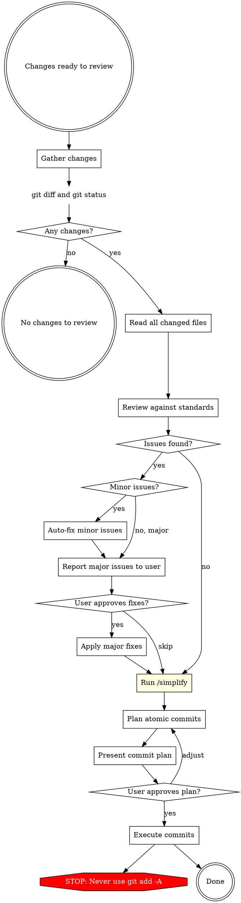

# Review and Commit

## Overview

Review all git working tree changes against code quality standards, fix issues found, then plan and execute atomic commits grouped by logical unit.

## When to Use

- After finishing a chunk of implementation work, before committing
- On explicit invocation to review current changes
- When you have multiple changed files that should be split into logical commits

## Workflow



## Phase 1: Gather Changes

Run in parallel:
- `git status` - see all modified, added, untracked files
- `git diff` - see unstaged changes
- `git diff --cached` - see staged changes
- `git log --oneline -5` - recent commits for message style reference

Read the full content of every changed file. You need full context to review properly.

### Run Linter (if available)

Detect the project's linter by checking for config files or `package.json` scripts:
- `biome.json` / `biome.jsonc` -> `pnpm biome check` or `npx biome check`
- `.eslintrc.*` / `eslint.config.*` -> `pnpm lint` or `npx eslint`
- `dotnet format` for .NET projects (check if `dotnet-format` tool is available)
- Any `lint` script in `package.json` -> `pnpm lint` or `yarn lint`

Run the linter on changed files only if possible. Include lint errors in the Phase 2 review findings.

## Phase 2: Review

Apply these checks to every changed file. Include any lint/format violations from Phase 1 in the findings.

### Review Checklist

**Architecture and Design:**

| Check | What to Look For |
|-------|-----------------|
| **God class / giant class** | Classes doing too much (100+ lines of logic, multiple unrelated methods). Split into focused classes. |
| **Single Responsibility** | Each class/function has one reason to change. Handlers should only orchestrate, not contain business logic. |
| **Open/Closed** | New behavior via extension, not modification. Check for long switch/if-else chains that should be polymorphic. |
| **Liskov Substitution** | Subtypes behave correctly when substituted for base types. No surprising overrides. |
| **Interface Segregation** | Interfaces are small and focused. No "fat" interfaces forcing unused method implementations. |
| **Dependency Inversion** | Dependencies injected via constructor, not instantiated with `new`. No service locator anti-pattern. |
| **DI registration** | *Only if project uses DI.* New interfaces/services are registered in DI container (e.g., `ServiceCollectionExtensions`, `Program.cs`, or relevant module registration). New repositories, services, and handlers must be wired up. |

**Security:**

| Check | What to Look For |
|-------|-----------------|
| **Injection** | SQL injection (raw string queries), command injection, XSS in responses. Use parameterized queries. |
| **Authentication/Authorization** | Endpoints have proper `[Authorize]` attributes. Role/policy checks enforced. No endpoints accidentally left open. |
| **Secrets** | No hardcoded API keys, connection strings, passwords, or tokens in code. Check for `.env` files staged. |
| **Input validation** | User inputs validated and sanitized. Request DTOs have proper validation attributes/rules. |
| **Data exposure** | Responses don't leak sensitive fields (passwords, internal IDs, PII). DTOs properly restrict what's returned. |

**Auditing and Observability:**

| Check | What to Look For |
|-------|-----------------|
| **Audit fields** | Entities that need tracking have `CreatedBy`, `CreatedAt`, `ModifiedBy`, `ModifiedAt` fields populated. |
| **Audit trail** | State-changing operations (create, update, delete) log who did what and when. Check if base entity audit pattern is followed. |
| **Logging** | Important operations have appropriate log levels. Errors are logged with context. No sensitive data in logs. |

**Code Quality:**

| Check | What to Look For |
|-------|-----------------|
| **Reuse before creating** | Before new code is added, check if an existing function, class, component, helper, or utility already does the same thing. Search the codebase for similar patterns. Flag duplicated logic that should reuse what already exists. |
| **Test coverage** | New/changed functionality has corresponding tests. Edge cases and error paths covered. |
| **Error handling** | Specific exceptions caught, meaningful messages, no swallowed errors. Consistent error response format. |
| **Readability** | Self-documenting code. No unnecessary complexity or over-engineering. Clear naming. |
| **Dead code** | No commented-out code, unused variables, unreachable branches, or leftover debugging code. |
| **Async correctness** | `async`/`await` used properly. No `async void` (except event handlers). No blocking on async (`.Result`, `.Wait()`). |

### Categorize Issues

- **Minor** (auto-fix): lint/format violations, naming inconsistencies, missing access modifiers, trivial formatting, simple null checks, obvious missing `readonly`, dead code removal, missing `async` keyword
- **Major** (ask first): SOLID violations, god classes, duplicated logic that should reuse existing code, missing DI registration, missing audit fields, security vulnerabilities, missing test coverage, architectural concerns, missing authorization attributes

## Phase 3: Fix

1. **Auto-fix minor issues** silently - apply fixes, then list what was changed in a summary
2. **Report major issues** clearly - for each, explain: what the issue is, why it matters, proposed fix
3. **Ask user** whether to fix major issues or skip them
4. Apply approved fixes

## Phase 3.5: Simplify (MANDATORY - never skip)

**Announce:** "Running /simplify to check for reuse opportunities, code quality, and efficiency improvements."

Then invoke the `/simplify` skill. This launches three parallel review agents (Code Reuse, Code Quality, Efficiency) against the current changes. Apply any valid findings before moving to commit planning.

This phase is **non-negotiable** - always run it regardless of change size, perceived simplicity, or whether issues were found in earlier phases.

## Phase 4: Plan Atomic Commits

Group changes into logical commits. Each commit should be:
- **Self-contained** - builds independently
- **Single purpose** - one logical change
- **Properly ordered** - dependencies committed first

### Grouping Strategy

1. Identify logical units of change (a feature, a bugfix, a refactor, a test addition)
2. Within each unit, order by dependency layer:
   - Domain/Core entities and interfaces first
   - Business logic / use cases second
   - Infrastructure / persistence third
   - API / presentation fourth
   - Tests last (or alongside their layer)
3. If a unit is small and tightly coupled across layers, keep as single commit

### Commit Message Format

Use conventional commits: `type(scope): description`

| Type | When |
|------|------|
| `feat` | New feature / wholly new functionality |
| `fix` | Bug fix |
| `refactor` | Code restructuring, no behavior change |
| `test` | Adding or updating tests only |
| `docs` | Documentation only |
| `chore` | Maintenance, dependency updates |

**Read `git log --oneline -5`** to match the repository's existing commit message style.

### Present the Plan

Show a numbered table:

```
| # | Type | Files | Message |
|---|------|-------|---------|
| 1 | feat(core) | Entity.cs, IRepo.cs | add Widget entity and repository interface |
| 2 | feat(usecase) | Handler.cs, Dto.cs | implement CreateWidget command handler |
| 3 | feat(api) | Endpoint.cs | expose CreateWidget endpoint |
| 4 | test(widget) | HandlerTests.cs | add CreateWidget handler unit tests |
```

Ask user to approve, adjust ordering, or merge/split commits.

## Phase 5: Execute Commits

For each commit in the plan:
1. Stage only the specific files for that commit: `git add file1 file2 ...`
2. Create the commit with the agreed message (use HEREDOC for formatting)
3. Verify with `git status` after each commit

**NEVER** use `git add -A` or `git add .` - always stage specific files.

## Red Flags - STOP

- Skipping `/simplify` for any reason - it is mandatory before commit planning
- About to `git add -A` or `git add .` - stage specific files only
- Committing `.env`, credentials, or secrets - warn the user
- Commit message doesn't match the actual changes - rewrite it
- Skipping review because "changes are small" - review everything
- Committing without reading the changed files first - read them all

## Common Mistakes

| Mistake | Fix |
|---------|-----|
| Reviewing only the diff, not the full file | Always read full file for context |
| Grouping unrelated changes in one commit | Split by logical unit, not by file proximity |
| Writing commit messages about "what" not "why" | Focus on purpose: "support widget filtering" not "add if statement" |
| Fixing issues without telling the user | Always summarize what was auto-fixed |
| Staging files that weren't reviewed | Only commit files that passed review |
