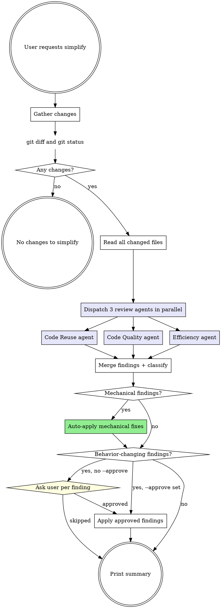

# Simplify

## Overview

Targeted simplification pass on working-tree changes. Three parallel review subagents look for duplication, quality drift, and inefficiency. Mechanical findings apply automatically. Behavior-changing findings pause for user pick. Never commits.

## Pre-Flight: Optimise the prompt (mandatory before any other step)

If `pandahrms:optimise-prompt` has not already run on the current user message, invoke it via the Skill tool with no arguments. Wait for it to return, then continue using the confirmed intent as the canonical request.

Skip this pre-flight when:
- Standalone pre-flight already ran on the current user message and locked an intent. Reuse the locked intent.
- Current message is a direct reply to an AskUserQuestion the assistant just sent.
- Current message is a one-word ack ("yes", "ok", "no", "go", "continue").
- optimise-prompt is already running in the current call stack.

**Re-invoke on mid-skill fresh directives.** After pre-flight, every user message received between simplify phases MUST be classified per the [Follow-up Directives](../optimise-prompt/SKILL.md#follow-up-directives) section of optimise-prompt. Continuation replies, control acks, and small refinements are absorbed by the current phase. Fresh directives (new scope, different files, "stop and commit", "skip the efficiency pass") MUST pause the current phase and re-invoke `pandahrms:optimise-prompt` before simplify acts on them.

See [optimise-prompt](../optimise-prompt/SKILL.md) for the full algorithm.

## Flags

- `--approve` -- auto-apply every finding (mechanical AND behavior-changing) without pausing. Replaces the Phase 5 AskUserQuestion with a one-line announcement.

When `--approve` is set, announce the auto-pick on one line at Phase 5 (`--approve: applying all findings`) before proceeding. Do NOT call AskUserQuestion for behavior-changing findings.

## Workflow



**Phase 0: Gather changes**

Run `git status` and `git diff` (and `git diff --cached` if a commit is being prepared). Combine the changed-file set.

If the combined set is empty, print `No working-tree changes to simplify.` and exit. No further phases.

**Phase 1: Read changed files**

Read each changed file in full -- not just the diff hunks. Reuse and efficiency findings need surrounding context.

Files outside the `git status` changed set are off-limits for edits in this skill. Read them only when an agent needs them as context.

**Phase 2: Dispatch three review subagents in parallel**

Dispatch all three subagents in a single tool-call batch using the Agent tool. Subagent type: `general-purpose`. Each runs read-only over the changed files.

The three agents and their charters:

| Agent | Charter |
|-------|---------|
| Code Reuse | Find duplicated logic across changed files, repeated patterns that match an existing helper in the codebase, copy-pasted blocks where one helper would do. Report file:line ranges and the helper to extract or reuse. |
| Code Quality | Find unclear names, dead code, redundant null checks, leftover commented blocks, mixed abstraction levels, comments that restate code, defensive validation for impossible states. Report file:line and the literal cleaner version. |
| Efficiency | Find unnecessary work: re-renders, repeated DB / API calls inside loops, premature abstraction, eager loading of unused data, redundant transformations. Report file:line and the leaner approach. |

Each agent returns a JSON-shaped list. Required fields per finding:

```
{
  "file": "<absolute path>",
  "lines": "<start>-<end>",
  "category": "code-reuse | code-quality | efficiency",
  "summary": "<one-line description>",
  "fix_kind": "mechanical | behavior-changing",
  "patch_intent": "<concrete change to apply>"
}
```

`fix_kind` is the agent's own classification. Phase 3 re-checks it.

**Phase 3: Merge findings and re-classify**

Merge the three returned lists. Dedupe overlapping findings (same file + overlapping line range + same intent) -- keep the most specific.

Re-classify each finding's `fix_kind` against the **literal mechanical definition**. A finding is `mechanical` only if ALL hold:

1. Touches a single helper, function, or block. No cross-file restructuring.
2. Fix is one of: rename, dead-code removal, single-helper extraction within the same file, removing a redundant null check, deleting commented-out blocks, collapsing duplicated literal strings into a constant.
3. Does not alter observable behavior: same inputs produce the same outputs, same side effects, same logs, same DB rows.
4. Does not change a public API signature, exported symbol, route, DTO field, or DB schema.
5. Does not introduce a new dependency, framework, or import path.

Any finding that fails one or more of those clauses is `behavior-changing`, regardless of what the subagent labeled it.

**Phase 4: Auto-apply mechanical findings**

For every finding classified `mechanical` in Phase 3:

1. Read the target file's current state (a prior fix in the same batch may have shifted lines).
2. Apply the patch with the Edit tool. One Edit call per finding.
3. If Edit fails (string not found, ambiguous), skip the finding and record `skipped: <reason>` for the Phase 6 summary. Do not retry.

No tests, no migrations, no formatter runs. The skill's job is to land the textual change.

**Phase 5: Behavior-changing findings**

If no behavior-changing findings remain, skip to Phase 6.

If `--approve` is set, announce `--approve: applying all behavior-changing findings` and apply each one in sequence (one Edit per finding, same skip-on-failure rule as Phase 4). Then go to Phase 6.

Otherwise, surface each behavior-changing finding via AskUserQuestion. Group up to 4 findings per call when they target the same file; otherwise one per call. Question shape:

> `<file>:<lines>` -- `<summary>`. Apply the change?

Options:
- `Yes, apply` -- apply the patch with Edit.
- `Skip` -- record `skipped by user` and continue.
- `Show me the file first` -- read the file, then re-ask the same question once.

Apply approved findings in order. Use the same read-before-edit guard as Phase 4.

**Phase 6: Done**

Print a one-block summary:

- Mechanical findings: `<N applied>`, `<M skipped>` (with reason).
- Behavior-changing findings: `<N applied>`, `<M skipped by user>`, `<P skipped by error>`.
- Per-category counts: code-reuse, code-quality, efficiency.
- Files touched (relative paths).

End. Return control to caller or to user. No follow-up offers.

## Hard Rules

- Read-only outside the `git status` changed set. Edits only inside that set.
- No `git add`, `git commit`, `git stash`, `git push`, `git restore`, `git checkout` of any kind.
- No test runs, no migrations, no dev servers, no formatter or linter invocations.
- No new files. Single-helper extractions land inside an existing file in the changed set.
- No public API surface changes during this skill (route paths, DTO field names, exported symbols, DB schema). Findings that need any of those are `behavior-changing` and route through Phase 5.
- One AskUserQuestion at a time in Phase 5. No batching across files unless the question references the same file.
- No `/hermes-commit`, no `atlas-pipeline-orchestrator`, no `/athena-code-review` invocations from inside this skill.

## Out of Scope

- Commit messages, PR descriptions, changelogs.
- New documentation files, design docs, memory entries.
- Branch creation, PR creation, push operations.
- Splitting a god class, cross-file refactors, framework swaps -- flag as behavior-changing and let the user route to a plan.
- Verifying the change works at runtime -- no tests, no dev server.

## Common Mistakes

| Mistake | Fix |
|---------|-----|
| Running tests to "verify" a rename | Out of scope. Skill lands textual change only. |
| Editing a file outside `git status` to wire a finding | Skip the finding. Cross-file changes are behavior-changing by definition. |
| Auto-applying a "small" behavior change because it looks safe | Phase 3 re-classify is literal. If a clause fails, route through Phase 5. |
| Dispatching the three agents one after another | Always parallel -- single tool-call batch. |
| Batching AskUserQuestion across unrelated files | Group only when same file. Otherwise one per call. |
| Retrying a failed Edit with a different string | One Edit per finding. Skip on failure, record reason. |
